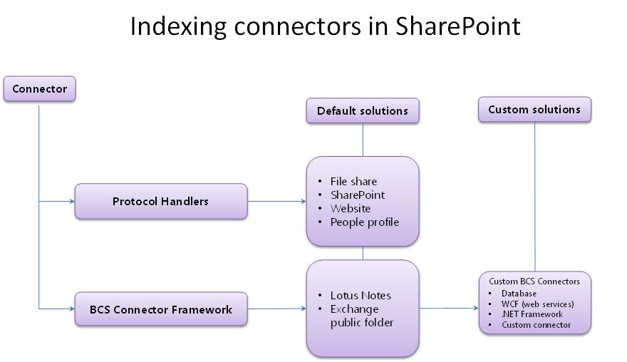
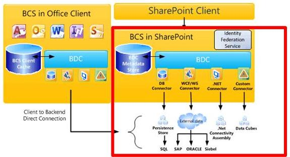
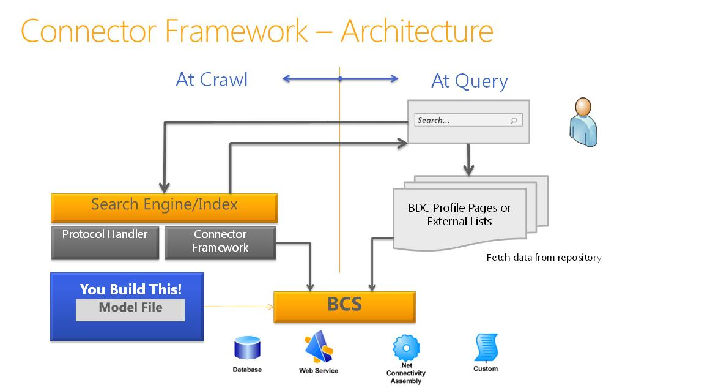

---
title: Search connector framework in SharePoint
ms.date: 09/25/2017
ms.prod: sharepoint
ms.assetid: 38560a3b-69c6-4a56-97ca-3625bbd5755e
---

# Search connector framework in SharePoint
Learn about the SharePoint indexing connectors, the connector framework, and how you can create custom BCS indexing connectors to search external systems.
## Making content available for search in SharePoint

Search in SharePoint provides two approaches for processing queries to return search results—federated search and content crawling.
  
    
    
 **Federated search** In this approach, search results are returned for content that is not crawled by your search server. The query is forwarded to an external content repository where it is processed by that repository's search engine. The repository's search engine then returns the results to the search server. The search server formats and renders the results from the external repository to display on the search results page. This approach offers the following advantages:
  
    
    

- You require no additional capacity requirements for the content index, because content is not crawled by Search in SharePoint.
    
  
- You can take advantage of a repository's existing search engine. For example, you can federate to an Internet search engine to search the web.
    
  
- You can optimize the content repository's search engine for the repository's specific set of content, which might provide better search performance on the content set.
    
  
- You can access repositories that are secured against crawls, but that can be accessed by search queries.
    
  
 **Content crawling** In this approach, results are returned from the Search service application's content index based on the user's query. The content index contains content that is crawled by the Search service application, and includes text content and metadata for each content item. This approach enables you to:
  
    
    

- Sort results by relevance.
    
  
- Control how frequently the content index is updated.
    
  
- Specify what metadata is crawled.
    
  
- Perform a single backup operation for crawled content.
    
  

## Crawling content with indexing connectors in SharePoint

The crawler uses indexing connectors to access the content to crawl. The indexing connector is the component that knows how to connect to the content source, what to crawl, and how to crawl it. In earlier versions of SharePoint, these were known as protocol handlers, components that are based on custom interfaces running unmanaged C++ code. 
  
    
    
Search in SharePoint includes a connector framework, introduced in SharePoint Server 2010 and built on Microsoft Business Connectivity Services (BCS), which provides a simpler approach to developing indexing connectors. With the connector framework, the crawler uses indexing connectors based on BCS to crawl external content. SharePoint uses both protocol handler-based indexing connectors and BCS indexing connectors to crawl content.
  
    
    
Figure 1 provides a high-level overview of the SharePoint indexing connector story.
  
    
    

  
    
    

  
    
    

  
    
    

  
    
    

## BCS overview for Search in SharePoint

BCS is the umbrella of tools and infrastructure that enables you to connect to external systems from SharePoint. Figure 2 shows a high-level view of the BCS architecture, with the relevant areas for Search highlighted.
  
    
    

  
    
    

**Figure 2. BCS architecture including Search**

  
    
    

  
    
    

  
    
    

  
    
    
BCS makes the connection to the external data based on the external content type definition in the metadata store. The metadata store contains the following information for an external content type:
  
    
    

- **Connectivity information** Describes how to connect to the external system.
    
  
- **Entity information** Describes the structure of the external data.
    
  
- **Operations** Describes methods used to access the external data. In the case of databases and web services, these are methods supported by the external system: SQL statements for database connectors and web methods for web services. For .NET and custom BCS indexing connectors, these are methods that are implemented in the connector assembly, which is the component DLL you create for the indexing connector.
    
  
This information is specified in the external content type's BDC model file. For more information about BDC models and what they contain, see  [BDC Model Infrastructure](http://msdn.microsoft.com/library/2818ebdd-6cda-4d8f-82b2-7fde9fbf2633%28Office.15%29.aspx).
  
    
    
For details about BCS architecture and functionality, see  [Business Connectivity Services Overview](http://msdn.microsoft.com/library/91dd7b01-ead2-4f87-804b-b59ef2245c87%28Office.15%29.aspx) and [Mechanics of Using Business Connectivity Services](http://msdn.microsoft.com/library/ff3e312b-0fbc-48ed-a752-76c50d286533%28Office.15%29.aspx).
  
    
    

### Using the connector framework

To crawl external data, you have to add one of the content source types that support connecting to external data. Table 1 lists these content source types.
  
    
    

**Table 1. Content source types that support BCS indexing connectors**

|**Content source type**|**Description**|
|:-----|:-----|
|Line of Business Data    |Use this content source for database and web service BCS indexing connectors.    |
|Custom Repository    |Use this content source for .NET and custom BCS indexing connectors.    |
   
The connector framework enables you to create BCS indexing connectors to connect to external content that you want to crawl and include in the content index. The BCS indexing connector is used by the crawler to communicate with the external data source. At crawl time, the crawler calls the BCS indexing connector to fetch the data from the external system and pass it back to the crawler. The BCS indexing connector also parses the access URLs understood by Search and the identifiers understood by BCS as they are passed between BCS and Search during the crawl process.
  
    
    
BCS indexing connectors are composed of the following:
  
    
    

  
    
    
> **The BDC model file** The file that provides the structure of the data, and that provides connection information to the external system.
    
  

  
    
    
> **The connector** The component containing the code that connects to the external system and parses the access URLs and BCS identifiers.
    
  
For BCS indexing connectors based on the Line of Business Data content source types, Search includes built-in connectors, so you have to create only a BDC model file. 
  
    
    
For BCS indexing connectors based on the Custom Repository content source types, you must develop a custom component in addition to a BDC model file to connect to the external data.
  
    
    
Figure 3 shows a high-level view of the search connector framework architecture.
  
    
    

**Figure 3. Search connector framework architecture**

  
    
    

  
    
    

  
    
    

  
    
    

  
    
    

### BCS indexing connectors

SharePoint supports the following types of BCS indexing connectors:
  
    
    

- **Database connector** SharePoint includes a predefined BCS connector that supports connecting to databases, so you can create a database BCS indexing connector without writing any code—just create the BDC model file for the connector.
    
  
- **WCF (web services) connector** SharePoint includes a predefined BCS connector that supports connecting to web services, so you can create a web service BCS indexing connector without writing any code—just create the BDC model file for the connector.
    
    > [!NOTE]
    > Although you don't have to write code to create a connector for web services, the web service must include methods that provide the same functionality that the .NET BCS connector provides, to pass the external business data to BCS. For information about creating a web service, see  [Creating .NET Connectivity Assemblies and Web Services](http://msdn.microsoft.com/library/9a6c6712-868a-4a9c-9645-3aa448ad5092%28Office.15%29.aspx). For code examples, see  [Sample Orders ASP.NET Web Service Sample](http://msdn.microsoft.com/library/10e46860-788f-4ed0-a4d8-1e17ada58e83%28Office.15%29.aspx) and [Sample Orders WCF Service Sample](http://msdn.microsoft.com/library/535277c8-9d5c-41eb-ab23-0ae141d726c5%28Office.15%29.aspx). 

- **.NET BCS connector** SharePoint does not include a predefined BCS connector for .NET connectors, so in addition to creating a BDC model file, you must also create a .NET component for the BCS indexing connector. You must implement the required stereotyped operations to support crawling the data, and implement methods for parsing the access URLs and BDC identifiers.
    
  
- **Custom BCS connector** SharePoint does not include a predefined BCS connector for custom .NET connectors, so in addition to creating a BDC model file, you must also create a .NET component for the BCS indexing connector, just as you must for the .NET BCS connector. You must implement the required stereotyped operations to support crawling the data, and implement methods for parsing the access URLs and BDC identifiers. You must also implement the **ISystemUtility** interface.
    
  

## Building BCS indexing connectors

When you develop a BCS indexing connector—whether you're just creating the BDC model file for database and web service indexing connectors, or creating the BDC model file and coding the BCS connector component for .NET and custom indexing connectors—you need to think about the following:
  
    
    

- **Connectivity** How to connect to the external data repository, for example, the server address, IP address, or database instance name. Also includes the authentication information used to connect to the external data repository.
    
  
- **Structure of repository** To read the data, the connector must know how the repository is organized. Is it hierarchical, enumerical, or does it have to traverse links?
    
  
- **Incremental crawls** To reduce the performance load on the external data repository, give the connector the ability to do incremental crawls in addition to full crawls. For this, the connector must recognize what data has changed since the last crawl and be able to crawl only that data. This can be done by using a timestamp-based incremental crawl or a change log-based crawl. The approach you implement depends on the APIs provided by the repository and the freshness goals for the content.
    
  
- **Securing data** In most scenarios, not all data is accessible to all users. It's important that this also works with search, so when a user searches by using the search UI, the user can see only the results he or she has access to. This means the connector must know how to read the security of the external system, and bring that security-related information back during the crawl into the index. For example, you could implement crawl-time storage of Windows NT access control lists (ACLs).
    
  
Table 2 describes the stereotyped operations that apply when you create a BCS indexing connector for SharePoint.
  
    
    

**Table 2. BCS stereotyped operations supported by Search in SharePoint**

|**Operation**|**Description**|
|:-----|:-----|
|Finder    |Core operation required when creating a BCS connector. This operation retrieves the list of items of the external content source. See  [Implementing a Finder](http://msdn.microsoft.com/library/a0cb7cfe-8758-4057-aa85-03071536745e%28Office.15%29.aspx).    |
|SpecificFinder    |Core operation required when creating a BCS connector. This operation retrieves individual items from the external content source. See  [Implementing a SpecificFinder](http://msdn.microsoft.com/library/9b6effa5-20ce-4ce7-a8dc-0fd601eb0f23%28Office.15%29.aspx).    |
|ChangedIdEnumerator    |Required to implement changelog-based incremental crawls. See  [Implementing a ChangedIdEnumerator](http://msdn.microsoft.com/library/19d3c942-f6d7-49e7-853f-4d9b61b10422%28Office.15%29.aspx).    |
|DeletedIdEnumerator    |Required to implement changelog-based incremental crawls. See  [Implementing a DeletedIdEnumerator](http://msdn.microsoft.com/library/aa1c521a-0c9b-4dc0-a32f-fb9e54c52bed%28Office.15%29.aspx).    |
|BinarySecurityDescriptorAccessor    |Required to implement item-level security. Returns the security descriptor for an item from the external content source. See  [Implementing a BinarySecurityDescriptorAccessor](http://msdn.microsoft.com/library/6cf70490-dd3c-49cd-bb13-ed33e938435d%28Office.15%29.aspx).    |
|StreamAccessor    |Required to enable crawling of attachments from the external content source. Returns the attachment as a data stream. See  [Implementing a StreamAccessor](http://msdn.microsoft.com/library/e3d8053b-90c0-4207-98e3-91e42db13cf1%28Office.15%29.aspx).    |
   

  
    
    

### Tooling support for developing BCS indexing connectors

BCS provides tooling support for BCS connectors in SharePoint Designer and Visual Studio.
  
    
    

#### SharePoint Designer tooling support for BCS connectors

SharePoint Designer provides a limited set of capabilities; you can use it to create BDC model files for existing BCS connector types, such as database, web service, and .NET BCS connectors. You can also use it to export BDC model files from one BCS service application to another BCS service application.
  
    
    

#### Visual Studio tooling support for BCS connectors

You can use Visual Studio to create the component for .NET BCS connectors and custom BCS connectors. For .NET BCS connectors, Visual Studio provides the Business Data Connectivity Model project template, which includes a set of visual designers and code management capabilities to enable you to more easily create, debug, and deploy the .NET component and the associated BDC model file for the .NET BCS connector. There is no corresponding project template for custom BCS connectors.
  
    
    

## Connector framework enhancements in SharePoint

In SharePoint the connector framework supports BCS connectors retrieving claims information for content that is stored in custom external data repositories.
  
    
    
The connector framework also provides improved exception capturing and logging to help you troubleshoot errors encountered when crawling content sources by using BCS connectors.
  
    
    

## See also

-  [Enhancing the BDC model file for Search in SharePoint](enhancing-the-bdc-model-file-for-search-in-sharepoint.md)
    
  
-  [SharePoint 2013: MyFileConnector custom BCS indexing connector sample](https://code.msdn.microsoft.com/sharepoint-2013-myfileconne-79d2ea26)
    
  
-  [How to: Crawl associated external content types in SharePoint](how-to-crawl-associated-external-content-types-in-sharepoint.md)
    
  
-  [How to: Crawl binary large objects (BLOBs) in SharePoint](how-to-crawl-binary-large-objects-blobs-in-sharepoint.md)
    
  
-  [How to: Crawl associated external content types in SharePoint](how-to-crawl-associated-external-content-types-in-sharepoint.md)
    
  
-  [How to: Configure item-level security in SharePoint](how-to-configure-item-level-security-in-sharepoint.md)
    
  

