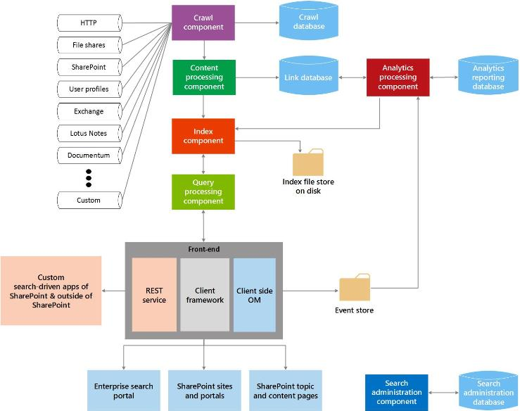

# Search in SharePoint
Understand the extensibility building blocks in Search in SharePoint and how you can use these building blocks to suit your use cases.
Search in SharePoint enables users to find relevant information more quickly and easily than ever before and makes it easy for Search administrators to customize the search experience. It also provides several API sets for more advanced customizations and solutions.
  
    
    

See the following articles for a good introduction to general SharePoint development concepts; you may find it helpful to review these before proceeding:
-  [Set up a general development environment for SharePoint](set-up-a-general-development-environment-for-sharepoint)
    
  
-  [Choose the right API set in SharePoint](choose-the-right-api-set-in-sharepoint)
    
  
-  [SharePoint Add-ins compared with SharePoint solutions](sharepoint-add-ins-compared-with-sharepoint-solutions)
    
  
-  [Deciding between SharePoint Add-ins and SharePoint solutions](deciding-between-sharepoint-add-ins-and-sharepoint-solutions)
    
  

## Search architecture overview

Search in SharePoint includes a wide variety of improvements and new features. With this version, Search in SharePoint is re-architected to a single enterprise search platform. The search architecture consists of the following areas:
  
    
    

-  [Crawl and content processing](#bk_crawl)
    
  
-  [Index](#bk_index)
    
  
-  [Query processing](#bk_query)
    
  
-  [Search administration](#bk_searchadmin)
    
  
-  [Analytics](#bk_analytics)
    
  
These areas consist of components and databases that work cohesively to perform the search operation. Figure 1 provides an overall view of the different areas of search architecture, and the components and databases within that work cohesively to perform the search operation. 
  
    
    

**Figure 1. Search component interaction**

  
    
    

  
    
    

  
    
    
For a more detailed view, see  [Technical Diagrams -- Search](http://technet.microsoft.com/en-us/library/cc263199.aspx#search) and [Overview of search in SharePoint](http://technet.microsoft.com/en-us/library/jj219738.aspx).
  
    
    

### Crawl and content processing

The crawl and content processing architecture consists of the following:
  
    
    
 **Crawl component**
  
    
    
 Crawls content sources to collect crawled properties and metadata from crawled items and sends this information to the content processing component.
  
    
    
 **Crawl database**
  
    
    
Contains information about crawled items, such as last crawl time, the last crawl ID, and the type of update during the last crawl.
  
    
    
 **Content processing component**
  
    
    
Crawls content sources to collect crawled properties and metadata from crawled items and sends this information to the index component.
  
    
    

### Index

The index component receives the processed items from the content processing component and writes them to the search index. This component also handles incoming queries, retrieves information from the search index, and sends back the result set to the query processing component.
  
    
    

### Query processing

The query processing component analyzes and processes search queries and results. The processed query is then submitted to the index component, which returns a set of search results for the query.
  
    
    

### Search administration

Search administration is composed of the search administration component and its corresponding database.
  
    
    
 **Search administration component**
  
    
    
Runs the system processes for search, and adds and initializes new instances of search components.
  
    
    
 **Search administration database**
  
    
    
Stores search configuration data.
  
    
    

### Analytics

The analytics architecture consists of the analytics processing component, analytics reporting database, and link database.
  
    
    
 **Analytics processing component**
  
    
    
Performs search analytics and usage analytics.
  
    
    
 **Link database**
  
    
    
Stores information extracted by the content processing component and search click information.
  
    
    
 **Analytics reporting database**
  
    
    
Stores the results of usage analytics.
  
    
    
 **Event store**
  
    
    
Stores usage events that are captured on the front-end.
  
    
    

## Search extensibility points

The Search in SharePoint architecture provides several extensibility points to support customization scenarios. In this section, we'll describe these points and show you where you can find more information about developing for these scenarios.
  
    
    

### Connector framework

The crawl component crawls content by invoking connectors or protocol handlers that interact with content sources to retrieve data. Search in SharePoint includes a connector framework that you can use to customize and build connectors to crawl new content sources. For detailed information about the connector framework architecture and how to extend it, see  [Search connector framework in SharePoint](search-connector-framework-in-sharepoint).
  
    
    

### Custom content processing

Within the content processing component, you can use the Content Enrichment web service callout to modify the managed properties of crawled items before they are added to the search index. This web service callout calls out to any external content enrichment web service that you create. For more information, see  [Custom content processing with the Content Enrichment web service callout](custom-content-processing-with-the-content-enrichment-web-service-callout). For a step-by-step implementation of a content enrichment web service, see  [How to: Use the Content Enrichment web service callout for SharePoint Server](how-to-use-the-content-enrichment-web-service-callout-for-sharepoint-server). The blog post  [Customize the SharePoint search experience with a Content Enrichment web service](http://blogs.msdn.com/b/sharepointdev/archive/2012/11/13/customize-the-sharepoint-search-experience-with-a-content-enrichment-web-service.aspx) is also a good resource
  
    
    

### Query APIs

Search in SharePoint provides several query APIs, giving you lots of ways to access search results, so that you can return search results in a variety of custom solution types.
  
    
    
Table 1 shows the APIs that you can use to program Search in SharePoint and where to find them.
  
    
    

**Table 1. Search APIs**

|**API name**|**Class library or schema and path**|
|:-----|:-----|
|.NET client object model (CSOM)    |Microsoft.SharePoint.Client.Search.dll          %ProgramFiles%\\Common Files\\Microsoft Shared\\web server extensions\\15\\ISAPI    |
|Silverlight CSOM    |Microsoft.SharePoint.Client.Search.Silverlight.dll          %ProgramFiles%\\Common Files\\Microsoft Shared\\web server extensions\\15\\TEMPLATE\\LAYOUTS\\ClientBin    |
|JavaScript CSOM    |SP.search.js          %ProgramFiles%\\Common Files\\Microsoft Shared\\web server extensions\\15\\TEMPLATE\\LAYOUTS    |
|Representational State Transfer (REST) service endpoints    |http://server/_api/search/query          http://server/_api/search/suggest    |
|Server object model    |Microsoft.Office.Server.Search.dll          %ProgramFiles%\\Common Files\\Microsoft Shared\\web server extensions\\15\\ISAPI    |
   
For more information, see  [Using the SharePoint search Query APIs](using-the-sharepoint-search-query-apis).
  
    
    

### Analytics

To help identify and surface the content that users consider to be the most useful and relevant, the analytics processing component analyzes both the content itself, and also the way that users interact with it. These analyses are done by timer jobs that are responsible for performing analysis lifecycle tasks such as starting, stopping, pausing, and resuming an analysis job when requested. You can manipulate these timer jobs through the  [Microsoft.Office.Server.Search.Analytics](https://msdn.microsoft.com/library/Microsoft.Office.Server.Search.Analytics.aspx) namespace. For in-depth information about analytics in SharePoint, see [Overview of analytics processing in SharePoint](http://technet.microsoft.com/en-us/library/jj219554.aspx).
  
    
    

### Custom ranking models

Search results can be ordered in various ways, one of which is by rank score. Rank scores are calculated by the search engine using ranking models. SharePoint provides fourteen ranking models by default. However, if you are not satisfied with the way your search results are ordered, you can use a custom ranking model. To learn more about the process of creating a custom ranking model and tuning it, see  [Customizing ranking models to improve relevance in SharePoint](customizing-ranking-models-to-improve-relevance-in-sharepoint).
  
    
    

### Custom security trimming

Search in SharePoint performs security trimming of search results that are based on the identity of the user submitting the query, at query time, by using security information obtained from the crawl component. However, in some cases, you may need to implement custom security trimming. SharePoint provides two interfaces to accomplish this task:  [ISecurityTrimmerPre](https://msdn.microsoft.com/library/Microsoft.Office.Server.Search.Query.ISecurityTrimmerPre.aspx) and [ISecurityTrimmerPost](https://msdn.microsoft.com/library/Microsoft.Office.Server.Search.Query.ISecurityTrimmerPost.aspx) .
  
    
    
The pre-trimmer interface ( **ISecurityTrimmerPre**) carries out pre-query evaluation, where the search query is rewritten to add security information before the search query is matched to the search index. In contrast, the post-trimmer interface ( **ISecurityTrimmerPost**) carries out post-query evaluation, where the search results are pruned before they are returned to the user. For more information about the two interfaces, see  [Custom security trimming for Search in SharePoint](custom-security-trimming-for-search-in-sharepoint-server). For step-by-step information on how to implement a security trimmer interface, see  [How to: Use a custom security trimmer for SharePoint Server search results](how-to-use-a-custom-security-trimmer-for-sharepoint-server-search-results).
  
    
    

### Content Search Web Part

The Content Search Web Part is a Web Part that can display dynamic content that was previously crawled and added to the search index. Each instance of the Web Part is associated with a search query and shows the results for that particular search query. When users browse to a page that contains a Content Search Web Part, a search query is automatically issued, and the corresponding search results are returned from the search index. You can use the Content Search Web Part whenever you want to display content that is populated by automatically generated search queries. In some cases, you may want to extend the Content Search Web Part, which is exposed through the  [Microsoft.Office.Server.Search.WebControls](https://msdn.microsoft.com/library/Microsoft.Office.Server.Search.WebControls.aspx) namespace as [ContentBySearchWebPart](https://msdn.microsoft.com/library/Microsoft.Office.Server.Search.WebControls.ContentBySearchWebPart.aspx) . To learn about how to extend the [ContentBySearchWebPart](https://msdn.microsoft.com/library/Microsoft.Office.Server.Search.WebControls.ContentBySearchWebPart.aspx) so that the Web Part understands custom properties, see [User segmentation in SharePoint](user-segmentation-in-sharepoint).
  
    
    

### Search-driven mobile apps using the Navigation and Event Logging REST interfaces

SharePoint provides two new REST interfaces: Navigation and Event Logging. You can use them to create search-driven mobile apps for mobile devices, such as phones and tablets, that run on operating systems other than Windows. This feature lets you display the product catalog on a mobile device in an alternate way, instead of using a mobile channel. See  [How to: Build search-driven mobile apps with the Navigation and Event Logging REST interfaces](how-to-build-search-driven-mobile-apps-with-the-navigation-and-event-logging-res) for a detailed example of how to create such an app.
  
    
    

## In this section

-  [What's new in SharePoint search for developers](what-s-new-in-sharepoint-search-for-developers)
    
  
-  [Searching new content with SharePoint Search](searching-new-content-with-sharepoint-search)
    
  
-  [Configure search in SharePoint](configure-search-in-sharepoint)
    
  
-  [Building search queries in SharePoint](building-search-queries-in-sharepoint)
    
  
-  [SharePoint Search REST API overview](sharepoint-search-rest-api-overview)
    
  
-  [Customizing search results in SharePoint](customizing-search-results-in-sharepoint)
    
  
-  [Sorting search results in SharePoint](sorting-search-results-in-sharepoint)
    
  
-  [Customizing ranking models to improve relevance in SharePoint](customizing-ranking-models-to-improve-relevance-in-sharepoint)
    
  
-  [Custom security trimming for Search in SharePoint](custom-security-trimming-for-search-in-sharepoint-server)
    
  
-  [Exporting and importing search configuration settings in SharePoint](exporting-and-importing-search-configuration-settings-in-sharepoint)
    
  

## Additional resources

-  [Changes from SharePoint 2010 to SharePoint](http://technet.microsoft.com/en-us/library/ff607742.aspx)
    
  
-  [Technical Diagrams -- Search](http://technet.microsoft.com/en-us/library/cc263199.aspx#search)
    
  
-  [Add SharePoint capabilities](add-sharepoint-capabilities)
    
  
