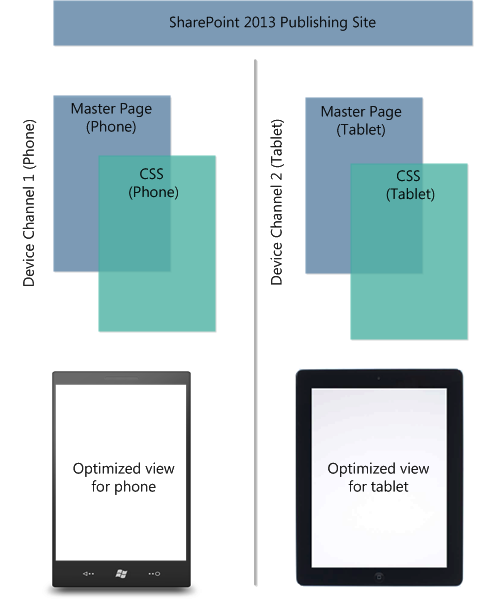
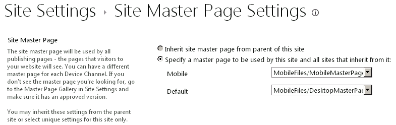

# SharePoint Design Manager device channels
Learn about, plan and configure a device channels experience on a SharePoint site.
## Introduction to device channels
<a name="Int"> </a>

Browsing the web on a mobile device is now so common that a SharePoint site must be optimized for readability and ease of use on smartphones and other mobile devices such as tablets. With device channels in SharePoint, you can render a single publishing site in multiple ways by using different designs that target different devices. This article can help you plan for using the device channels feature in SharePoint. It provides a detailed overview of the feature itself, and provides the necessary information for creating a device channel. Also, after reading this article, you'll know what device channels you need to implement, and how to implement those channels.
  
    
    
Device channels are available only for SharePoint publishing sites. Before you implement device channels, you should already have a general understanding of the parts of a SharePoint site, how a SharePoint page is put together, and a general understanding of design manager. For more information about the SharePoint page model, including master page and page layouts, see  [Overview of the SharePoint page model](overview-of-the-sharepoint-page-model.md). For more information about design manager, see  [Overview of Design Manager in SharePoint](overview-of-design-manager-in-sharepoint.md).
  
    
    

## What is a device channel?
<a name="WhatDev"> </a>

A device channel is part of the SharePoint publishing infrastructure that enables you to render certain site content, style your content, and even change images—while maintaining the same URL across a pool of different devices. Compared to the desktop version of the SharePoint site, a mobile rendering can be formatted with a smaller width, have better navigation with wider touch targets, and show a reduced amount of information for better usability. You can create a single site, and author and edit the content a single time for all your different mobile devices. When a user browses a SharePoint site from a mobile device such as a smartphone or tablet, the mobile browser submits to the site an HTTP GET request that includes a user agent string. This string contains information about the type of device that is trying to access the site. Based on that device substring, the device browser can be redirected to a specific master page view. For example, if you have a collection of Windows Phone and iPad devices, you can provide each pool with a unique rendering of the SharePoint publishing site by using device channels. These device channels can each be given a different master page and thus CSS file to give users a more optimal viewing experience. Figure 1 shows the use of two device channels to provide two unique site renderings for a phone and tablet device.
  
    
    
Figure 1. Using device channels across different device platforms
  
    
    

  
    
    

  
    
    
You can create and configure a device channel from the **Site Settings** menu under the **Look and Feel** section, or alternatively through the **Design Manager** option in the same section. When you create a device channel item, there are five required and optional fields to supply for the process. Table 1 lists these fields and describes what type of information must be provided.
  
    
    

**Table 1. Required and optional fields for creating a device channel**


|**Field**|**Required Value**|**Value**|
|:-----|:-----|:-----|
|Name  <br/> |Yes  <br/> |This is the name of your design channel. It can be a friendly name to identify the channel.  <br/> |
|Alias  <br/> |Yes  <br/> |The alias name enables you to identify your device channel in code, device channel panels (discussed later in this article), previews, and other contexts.  <br/> **Important:** If you later change the channel alias, you'll have to manually update master page mappings, device channel panels, and any custom code or markup.           |
|Description  <br/> |No  <br/> |A field for supplying a general description for the device channel.  <br/> |
|Device Inclusion Rules  <br/> |Yes  <br/> |A field for supplying the user agent substring such as Windows Phone OS. Device redirection to a specific master page depends on what is entered for this value. For more information about what values to supply in this field, see the section  [User agent substrings and device channel rankings](#PlanDeviceChannels_UserAgentSubstrings) in this article. <br/> |
|Active  <br/> |No  <br/> |Selecting this check box activates your device channel. If you are working on a live site, you should not activate the channel before you have finished designing it. For testing, you can use the query string  `?DeviceChannel=alias` within a browser to preview your site for a specific channel. <br/> |
   

> [!NOTE]
> For more information and steps for creating a device channel, see the  [Create a device channel](sharepoint-design-manager-device-channels.md#create) section of this article.
  
    
    

After a device channel is created and activated, device redirection to a specific master page, for example a mobile version, is possible. The next step is to specify what master page should be displayed for mobile devices at the site level, through either the **Site Master Page Settings** or by using the **Publish and Apply** option in Design Manager.
  
    
    

**Figure 2. Setting master pages for mobile device viewing and default desktop viewing**

  
    
    

  
    
    

  
    
    
As seen in Figure 2, you can assign a specific master page for regular desktop viewing of the site, and a mobile master page for device redirection. Whether the mobile or default master pages are rendered depends on the configured, active device channel. Specifically, it depends on the device inclusion rule substring that is supplied in the device channel creation process.
  
    
    

### User agent substrings and device channel rankings
<a name="PlanDeviceChannels_UserAgentSubstrings"> </a>

When creating a device channel, you are asked to supply a user agent substring that is responsible for device redirection to a specified master page. If you do not provide this value in the **Device Inclusion Rules** field, device redirection is not possible and the channel cannot be created. Table 2 provides some sample user agent substring values that can be used when you are creating a device channel.
  
    
    

**Table 2. Sample user agent substring values**


|**Device**|**User agent substring(s)**|
|:-----|:-----|
|Windows Phone  <br/> | Windows Phone OS 7.5 (Specific to Windows Phone 7.5 phone.) <br/>  Windows Phone OS (Generic substring for all Windows Phone versions.) <br/> |
|iPhone  <br/> |iPhone  <br/> |
|iPad  <br/> |iPad  <br/> |
|Android  <br/> |Android  <br/> |
   
In the **Device Inclusion Rules** field, you add just the substring value or values for the devices that you want to include.
  
> [!IMPORTANT]
> User agent substring values differ from device manufacturer to device manufacturer, and possibly throughout a set of similarly branded devices, as seen above with Windows Phone. To achieve successful traffic redirection to a specific pool, you must provide a unique identifier for the user agent substring. For more information about how to isolate a substring across different devices, see the  [Planning your device channels experience](sharepoint-design-manager-device-channels.md#plan) section of this article.
  
    
    

After they are created, device channels are ordered and stored in a list. It is possible to support up to 10 device channels per site in SharePoint, so it may be necessary to rank your channels for proper traffic routing. You should order the most specific rules at the top for higher priority. For example, you may have multiple OS versions for Windows Phone devices in your organization, and want a unique master page rendering for Windows Phone 7.5 devices. All other Windows Phone devices would receive another mobile master page view. Table 3 shows two ordering schemes that could be applied, and the effects on the routing decision.
  
> [!NOTE]
> For more information about how to reorder device channels see the  [Create a device channel](sharepoint-design-manager-device-channels.md#create) section of this article.
  
    
    


**Table 3. Sample ordering of device channels**


|**Order 1 (Device Channels)**|**Order 2 (Device Channels)**|
|:-----|:-----|
|device channel 1—Windows Phone OS 7.5  <br/> |device channel 1—Windows Phone OS  <br/> |
|device channel 2—Windows Phone OS  <br/> |device channel 2—Windows Phone OS 7.5  <br/> |
|device channel 3—Default  <br/> |device channel 3—Default  <br/> |
   
If you choose Order 1, where the device inclusion rule substring is set to **Windows Phone OS 7.5**, a user browsing to your site with a Windows Phone 7.5 device is directed to device channel 1. A user with any other Windows Phone version is directed to device channel 2, and any non-Windows Phone user receives channel 3. But, if you choose Order 2, which prioritizes the generic Windows Phone OS substring, all Windows Phone traffic is directed to device channel 1. Device channel 2 isn't invoked for Windows Phone 7.5 devices because of the prioritization and generic nature of device channel 1. If you create multiple device channels, it is important to understand how order and ranking affect traffic redirection for your device pools.
  
> [!NOTE]
> For more information and steps for ordering device channels, see the  [Change the order of device channels](sharepoint-design-manager-device-channels.md#reorder) section of this article.
  
    
    


### Device channel panels
<a name="PlanDeviceChannels_UserAgentSubstrings"> </a>

A device channel panel is a container that can be used on a master page or page layout when you want specific content to render based on the alias of a given device channel, or set of channels. For example, you may have a web part or control that you want revealed only on the desktop view of the site, and not on any mobile device. The device channel panel can enable you to encapsulate this web part in code, and enable you to render it only through a designated device channel. A major benefit of device channel panels over using  `Display:None` in a CSS class is that the content inside a device channel panel is not rendered at all on the non-specified channels. Also, device channel panels can be used to reduce the rendered size of a page for devices by eliminating bulky content. This provides a way to increase site responsiveness on bandwidth-constrained devices.
  
    
    
A device channel panel snippet can be produced from the snippet gallery when you are previewing a master page or page layout. The following HTML example shows how to create a device channel panel. In this scenario, there is a paragraph of inserted text that is rendered only for a specific device channel. The attribute **IncludedChannels** is where you specify the alias of your configured device channel. Again, an alias is a name that is assigned during the device channel creation process and can be referenced in your code.
  
    
    

  
    
    


```HTML

<div data-name="DeviceChannelPanel">
 <!--CS: Start device channel panel snippet.-->
<!--SPM:<%@Register Tagprefix="Publishing" Namespace="Microsoft.SharePoint.Publishing.WebControls" Assembly="Microsoft.SharePoint.Publishing, Version=15.0.0.0, Culture=neutral, PublicKeyToken=62TDCXXXXXXXXXX
<!--MS:<Publishing:MobilePanel runat="server" IncludedChannels="DEFAULT">-->
<p>
This paragraph of content shows up only in the default channel, which means that you can use the same page layout for all your different devices. You can put HTML content, page fields, web parts, or CSS/JavaScript links within a device channel panel so that the content loads only on your specified channels.
</p>
<!--ME:</Publishing:MobilePanel>-->
<!--CE: End Device Channel Panel Snippet-->
</div>
```

If you want the content to be displayed on more than one channel, the aliases should be separated by commas within the quotation marks:  `IncludedChannels="alias1, alias2"` For more information about the device channel panel container, see [Overview of the SharePoint page model](overview-of-the-sharepoint-page-model.md). For more information about using Design Manager snippets, see  [SharePoint Design Manager snippets](sharepoint-design-manager-snippets.md).
  
    
    

## Planning your device channels experience
<a name="plan"> </a>

There are several questions and pieces of information that have to be answered and collected before you implement device channels in your organization. This section helps you plan for using device channels by asking relevant questions about your device and usability needs, and offering guidance on your approach for the feature. The questions in this section are intended to be read in order and not individually.
  
    
    

### What site experience am I trying to achieve across the desktop and my devices?

Like most organizations, there will be unique usability requirements based on your organization's needs. The ideal goal is to make sure that this experience is translated optimally to any type of form factor, whether a desktop or device. But, despite that broad generalization, it is still a complex process, especially when you deal with varying resolutions and less screen area for touch interaction. Also, perhaps some phones in your inventory require unique UI customization that others cannot or should not have. Web development can be difficult in these scenarios, and more so if you do not have the luxury of assigning a single master page across several device brands.
  
    
    
One first task should be to write down what has to be achieved functionally to create a successful user experience across devices. What does the user base expect to be able to do with your SharePoint publishing site on their desktop, phone, tablet? You may discover various issues including possible limitations, and individual device considerations that have to be considered. Record all of this information in any format; it will help you understand your specific objectives with the device channel feature, and help you answer successive questions listed below, like what devices you are willing to support and how many device channels you should implement.
  
    
    
Also, it is important to remember some key functions the device channels feature provides that can solve various planning issues. Examples include the support of several device channels for unique master page mappings to multiple devices. Also, the use of device channel panels to selectively display various content elements across different device pools.
  
    
    

### How many device channels do you need?

You can have a maximum of 10 device channels including the default configured on a specific site for an on-premises installation, and a total of two device channels when using SharePoint Online. For your organization, it might be as simple as creating a single device channel, applying several device inclusion rules representing all the devices, and redirecting to a specific master page. Ideally, it is optimal to have as few device channels as possible. However, based on device differentiation or unique HTML/CSS customization, having only one channel might not an option, and you might require additional device channels.
  
    
    
To determine the number of device channels, you should reference the information collected about your site goals across devices, devices that you plan to support, and the level of required customization from the previous questions. Using this information, create a list of the channels you want to implement. Can one mobile master page attached to one device channel address all requirements? Or do you need a separate master page association for tablets, and so multiple channels? This is also an appropriate time to name your channels, and think of a suitable alias name for each channel so that it can be referenced in code. If you change the channel alias later, you will have to update all references to it.
  
    
    

### Where is a list of all of the device substrings I can use?

There are some generic manufacturer user agent substrings that you can use for device redirection such as Windows Phone OS or iPhone, as shown in Table 2. The substring needed in the **Device Inclusion Rules** field is usually a subset of the much larger user agent string provided when the device connects to the site. It is recommended that you find a device-specific string by locating it on the manufacturer or software provider website, or through a general web-based search. Sometimes a specific, versioned substring might be difficult to isolate given similarities in user agent string construction. Table 4 provides two sample user agent strings, for Windows 8 desktop and for a tablet device.
  
> [!NOTE]
> The below strings are examples, and not genuine strings for the covered Windows devices. They are provided to illustrate the point of isolating a substring if needed. 
  
    
    


**Table 4. Differentiating between user agent strings**


|**Device**|**User Agent String**|
|:-----|:-----|
|Windows 8 desktop  <br/> |(compatible; MSIE 10.0; Windows NT 6.2; WOW64; Trident/6.0)  <br/> |
|Windows 8 tablet (example)  <br/> |(compatible; MSIE 10.0; Windows NT 6.2; WOW64; Trident/6.0; touch)  <br/> |
   
These strings are very similar in format; the only difference is the inclusion of  `touch` for the Windows 8 tablet example. For this particular scenario, if you wanted a specific master page rendering for the tablet device, you would supply `touch` as your substring when you are creating a device inclusion rule. The key, when you deal with situations such as this, is to find a point of differentiation between similar strings. If you were to create a device channel with a device inclusion rule using a common value such as **MSIE 10.0**, there would be no way to differentiate between the desktop and the tablet.
  
    
    

### Do I need to use device channel panels?

No. Device channel panels are helpful when you want to allow, adjust, or prevent the rendering of some UI-based element across different device experiences. For example, you may have text or a control that you want to appear on iPhone that you wouldn't want to appear on an Android device. A reason could be that the form factor has a smaller screen size and usability would be affected. Regardless of the condition, device channel panels can be assigned to an alias of a created device channel and provide the flexibility needed for this level of differentiation. A good question to ask is would there be a reason for not applying a single master page to a group of different devices in my organization? If so, a device channel panel may be the best option to get a more granular development experience that caters to specific device needs. Also, you can use device channel panels to add channel-specific CSS to page layouts.
  
    
    

### Can I use cookies to select a device channel?

Yes, you can force or override device channel selection through the use of cookies. To do so, you have to create a browser cookie named deviceChannel, and provide it with the alias of your specified device channel. Also, device channels can set a JavaScript variable called **effectiveDeviceChannel** that contains the current channel alias. This variable can be used to show which channel is currently being used. To make your site emit the JavaScript variable, add this property to the root web property bag:
  
    
    

```

key = PublishingInformationControlIncludeEffectiveDeviceChannel, value = true
```

This variable can also be used to affect the rendering of content, and web parts, on a page.
  
    
    

## Create a device channel
<a name="create"> </a>

Use this procedure to create a new device channel.
  
    
    

### To create a device channel


1. Start Design Manager. (For example, on the **Settings** menu, choose **Design Manager**.)
    
  
2. In the numbered list, select **Manage Device Channels**.
    
  
3. On the Design Manager: Manage Device Channels page, choose **Create a channel**.
    
  
4. On the Device Channels - New Item page, in the **Name** text box, enter a name for the device channel.
    
  
5. In the **Alias** text box, enter an alias for the device channel. The alias must be alphanumeric characters and may not contain spaces. You will use the alias to refer to the device channel in code and in other contexts.
    
  
6. In the **Description** text box, enter a brief description of the devices or browsers that the channel will capture.
    
  
7. In the **Device Inclusion Rules** text box, enter the user agent substrings for the channel. A request for a webpage will use this channel if any of the strings that you provide match the user agent string of the request.
    
  
8. If you are ready to make the channel available to render pages, select the **Active** check box.
    
  
9. Choose **Save**.
    
  

## Change a device channel
<a name="modify"> </a>

Use this procedure to change an existing device channel.
  
> [!NOTE]
> You cannot modify the Default channel. 
  
    
    


### To change a device channel


1. Start Design Manager. (For example, on the **Settings** menu, choose **Design Manager**.)
    
  
2. In the numbered list, select **Manage Device Channels**.
    
  
3. On the Design Manager: Manage Device Channels page, choose **Edit or reorder existing channels**.
    
  
4. In the **Device Channels** list, select the device channel that you want to change, and then, on the **ITEMS** tab, choose **Edit Item**.
    
  
5. To change the name of the device channel, enter a new name in the **Name** text box.
    
  
6. To change the alias of the device channel, enter a new alias in the **Alias** text box.
    
    > [!NOTE]
    > If you change a device channel's alias, you must manually change the alias in other places where you use it. For example, you must manually change the alias in custom code or markup, and you must manually change the mappings between the device channel and master pages. 

7. To change the description of the device channel, enter a new description in the **Description** text box.
    
  
8. To change the device inclusion rules, edit the strings in the **Device Inclusion Rules** text box.
    
  
9. To make the device channel active, select the **Active** check box. To make the channel inactive, clear the **Active** check box.
    
  
10. Choose **Save**.
    
  

## Delete a device channel
<a name="delete"> </a>

Use this procedure to delete an existing device channel.
  
> [!NOTE]
> You cannot delete the Default channel. 

### To delete a device channel


1. Start Design Manager. (For example, on the **Settings** menu, choose **Design Manager**.)
    
  
2. In the numbered list, select **Manage Device Channels**.
    
  
3. On the Design Manager: Manage Device Channels page, choose **Edit or reorder existing channels**.
    
  
4. In the **Device Channels** list, select the device channel that you want to delete.
    
  
5. On the **ITEMS** tab, choose **Delete Item**.
    
  
6. Choose **OK**.
    
  

## Change the order of device channels
<a name="reorder"> </a>

Use this procedure to change the order of device channels.
  
    
    

### To reorder device channels


1. Start Design Manager. (For example, on the **Settings** menu, choose **Design Manager**.)
    
  
2. In the numbered list, select **Manage Device Channels**.
    
  
3. On the Design Manager: Manage Device Channels page, choose **Edit or reorder existing channels**.
    
  
4. On the **ITEMS** tab, choose **Reorder Channels**.
    
  
5. On the Device Channel Reordering page, choose the channel whose order you want to change, and then select **Move Up** or **Move Down**.
    
  
6. After the channels are ordered the way that you want them, choose **OK**.
    
  

## See also
<a name="PlanDeviceChannels_addresources"> </a>


-  [Develop the site design in SharePoint](develop-the-site-design-in-sharepoint.md)
    
  
-  [Overview of the SharePoint page model](overview-of-the-sharepoint-page-model.md)
    
  
-  [Overview of Design Manager in SharePoint](overview-of-design-manager-in-sharepoint.md)
    
  
