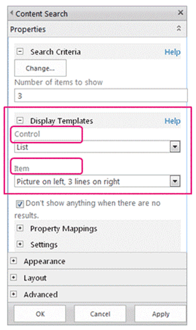
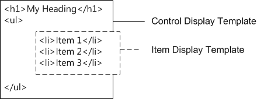

# SharePoint Design Manager display templates
Learn about display templates, including: how they relate to Search Web Parts, how the templates are structured, how to map properties and use variables and jQuery, and how to create a custom display template in SharePoint.
## Introduction to display templates
<a name="bk_introduction"> </a>

Display templates in SharePoint are templates used in Web Parts that use search technology (referred to in this article as Search Web Parts) to show the results of a query made to the search index. Display templates control which managed properties are shown in the search results, and how they appear in the Web Part. Each display template is made of two files: an HTML version of the display template that you can edit in your HTML editor, and a .js file that SharePoint uses.
  
    
    

> **Note:**
> Only Search Web Parts can use display templates. The Content Query Web Part is not search-driven, and so does not use display templates. 
  
    
    

You can view existing display templates in Design Manager, but you don't create them in Design Manager the way that you create master pages and page layouts. Instead, you:
  
    
    

- Open your  [mapped network drive to the Master Page Gallery](how-to-map-a-network-drive-to-the-sharepoint-master-page-gallery).
    
  
- Open one of the four folders in the **Display Templates** folder.
    
    > **Note:**
      > The folder you choose depends on the type of display template you want to use. For example, if your site uses cross-site publishing, copy a display template from the **Content Web Parts** folder. For more information, see [Display template reference in SharePoint](http://technet.microsoft.com/en-us/library/jj944947.aspx). 
- Copy the HTML file for an existing display template that's similar to what you want. The exact location that you copy the file to does not matter, as long as it is in the **Master Page Gallery**.
    
  
- Open and modify your copy in an HTML editor.
    
  
By using an existing display template as a starting point for a new display template, you can benefit from helpful information about the customization process in the comments of the default display templates, and you have a framework in place for basic tasks such as mapping input fields. It also guarantees that your templates use the correct basic page structure.
  
    
    
When you create a display template by copying the HTML file for an existing display template in the **Display Templates** folder in the **Master Page Gallery**:
  
    
    

- A .js file that has the same name is created in the location where you copied the HTML file.
    
  
- All markup required by SharePoint is added to the .js file so that the display template displays correctly.
    
  
- The HTML file and the .js file are associated, so that any later edits to the HTML file are synched to the .js file when the HTML file is saved.
    
  

> **Note:**
> The syncing goes in one direction only. Changes to the HTML display template are synched to the associated .js file. Unlike master pages and page layouts, when working with display templates you can't choose to work only with the .js file by breaking the association between the files. You must enter all the HTML and JavaScript in the HTML file. 
  
    
    


## Understanding the relationship between display templates and Search Web Parts
<a name="bk_DTandSWP"> </a>

There are two primary types of display templates:
  
    
    

- **Control templates** determine the overall structure of how the results are presented. Includes lists, lists with paging, and slide shows.
    
  
- **Item templates** determine how each result in the set is displayed. Includes images, text, video, and other items.
    
  
For more information about these and other display templates, see  [Display template reference in SharePoint](http://technet.microsoft.com/en-us/library/jj944947.aspx).
  
    
    
After you add a Search Web Part (such as the Content Search Web Part) to a page, to configure the Web Part, you select both a control display template and an item display template, as shown in Figure 1.
  
    
    

**Figure 1. Tool pane of Content Search Web Part**

  
    
    

  
    
    

  
    
    
The control display template provides HTML to structure the overall layout for how you want to present the search results. For example, the control display template might provide the HTML for a heading and the beginning and end of a list. The control display template is rendered only once in the Web Part.
  
    
    
The item display template provides HTML that determines how each item in the result set is displayed. For example, the item display template might provide the HTML for a list item that contains a picture, and three lines of text that are mapped to different managed properties associated with the item. The item display template is rendered one time for each item in the result set. So, if the result set contains ten items, the item display template creates its section of HTML ten times.
  
    
    
When used together in this way, the control display template and the item display template combine to create a cohesive block of HTML that is rendered in the Web Part, as shown in Figure 2.
  
    
    

**Figure 2. Combined HTML output of a control display template and item display template**

  
    
    

  
    
    

  
    
    
For more information about display templates, see the "Search-driven Web Parts and display templates" section in  [Overview of the SharePoint page model](overview-of-the-sharepoint-page-model).
  
    
    

## Understanding the display template structure
<a name="bk_DTstructure"> </a>

The HTML file that is used for a display template is a fully-formed HTML document, but it does not represent a full HTML webpage. SharePoint converts the pieces of the display template HTML file into JavaScript. This section describes the four major sections of a display template.
  
    
    

### Title tag

The text in the **\<title\>** tag in a display template file is used as the display name in the **Display Templates** section of the Web Part edit pane when the Search Web Part is in edit mode. The following example is for the item display template named Item_Picture3Lines.html:
  
    

```HTML

<title>Picture on left, 3 lines on right</title>
```


### Header properties

Immediately after the **\<title\>** tag, there is a set of custom elements bounded by the following markup:
  
    
    

```HTML
<!--[if gte mso 9]><xml>
<mso:CustomDocumentProperties>
…
</mso:CustomDocumentProperties>
</xml><![endif]-->

```

These elements and their properties provide important information to the SharePoint environment about the display template. Table 1 describes the custom properties that are used in display templates.
  
    
    

> **Note:**
> Not all custom properties are used in every display template. Also, some properties can be changed by editing the display template file properties in Design Manager. 
  
    
    


**Table 1. List of CustomDocumentProperties entries**


|**Property**|**Description**|
|:-----|:-----|
|**TemplateHidden** <br/> |Boolean value that indicates whether to hide the display template from the list of available templates in the Web Part. This value can be changed in the display template file properties.  <br/> |
|**ManagedPropertyMapping** <br/> |Maps fields exposed by search result items into properties available for JavaScript. Used only in item templates.  <br/> |
|**MasterPageDescription** <br/> |Provides a friendly description of the display template. This is shown to users in the SharePoint editing environment. This value can be changed in the display template file properties.  <br/> |
|**ContentTypeId** <br/> |The ID of the content type associated with the display template.  <br/> |
|**TargetControlType** <br/> |Indicates the context in which the display template is used. This value can be changed in the display template file properties.  <br/> |
|**HtmlDesignAssociated** <br/> |Boolean value that indicates whether a display template HTML file has a .js file associated with it.  <br/> |
|**HtmlDesignConversionSucceeded** <br/> |Indicates whether the conversion process was successful. This value is automatically added to the file by SharePoint, and is used only in custom display templates.  <br/> |
|**HtmlDesignStatusAndPreview** <br/> |Contains the URL to the HTML file and the text for the **Status** column (either **Conversion successful** or **Warnings and Errors**). This value is automatically added to the file by SharePoint, and is used only in custom display templates.  <br/> |
   

### Script block
<a name="bk_scriptblock"> </a>

Inside the **\<body\>** tag, you can see the following **\<script\>** tag:
  
    
    

```HTML

<script>
     $includeLanguageScript(this.url, "~sitecollection/_catalogs/masterpage/Display Templates/Language Files/{Locale}/CustomStrings.js");
</script>
```

By default, this line is included in all display templates. You can add more lines of code inside the **\<script\>** tag to reference CSS files or other JavaScript files outside your main display template HTML file. Table 2 shows examples for how to include other resources.
  
    
    

**Table 2. Examples for including external resources in the \<script\> tag**


|**If you want to include the following:**|**Use the following code:**|
|:-----|:-----|
|A JavaScript file that is part of the current site collection  <br/> | `$includeScript(this.url, "~sitecollection/_catalogs/masterpage/Display Templates/Content Web Parts/MyScripts.js");` <br/> |
|An external JavaScript file  <br/> | `$includeScript(this.url, "http://www.contoso.com/ExternalScript.js");` <br/> |
|A CSS file that is part of the current site collection  <br/> | `$includeCSS(this.url, "~sitecollection/_catalogs/masterpage/Display Templates/Content Web Parts/MyCSS.css");` <br/> |
|A CSS file that is in a location relative to the current display template  <br/> | `$includeCSS(this.url,"../../MyStyles/MyCSS.css");` <br/> |
   

> **Note:**
> If **Content Approval** is required for items in the Master Page Gallery, all resource files (including CSS and .js files) must be published before they are available to master pages and page layouts. For more information, see [Require approval of items in a site list or library](http://office.microsoft.com/en-us/sharepoint-help/require-approval-of-items-in-a-site-list-or-library-HA102853936.aspx?CTT=1). 
  
    
    


### DIV block
<a name="bk_scriptblock"> </a>

Following the **\<script\>** tag is a **\<div\>** tag with an ID. By default, the ID for this **\<div\>** tag matches the name of the HTML file. Any HTML or code that you want the display template to provide must be included inside this **\<div\>** tag. But, the tag itself is not included in the markup that is rendered on the webpage at run time.
  
    
    

> **Note:**
> If you want to assign a CSS style or an ID to the block of HTML that is rendered on the page at run time, you can add a new tag inside the first **\<div\>** tag. You can also assign a CSS style or an ID to the HTML that surrounds the variable `_#= ctx.RenderGroups(ctx) =#_` in the control template. The variable `_#= ctx.RenderGroups(ctx) =#_` is used to render the HTML that surrounds the query results that are rendered by the item template.
  
    
    

In the first **\<div\>** tag you'll see code inside comment blocks that begin with **<!--#_** and end with **_#-->**. You use JavaScript code inside these blocks, and HTML outside the blocks. You can also use these blocks to control the HTML with conditional statements. To do this, use a comment block with the conditional statement and opening bracket, followed by HTML, followed by another comment block with the closing bracket. In the following example, the anchor tag is rendered on the page only if the value for the **linkURL** object is not empty.
  
    
    


```HTML

<!--#_
if(!linkURL.isEmpty)
{
_#-->
     <a class="cbs-pictureImgLink" href="_#= linkURL =#_" title="_#= $htmlEncode(line1.defaultValueRenderer(line1)) =#_" id="_#= pictureLinkId =#_">
<!--#_
}
_#-->

```


## Mapping input properties and getting their values
<a name="bk_mapproperties"> </a>

The header section of an item display template has a custom document property named **ManagedPropertyMapping**. This property takes the managed properties that are used by search and maps them to values that can be used by the display template. The property is a comma-delimited list of values that uses the following format: ' _property display name_'{ _property name_}:' _managed property_'. For example,  `'Picture URL'{Picture URL}:'PublishingImage;PictureURL;PictureThumbnailURL'`.
  
    
    
Let's look at the format in more detail:
  
    
    

-  _property display name_ is the property name that shows in the Web Part editing pane when the display template is selected.
    
  
-  _property name_ is an identifier that uses localized string resources to look up the name of the managed property. It is also the value that appears in the **Property Mappings** section of the Web Part settings menu. When you edit the settings for a Web Part, you can change this value to change what managed property is associated with the field that appears in the Web Part.
    
  
-  _managed property_ is a string of one or more managed properties, separated by semicolons. At run time, the list is evaluated from left to right, and the first value that matches the name of a managed property of the current search item will have its value mapped to this slot. This enables you to write a display template that can work with multiple item types and that can use consistent rendering if compatible properties are present.
    
  
After you map a property, you can get its value in script by using the following code:  `var pictureURL = $getItemValue(ctx, "Picture URL");`
  
    
    
The second parameter that is passed to **$getItemValue()** must match the property display name in single quotes used in the **ManagedPropertyMapping** element. In this example, **Picture URL** is the property name that is passed to **$getItemValue()**.
  
    
    
This code returns a value information object ( **valueInfoObj**). This object contains a raw representation of the input value, together with the value with a default encoding applied to it.
  
    
    
You can use variables within the sections of JavaScript as you typically would, to manipulate variables and create HTML strings to be rendered on the page at run time. But, to reference variables declared in the script directly in the HTML, you must use the following format: _#=  _variableName_ =#_. For example, to use the variable **pictureURL** as the value for an image, you use the following HTML: ``
  
    
    

## Using jQuery with display templates
<a name="bk_jQuery"> </a>

You can use jQuery with your display templates. But, be aware of two important factors:
  
    
    

- To include the jQuery libraries in your display template, follow the directions described in the  [Script block](#bk_scriptblock) section, earlier in this article.
    
  
- If you use ID selectors in jQuery, use the following code to create a variable for the ID:  `var containerQueryId = '#' + '_#= containerId =#_';`
    
    Use the following code to reference the selector in jQuery:  `$('_#= containerQueryId =#_')`
    
  

## Create a display template
<a name="bk_createDT"> </a>

Before you can create a display template by using the following procedure, you must have a mapped network drive that points to the **Master Page Gallery**. For more information, see  [How to: Map a network drive to the SharePoint Master Page Gallery](how-to-map-a-network-drive-to-the-sharepoint-master-page-gallery).
  
    
    

### To create a display template


1. Using Windows Explorer, open the mapped network drive to the **Master Page Gallery**.
    
  
2. Open the **Display Templates** folder, and then open the **Content Web Parts** folder.
    
  
3. Copy the HTML file for a display template that is similar to what you want to create. For a list of the default display templates and their descriptions, see  [Display template reference in SharePoint](http://technet.microsoft.com/en-us/library/jj944947.aspx).
    
    At this point, SharePoint copies the HTML file into a .js file that has the same name. For example, if the copied HTML file is named Item_Picture3Line_copy.html, a corresponding .js file named Item_Picture3Lines_copy.js is also created. If you choose to rename the file, the corresponding .js file name also changes.
    
  
4. To customize the display template, edit the HTML file that resides on the server by using an HTML editor to open and edit the HTML file in the mapped drive. Each time that you save the HTML file, any changes are synched to the associated .js file.
    
  
5. Browse to your publishing site.
    
  
6. In the upper-right corner of the page, choose **Settings**, and then choose **Design Manager**.
    
  
7. In Design Manager, in the left navigation pane, choose **Edit Display Templates**. Your HTML file now appears with a **Status** column that shows one of two statuses:
    
  - **Warnings and Errors**
    
  
  - **Conversion successful**
    
  

    > **Note:**
      > Unlike master pages and page layouts, you can't use the preview page to see a live server-side preview of your display template. To preview the display template, you must add a Content Search Web Part to a page, and then apply the display template in the Content Search Web Part edit pane. If there are any errors in the display template, the Content Search Web Part displays an error message. Errors must be fixed before the display template can display correctly. 
8. To fix any errors, edit the HTML file that resides on the server by using an HTML editor to open and edit the HTML file on the mapped drive. Save the display template, and then reload the page that contains the Content Search Web Part that uses the display template.
    
  

## Additional resources
<a name="bk_addresources"> </a>


-  [Overview of Design Manager in SharePoint](overview-of-design-manager-in-sharepoint)
    
  
-  [Develop the site design in SharePoint](develop-the-site-design-in-sharepoint)
    
  
-  [How to: Convert an HTML file into a master page in SharePoint](how-to-convert-an-html-file-into-a-master-page-in-sharepoint)
    
  
-  [How to: Create a page layout in SharePoint](how-to-create-a-page-layout-in-sharepoint)
    
  
-  [SharePoint Design Manager branding and design capabilities](sharepoint-design-manager-branding-and-design-capabilities)
    
  

