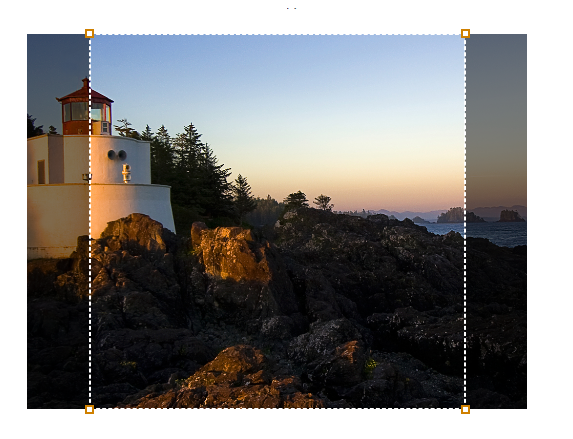
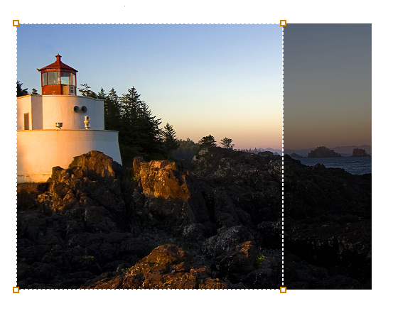

# SharePoint Design Manager image renditions
Learn how to create an image rendition, how to add it to a page, and how to crop it. An image rendition defines the dimensions that are used to display images in SharePoint publishing sites.
Image renditions enable you to display differently sized versions of an image on different pages in a publishing site, based on the same source image. When you create an image rendition, you specify the width and/or height for all images that use that image rendition. The image renditions are available for every image that is uploaded to a library in that site collection. For example, designers can create an image rendition to display thumbnail images and another image rendition to display banner images. When an image is added to a page, the author can specify the image rendition to use on that image. Authors can also crop the image rendition to specify the portion of the image to use in the image rendition. The correct image size is displayed when the page is rendered.
  
    
    

Image renditions enable you to render a single image in multiple ways. An image can be displayed in various sizes or with different cropping. The first time that an image is requested, SharePoint Server uses the specified image rendition to generate the image. When a user views a SharePoint site, the correctly sized version of the image is downloaded to the client computer. This reduces the size of the file that is downloaded to the client, which improves site performance.
## Prerequisites for managing image renditions
<a name="Prerequisites"> </a>

Because image renditions have dependencies on other features in SharePoint, make sure that you meet the prerequisites in this section before you perform the procedures in this topic. Prerequisites include:
  
    
    

- **A publishing site collection** The site collection where you are adding image renditions must have been created by using the Publishing Portal or the Product Catalog site collection template. Or, publishing features must be enabled on the site collection where you want to use image renditions. For more information, see [Overview of publishing to Internet, intranet, and extranet sites](http://technet.microsoft.com/en-us/library/jj635881%28office.15%29.aspx) in the TechNet Library.
    
  
- **A configured BLOB cache** The disk-based BLOB cache controls the caching for binary large objects (BLOBs), such as frequently used image, audio, and video files, and other files that are used to display webpages, such as .css files and .js files. The BLOB cache must be enabled on each front-end web server where you want to use image renditions. If the BLOB cache is not enabled, the original image is always used. For more information, see [Configure cache settings for a Web application](http://technet.microsoft.com/en-us/library/cc770229.aspx) in the TechNet Library.
    
  
- **An asset library (recommended)** You can use the Asset Library template to set up a library that makes it easy to store, organize, and find rich media assets, such as image, audio, or video files. For more information, see [Set up an Asset Library to store image, audio, or video files](http://office.microsoft.com/en-us/sharepoint-server-help/set-up-an-asset-library-to-store-image-audio-or-video-files-HA102785730.aspx) on Office.com.
    
  

## Create an image rendition
<a name="Create"> </a>

When an image rendition is created, SharePoint creates a unique ID that identifies that image rendition. An image is generated when SharePoint Server first receives a request for the image rendition.
  
    
    

### To create an image rendition


1. Verify that the user account that is performing this procedure has, at minimum, Design permissions to the top-level site of the site collection.
    
  
2. In a browser, go to the top-level site of the publishing site collection.
    
  
3. Choose the **Settings** icon. On the **Site Settings** page, in the **Look and Feel** section, choose **Image Renditions**.
    
    > [!NOTE]
    > The Image Renditions page can also be opened from the default home page of the publishing site. In the **I'm the Visual Designer** section, choose **Configure image renditions**. 
     

4. On the **Image Renditions** page, choose **Add new item**.
    
  
5. On the **New Image Rendition** page, in the **Name** box, enter a name for the rendition. For example, enterThumbnail_Small.
    
  
6. In the **Width** and **Height** text boxes, enter the width and height, in pixels, of the rendition, and then choose **Save**.
    
  

## Edit an image rendition
<a name="Edit"> </a>

When an image rendition is edited, the new dimensions take effect the next time that the image is requested. If there is an image that was generated previously from the image rendition, the image is regenerated with the new dimensions the next time that the image is requested.
  
    
    

### To edit an image rendition


1. Verify that the user account that is performing this procedure has, at minimum, Design permissions to the top-level site of the site collection.
    
  
2. In a browser, go to the top-level site of the publishing site collection.
    
  
3. Choose the **Settings** icon. On the **Site Settings** page, in the **Look and Feel** section, choose **Image Renditions**.
    
    > [!NOTE]
    > The **Image Renditions** page can also be opened from the default home page of the publishing site. In the **I'm the Visual Designer** section, choose **Configure image renditions**. 

4. On the **Image Renditions** page, choose the image rendition that you want to edit.
    
  
5. On the **Edit Image Rendition** page, modify the name, width, or height of the image rendition.

     > [!NOTE]
  > To use the same image rendition on all webs within the same site collection, go to the image file directly and edit renditions from there. 

## Add an image rendition
<a name="Add"> </a>

When you add an image to a page in a SharePoint publishing site, you can specify the image rendition to use for that image. When the page is rendered in a browser, the correct image size is displayed. You can specify the image rendition in the Rich Text Editor, in an image field control, or in the image URL.
  
    
    

### Specify the image rendition by using the Rich Text Editor

When an image is inserted in a page, you can specify the image rendition to use so that the correct image size is displayed when the page is rendered. You can specify the image rendition in the Rich Text Editor only for images that are stored in the same site collection as the page that is being edited.
  
    
    

### To specify an image rendition by using the Rich Text Editor


1. On the **Page** tab, choose **Edit**.
    
  
2. Choose the **Settings** icon, and then choose **Add a page**.
    
  
3. In the **Add a page** window, enter a name for the page, and then choose **Create**.
    
  
4. Place the pointer in the **Page Content** field.
    
  
5. On the **Insert** tab, choose **Picture**, and then choose **From SharePoint**.
    
  
6. Locate the image that you want to add to the page, select the image, and then choose **Insert**. The image will be displayed at full size.
    
  
7. On the **Design** tab, in the **Select** group, choose **Pick Rendition**, and then select an image rendition. The image will display according to the size specified for the image rendition.
    
    > [!NOTE]
    > The **Pick Rendition** command is available only for images that are stored in the same site collection as the page that is being edited.

8. If you want to crop the image rendition, choose **Pick Rendition**, and then choose **Edit Renditions**.
    
    For more information about cropping image renditions, see the  [Crop an image rendition](#Crop) section of this article.
    
  

### Specify the image rendition in the image URL

You can specify the image rendition by adding the RenditionID, Width, or Height parameters to the image URL.
  
    
    
 **RenditionID** Use the RenditionID parameter to specify the ID of the image rendition to use.
  
    
    
 **Width** Use the Width parameter to specify the width, in pixels, of the image rendition. SharePoint Server tries to find an image rendition with the specified width. Next, SharePoint Server tries to find an image rendition that has a width that is larger than the specified width. If there are multiple image renditions that match this criterion, SharePoint Server uses the image rendition with the closest width to what was specified. If there is no image rendition with a width that is equal to or larger than the specified width the original image is used.
  
    
    
 **Height** Use the Height parameter to specify the height, in pixels, of the image rendition. SharePoint Server tries to find an image rendition with the specified height. Next, SharePoint Server tries to find an image rendition that has a height that is larger than the specified height. If there are multiple image renditions that match this criterion, SharePoint Server uses the image rendition with the closest height to what was specified. If there is no image rendition with a height that is equal to or larger than the specified height the original image is used.
  
    
    
 **Width and Height** If both the Width parameter and the Height parameter are specified, SharePoint Server tries to find an image rendition with the specified width and height. Next, SharePoint Server tries to find a rendition that is closest to the width/height ratio specified. If there are multiple matches, the image rendition that has the closest larger width/height ratio to the requested size is chosen.
  
> [!NOTE]
> If the image URL includes the RenditionID parameter and Width and Height parameters, the Width and Height parameters are ignored. 
  
    
    

The following example shows how to use the RenditionID parameter:
  
    
    


```HTML


```

The following example shows how to use the Width and Height parameters:
  
    
    


```HTML

```


### Specify the image rendition in the image field control

A developer can specify the image rendition to use in the image field control. Use the **RenditionId** property to set the ID of the image rendition. For more information, see **RenditionId**.
  
    
    

## Crop an image rendition
<a name="Crop"> </a>

By default, an image rendition is generated from the center of the image. You can adjust the image rendition for individual images by cropping the portion of the image that you want to use. For example, if a photo shows a lighthouse scene but the image rendition does not show the whole lighthouse (see Figure 1), you can change the selected image area so that the whole lighthouse is displayed (see Figure 2). 
  
    
    

**Figure 1. Original image rendition**

  
    
    

  
    
    

  
    
    

**Figure 2. Cropped image rendition**

  
    
    

  
    
    

  
    
    
An image rendition can be cropped in the asset library or on a page, without changing the original image. 
  
    
    
Image renditions can be cropped in the following ways:
  
    
    

- Designers can crop an image rendition in the asset library. For example, a designer may want to specify how an image appears in the thumbnail image rendition.
    
  
- Authors can crop an image rendition when they insert an image into a page. This enables them to customize the look of their page. When an author crops an image rendition, this also changes the image rendition for that image. Anyone who uses that image rendition sees the cropped image.
    
    > [!NOTE]
    > An author can crop an image rendition only when the original image is stored in a library that is in the same site collection as the page that is being edited. For example, in cross-site publishing scenarios, an author can crop the image rendition only if the image is stored in the same site collection as the catalog content. Otherwise, the image rendition must be cropped in the asset library. 

### Crop an image rendition in the asset library

Designers can crop an image rendition in the asset library.
  
    
    

### To crop an image rendition in the asset library


1. Verify that the user account that is performing this procedure has Write permissions to the asset library where the image is located.
    
  
2. In a browser, go to the asset library.
    
  
3. Position the pointer in the lower-right corner of the image whose rendition you want to change, select the ellipses ( **...**) that appears, and then choose **EDIT RENDITIONS**.
    
    > [!NOTE]
    > You can also open the **Edit Renditions** page by placing the pointer over the preview image in the asset library, and then selecting the check box that appears at the bottom of the preview image. Then, on the **Design** tab, choose **Edit Renditions**. 

    The Edit Renditions page displays a preview image for each image rendition that is defined in the site collection.
    
  
4. Locate the image rendition that you want to change, and then choose **Click to change**.
    
  
5. In the **Crop Rendition** window, use the image tool to select the portion of the image that you want to use in the image rendition.
    
  
6. Choose **Save**.
    
  
If the image and the page that is being edited are in the same site collection, you also can crop an image rendition by using the Rich Text Editor.
  
    
    

### Crop an image rendition on a page

Authors can crop an image rendition when they insert an image into a page. This enables them to customize the look of their page. When an author crops an image rendition, this also changes the image rendition for that image. Anyone who uses that image rendition sees the cropped image.
  
    
    

### To crop an image rendition on a page


1. Verify that the user account that is performing this procedure has Write permissions to the asset library where the image is located.
    
  
2. In a browser, go to the SharePoint site that contains the image.
    
  
3. On the **Page** tab, choose **Edit**.
    
  
4. Select the image that you want to crop.
    
  
5. On the **Image** tab of the ribbon, in the **Select** group, choose **Pick Rendition**, and then choose **Edit Renditions**.
    
    The **Edit Renditions** page displays a preview image for each image rendition that is defined in the site collection.
    
    > [!NOTE]
    > The **Pick Rendition** command is available only for images that are stored in the same site collection as the page that is being edited.

6. Locate the image rendition that you want to change, and then choose **Click to change**.
    
  
7. In the **Crop Rendition** window, use the image tool to select the portion of the image to use in the image rendition.
    
  
8. Choose **Save**.
    
  

## Delete an image rendition
<a name="Delete"> </a>

When an image rendition is deleted, that image rendition is no longer generated for images. If a site requests the deleted image rendition, the original image is returned.
  
    
    

### To delete an image rendition


1. Verify that the user account that is performing this procedure has, at minimum, Design permissions to the top-level site of the site collection.
    
  
2. In a browser, go to the top-level site of the publishing site collection.
    
  
3. Choose the **Settings** icon. On the **Site Settings** page, in the **Look and Feel** section, choose **Image Renditions**.
    
    > [!NOTE]
    > The **Image Renditions** page can also be opened from the default home page of the publishing site. In the **I'm the Visual Designer** section, choose **Configure image renditions**. 

4. On the **Image Renditions** page, locate the image rendition that you want to delete, and then choose **Delete**.
    
  

## See also
<a name="Additional"> </a>

-  [Develop the site design in SharePoint](develop-the-site-design-in-sharepoint.md) 
-  [SharePoint Design Manager branding and design capabilities](sharepoint-design-manager-branding-and-design-capabilities.md)
-  [Build sites for SharePoint](build-sites-for-sharepoint.md)
    
  

