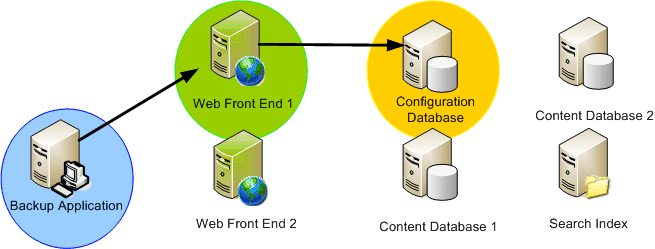

# SharePoint 2013 VSS Writer
 **Summary:** Learn about the characteristics and features of the Volume Shadow Copy Service (VSS) writer for Microsoft SharePoint 2013.
The VSS included with Windows Server is the infrastructure that provides built-in shadow copy capabilities. Shadow copies created by VSS augment the storage administrator's tape backup archival solutions, providing high fidelity point-in-time copies that can be created and restored easily and effectively, thereby helping to simplify several aspects of storage and data management. Microsoft SharePoint Foundation uses VSS to simplify backup and restore operations. 
  
    
    

## Characteristics of the System

Following are the SharePoint Foundation VSS solution features and characteristics:
  
    
    

- **A single VSS reference writer.** There has been no easy way for applications to describe their data to backup applications. To successfully back up various Windows platform applications, backup applications have an excessive number of APIs that they need to write specific code for. The SharePoint Foundation VSS writer (hereafter called "the SPF-VSS Writer") enables backup applications to take advantage of the single writer to backup SharePoint Foundation.
    
  
- **Full farm backup and restore for catastrophe.** The SPF-VSS Writer enables a backup application (requestor) to access the VSS API to request a backup or a restore operation for an entire SharePoint Foundation farm, including a single box setup or a farm configuration. (The IIS configuration store, which is primarily the `applicationhost.config` file, is not included. It must be backed up and restored separately.)
    
  
- **Database level granularity**. The SPF-VSS Writer enables a requestor to select all databases, a segment of the databases (multiple select), or a single database (single select) for both backup and restore operations. All databases, except configuration and the Central Administration content database, are selectable through the writer. The configuration and Central Administration content databases can be backed up and restored only as part of the whole farm. (The IIS configuration store is not included. It must be backed up and restored separately.)
    
  
- **Inventory of databases.** Before backup, the SPF-VSS Writer generates a flat list of databases selected for backup within the farm. The list is returned to the requestor so that backup can be run on the location where the database is physically located.
    
  
- **Farm support.** The writer understands and provides support to synchronize backup and recovery on a SharePoint Foundation farm in a limited way. The writer provides the requestor with a list of servers, databases, and files associated with the farm. The requestor is responsible for making a separate connection to each server to call the SPF-VSS Writer on that server to generate the backup or to run the restore operation.
    
  
- **Backup content without interruption.** If an application modifies a file while it is being backed up, the file could become corrupt. VSS enables a quick snapshot of the files to the shadow copy, while the application continues to operate at the original location without interruption.
    
  
- **Third-party pluggable database backup and recovery.** The SPF-VSS Writer offers pluggable/extensible backup for third-party solutions built on top of SharePoint Foundation. However, only databases that are registered within the configuration database are included in the writer. Any additional files and unregistered databases are not included.
    
  
- **Search index files backup and recovery.** Because search index files are stored in the file system, a separate file writer is needed to them up back up. To resolve this, SharePoint Foundation includes a separate search writer that handles search index files. To simplify the process for backup application writers, SharePoint Foundation declares cross-writer dependencies in such a way that search index files are also backed up or restored when backing up registered databases in the farm.
    
  
- **Full rollback.** The SPF-VSS Writer handles all components within a SharePoint Foundation deployment, including the configuration database and the content databases and the Search database and index. As mentioned previously, the writer also has a dependency on the Search writer, which handles all the Search index files for backup and recovery. At the time of recovery, the writer can roll back the entire SharePoint Foundation deployment by restoring a previous farm backup. (The IIS configuration store is not included. It must be backed up and restored separately.)
    
    > **Note:**
      > See "Restoring" in  [VSS requestors and SharePoint 2013](vss-requestors-and-sharepoint.md) for important information about restorations.
- **Post-restore synchronization of databases.** To ensure that all databases are synchronized with the farm after a restore operation is complete, each of the databases are automatically detached and reattached to the farm post recovery. Administrators do not need to run additional procedures to resynchronize the restored databases.
    
  

> **Important:**
> If you use SQL aliases in your SharePoint Foundation farm to connect to the SQL Server, then you must install the SQL client connectivity components on your farm servers in order to use the SPF-VSS writer for backup/restore. The components include SQL WMI provider for configuration management, which the SPF-VSS writer needs to resolve SQL aliases to the correct SQL Server. It is not necessary to install any of the management tools such as SQL Management Studio. You must use the same installation source (for example, a data DVD) that you would use to install the full SQL Server product. (Do not use the separate, stand-alone, version of the client components. That version does not include the SQL WMI provider.) Choose to make a custom installation and choose only the client components to install. 
  
    
    

## Functions Performed by the SPF-VSS Writer

The SPF-VSS Writer performs the following functions:
  
    
    

1. Builds SharePoint Foundation components.
    
  - Generates a full list of all components within the SharePoint Foundation farm.
    
  
  - Is not necessarily tied to backup process or restore process.
    
  

     
  

  

  
2. Backs up farm or database.
    
  - Requests a SharePoint Foundation (farm/database) backup via VSS.
    
  

     
  

  

  
3. Restores a farm or database.
    
  - Requests a SharePoint Foundation (farm/database) recovery via VSS.
    
  
  - Implements **postRestore()** to synchronize sites table.
    
  

     
  

  

  

## Next steps

Learn how to create and use a VSS requestor for SharePoint 2013:
  
    
    

-  [VSS requestors and SharePoint 2013](vss-requestors-and-sharepoint.md)
    
  

## Additional resources

-  [Overview of SharePoint 2013 and the Volume Shadow Copy Service](overview-of-sharepoint-and-the-volume-shadow-copy-service.md)
    
  

