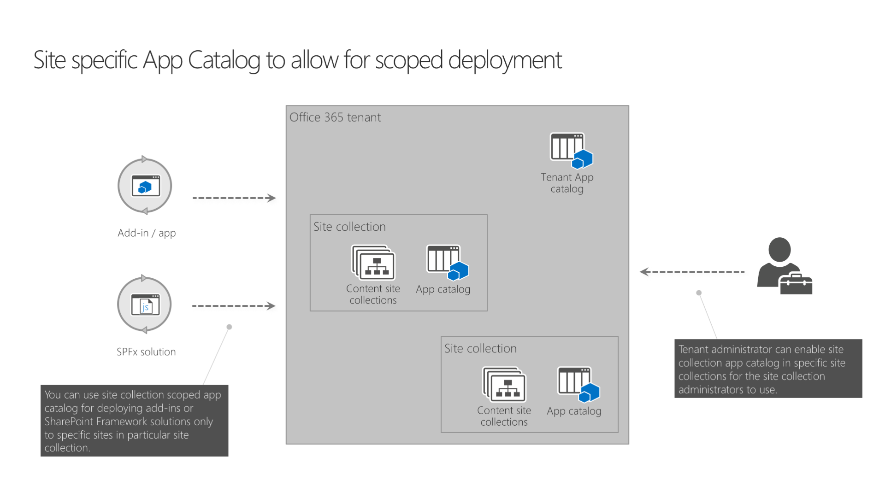

# Use the site collection app catalog

_**Applies to:** Office 365_

Using site collection app catalogs, SharePoint tenant administrators can decentralize the management and scope the deployment of SharePoint add-ins and SharePoint Framework solutions to specific sites.

## Why site collection app catalogs

Previously, all add-ins and SharePoint Framework solutions had to be managed centrally in the tenant app catalog. While tenant administrators could delegate the access to other people in the organization, a deployed package was visible on all site collections. SharePoint offered no supported way of deploying add-ins and SharePoint Framework solutions only to specific sites.

With the introduction of site collection app catalogs, tenant administrators can enable app catalog on the specific sites. Once enabled, site collection administrators can deploy SharePoint add-ins and SharePoint Framework solutions that will be available only in that particular site collection.

The following schema illustrates using site collection app catalogs:



In your Office 365 tenant you have a tenant app catalog. Solutions deployed to this app catalog, can be installed in any site collection in the tenant. Tenant administrators can choose to enable site collection app catalogs on specific site collections. Solutions deployed to the site collection app catalogs can only be installed in that particular site collection.

## Supported capabilities

### Support for both SharePoint add-ins and SharePoint Framework packages

In site collection app catalogs, just as in tenant app catalog, you can deploy both SharePoint add-ins and SharePoint Framework solutions (.sppkg).

### Including assets in solution packages

SharePoint Framework solution packages that contain assets, can be deployed to site collection app catalogs. Included assets will be deployed to a preconfigured document library in the same site collection as where the site collection app catalog is located. If the Office 365 Public CDN is configured, assets will be served from the CDN. Otherwise, assets will be served directly from the document library.

> [!NOTE]
> A bugfix for correctly supporting assets packaging in site collection app catalogs is currently being rolled out and should be available on all tenants before the end of the calendar year 2017.

### Tenant-scoped deployment

When deploying SharePoint Framework solutions that support tenant-wide deployment to a site collection app catalog, you will be prompted if you want to make this solution available to all sites in the organization. Despite the wording, if you check this box, the solution will be available immediately **only in the same site collection as where the app catalog is**. Other site collections in your organizations will not be able to use the solution. If you don't check this option, you will have to explicitly install the solution in your site, before you will be able to use it.

## Current limitations

### Application Lifecycle Management (ALM) APIs are not yet supported

At this moment, it's not possible to use the recently released ALM APIs to manage the lifecycle of solutions in site collection app catalogs. This is currently being worked on and should be available in the early 2018.

## Configure and manage site collection app catalogs

You can configure and manage site collection app catalogs using the SharePoint Online Management Shell.

> [!NOTE]
> Before you can manage site collection app catalogs in your tenant, ensure that you have installed [SharePoint Online Management Shell](https://www.microsoft.com/en-us/download/details.aspx?id=35588) from November 2017 or newer.

Alternatively, you can use the [Office 365 CLI](https://sharepoint.github.io/office365-cli?utm_source=msft_docs&utm_medium=page&utm_campaign=Use+the+site+collection+app+catalog) to manage your SharePoint site collection app catalogs. The Office 365 CLI is a cross-platform command line interface that can be used on any platform, including Windows, MacOS and Linux.

### Create a site collection app catalog

> [!NOTE]
> Before running the following script, connect to your SharePoint Online tenant using the `Connect-SPOService` cmdlet when using the SharePoint Online PowerShell. Also ensure, that you have a tenant app catalog created in your tenant. If you don't, the cmdlet will fail with the following error:
> ```text
> Cannot invoke method or retrieve property from null object. Object returned by the
> following call stack is null. "TenantAppCatalog
> RootWeb
> GetSiteByUrl
> new Microsoft.Online.SharePoint.TenantAdministration.Tenant()
> "
> ```
>
> Alternatively, if you are using the Office 365 CLI, you must first connect to your tenant using the `spo connect` command.

To create a site collection app catalog, use the `Add-SPOSiteCollectionAppCatalog` cmdlet passing the site collection where the app catalog should be created as the `-Site` parameter.

```powershell
# get a reference to the site collection where the
# site collection app catalog should be created
$site = Get-SPOSite https://contoso.sharepoint.com/sites/marketing

# create site collection app catalog
Add-SPOSiteCollectionAppCatalog -Site $site
```

Alternatively, use the `spo site appcatalog add` command if you are using the Office 365 CLI

```shell
spo site appcatalog add --url https://contoso.sharepoint.com/sites/marketing
```

After executing this script, the **Apps for SharePoint** library will be added to your site collection where you will be able to deploy SharePoint add-ins and SharePoint Framework solutions.

### Disable the site collection app catalog

> [!NOTE]
> Before running the following script, connect to your SharePoint Online tenant using the `Connect-SPOService` cmdlet for the SharePoint Online PowerShell or `spo connect` command for the Office 365 CLI.

To disable the site collection app catalog in your site collection, use the `Remove-SPOSiteCollectionAppCatalog` cmdlet passing the site collection where the app catalog should be disabled as the `-Site` parameter. Alternatively, if you have your site collection's ID, you can use the `Remove-SPOSiteCollectionAppCatalogById` cmdlet instead.

> [!NOTE]
> Despite the naming, the `Remove-SPOSiteCollectionAppCatalog` and `Remove-SPOSiteCollectionAppCatalogById` cmdlets don't remove the site collection app catalog from the site collection. Instead, they disable it so that it's not possible to deploy or use any solutions deployed in it.

```powershell
# get a reference to the site collection in which
# the site collection app catalog should be disabled
$site = Get-SPOSite https://contoso.sharepoint.com/sites/marketing

# disable the site collection app catalog
Remove-SPOSiteCollectionAppCatalog -Site $site
```

Alternatively, use the `spo site appcatalog remove` command if you are using the Office 365 CLI

```shell
spo site appcatalog remove --url https://contoso.sharepoint.com/sites/marketing
```

After executing this script, the **Apps for SharePoint** library will be still visible in your site collection, but you will not be able to deploy or use any solutions deployed in it.

## Considerations

### Governance

Currently, it's not possible to list all site collections in the tenant that have the site collection app catalog enabled.

### Security

Before deploying solutions to site collection app catalogs, site collection administrators should verify that these solutions meet organizational policies. Although solutions installed in site collection app catalogs can only be used in these particular site collections, they can potentially access resources from other sites in the tenant so administrators should ensure that the solutions they are about to deploy work as intended.

## See also

- [Manage the Site Collection App Catalog](https://support.office.com/en-us/article/Manage-the-Site-Collection-App-Catalog-928b9b61-a9de-4563-a7d1-6231aa9d4d19)
- [Office 365 CLI](https://sharepoint.github.io/office365-cli?utm_source=msft_docs&utm_medium=page&utm_campaign=Use+the+site+collection+app+catalog)

