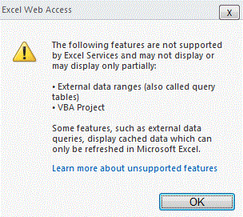
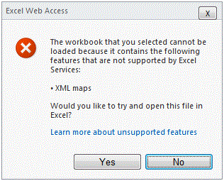

# Supported and Unsupported Features

  
    
    

Microsoft Excel is feature-rich. With every release, the functionality gap between Excel and Excel Services gets narrower, and the number of unsupported features is reduced. But is not possible to support every Excel feature in the second version of Excel Services, in Microsoft SharePoint Server 2010. 
When deciding which feature to support, priorities are given to features that are needed in key Excel Services scenarios, and to ensuring that Excel Services is a server-grade service that meets customers' expectations for reliability, scalability, and security.
  
    
    

> **Note:**
> This topic assumes that you are familiar with what is supported and unsupported in Microsoft Office SharePoint Server 2007. You can find more information about the unsupported features in Office SharePoint Server 2007 in  [Unsupported Features in Excel Services](http://msdn.microsoft.com/en-us/library/ms496823.aspx). 
  
    
    

## Support for New Excel Features

Most of the new features in Microsoft Excel 2010 work in some way in Excel Services. Some features display as they do in Excel. Others can be displayed and are also interactive.
  
    
    
 **Following are new features that can be viewed:**
  
    
    

- Sparklines
    
  
-  [Icon set](http://blogs.msdn.com/excel/archive/2009/08/05/icon-set-improvements-in-excel-2010.aspx) and [data bar improvements](http://blogs.msdn.com/excel/archive/2009/08/07/data-bar-improvements-in-excel-2010.aspx)
    
  
-  [PivotTable named sets](http://blogs.msdn.com/excel/archive/2009/10/05/pivottable-named-sets-in-excel-2010.aspx)
    
  
-  [PivotTable improvements](http://blogs.msdn.com/excel/archive/2009/10/15/a-few-more-pivottable-improvements-in-excel-2010.aspx)
    
  
 **Following are new features that can be viewed and interacted with:**
  
    
    

- Slicers
    
  
- PowerPivot files
    
  
The new functions in Excel are also supported. Embedded images, a long-time feature of Excel, are now supported and can be viewed in Excel Services. 
  
    
    

## Features that Previously Prevented Excel Files from Loading

In Office SharePoint Server 2007, Excel workbooks that contain unsupported features like VBA macros, form controls, and so on are not loaded in Excel Services.
  
    
    
In SharePoint Server 2010, to help users work with this limitation, Excel Services ignores certain unsupported features. In other words, rather than blocking the entire file from loading, Excel Services loads the file but you do not see the features that Excel Services does not support.
  
    
    
Following are features that do not prevent Excel Services from loading a file:
  
    
    

- Cell comments.
    
  
- Formula references to external books.
    
  
- Query tables (also known as external data ranges).
    
  
- Microsoft Visual Basic for Applications (VBA).
    
  
- Any OfficeArt technology. For example, Shapes, WordArt, SmartArt, organization chart, diagrams, signature lines, ink annotations, and so on.
    
  
Note that these features continue to be unsupported. This means that they do not render, execute, or work in any way as they do on the client. Most of the features in the list do not render in Excel Services. For example, if there is a Shape near cell A1 when viewed in the client, you see no Shape when viewed on the server. Other features, like formula references and query tables, show values that were last refreshed on the client. In other words, the values in the cells are still there, but you cannot update them. 
  
    
    
Lastly, VBA code does not execute on the server. In Office SharePoint Server 2007, Excel Services did not support loading *.xlsm files. In SharePoint Server 2010, Excel Services ignores VBA macros. Therefore, *.xlsm files can now be loaded in Excel Services.
  
    
    

## Viewing a File with Ignored Features

If Excel Services is able to load files and not render certain unsupported features, how can you know the file that you are viewing is missing some features? You know that you are viewing a file with some missing features because Excel Services displays a notification above the worksheet to alert you. The following screenshot shows the notification.
  
    
    

**Unsupported Features notification on top of workbook**

  
    
    
This notification is the first indication that the file is rendering differently than it would in the Excel client.
  
    
    
In the following figure, clicking **Learn more about unsupported features** provides information about which unsupported features are in the file.
  
    
    

**Unsupported feature error message for VBA**

  
    
    

  
    
    

  
    
    
Cropped images are not displayed (that is, missing features). 
  
    
    

    
> **Note:**
> For workbooks that contain ignored or missing unsupported features that loaded in view mode with a notification bar, attempting to save a copy of the workbook involves removing the unsupported features. A dialog box alerts the user of this. 
  
    
    

## Other Unsupported Features

All other unsupported features continue to behave as they do in Office SharePoint Server 2007 for Excel Services. That is, Excel Services blocks loading of a file if it detects the existence of one or more of these unsupported features. Users are informed that the file cannot be loaded, as shown in the following screen shot. 
  
    
    

> **Note:**
> The  [Unsupported Features in Excel Services](http://msdn.microsoft.com/en-us/library/ms496823.aspx) topic contains more details about these unsupported features.
  
    
    

> **Caution:**
> The information bar with the list of unsupported features is not displayed if the file is loaded from a Web Part. 
  
    
    

**Unsupported feature error message for XML maps**

  
    
    

  
    
    

  
    
    
Unlike workbooks with external links, charts with external links are blocked from loading. 
  
    
    

## See also

#### Concepts

  
    
    
 [Excel Services Overview](excel-services-overview.md)
  
    
    
 [Excel Services Architecture](excel-services-architecture.md)
  
    
    
 [Excel Services Blogs, Forums, and Resources](excel-services-blogs-forums-and-resources.md)
#### Other resources

  
    
    
 [Walkthrough: Developing a Custom Application Using Excel Web Services](walkthrough-developing-a-custom-application-using-excel-web-services.md)
