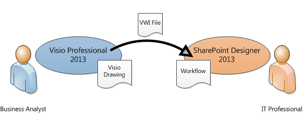
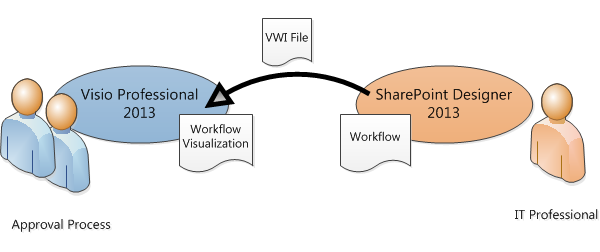
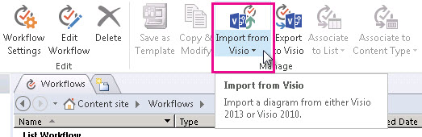
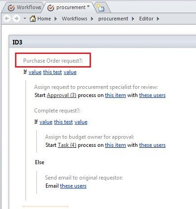

# Transfer a workflow between SharePoint Designer 2013 and Visio Professional 2013 (SharePoint 2010 Workflow platform)
Use SharePoint Designer to import a workflow from Visio or export a workflow to Visio.
## Transferring a workflow between SharePoint Designer 2013 and Visio Professional 2013

Business analysts and process analysts who are already familiar with flowcharting in Visio can use Visio to design a SharePoint workflow. The workflow in Visio represents the business logic. After the business logic is complete, the workflow can be exported to SharePoint Designer. Once the workflow is in SharePoint Designer, an IT professional can wire it up to the SharePoint site.
  
    
    

  
    
    

  
    
    
In Microsoft SharePoint Designer 2013, you can import a workflow created in Microsoft Visio Professional 2013 or export a workflow to Visio for viewing. 
  
    
    
This article describes transferring a workflow by using the SharePoint 2010 Workflow platform in SharePoint Designer 2013.
  
    
    
To select the SharePoint 2010 Workflow platform when you create a workflow:
  
    
    

  
    
    

1. In the **Navigation** pane, click **Workflows**.
    
  
2. On the **Workflows** tab, in the **New** section, click **List Workflow**, **Reusable Workflow**, or **Site Workflow**.
    
  
3. In the **Create Workflow** dialog box, in the **Platform Type** box, click **SharePoint 2010 Workflow**.
    
  
You can visualize workflows in SharePoint Designer in two ways:
  
    
    

- If Visio Services is installed on the server that is running SharePoint, you can create a workflow visualization on the workflow status page that displays progress and assignments.
    
  
- You can export the workflow to Visio to create a workflow drawing that can be used for feedback and approval.
    
  

  
    
    

  
    
    

  
    
    

  
    
    

## Import a workflow from Visio

To import a SharePoint workflow, do the following:
  
    
    

1. In SharePoint Designer 2013, in the **Navigation** pane, click **Workflows**.
    
  
2. On the **Workflows** tab, in the **Manage** group, click **Import from Visio**.
    
  
  

  

  
3. In the **Import Workflow from Visio Drawing** dialog box, browse to and select the Visio Workflow Interchange (.vwi) file you want to use, and then click **Next**.
    
  
4. Type a name for the workflow, and then select the type of workflow you want it to be once it has been imported. Your choices are:
    
  - **List workflow** A workflow that is attached to a specific list. If you select this option, you must choose the list to which the workflow will be attached.
    
  
  - **Reusable workflow** A workflow that is attached to a content type, and is therefore portable. It can be used by different lists on a SharePoint site. If you select this option, you must choose the content type on which the workflow will run.
    
  
5. Click **Finish**.
    
  
The imported workflow appears in the SharePoint Designer full-screen workflow editor. All text in the Visio custom shapes is imported into SharePoint Designer as activity labels (the gray text in the image below) to clarify the intent of the workflow:
  
    
    

  
    
    

  
    
    
After the workflow is imported to SharePoint Designer, it is editable and can be revised to add the necessary conditions, actions, steps, and settings. 
  
    
    

## Export a workflow to Visio

Once you have created or edited a workflow in SharePoint Designer 2013, you can export the workflow as a Visio drawing that can be opened in Visio Professional 2013. The ability to export a workflow back to Visio after it has been edited in SharePoint Designer—also known as "round-tripping"—enables deeper collaboration between business users and workflow designers. When you iterate the workflow design in this way, you can use Visio to define the business requirements and then use round-tripping to coordinate and approve changes.
  
    
    

> **Note:**
> Visio Professional 2013 does not support steps. Step information that has been added in SharePoint Designer may be lost when the workflow is viewed in Visio and then re-imported into SharePoint Designer. 
  
    
    

To export a workflow, do the following:
  
    
    

1. In SharePoint Designer 2013, click **Workflows** in the **Navigation** pane.
    
  
2. On the **Workflow** tab, in the **Manage** group, click **Export to Visio**.
    
  
3. In the **Export Workflow to Visio Drawing** dialog box, name the file, select a location, and then click **Save**. The exported file is saved as a .vwi file that can be opened directly in Visio Professional 2013.
    
  

## Additional resources

-  [What's new in workflows for SharePoint](what-s-new-in-workflows-for-sharepoint.md)
    
  
-  [Get started with workflows in SharePoint](get-started-with-workflows-in-sharepoint.md)
    
  
-  [Workflow development in SharePoint Designer and Visio](workflow-development-in-sharepoint-designer-and-visio.md)
    
  

  
    
    

