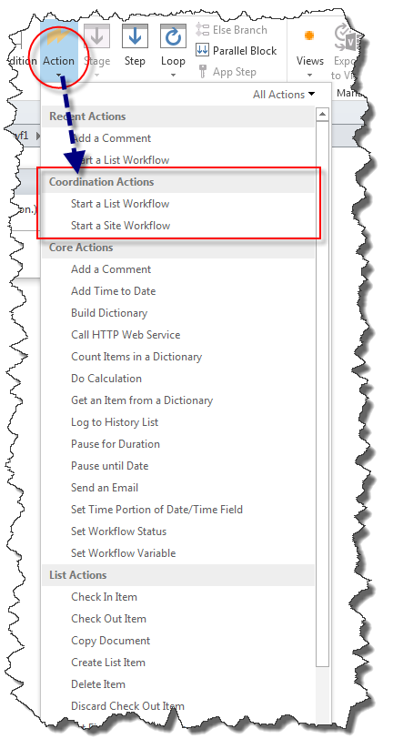
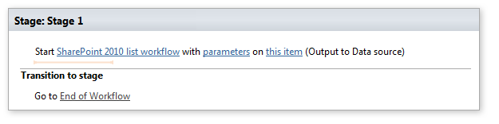
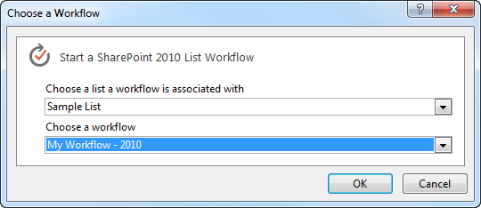
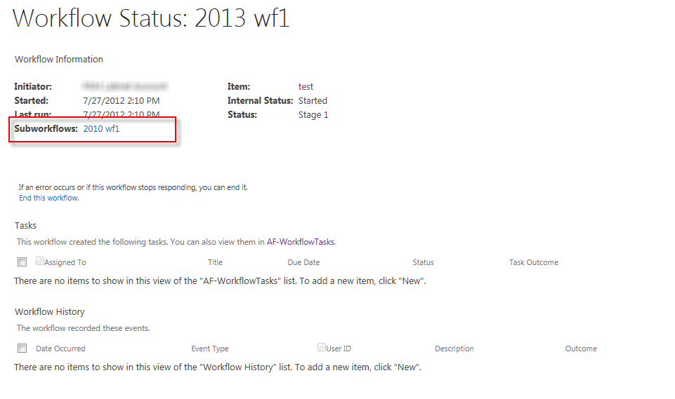

# Understanding Coordination actions in SharePoint Designer 2013
Coordination Actions in SharePoint Designer 2013 are designed to start a workflow built on the SharePoint 2010 Workflow platform from within a workflow built on the SharePoint Workflow platform.

   

## Coordination Actions in SharePoint Designer 2013

There are two Coordination Actions available in SharePoint Designer 2013. Both actions are only available for the SharePoint Workflow platform. These actions are:
  
    
    

- Start a List Workflow: Used to start a workflow developed for a specific list.
    
  
- Start a Site Workflow: Used to start a workflow developed for the site.
    
  
Coordination Actions appear in the **Actions** drop-down menu when you build a workflow based on the SharePoint Workflow platform, as shown in the figure.
  
    
    

**Figure: Coordination Actions in SharePoint Designer**

  
    
    

  
    
    

  
    
    
Both actions are designed to start a workflow built on the SharePoint 2010 Workflow platform from a workflow built on the SharePoint Workflow platform.
  
    
    

    
> **Important:**
> The coordination actions only support starting a workflow based on the SharePoint 2010 Workflow platform from a workflow based on the SharePoint Workflow platform. Starting a workflow built on the SharePoint Workflow platform from within a workflow built on the same platform is not supported. 
  
    
    

## Using Coordination Actions

There are a number of actions that have been deprecated in the SharePoint Workflow platform. To accommodate legacy workflows you can use Coordination Actions. Coordination Actions can be used to start a List workflow or a Site workflow that has been built by using the SharePoint 2010 Workflow platform.
  
    
    
A Coordination Action includes three editable regions, as shown in the figure.
  
    
    

**Figure: Start a List Workflow coordination action**

  
    
    

  
    
    

  
    
    
The three editable regions are: 
  
    
    

- **SharePoint 2010 list workflow** Select the 2010 workflow to start.
    
  
- **parameters** Parameters to send to the 2010 workflow.
    
  
- **this item** The item which the 2010 workflow should be run on.
    
  
Click an editable link to enter information. For example, to select the 2010 workflow to start, click the link **SharePoint 2010 list workflow**. A dialog box appears that can be used to select the workflow, as shown in the figure.
  
    
    

**Figure: Selecting a workflow based on the 2010 platform**

  
    
    

  
    
    

  
    
    

  
    
    

  
    
    

  
    
    
The SharePoint 2010 Workflow platform workflow instances that are coordinated from within a SharePoint workflow are listed on the workflow status page in the Subworkflows section, as shown in the figure.
  
    
    

**Figure: The workflow status page lists the subworkflows**

  
    
    

  
    
    

  
    
    

  
    
    

  
    
    

## Additional resources

-  [What's new in workflow in SharePoint](http://msdn.microsoft.com/library/6ab8a28b-fa2f-4530-8b55-a7f663bf15ea.aspx)
    
  
-  [Getting started with SharePoint workflow](http://msdn.microsoft.com/library/cc73be76-a329-449f-90ab-86822b1c2ee8.aspx)
    
  
-  [Understanding Dictionary actions in SharePoint Designer 2013](understanding-dictionary-actions-in-sharepoint-designer.md)
    
  

  
    
    

