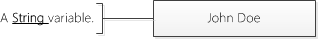
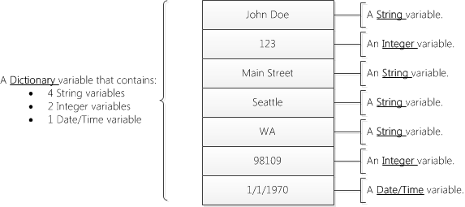
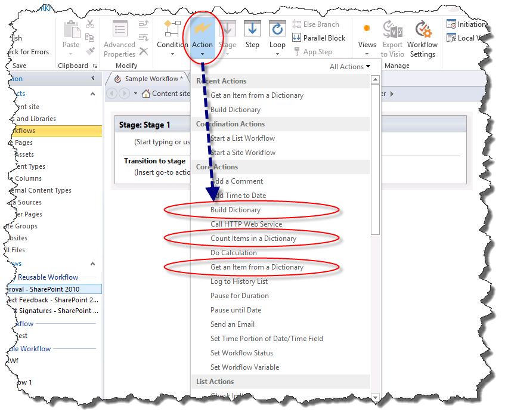
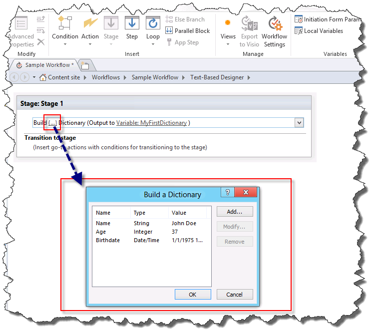
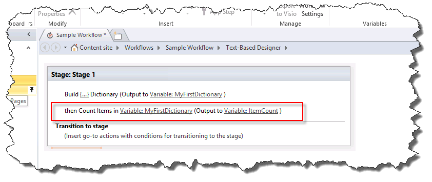
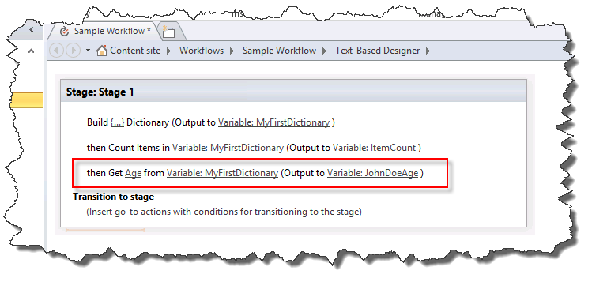

# Understanding Dictionary actions in SharePoint Designer 2013
The Dictionary variable type is a new variable type in the SharePoint 2013 Workflow platform that you can use with SharePoint Designer 2013. 
||
|:-----|
||
   

## Understanding the Dictionary variable type

A workflow is a series of actions that perform a desired outcome. As you build a workflow you often need to save values in a variable (storage container) to use in other parts of the workflow.
  
    
    
When you create a variable you need to tell the workflow engine what type of data will be contained in the variable. For example, you might want to save the name of an employee in a variable. The name of an employee is a string of characters so you would create a variable of type **String**. The workflow could then store the name of the employee, such as "John Doe," in the variable. 
  
    
    

**Figure: A String variable**

  
    
    

  
    
    

  
    
    
SharePoint Designer 2013 has a new variable type called **Dictionary**. The **Dictionary** variable type is a container designed to hold a collection of other variables. For example, your workflow might need to store more than just the name of the employee. It might also need to store his address and birth date. If you do not use the **Dictionary** variable you will have to create multiple stand-alone variables. This can quickly become difficult to organize and difficult to work with in the logic of the workflow. A **Dictionary** variable allows you to store multiple data points in a single variable.
  
    
    
The figure illustrates the concept.
  
    
    

**Figure: A Dictionary variable**

  
    
    

  
    
    

  
    
    

  
    
    

  
    
    

## Workflow actions that use the Dictionary variable type

A workflow consists of multiple actions that are executed as the workflow is processed. SharePoint Designer 2013 contains many different actions. For example, there is an action to send an email message, create a list item, and log messages to workflow history.
  
    
    
The following are the three actions specifically designed for the **Dictionary** variable type.
  
    
    

- **Build Dictionary**
    
  
- **Count Items in a Dictionary**
    
  
- **Get an Item from a Dictionary**
    
  
The workflow actions for the Dictionary variable type can be found on the **Action** drop-down list, as shown in the figure.
  
    
    

**Figure: Dictionary actions**

  
    
    

  
    
    

  
    
    

### Create variables with the "Build Dictionary" action

You use the **Build Dictionary** action to create a variable of type **Dictionary**. You enter the contents of the dictionary and then specify the name of the dictionary in the variable list.
  
    
    
The figure shows the **Build a Dictionary** dialog box. Notice that three variables have been added to the dictionary: a string, an integer, and a date/time.
  
    
    

**Figure: The "Build a Dictionary" dialog box**

  
    
    

  
    
    

  
    
    
A **Dictionary** can contain any type of variable available in the SharePoint 2013 Workflow platform. The following list defines the variable types available:
  
    
    

- **Boolean**: A Yes or No value
    
  
- **Date/Time**: A date and time
    
  
- **Dictionary**: A collection of variables
    
  
- **Guid**: A Globally Unique Identifier (GUID)
    
  
- **Integer**: A whole number without decimals
    
  
- **Number**: A number that can contain decimals
    
  
- **String**: A string of characters
    
  

    
> **Important:**
> The **Dictionary** variable type is critical when you are using the **Call HTTP Web Service** action.
  
    
    

    
> **Caution:**
> Using the **Name** field as a lookup is only supported when you are setting a value in a dictionary. Using the **Name** field as a lookup is not supported when you are building a dictionary.
  
    
    

    
> **Note:**
> A **Dictionary** variable can contain a variable of type **Dictionary**. The ability to store **Dictionary** variables within a **Dictionary** provides a number of benefits. For example, you might create a **Dictionary** to store information about employees. Within the **Dictionary** you might create another **Dictionary** entry for each employee. As you build the workflow you can use the **Dictionary** variable instead of constantly creating new stand-alone variables for each piece of information about each employee. As this example shows, a **Dictionary** can be used to organize complex information within the workflow.
  
    
    

### Count and store variables with the "Count Items in a Dictionary" action

You use the **Count Items in a Dictionary** action to count the variables that a **Dictionary** contains and then store that number in an Integer variable. You can then use the item count to loop through the **Dictionary**.
  
    
    
The figure shows the **Count Items in a Dictionary** workflow action.
  
    
    

**Figure: Count items in a Dictionary**

  
    
    

  
    
    

  
    
    

  
    
    

  
    
    

### Retrieve variables with the "Get an Item from a Dictionary" action

You use the **Get an Item from a Dictionary** action to retrieve a variable stored in the **Dictionary** and place it in a variable. This is valuable when you need a value in the dictionary stored in a stand-alone variable. You can retrieve a value by entering the name of the variable.
  
    
    
The figure shows the **Get an Item from a Dictionary** workflow action. Notice that **Age** is the name of the variable in the **Dictionary** and it is being output to a new **Integer** variable.
  
    
    

**Figure: Get an item from a Dictionary**

  
    
    

  
    
    

  
    
    

  
    
    

  
    
    

## Additional resources

-  [Workflow in SharePoint 2013](http://technet.microsoft.com/en-us/sharepoint/jj556245.aspx)
    
  
-  [What's new in workflow in SharePoint Server 2013](http://msdn.microsoft.com/library/6ab8a28b-fa2f-4530-8b55-a7f663bf15ea.aspx)
    
  
-  [Getting started with SharePoint Server 2013 workflow](http://msdn.microsoft.com/library/cc73be76-a329-449f-90ab-86822b1c2ee8.aspx)
    
  

  
    
    

