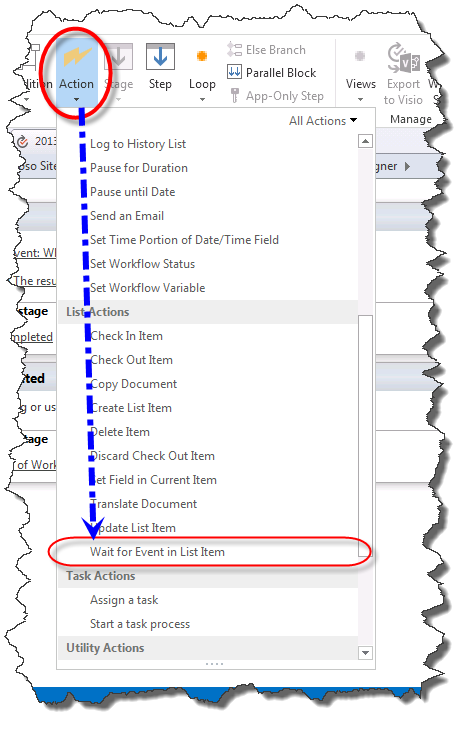
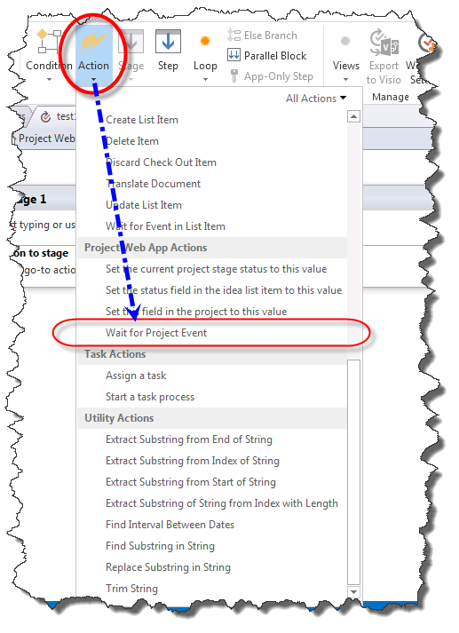
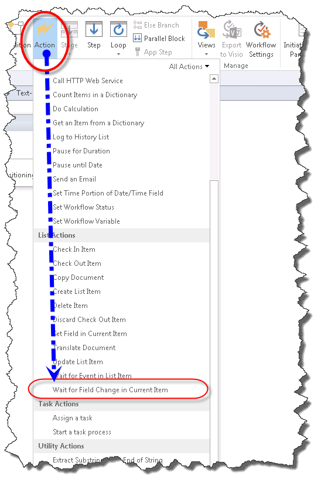
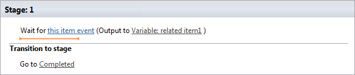
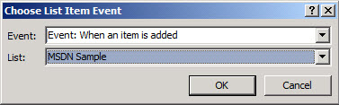
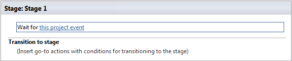
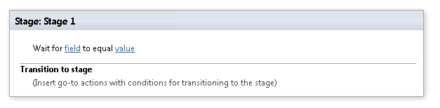

# Understanding Eventing Actions in SharePoint Designer 2013
Learn to use Eventing Actions in SharePoint Designer 2013.
## Overview of Eventing Actions in SharePoint Designer 2013

A SharePoint workflow can subscribe to be notified when an item is added or changed. When an item is added or changed, it is called an event. A workflow can wait for these events to happen before proceeding with the workflow. The Eventing actions in SharePoint Designer 2013 are: 
  
    
    

- **Wait for Event in List Item:** Used to wait for a new item to be created or an item to be changed.
    
  
- **Wait for Project Event:** Used to wait for a project to be checked in, committed, or submitted.
    
  
- **Wait for Field Change in Current Item:** Used to wait for a field to be changed in the current item.
    
  
The Eventing actions are accessed in the **Action** drop-down menu of the SharePoint Designer 2013 ribbon as shown in the figures.
  
    
    

> **Note:**
> The **Project Web App Actions** are only available when working with a Project Web App site.
  
    
    

**Eventing Action in SharePoint Designer 2013**

  
    
    

  
    
    

  
    
    

**Project Web App Eventing Action in SharePoint Designer 2013**

  
    
    

  
    
    

  
    
    

**Wait for Field Change in Current Item event in SharePoint Designer 2013**

  
    
    

  
    
    

  
    
    

  
    
    

  
    
    

## Using Eventing Actions in SharePoint

A workflow orchestrates business processes. In a business process it is often important to wait for an item to be added or updated in a SharePoint list. Using the Eventing actions you can wait for an event to happen and then perform a workflow action.
  
    
    
The Eventing actions are located on the Actions drop-down menu in the SharePoint Designer 2013 ribbon. You can add the action to your workflow and then customize it for your particular circumstance.
  
    
    

### Wait for Event in List Item

The **Wait for Event in List Item** action contains two editable regions, as shown in the figure.
  
    
    

**Wait for Event in List Item**

  
    
    

  
    
    

  
    
    

  
    
    

  
    
    
The two editable regions are:
  
    
    

- **This item event:** The list and event that will be monitored.
    
  
- **Output variable:** A variable in which to save the GUID of the item from which the event originated. Items have both an ID and a GUID field. The ID is unique to the list and a GUID is globally unique. For example, the ID of the first item in the list will be the number 1 and the ID of the second item will be the number 2. The GUID is globally unique and in the format of a 128-bit value consisting of 8 hexadecimal digits, followed by three groups of 4 hexadecimal digits each, followed by one group of 12 hexadecimal digits. An example of a GUID is: 6B29FC40-CA47-1067-B31D-00DD010662DA. The **Wait for Event in List Item** action retrieves the GUID.
    
  
Clicking the **this item event** link opens the **Choose List Item Event** dialog box, as shown in the figure.
  
    
    

**Choose List Item Event dialog box**

  
    
    

  
    
    

  
    
    

  
    
    

  
    
    
The **Event** drop-down list corresponds to the type of event. The options are to wait for an item to be added to a list or to wait for an item to be changed in a list. The **List** drop-down corresponds to the list that is monitored.
  
    
    

### Wait for Project Event

The **Wait for Project Event** action contains one editable region, as shown in the figure.
  
    
    

**Wait for Project Event**

  
    
    

  
    
    

  
    
    

  
    
    

  
    
    
The editable region is:
  
    
    

- **This project event:** The project event that the workflow should wait for.
    
  
The **This project event** drop-down includes three project events to choose from. These include waiting for the project to be checked in, committed, or submitted.
  
    
    
Once an event has occurred the workflow will continue to process.
  
    
    

### Wait for Field Change in Current Item

The **Wait for Field Change in Current Item** action contains two editable regions, as shown in the figure.
  
    
    

**Wait for Field Change in Current Item**

  
    
    

  
    
    

  
    
    

  
    
    

  
    
    
The editable regions are:
  
    
    

- **Field:** The field in the item that should be monitored for change.
    
  
- **Value:** The value that the field should equal in order for the workflow to proceed.
    
  
Once a field has changed the workflow continues.
  
    
    

## Additional resources

-  [Workflow in SharePoint ](http://technet.microsoft.com/en-us/sharepoint/jj556245.aspx)
    
  
-  [What's new in workflow in SharePoint](http://msdn.microsoft.com/library/6ab8a28b-fa2f-4530-8b55-a7f663bf15ea.aspx)
    
  
-  [Getting started with SharePoint workflow](http://msdn.microsoft.com/library/cc73be76-a329-449f-90ab-86822b1c2ee8.aspx)
    
  
-  [Workflow development in SharePoint Designer and Visio](workflow-development-in-sharepoint-designer-and-visio.md)
    
  
-  [Workflow actions quick reference (SharePoint Workflow platform)](workflow-actions-quick-reference-sharepoint-workflow-platform.md)
    
  

  
    
    

