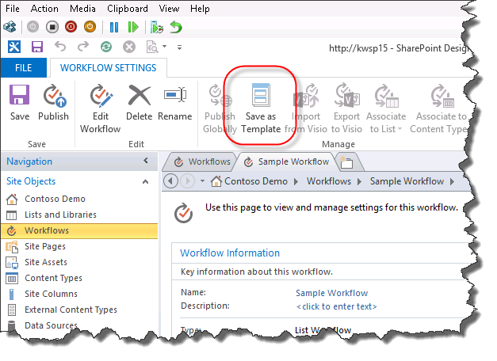

# Understanding how to package and deploy workflow in SharePoint 2013
Learn how to package and deploy a workflow in SharePoint Server 2013 with SharePoint Designer 2013.
## Overview of the workflow packaging capabilities of SharePoint Designer 2013

SharePoint Designer 2013 provides the capability to save a workflow as a template. Saving a workflow as a template is also known as packaging the workflow. After the workflow is saved as a template, it can then be imported into other SharePoint Server 2013 environments and used without the need to redevelop the workflow. Not all workflow types can be saved as a template. The following matrix shows the workflow types that can be saved as a template. 
  
    
    

**Support, by platform, for saving a workflow as a template**

|**Workflow type**|**SharePoint 2010 Workflow platform**|**SharePoint 2013 Workflow platform**|
|:-----|:-----|:-----|
|List Workflow    |No    |Yes    |
|Site Workflow    |No    |Yes    |
|Reusable Workflow    |Yes    |Yes    |
   

  
    
    

  
    
    

> **Note:**
> SharePoint Server 2013 contains two different workflow platforms: the SharePoint 2010 Workflow platform and the SharePoint 2013 Workflow platform. Both platforms are available in SharePoint Server 2013. For more information about the two workflow, see  [Getting started with SharePoint Server 2013 workflow.](http://msdn.microsoft.com/library/cc73be76-a329-449f-90ab-86822b1c2ee8.aspx)
  
    
    

## Packaging a workflow by using SharePoint Designer 2013

The process for packaging a workflow involves saving the workflow to a template file by using SharePoint Designer 2013. A workflow package is in the form of a Web Solution Package (WSP) file and has a .wsp extension. To package a workflow follow these steps. 
  
    
    

### Package a workflow

1. Open an existing workflow, or develop a new workflow, in SharePoint Designer 2013.
    
  
2. On the **Workflow Settings** tab in the ribbon, click the **Save as Template** button in the **Manage** section as shown in the figure.
    
   **Figure: Save workflow as template**

  

  
  

  

  
3. An informational dialog box appears to let you know the template has been saved to the **Site Assets** library.
    
  
4. Click the Site Assets library to view the workflow template as shown in the figure.
    
   **Figure: A workflow template in Site Assets**

  

  
  

  

  

  
    
    

> **Tip:**
> A workflow template automatically saves to the **Site Assets** library of the site collection in which the workflow resides.
  
    
    

## Deploying a workflow package to SharePoint 2013

You can deploy a workflow package to a SharePoint farm or site that is different from the farm or site in which it was developed. In order for a workflow deployment to be successful two items must be fulfilled:
  
    
    

- All workflow dependencies such as lists, libraries, columns, and content types must already exist on the new site.
    
  
- Each dependency must have the exact name of the source dependency.
    
  
If a workflow is deployed and the exact dependencies do not exist then the result will be an error.
  
    
    
Before you can deploy a workflow you must first export the workflow template from the source SharePoint Server 2013 farm. To export a workflow template, follow this procedure.
  
    
    

### Export a workflow template

1. Open SharePoint Designer 2013 and navigate to the Site Assets library where the template is located.
    
  
2. Select the workflow template you want to export by clicking it.
    
  
3. Click the **Export File** button to save the template file to your local computer or a network drive, as shown in the figure.
    
   **Figure: Export workflow template from SharePoint Designer 2013**

  

  
  

  

  
To deploy a workflow package follow this procedure.
  
    
    

### Deploy a workflow solution

1. Open Internet Explorer and navigate to the SharePoint Server 2013 site collection where you want to deploy the workflow.
    
  
2. Click **Site Actions** and select **Site Settings**.
    
  
3. In the **Web Design Galleries** section click **Solutions**.
    
    > **Note:**
      > You must be on the **Site Settings** page for the site collection in order to see the **Solutions** gallery. If you are on the **Site Settings** page for a sub-site then the **Solutions** gallery is not visible.
4. Click the **Upload Solution** button to upload the solution as shown in the figure.
    
   **Figure: Upload Solution button**

  

  
  

  

  
5. Activate the solution by clicking the **Activate** button as shown in the figure.
    
   **Figure: Activate Solution dialog and button**

  

  
  

  

  
After a workflow solution has been activated for a site collection, it is available as a feature for all sub-sites. To activate the workflow feature for a sub-site, follow this procedure.
  
    
    

### Activate the workflow feature

1. Open **Site Settings** on the site where you wish to activate the workflow feature.
    
  
2. In the **Site Actions** group, click **Manage site features**.
    
  
3. Click **Activate** next to the workflow feature as shown in the figure.
    
  

**Figure: Activate workflow feature for site**

  
    
    

  
    
    

  
    
    

  
    
    

  
    
    

## Additional resources

-  [Workflow in SharePoint 2013 ](http://technet.microsoft.com/en-us/sharepoint/jj556245.aspx)
    
  
-  [What's new in workflow in SharePoint Server 2013](http://msdn.microsoft.com/library/6ab8a28b-fa2f-4530-8b55-a7f663bf15ea.aspx)
    
  
-  [Getting started with SharePoint Server 2013 workflow](http://msdn.microsoft.com/library/cc73be76-a329-449f-90ab-86822b1c2ee8.aspx)
    
  
-  [Workflow development in SharePoint Designer and Visio](workflow-development-in-sharepoint-designer-and-visio.md)
    
  
-  [Workflow actions quick reference (SharePoint 2013 Workflow platform)](workflow-actions-quick-reference-sharepoint-workflow-platform.md)
    
  
-  [Blog article from the SharePoint Designer team: Workflow package and deploy scenario](http://blogs.msdn.com/b/sharepointdesigner/archive/2012/08/30/packaging-list-site-and-reusable-workflow-and-how-to-deploy-the-package.aspx)
    
  

