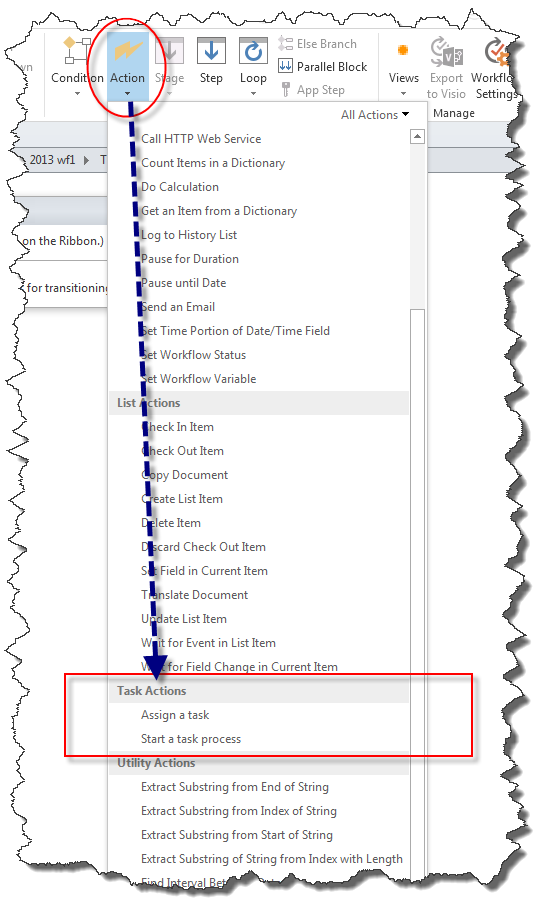
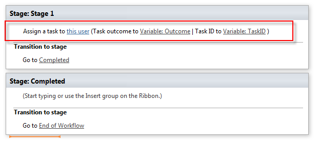
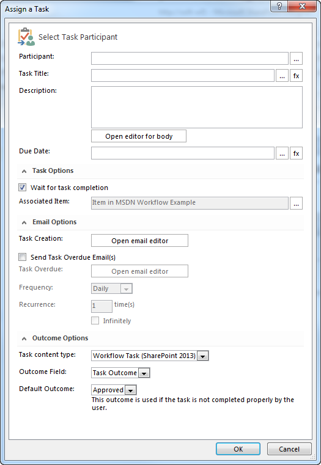
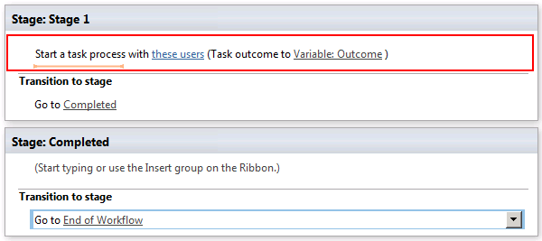
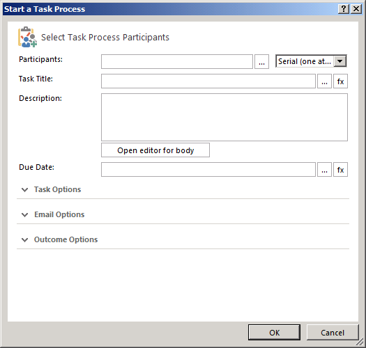

# Understanding Task Actions in SharePoint Designer 2013
Learn to use Task Actions in SharePoint Designer 2013.
||
|:-----|
||
   

## Overview of Task Actions in SharePoint Designer 2013

A task in SharePoint is used to assign work to a person or group and then track the progress of that work over time. There are two workflow actions in SharePoint Designer 2013 designed for working with tasks.
  
    
    
These actions are:
  
    
    

- **Assign a task** is used to create a SharePoint task and assign it to a single participant.
    
  
- **Start a task process** is used to assign a task to multiple participants.
    
  
The Task Actions are accessed in the **Action** drop-down menu of the SharePoint Designer 2013 ribbon, as shown in the figure.
  
    
    

**Figure: Task Actions in SharePoint Designer 2013**

  
    
    

  
    
    

  
    
    

  
    
    

  
    
    

## Using Task Actions in SharePoint

A business process often consists of tasks that must be performed by people. A workflow orchestrates the steps of a process. A workflow uses Task Actions to assign tasks to people. For example, when a new employee is hired a number of tasks need to be performed. One such task might be a new employee orientation. The task might need to be performed by a member of the Human Resources department.
  
    
    
The **Assign a task** and **Start a task process** actions are located on the **Actions** drop-down menu in the SharePoint Designer 2013 ribbon. You can add the actions to your workflow and then customize them for your particular circumstance. The **Assign a task** action is used to assign a task to a single participant. The **Start a task process** action is used to assign a task to multiple participants.
  
    
    

### Assign a task

The **Assign a task** action is shown in the figure.
  
    
    

**Figure: The Assign a task action in SharePoint Designer 2013**

  
    
    

  
    
    

  
    
    

  
    
    

  
    
    
The **Assign a task** action takes three inputs: the user to assign a task, the outcome variable, and the task id variable.
  
    
    

- **this user**: Opens the **Assign a Task** dialog as shown in the figure. Use the dialog to set the participant, task title, description, due date, task options, email options, and outcome options.
    
  
- **Variable: Outcome**: Assigns the variable that will hold the outcome of the task.
    
  
- **Variable: TaskID**: Assigns the variable that will hold the id of the task.
    
  

**Figure: The Assign a Task dialog box**

  
    
    

  
    
    

  
    
    

  
    
    

  
    
    

### Start a task process

The **Start a task process** action is shown in the figure.
  
    
    

**Figure: The "Start a task process" action.**

  
    
    

  
    
    

  
    
    

  
    
    

  
    
    
The **Start a task process** action takes two inputs: the users that will participate in the task and the outcome variable.
  
    
    

- **these users**: Opens the **Start a Task Process** dialog box as shown in the figure. Use the dialog box to set the participants, task title, description, due date, task options, email options, and outcome options.
    
  
- **Variable: Outcome**: Assigns the variable that holds the outcome of the task process.
    
  

**Figure: The Start a Task Process dialog box**

  
    
    

  
    
    

  
    
    

  
    
    

  
    
    

## See also

-  [What's new in workflow in SharePoint](http://msdn.microsoft.com/library/6ab8a28b-fa2f-4530-8b55-a7f663bf15ea.aspx)
    
  
-  [Getting started with SharePoint workflow](http://msdn.microsoft.com/library/cc73be76-a329-449f-90ab-86822b1c2ee8.aspx)
    
  
-  [Workflow development in SharePoint Designer and Visio](workflow-development-in-sharepoint-designer-and-visio.md)
    
  
-  [Workflow actions quick reference (SharePoint Workflow platform)](workflow-actions-quick-reference-sharepoint-workflow-platform.md)
    
  

  
    
    

