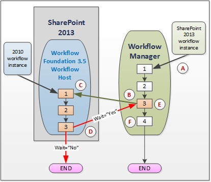
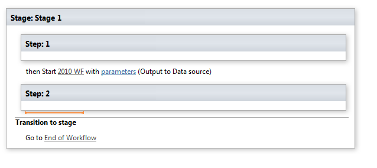
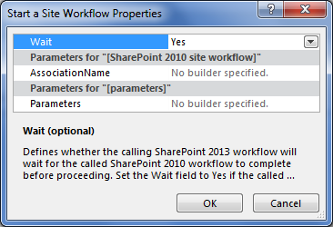
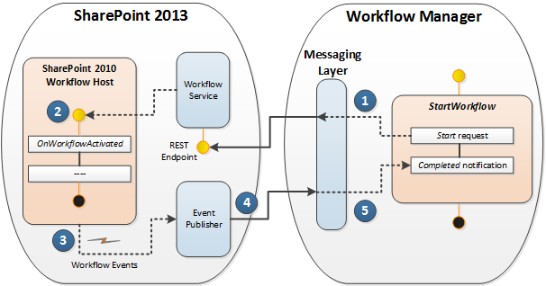

# Use workflow interop for SharePoint 2013
Provides a discussion of using SharePoint workflow Interop in the Visual Studio 2012 workflow designer. Workflow interop allows you to invoke a SharePoint 2010 workflow from within a SharePoint 2013 workflow. This is an important feature that allows you to reuse existing workflow features, and to call on workflow activities that are not integrated into SharePoint 2013.

  
    
    

> **Important:**
> To learn about using SharePoint workflow interop functionality in SharePoint Designer 2013, see  [Understanding Coordination actions in SharePoint Designer 2013](understanding-coordination-actions-in-sharepoint-designer.md). 
  
    
    

## SharePoint workflow interop

Here's the problem. You have legacy SharePoint 2010 workflows that you wish to reuse on your SharePoint 2013 platform. Or, worse, you are creating new SharePoint 2013 workflows and you need to invoke activities that are only available in the SharePoint 2010 platform. And you don't know what to do. Actually, the solution is simple: use SharePoint workflow Interop.
  
    
    
SharePoint workflow interop enables SharePoint 2010 workflows (built on Windows Workflow Foundation 3) to work smoothly with the SharePoint 2013 workflow engine, which is based on Windows Workflow Foundation 4. While the new Windows Workflow Foundation 4 execution engine is hosted in Workflow Manager, which runs as an external service, SharePoint 2013 still contains the legacy SharePoint workflow host which it uses to process SharePoint 2010 workflows. SharePoint workflow interop negotiates the two execution environments, as depicted in Figure 1.
  
    
    

**Figure 1. SharePoint workflow interop in action**

  
    
    

  
    
    

  
    
    
Let's walk through the process depicted in Figure 1. Use the letters to reference points of emphasis in the illustration:
  
    
    

  
    
    
> ( **A** ) An instance of a SharePoint 2013 workflow starts to run in then Windows Workflow Foundation 4-based Workflow Manager. Note that the Workflow Manager is not in SharePoint, but instead runs as an external service.
    
  

  
    
    
> ( **B** ) You reach a point in the SharePoint 2013 workflow - step number 3 in the Workflow Manager - where you wish to invoke a SharePoint 2010 workflow. In the Visual Studio 2012 workflow designer, you do this by implementing the **Start 2010 WF** activity, as shown in Figure 2.
    
   **Figure 2. Stage tile for starting a SharePoint 2010 workflow.**

  

  
  

    
    
    From the perspective of the SharePoint object model, this is accomplished using the  [StartWorkflow](https://msdn.microsoft.com/library/Microsoft.SharePoint.WorkflowServices.WorkflowInteropService.StartWorkflow.aspx) method on the [WorkflowInteropService](https://msdn.microsoft.com/library/Microsoft.SharePoint.WorkflowServices.WorkflowInteropService.aspx) class.
    
  

  
    
    
> ( **C** ) At this point, the SharePoint 2010 workflow begins executing in the Windows Workflow Foundation 3.5 workflow host inside of SharePoint. But an important consideration comes up. In some scenarios you may want the 2013 workflow to wait for the 2010 workflow to complete running (and perhaps return some data) before continuing to execute the 2013 workflow. In other scenarios, this may not be necessary and both workflows may run independently, in parallel.
    
    To control this behavior, the  [WorkflowInterop](https://msdn.microsoft.com/library/Microsoft.SharePoint.WorkflowServices.Activities.WorkflowInterop.aspx) class, which controls executing workflows in the Windows Workflow Foundation 3.5 workflow host, provides a [Wait](https://msdn.microsoft.com/library/Microsoft.SharePoint.WorkflowServices.Activities.WorkflowInterop.Wait.aspx) property. Setting this Boolean property to " **Yes**" (in the designer dialog box) or to **true** in the on the **Wait** property, causes the 2013 workflow to pause until the 2010 finished executing and returns a **completed** message.
    
    
    

   **Figure 3. Start a Workflow properties dialog box.**

  

  
  

  

  

  
    
    
> ( **D** ) The practical effect of selecting **true** or **false** on the **Wait** property (or **Yes** or **No** in the properties dialog box) is depicted here. If **Wait** is **true**, then the 2010 workflow passes a  [WorkflowCompleted](https://msdn.microsoft.com/library/Microsoft.SharePoint.WorkflowServices.WorkflowInteropEventReceiver.WorkflowCompleted.aspx) event (and, optionally, returns data as a [DynamicValue](http://msdn.microsoft.com/library/2af7983b-8357-4e0f-9ba9-dfdeed05a8a7.aspx) property). For more information about dynamic values, see [Understanding Dynamic Value](http://msdn.microsoft.com/library/c5702628-9625-4d19-95c5-13923e91fea1.aspx).
    
    Of course, if **Wait** is set to **false**, then your 2010 workflow executes, then terminates normally.
    
  

  
    
    
> ( **E** ) This step is only relevant if your invocation of the 2010 workflow specified **Wait=true**. In that case, your 2013 workflow received the **WorkflowCompleted** event and restarts the workflow 2013 execution at the point it left off.
    
  

  
    
    
> ( **F** ) Your 2013 workflow then completes execution and terminates normally. If **Wait=false**, then your 2013 workflow executes and terminates independently of the 2010 workflow. 
    
  

## Workflow interop design

SharePoint workflow interop is a messaging framework that supports a one-to-one instance mapping between WF 3 and WF 4 workflow activities. WF 3 and WF 4 interoperate through message exchanges that are wrapped by a set of WF 4 activities on  [WorkflowInteropService](https://msdn.microsoft.com/library/Microsoft.SharePoint.WorkflowServices.WorkflowInteropService.aspx) .
  
    
    
To support workflow interop, the workflow design surface in SharePoint Designer provides access to a new workflow activity, **Start 2010 WF**, which is a wrapper on the  [StartWorkflow](https://msdn.microsoft.com/library/Microsoft.SharePoint.WorkflowServices.WorkflowInteropService.StartWorkflow.aspx) method. This activity allows you to start either a list workflow or a site workflow.
  
    
    
The activity is in fact a sequence of messages that take place between the Workflow Manager and the SharePoint 2010 Workflow Host that is running inside SharePoint 2013. These two are mediated by a messaging layer, as shown in Figure 4. The sequence begins in the SharePoint 2013 workflow manager with an invocation of the **StartWorkflow** method. The "start" message goes to the workflow service inside of SharePoint, where in turn it launches the workflow inside the SharePoint 2010 workflow host. When execution of the 2010 workflow is complete, an event is fired that sends a "completed" message through the event publisher back to the 2013 workflow manager.
  
    
    

**Figure 4. SharePoint workflow interop messaging protocol**

  
    
    

  
    
    

  
    
    

  
    
    

  
    
    

## Additional resources

-  [Get started with workflows in SharePoint 2013](get-started-with-workflows-in-sharepoint.md)
    
  
-  [SharePoint 2013 workflow fundamentals](sharepoint-workflow-fundamentals.md)
    
  
-  [Understanding Coordination actions in SharePoint Designer 2013](understanding-coordination-actions-in-sharepoint-designer.md)
    
  
-  [WorkflowInteropService](https://msdn.microsoft.com/library/Microsoft.SharePoint.WorkflowServices.WorkflowInteropService.aspx)
    
  
-  [WorkflowInteropEventReceiver](https://msdn.microsoft.com/library/Microsoft.SharePoint.WorkflowServices.WorkflowInteropEventReceiver.aspx)
    
  

  
    
    

