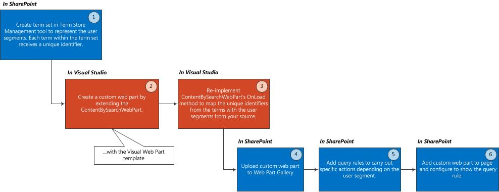

---
title: User segmentation in SharePoint
ms.date: 09/25/2017
ms.prod: sharepoint
---


# User segmentation in SharePoint
Display content you tailor for user segments you define—for example, based on locale, interests, gender, or referral links—by using a combination of term sets, the Content Search web part, and query rules in SharePoint.
SharePoint provides the building blocks to tailor content you show on a SharePoint site, depending on certain attributes of end-users, for example their gender, where they live, their interests, or referral links. These groupings of user attributes are known as user segments. 
  
    
    

In SharePoint, this user segmentation functionality can be beneficial in many scenarios, such as:
- Displaying different banners on a page depending on the end-user's gender 
    
  
- Displaying different discount offers depending on the end-user's locale 
    
  
- Displaying different articles on a page depending on the end-user's referrer link (the website that brought the end-user to your page). 
    
  
To implement user segmentation in SharePoint, you'll do three things: create a term set for each user segment, extend the Content Search web part to make it aware of your user segments, and then use query rules to perform specific actions for each user segment.
## Prerequisites
<a name="SP15_Prerequisites"> </a>

Before you get started implementing user segmentation in SharePoint, be sure to have the following installed in your development environment:
  
    
    

- SharePoint
    
  
- Visual Studio 2012
    
  
This article assumes that you have experience with developing web parts in SharePoint. For more information on developing web parts, refer to  [Building Block: web parts](http://msdn.microsoft.com/en-us/library/ee535520%28v=office.14%29.aspx)
  
    
    

## Overview on adding user segmentation functionality to your SharePoint site
<a name="SP15_Overview_User_Segmentation"> </a>

Figure 1 shows the basic steps to add user segmentation functionality to your SharePoint site.
  
    
    

**Figure 1. Steps to add user segmentation functionality to your SharePoint site**

  
    
    

  
    
    

  
    
    

  
    
    

  
    
    

## Create a term set
<a name="SP15_Create_a_term_set"> </a>

A term is a word or a phrase that can be associated with an item in SharePoint. Aterm set is a collection of related terms. For more information, see [Overview of managed metadata in SharePoint](http://technet.microsoft.com/en-us/library/ee424402.aspx). You can create term sets either through the SharePoint Term Store Management Tool, or programmatically. 
  
> [!NOTE] 
> See the following topics for detailed instructions on how to use the Term Store Management Tool to create your term set:>  [Set up a new term set](http://office.microsoft.com/en-us/sharepoint-help/set-up-a-new-term-set-HA102922634.aspx)>  [Create and manage terms in a term set](http://office.microsoft.com/en-us/office365-sharepoint-online-enterprise-help/create-and-manage-terms-in-a-term-set-HA102771989.aspx)
  
    
    

You can create a term set programmatically by using the types exposed via  [Microsoft.SharePoint.Taxonomy](https://msdn.microsoft.com/library/Microsoft.SharePoint.Taxonomy.aspx) . The following code example shows how to create a **TermSet** object and obtain the **NavigationTermSet**. Next, you create **Term** objects within your **TermSet**. Finally, commit these changes to the **TermStore** and load the **TermSet** to use for navigation.
  
    
    
Each term you add to your term set receives a unique identifier. This identifier is the key to making the  [ContentBySearchWebPart](https://docs.microsoft.com/en-us/sharepoint/dev/general-development/content-search-web-part-in-sharepoint) aware of your user segments.
  
    
    


```cs

static void CreateNavigationTermSet(string siteUrl)
{
    using (SPSite site = new SPSite(siteUrl))
    {
        using (SPWeb web = site.OpenWeb())
        {
            TaxonomySession taxonomySession = new TaxonomySession(site);
            taxonomySession.UpdateCache();
            TermStore termStore = taxonomySession.DefaultSiteCollectionTermStore;

            // Create a TermSet object in a default site collection term group.
            Group siteCollectionGroup = termStore.GetSiteCollectionGroup(site, createIfMissing: true);
            TermSet termSet = siteCollectionGroup.CreateTermSet("Navigation Demo", Guid.NewGuid(), lcid: 1033);

            // Obtain navigation term set.
            NavigationTermSet navigationTermSet = NavigationTermSet.GetAsResolvedByWeb(termSet, web, "GlobalNavigationTaxonomyProvider");

            // Create a term that points to a SharePoint page set at the term set level of hierarchy.
            NavigationTerm term1 = navigationTermSet.CreateTerm("Term 1", NavigationLinkType.FriendlyUrl, Guid.NewGuid());

            // Create a term that points to an already existing URL outside of SharePoint.
            NavigationTerm term2 = navigationTermSet.CreateTerm("Term 2", NavigationLinkType.SimpleLink, Guid.NewGuid());
            term2.SimpleLinkUrl = "http://www.bing.com/";

            // Create a term that points to an existing SharePoint page.
            NavigationTerm term3 = navigationTermSet.CreateTerm("Term 3", NavigationLinkType.FriendlyUrl, Guid.NewGuid());

            // Save all changes to the term store.
            termStore.CommitAll();
        }
    }
}
```


## Create a custom web part for user segmentation
<a name="SP15_Create_a_custom_web_part_user_segmentation"> </a>

In Visual Studio 2012, create a custom web part by using the Visual web parts template from the SharePoint category. Your custom web part must inherit from the  [ContentBySearchWebPart](https://docs.microsoft.com/en-us/sharepoint/dev/general-development/content-search-web-part-in-sharepoint) object.
  
> [!NOTE] 
> This article assumes that you have experience with developing web parts in SharePoint. For more information on developing web parts, refer to  [Building Block: web parts](http://msdn.microsoft.com/en-us/library/ee535520%28v=office.14%29.aspx)
  
    
    


## Configure a custom web part with user segmentation logic
<a name="SP15_Configure_custom_web_part_user_segmentation_logic"> </a>

In your custom web part, you can re-implement either the  `OnLoad()` method or the `OnInit()` method to carry out your custom logic. Both these methods are useful to set or customize properties of the [ContentBySearchWebPart](https://docs.microsoft.com/en-us/sharepoint/dev/general-development/content-search-web-part-in-sharepoint) object.
  
    
    

### Example 1: Add Male and Female user segments to your SharePoint site

To add **Male** and **Female** user segments, you can re-implement the `OnLoad()` method as shown in the following code.
  
    
    

```cs

protected override void OnLoad(EventArgs e)
{
    if (this.AppManager != null)
    {
        if (this.AppManager.QueryGroups.ContainsKey(this.QueryGroupName) &amp;&amp; this.AppManager.QueryGroups[this.QueryGroupName].DataProvider != null)
        {
            this.AppManager.QueryGroups[this.QueryGroupName].DataProvider.BeforeSerializeToClient += new
                BeforeSerializeToClientEventHandler(AddMycustomProperties);
        }
    }
    base.OnLoad(e);
}
```

The corresponding **AddMycustomProperties** method would look like the following code.
  
    
    


```cs

private void AddMycustomProperties(object sender, BeforeSerializeToClientEventArgs e)
{
    DataProviderScriptWebPart dp = sender as DataProviderScriptWebPart;
    string gender = (string)Page.Session["DataProvider.Gender"];
    // Depends on what your DataProvider is: Facebook, LinkedIn, etc.

    if (dp != null &amp;&amp; gender != null)
    {   try
        {
            // Set property to male or female GUID.
            if (gender.CompareTo("female") == 0)
            {
                dp.Properties["TermSetName"] = new String[] { "TermUniqueIdentifier" };
                // E.g. 47ba9139-a4c5-4ff0-8f9a-2864be32da92
            }
            else if(gender.CompareTo("male") == 0)
            {
                dp.Properties["UserSegmentTerms"] = new String[] { "TermUniqueIdentifier" };
                // E.g. f5bf2195-2170-4b11-a018-a688a285e579
            }
        }
        catch (ArgumentException exp)
        {
             // Do something with the exception.
        }
   }
}
```


### Example 2: Create user segments based on the type of Web browser your end-user is using when

To create user segments based on the type of web browser the end-user is using, to view your SharePoint site, re-implement the **OnLoad** method as shown in the following code.
  
    
    

```cs

protected override void OnLoad(EventArgs e)
{
    if (this.AppManager != null)
    {
        if (this.AppManager.QueryGroups.ContainsKey(this.QueryGroupName) &amp;&amp; this.AppManager.QueryGroups[this.QueryGroupName].DataProvider != null)
        {
             this.AppManager.QueryGroups[this.QueryGroupName].DataProvider.BeforeSerializeToClient += new 
                 BeforeSerializeToClientEventHandler(AddMycustomProperties);
        }
    }
    base.OnLoad(e);
}
```

The code for the **AddMycustomProperties** method would look like the following example.
  
    
    


```cs

private void AddMycustomProperties(object sender, BeforeSerializeToClientEventArgs e)
{
    DataProviderScriptWebPart dataProvider = sender as DataProviderScriptWebPart;
    SPSite site = SPContext.Current.Site;
  
    TaxonomySession session = new TaxonomySession(site);
    TermStore defaultSiteCollectionStore = session.DefaultSiteCollectionTermStore;
    List<string> userSegmentTerms = new List<string>();

    var userAgentparts = Page.Request.UserAgent.Split(new char[] { ';', '(', ')' });

    foreach (var part in userAgentparts)
    {
        var entry = part.Trim();
        var terms = termStore.GetTermsWithCustomProperty("UserAgent", entry, false);

            if (terms.Count > 0)
            {
                userSegmentTerms.Add(terms[0].Id.ToString());
            }
    }
    dataProvider.Properties["UserSegmentTerms"] = userSegmentTerms.ToArray();
}
```


## Upload the custom web part to the SharePoint Web Part Gallery
<a name="SP15_Upload_custom_web_part"> </a>

In order to use your custom web part in your page, you need to upload the web part to the **SharePoint Web Part Gallery**.
  
    
    
In the **SharePoint Web Part Gallery**, choose **Site Settings**, and then choose **Web parts** under **Web Designer Galleries**. On the **Files** tab, choose **Upload Document**.
  
    
    

## Add query rules to carry out specific actions that depend on the user segment
<a name="SP15_Add_query_rules_to_carry_out_actions"> </a>

A query rule transforms queries to improve the relevance of search results by reacting intelligently to what the user might be trying to find. In a query rule, you specify conditions and correlated actions. When a query meets the conditions in a query rule, the search system performs the actions specified in the rule to improve the relevance of the search results, such as narrowing down the results or changing the order in which results are displayed.
  
    
    
When implementing user segmentation, you use query rules to define conditions and actions for the defined user segments. When an end-user is part of a particular user segment, the query rule will activate and the  [ContentBySearchWebPart](https://docs.microsoft.com/en-us/sharepoint/dev/general-development/content-search-web-part-in-sharepoint) will display content that is tailored for that particular user segment.
  
    
    

### To create a query rule that will activate for a particular user segment


1. In your publishing site collection in **Site Settings**, choose **Site Collection Administration**, and then choose **Search Query Rules**. 
    
  
2. Choose a result source, and then choose **New Query Rule**.
    
  
3. Type a rule name in the **Rule Name** field. Then, click to expand **Context**.
    
  
4. Under the **Query is performed by these user segments** section, choose **One of these user segments**, and then click **Add User Segment**.
    
  
5. In the **Title** field, type a name for this user segment query rule. Choose **Add user segment term**.
    
  
6. In the **Import from term store** dialog box, expand the **Managed Metadata Service**. Under **Site Collection**, locate the term set that holds the user segmentation terms that you previously defined in  [Create a term set](#SP15_Create_a_term_set). Select the user segment for which you want to apply this query rule. Then, click **Save**.
    
  
7. Name your user segment n the **Add User Segment** dialog box.
    
    You have now mapped a query rule to a user segment, which in turn is mapped to a user segment term.
    
  
8. Under **Query Conditions**, choose **Remove Condition**. 
    
    This specifies that the query configured in the  [ContentBySearchWebPart](https://docs.microsoft.com/en-us/sharepoint/dev/general-development/content-search-web-part-in-sharepoint) will act as the query condition.
    
  
9. Set the corresponding actions that your query rule will perform. Under the **Actions** section, select a corresponding action that you want to take as a result of -your query rule. You can select to either **Add Promoted Result** or **Add a Result Block**.
    
  
10. Save your query rule.
    
  
11. Repeat steps 1 through 10 for your other user segments, depending on the actions you want to perform.
    
  

## Add a custom web part to the SharePoint page and configure it to show the query rule
<a name="SP15_Add_custom_web_part_to_SharePoint"> </a>

You need to add your custom web part to your SharePoint page.
  
    
    

### To add your custom web part


1. Navigate to a category page, choose **Edit page**, and then choose **Edit page template**.
    
  
2. Select **Add a web part** in the top section of the page. Then, select your custom web part from the drop-down menu in the upper right corner of the web part.
    
  
3. Click **Edit web part**.
    
  
4. Expand the **Settings** section, and in the **Result Table** field, choose **SpecialTermResults**. 
    
  
5. Save your configuration.
    
  

## See also
<a name="bk_addresources"> </a>


-  [Build sites for SharePoint](https://docs.microsoft.com/en-us/sharepoint/dev/general-development/build-sites-for-sharepoint)
    
  
-  [Set up User Segmentation to drive adaptive experiences in a Product Catalog in SharePoint](http://blogs.msdn.com/b/adaptive_experiences_in_sharepoint_2013/archive/2012/11/14/set-up-user-segmentation-to-drive-adaptive-experiences-in-a-product-catalog-in-sharepoint.aspx)
    
  

  
    
    

