# Validation issues in Visio (SharePoint 2010 Workflow platform)
Use this reference to help resolve validation issues when you export a SharePoint workflow from Visio Professional 2013 to SharePoint Designer 2013. 
This article describes validation issues that might arise when you use the SharePoint 2010 Workflow platform in SharePoint Designer 2013.
  
    
    

## Introduction

When you export a SharePoint workflow from Microsoft Visio Professional 2013 to Microsoft SharePoint Designer 2013, the diagram must first be validated. If the workflow diagram is not valid, an **Issues** window appears that includes a list of issues that must be repaired before the workflow can be exported..
  
    
    
This article includes a description, example, and suggested action for each of the workflow validation issues that you can receive in Visio Professional 2013. If you receive notice of an issue during validation, find the issue name in the list below, use the example to help identify where the problem is, and then follow the suggested action to resolve it.
  
    
    

## A custom action cannot be added to a workflow diagram

Message:
  
    
    
A Custom action cannot be added to a workflow diagram. The Custom action can only be generated when importing workflow from SharePoint Designer.
  
    
    
Example:
  
    
    

  
    
    
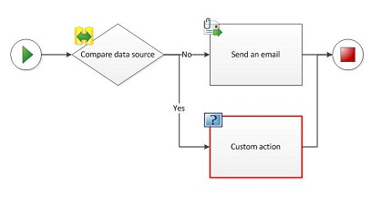
  
    
    
Suggested action:
  
    
    
If you want to add an action to your workflow and a master shape does not exist for it in the stencil, do not create your own shape or import one from a different stencil. Instead, use an existing shape, and then use the **Add Comment** feature of the shape to specify the intended behavior.
  
    
    

## A Custom condition cannot be added to a workflow diagram

Message:
  
    
    
A Custom condition cannot be added to a workflow diagram. The custom condition can only be generated when importing workflow from SharePoint Designer.
  
    
    
Example:
  
    
    

  
    
    
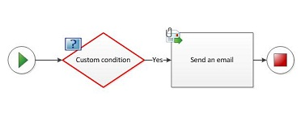
  
    
    
Suggested action:
  
    
    
If you want to add a condition to your workflow and a master shape does not exist for it in the stencil, do not create your own shape or import one from a different stencil. Instead, use an existing shape, and then use the **Add Comment** feature of the shape to specify the intended behavior.
  
    
    

## A Compound condition cannot be manually added to a workflow diagram

Message:
  
    
    
A Compound condition cannot be manually added to a workflow diagram. The compound condition can only be generated when importing workflow from SharePoint Designer.
  
    
    
Example:
  
    
    

  
    
    
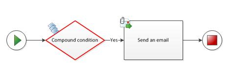
  
    
    
Suggested action:
  
    
    
If you want to add a condition to your workflow and a master shape does not exist for it in the stencil, do not create your own shape or import one from a different stencil. Instead, use an existing shape, and then use the **Add a Comment** feature of the shape to specify the intended behavior.
  
    
    

## Duplicate connections exist between workflow shapes

Message:
  
    
    
Duplicate connections exist between workflow shapes.
  
    
    
Example:
  
    
    

  
    
    
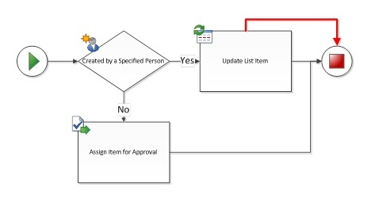
  
    
    
Suggested action:
  
    
    
Remove the redundant connector by selecting and deleting it.
  
    
    

## Loop back to parent shape is not allowed

Message:
  
    
    
Loop back to parent shape is not allowed.
  
    
    
Example:
  
    
    

  
    
    
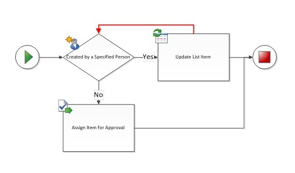
  
    
    
Suggested action:
  
    
    
Neither Visio Professional 2013 nor SharePoint Designer 2013 supports workflows with loops. Check your workflow for loops, and delete the looping connections. If you want to create a SharePoint workflow that includes a set of looping steps, you must create the workflow in Visual Studio.
  
    
    

## Parallel activities that are also sequential are not allowed

Message:
  
    
    
Parallel activities that are also sequential are not allowed.
  
    
    
Example:
  
    
    

  
    
    
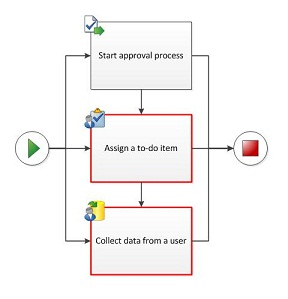
  
    
    
Suggested action:
  
    
    
Activities can be either parallel or sequential, but not both simultaneously. For parallel activities, remove the sequential connectors. For sequential activities, remove the parallel connectors. Sometimes, simultaneously parallel and sequential activities can be difficult to identify. The following examples show other common instances of parallel and sequential arrangement and offer alternative arrangements.
  
    
    
Example:
  
    
    

  
    
    
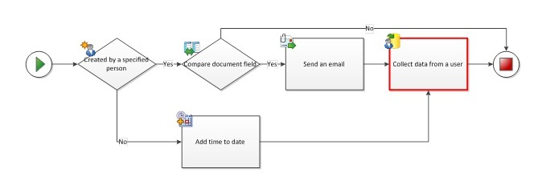
  
    
    
Suggested action:
  
    
    
To avoid having connectors point to the same activity from multiple paths, try duplicating the activity:
  
    
    

  
    
    
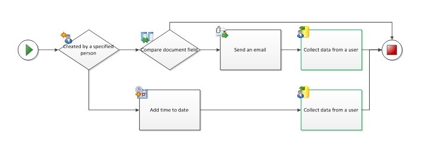
  
    
    
Example:
  
    
    

  
    
    
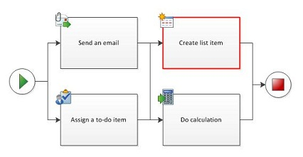
  
    
    
Suggested action:
  
    
    
If dealing with parallel blocks in sequential steps (usually found in workflows constructed by using SharePoint Designer), try using the "Add a Comment" shape between the two parallel blocks so that the steps are separated cleanly.
  
    
    

  
    
    
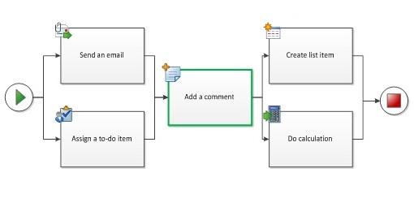
  
    
    

  
    
    

  
    
    

## The condition shape does not have connections labeled with Yes or No

Message:
  
    
    
The condition shape does not have connections labeled with Yes or No.
  
    
    
Example:
  
    
    

  
    
    
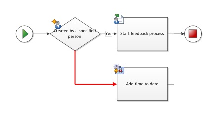
  
    
    
Suggested action:
  
    
    
Right-click the connector to assign a "Yes" or "No" label.
  
    
    

## The condition shape must have at least one outgoing connection with label Yes or No

Message:
  
    
    
The condition shape must have at least one outgoing connection with label Yes or No.
  
    
    
Example:
  
    
    

  
    
    
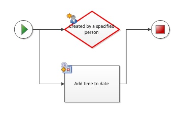
  
    
    
Suggested action:
  
    
    
Ensure that the condition shape has at least one outgoing connector attached to another workflow shape.
  
    
    

## The connector is not a SharePoint Workflow connector

Message:
  
    
    
The connector is not a SharePoint Workflow connector. Ensure the correct connector is used by using the connector tool or AutoConnect.
  
    
    
Example:
  
    
    

  
    
    
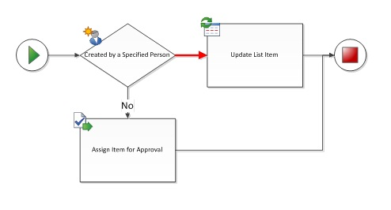
  
    
    
Suggested action:
  
    
    
Avoid reusing connectors from other diagrams, because they are not necessarily designed to be used with SharePoint workflows. Delete the selected connector, and use the connector tool or AutoConnect to replace it with a new connector.
  
    
    

## The connector must be connected to two workflow shapes

Message:
  
    
    
The connector must be connected to two workflow shapes.
  
    
    
Example:
  
    
    

  
    
    
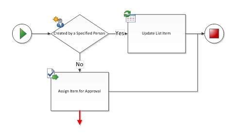
  
    
    
Suggested action:
  
    
    
Remove dead-end connectors or attach them to a second shape.
  
    
    

## The diagram must only have one workflow and one Start shape

Message:
  
    
    
The diagram must only have one workflow and one Start shape.
  
    
    
Example:
  
    
    

  
    
    
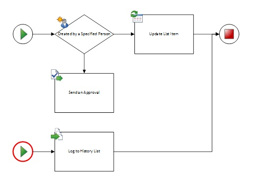
  
    
    
Suggested action:
  
    
    
All paths must originate from the same **Start** shape. Remove extra **Start** shapes, and arrange the connectors so that the path starts in one place.
  
    
    

## The shape is not a SharePoint workflow shape. Only SharePoint workflow shapes can be connected in a workflow

Message:
  
    
    
The shape is not a SharePoint workflow shape. Only SharePoint workflow shapes can be connected in a workflow.
  
    
    
Example:
  
    
    

  
    
    
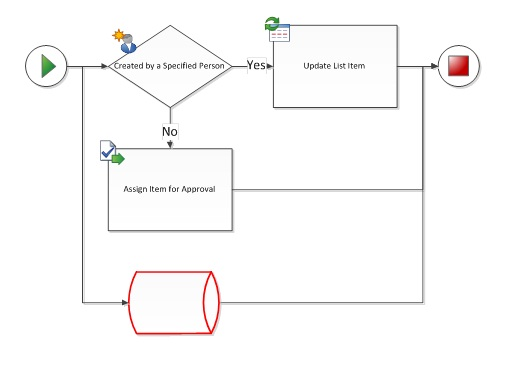
  
    
    
Suggested action:
  
    
    
Only workflow shapes from the SharePoint workflow stencils can be used in the Microsoft SharePoint Workflow template. Other flowchart shapes are not recognized, and they prevent the workflow from being exported to SharePoint Designer 2013.
  
    
    

## The Start shape must not have incoming connections

Message:
  
    
    
The Start shape must not have incoming connections.
  
    
    
Example:
  
    
    

  
    
    
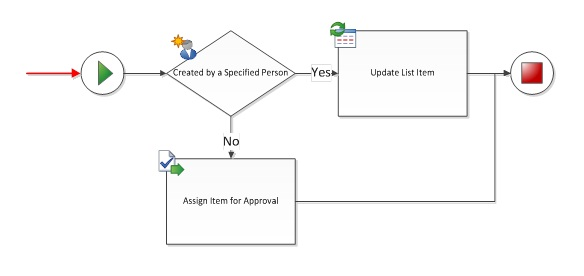
  
    
    
Suggested action:
  
    
    
Remove the incoming connector to the **Start** shape.
  
    
    

## The Terminate shape must not have outgoing connections

Message:
  
    
    
The Terminate shape must not have outgoing connections.
  
    
    
Example:
  
    
    

  
    
    
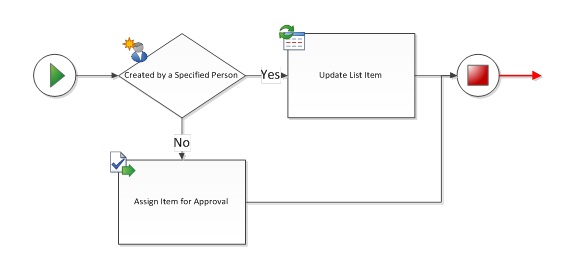
  
    
    
Suggested action:
  
    
    
Remove the outgoing connector from the **Terminate** shape.
  
    
    

## The workflow must have a Start shape

Message:
  
    
    
The workflow must have a Start shape.
  
    
    
Example:
  
    
    

  
    
    
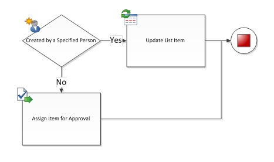
  
    
    
Suggested action:
  
    
    
Add a **Start** shape to the beginning of the workflow, and connect it to the first activity.
  
    
    

## The workflow shape is not connected to a Terminate shape

Message:
  
    
    
The workflow shape is not connected to a Terminate shape.
  
    
    
Example:
  
    
    

  
    
    
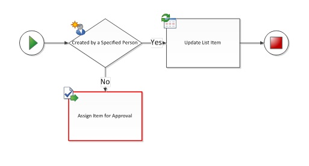
  
    
    
Suggested action:
  
    
    
If the workflow does not have a **Terminate** shape, add one and connect it to the end of the workflow. If a workflow shape is missing a connection to another workflow shape (see example), you can remove it or connect it to another workflow shape.
  
    
    

## The workflow shape is not connected to the workflow

Message:
  
    
    
The workflow shape is not connected to the workflow.
  
    
    
Example:
  
    
    

  
    
    
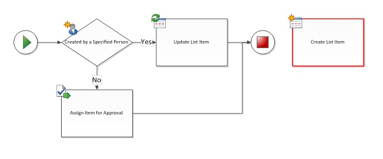
  
    
    
Suggested action:
  
    
    
If the workflow shape is necessary, add connectors to attach it to the workflow path. Otherwise, delete the shape.
  
    
    

## Workflow nesting levels must not exceed a maximum of 10

Message:
  
    
    
Workflow nesting levels must not exceed a maximum of 10.
  
    
    
Suggested action:
  
    
    
Visio Professional 2013 can recognize a maximum of 10 levels of nested workflow activities. Rearrange the workflow to reduce complexity by eliminating activities or dividing the workflow path into more than one branch.
  
    
    

## Additional resources

-  [What's new in workflows for SharePoint](what-s-new-in-workflows-for-sharepoint.md)
    
  
-  [Get started with workflows in SharePoint](get-started-with-workflows-in-sharepoint.md)
    
  
-  [Workflow development in SharePoint Designer and Visio](workflow-development-in-sharepoint-designer-and-visio.md)
    
  

  
    
    

