# Visio shapes in SharePoint Designer 2013: A quick reference guide (SharePoint 2010 Workflow platform)
You can create a workflow in Microsoft Visio Professional 2013 and then export it to Microsoft SharePoint Designer 2013. This guide identifies the Visio shapes that you use to create your workflow.Use this reference article only if you are working in SharePoint Designer 2013 but want to continue to use the SharePoint 2010 Workflow Platform.The shapes for the SharePoint 2010 Workflow Platform come in three stencils: **Actions - SharePoint 2010 Workflow**, **Conditions - SharePoint 2010 Workflow**, and **Terminators - SharePoint 2010 Workflow**.
## Workflow actions

Workflow actions are specific operations that workflow performs. Every workflow must contain at least one action.
  
    
    
The actions in this list are organized in categories based on their area of application in a workflow. For example, actions that affect the behavior of a list item are grouped under **List Actions**, and actions related to document sets are grouped under **Document Set Actions**. The categories for actions are:
  
    
    

-  [Core actions](visio-shapes-in-sharepoint-designer-a-quick-reference-guide-sharepoint-2010.md#section1a) These are the most commonly used actions in a workflow.
    
  
-  [Document set actions](visio-shapes-in-sharepoint-designer-a-quick-reference-guide-sharepoint-2010.md#section1e) Typically, these actions are used in workflows that are associated with a document library or the document content type.
    
  
-  [List actions](visio-shapes-in-sharepoint-designer-a-quick-reference-guide-sharepoint-2010.md#section1b) These actions perform operations on list items.
    
  
-  [Relational actions](visio-shapes-in-sharepoint-designer-a-quick-reference-guide-sharepoint-2010.md#section1d) The single action in this category looks up a user's manager and stores that information in a variable.
    
  
-  [Task actions](visio-shapes-in-sharepoint-designer-a-quick-reference-guide-sharepoint-2010.md#section1c) These actions are associated with approval, feedback, and form operations.
    
  

> **Important:**
> Most of the action shapes that you can insert into a SharePoint workflow in Visio require additional configuration when the workflow is imported into SharePoint Designer. In Visio, remember to use the comments feature of each action shape to specify the settings or configuration of the action. 
  
    
    

### Core actions

These are the most commonly-used actions and can be used in any type of workflow or step.
  
    
    

****

|**Visio Action Shape**|**Corresponding action in SharePoint Designer**|**Action description**|
|:-----|:-----|:-----|
|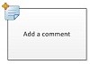|This Visio action is the same as the **Add a Comment** action in SharePoint Designer 2013 and appears as:   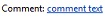    > **Note:**> Comments remain visible when the workflow is exported to Visio.           |**Add a comment**   Use this action to leave informative comments in the workflow designer for reference purposes. This is especially helpful when there are other users co-authoring the workflow. For example, if a variable in the current workflow doesn't have a user-friendly name, you use this action to add a comment to indicate what the variable does in the workflow.    |
|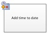|This Visio action is the same as the **Add Time to Date** action in SharePoint Designer 2013 and appears as:   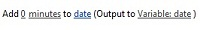|**Add time to date**   Use this action to add a specific time in minutes, hours, days, months, or years to a date, and store the output value as a variable. The date can be a current date, specific date, or a lookup.    |
|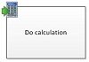|This Visio action is the same as the **Do Calculation** action in SharePoint Designer 2013 and appears as:   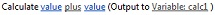|**Do calculation**   Use this action to perform a calculation, such as add, subtract, multiply, or divide two values, and stores the output value in a variable.    |
||This Visio action is the same as the **Log to History List** action in SharePoint Designer 2013 and appears as:   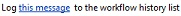|**Log to history list**   Use this action to log a message about the workflow into its history list. A message can be a summary of a workflow event, or anything significant about the workflow. The workflow history list can be helpful in troubleshooting issues with the workflow.    |
|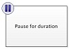|This Visio action is the same as the **Pause for Duration** action in SharePoint Designer 2013 and appears as:   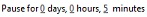|**Pause for duration**   Use this action to pause the workflow for a specific duration in days, hours, or minutes.    > **Note:**> The delay time is effected by the timer job interval, which has a default value of five minutes.           |
|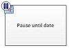|This Visio action is the same as the **Pause Until Date** action in SharePoint Designer 2013 and appears as:   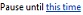|**Pause until date**   Use this action to pause the workflow until a particular date. You can add a current date, a specific date, or a lookup.    |
|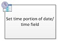|This Visio action is the same as the **Set Time Portion of Date/Time Field** action in SharePoint Designer 2013 and appears as:   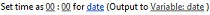|**Set time portion of date/time field**   Use this action to create a timestamp, and stores the output value in a variable. You can set the time in hours and minutes and add a current date, specific date or a lookup.    |
|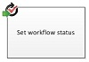| This Visio action is the same as the **Set Workflow Status** action in SharePoint Designer 2013 and appears as:   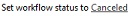 You cannot rename or delete a status value once it has been created. However, you do not have to use it.    A custom status is applicable to the current workflow only, and cannot be used in another workflow    A workflow cannot use custom status values that you define in the action if the action is used inside an impersonation step.   |**Set workflow status**   Use this action to set the status of the workflow. The default options are **Canceled**, **Approved**, and **Rejected**.    You can enter a new status value in the dropdown in the action. Once you enter a status value, the entry is automatically added to the dropdown list.    If the **Set Workflow Status** action is the last step in your workflow where you have also used a custom value, you can see your custom value in the **Status** column in the list upon workflow pausing or completion.   |
|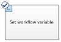|This Visio action is the same as the **Set Workflow Variable** action in SharePoint Designer 2013 and appears as:   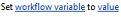|**Set workflow variable**   Use this action to set a workflow variable to a value. Use this action when you want the workflow to assign data to a variable.    |
|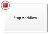|This Visio action is the same as the **Stop workflow** action in SharePoint Designer 2013 and appears as:   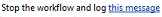|**Stop workflow**   Use this action to stop the current instance of the workflow and log a message to the **Workflow History** list. The message that you specify in the action will appear in the **Description** column in the Workflow History upon workflow completion.   |
   

### List actions

These actions are used on list items.
  
    
    

****

|**VISIO ACTION SHAPE**|**CORRESPONDING ACTION IN SHAREPOINT DESIGNER**|**ACTION DESCRIPTION**|
|:-----|:-----|:-----|
|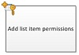|This Visio action is the same as the **Add List Item Permissions** action in SharePoint Designer 2013 and appears as:   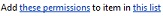    > **Note:**> This action is only available within an impersonation step.           |**Add list item permissions**   This action grants specific permission levels for an item to specific users.    |
|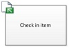|This Visio action is the same as the **Check In Item** action in SharePoint Designer 2013 and appears as:   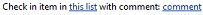|**Check in item**   This action checks in an item that is checked out.    > **Note:**> You can only check in items from a document library.           |
|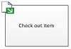|This Visio action is the same as the **Check Out Item** action in SharePoint Designer 2013 and appears as:   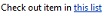|**Check out item**   Use this action to check out an item. The workflow verifies if the item is checked in, before it checks out a document.    > **Note:**> You can only check out items from a library in your site.           |
|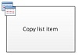|This Visio action is the same as the **Copy List Item** action in SharePoint Designer 2013 and appears as:   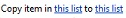|**Copy list item**   Use this action to copy a list item to another list. If there is a document in the list item, the workflow also copies the document to the destination list.    > **Important:**> You must have at least one column similar in both the source and destination lists.           |
|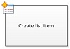|This Visio action is the same as the **Create List Item** action in SharePoint Designer 2013 and appears as:   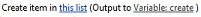|**Create list item**   Use this action to create a new list item in the list that you specify. You can supply the fields and values in the new item.    You can use this action whenever you want a new item to be created with specific information.    > **Note:**> The output variable is the ID of the item created in the list.           |
|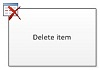|This Visio action is the same as the **Delete Item** action in SharePoint Designer 2013 and appears as:   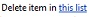|**Delete item**   Use this action to delete an item.    |
|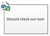|This Visio action is the same as the **Discard Check Out Item** action in SharePoint Designer 2013 and appears as:   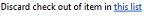|**Discard check out item**   Use this action if an item is checked out, changes have been made to it, and you want to discard the changes and check the item back in.    |
|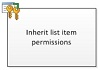|This Visio action is the same as the **Inherit List Item Parent Permissions** action in SharePoint Designer 2013 and appears as:   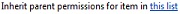    > **Note:**> This action is only available in an impersonation step.           |**Inherit list item permissions**   If your item has unique permissions, you can use this action to make the item inherit the parent permissions from the list.    |
|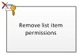|This Visio action is the same as the **Remove List Item Permission**s action in SharePoint Designer 2013 and appears as:    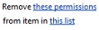    > **Note:**> This action is only available in an impersonation step.           |**Remove list item permissions**   This action removes permissions from an item for specific users.    |
|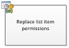|This Visio action is the same as the **Replace List Item Permissions** action in SharePoint Designer 2013 and appears as:   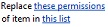    > **Note:**> This action is only available in an impersonation step.           |**Replace list item permissions**   It replaces an item's current permissions with the new permissions that you specify in the action.    |
|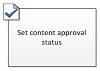|This Visio action is the same as the **Set Content Approval Status** action in SharePoint Designer 2013 and appears as:   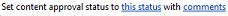    > **Note:**> Content approval must be enabled in the list in order to use this action.           
|**Set content approval status**   If you have content approval enabled in your list, use this action to set the content approval status field to a value such as Approved, Rejected, or Pending. You can type a custom status in the action.    > **Note:**> The **Set Content Approval Status** action works on the current item that the workflow is acting upon, therefore the action is not available in a site workflow.          |
|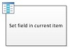|This Visio action is the same as the **Set Field in Current Item** action in SharePoint Designer 2013 and appears as:   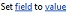|**Set field in current item**   Use the action to set a field in the current item to a value.    > **Note:**> If you want to pause the workflow until it changes the value of the field, use the **Wait for Field Change in Current Item** action instead.          The **Set Field in Current Item** action should not be used in a site workflow.   |
|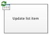|This Visio action is the same as the **Update List Item** action in SharePoint Designer 2013 and appears as:   |**Update list item**   Use this action to update a list item. You can specify the fields and the new values in those fields.    |
|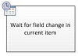|This Visio action is the same as the **Wait for Field Change in Current Item** action in SharePoint Designer 2013 and appears as:   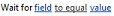|**Wait for field change in current item**   This action pauses the workflow until the field in the current item has changed to a new value.    > **Note:**> If you want the workflow to change the value of the field, rather than have the workflow wait for the field to change, use the **Set Field in Current Item** action instead.          |
   

### Task actions

Actions in this category pertain to task items. These actions apply only to SharePoint sites running SharePoint Server 2013.
  
    
    

****

|**VISIO ACTION SHAPE**|**CORRESPONDING ACTION IN SHAREPOINT DESIGNER**|**ACTION DESCRIPTION**|
|:-----|:-----|:-----|
|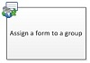|This Visio action is the same as the **Assign a Form to a Group** action in SharePoint Designer 2013 and appears as:   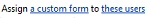|**Assign a form to a group**   Use this action to enable you to create a custom task form with customized fields.    You can use this action to assign a task to one or more participants or groups prompting them to perform their tasks. Participants provide their responses it the fields of the custom task form and, when they are done with the task, click **Complete Task** on the form.   |
|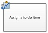|This Visio action is the same as the **Assign a To-do Item** action in SharePoint Designer 2013 and appears as:   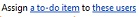|**Assign a to-do item**   Use this action to assign a task to each of the participants, prompting them to perform their tasks and then, when they are done, to click the **Complete Task** button on their task form.   |
||This Visio action is the same as the **Collect Data from a User** action in SharePoint Designer 2013 and appears as:   |**Collect data from a user**   Use this action to assign a task to the participant, prompting them to provide the needed information in a custom task form, and then click the **Complete Task** button on the task form.   This action has an output clause— meaning, the workflow stores the information returned by the action in a corresponding variable. The list item ID of the completed task item from the action is stored in the collect variable.    |
||This Visio action is the same as the **Start Approval Process** action in SharePoint Designer 2013 and appears as:   |**Start approval process**   Use this action to route a document for approval. Approvers can approve or reject the document, reassign the approval task, or request changes.    You can assign tasks to both internal and external participants in the action. An external participant can be an employee in your organization who isn't a user in the site collection, or anyone outside your organization.    |
||This Visio action is the same as the **Start Feedback Process** action in SharePoint Designer 2013 and appears as:   |**Start feedback process**   Use this action to assign task items for feedback to users in a specific order—serial or parallel. The default is parallel. Users or task participants can also reassign a task to other users. When the users are done, they can click the **Submit Feedback** button to indicate task completion.   You can assign tasks to both internal and external participants in the action. An external participant can be an employee in your organization who isn't a user in the site collection, or anyone outside your organization.    |
||This Visio action is the same as the **Start Custom Task Process** action in SharePoint Designer 2013 and appears as:   |**Start custom task process**   The **Start Custom Task Process** action is an approval process template that you can use if other approval actions do not meet your needs.   |
   

### Relational actions

The single action in this category looks up a user's manager and stores that information in a variable. This action applies only to SharePoint sites running SharePoint Server 2013.
  
    
    

****

|**VISIO ACTION SHAPE**|**CORRESPONDING ACTION IN SHAREPOINT DESIGNER**|**ACTION DESCRIPTION**|
|:-----|:-----|:-----|
||This Visio action is the same as the **Lookup Manager of a User** action in SharePoint Designer 2013 and appears as:   |**Lookup manager of a user**   Use this action to look up a user's manager. The output value is then stored in a variable.    > **Note:**> For this action to work properly, the User Profile service must be running in SharePoint.           |
   

### Document set actions

Some workflow actions are only available when the workflow is associated to a document library, such as Shared Documents, or to the Document content type.
  
    
    

****

|**VISIO ACTION SHAPE**|**CORRESPONDING ACTION IN SHAREPOINT DESIGNER**|**ACTION DESCRIPTION**|
|:-----|:-----|:-----|
||This Visio action is the same as the **Start Document Set Approval Process** action in SharePoint Designer 2013 and appears as:   |**Send approval for document set**   Use this action to begin the approval process for a document set.    |
||This Visio action is the same as the **Send Document Set to Repository** action in SharePoint Designer 2013 and appears as:   |**Send document set to repository**   Use this action to allow you to move or copy the document set to a document repository. A document repository can be a library in your SharePoint site, or a site on its own like the Document Center, that routes records to a specific destination based on rules that you define.    |
||This Visio action is the same as the **Send Document to Repository** action in SharePoint Designer 2013 and appears as:   |**Send document to repository**   Use this action to allow you to move or copy a document to a document repository. A document repository can be a library in your SharePoint site, or a site on its own like the Document Center, that routes records to a specific destination based on rules that you define.    |
||This Visio action is the same as the **Set Content Approval Status for the Document Set** action in SharePoint Designer 2013 and appears as:   |**Set content approval status for the document set**   Use this action to set content approval of a document set to **Approved**, **Rejected**, or **Pending**.    |
   

## Workflow conditions

A workflow condition is a branching point in the workflow. The workflow condition compares the input to a specified value. If they match, the workflow follows one branch; if not, it follows the other branch.
  
    
    

> **Important:**
> Most of the condition shapes that you can insert into a SharePoint workflow in Visio require additional configuration when the workflow is imported into SharePoint Designer. In Visio, remember to use the comments feature of each condition shape to specify the decision criteria of the condition. 
  
    
    

### General conditions

This section describes the conditions that are available in SharePoint Designer 2013for list and reusable list workflows, no matter which list or content type the workflow is associated with.
  
    
    

****

|**VISIO CONDITION SHAPE**|**CORRESPONDING CONDITION IN SHAREPOINT DESIGNER**|**CONDITION DESCRIPTION**|
|:-----|:-----|:-----|
||This Visio condition is the same as the **If any value equals value** condition in SharePoint Designer 2013 and appears as:   |**Compare data source**   This condition compares two values. You can specify whether the values should be equal or not equal.    |
||This Visio condition is the same as the **If current item field equals value** condition in SharePoint Designer 2013 and appears as:   |**Compare document field**   This condition checks a field against a value that you specify. You can specify whether the values should be equal or not equal.    |
||This Visio condition is the same as the **Created by a specific person** condition in SharePoint Designer 2013 and appears as:   |**Created by a specified person**   This condition checks if an item was created by a specific user. The user can be specified as an e-mail address, such as olivier@contoso.com, or selected from SharePoint, Exchange, or Active Directory users.    > **Note:**> The user name and e-mail address are case sensitive. It is recommended that you select a user name or e-mail address to help ensure that you use the correct case. If you type a user name or e-mail address, you must match the case of the account. For example, If created by contoso\\molly will not evaluate as true if the user account is Contoso\\Molly.           |
||This Visio condition is the same as the **Created in a specific date span** condition in SharePoint Designer 2013 and appears as:   |**Created in specific date span**   This condition checks if the item was created between the specified dates. You can use the current date, a specific date, or a lookup.    |
||This Visio condition is the same as the **Modified by a specific person** condition in SharePoint Designer 2013 and appears as:   |**Modified by a specific person**   Use this condition to check if an item was modified by a specified user. The user can be specified as an e-mail address, such as olivier@contoso.com, or selected from SharePoint, Exchange, or Active Directory users.    > **Note:**> The user name and e-mail address are case sensitive. It is recommended that you select a user name or e-mail address to help ensure that you use the correct case. If you type a user name or e-mail address, you must match the case of the account. For example, If modified by contoso\\molly will not evaluate as true if the user account is Contoso\\Molly.           |
||This Visio condition is the same as the **Modified in a specific date span** condition in SharePoint Designer 2013 and appears as:   |**Modified in a specific date span**   This condition checks if an item was modified between the specified dates. You can use the current date, a specific date, or a lookup.    |
||This Visio condition is the same as the **Title field contains keywords** condition in SharePoint Designer 2013 and appears as:   |**Title field contains keywords**   This condition checks if the **Title** field for an item contains a specific word. You can either specify the keyword in the String Builder—which can be a static value or a dynamic string or a combination — or insert a lookup to a field or variable.   > **Note:**> You cannot search for more than one keyword in the **Title field contains keywords** condition. However, you can use logical operators such as**||**( or) or **&amp;&amp;** (and.          |
   

### Document set conditions

Some workflow conditions are only available when the workflow is associated to a document library, such as Shared Documents, or to the Document content type.
  
    
    

|**VISIO CONDITION SHAPE**|**CORRESPONDING CONDITION IN SHAREPOINT DESIGNER**|**CONDITION DESCRIPTION**|
|:-----|:-----|:-----|
||This Visio condition is the same as the **The file size in a specific range kilobytes** condition in SharePoint Designer 2013 and appears as:   |**File size is in a specific range**   This condition checks if the file size of a document is between the specified sizes, in kilobytes. The condition does not include the specified sizes in the evaluation. You can enter a number or use a lookup for the first or the second size in the condition.    |
||This Visio condition is the same as the **The file type is a specific type** condition in SharePoint Designer 2013 and appears as:   |**File is a specific type**   This condition checks if the file type of the current item is of the specified type, such as docx. You can enter the file type as a string or use a lookup.    |
   

### List conditions

  
    
    

****

|**VISIO CONDITION SHAPE**|**CORRESPONDING CONDITION IN SHAREPOINT DESIGNER**|**CONDITION DESCRIPTION**|
|:-----|:-----|:-----|
||This Visio condition is the same as the **Check list item permission levels** condition in SharePoint Designer 2013 and appears as:   |**Check exact user permissions**   This condition checks that the specified user has the minimum necessary permission level.    |
||This Visio condition is the same as the **Check list item permissions** condition in SharePoint Designer 2013 and appears as:   |**Check user permission**   This condition checks if the specified user has the minimum necessary permissions.    |
   

## Workflow terminators

In Visio, each workflow must begin with a Start terminator (
  
    
    

  
    
    
) and end with a Stop terminator (
  
    
    

  
    
    
). Only one of each type of terminator can be used in a given workflow. Terminators are necessary when you create a SharePoint workflow in Visio so that the workflow can pass validation and can be exported. Workflow terminators are not used in SharePoint Designer.
  
    
    

## Additional resources

-  [What's new in workflows for SharePoint 2013](what-s-new-in-workflows-for-sharepoint.md)
    
  
-  [Get started with workflows in SharePoint 2013](get-started-with-workflows-in-sharepoint.md)
    
  
-  [Workflow development in SharePoint Designer and Visio](workflow-development-in-sharepoint-designer-and-visio.md)
    
  

  
    
    
