# What's new for developers in SharePoint
Learn about new features and functionality in SharePoint, including the new Cloud Add-in Model, development tools, platform enhancements, mobile add-ins, and more.
## Cloud Add-in Model

SharePoint introduces a Cloud Add-in Model that enables you to create add-ins. SharePoint Add-ins are self-contained pieces of functionality that extend the capabilities of a SharePoint website. An add-in may include SharePoint components such as lists, workflows, and site pages, but it can also surface a remote web application and remote data in SharePoint. An add-in has few or no dependencies on any other software on the device or platform where it is installed, other than what is built into the platform. This characteristic enables add-ins to be installed simply and uninstalled cleanly. Add-ins have no custom code that runs on the SharePoint servers. Instead, all custom logic moves "up" to the cloud or "down" to client computers. Additionally, SharePoint introduces an innovative delivery model for SharePoint Add-ins that includes components like the Office Store and the Add-in Catalog.

<a href="../sp-add-ins/sharepoint-add-ins.md">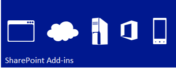</a>&nbsp;&nbsp;<a href="../sp-add-ins/deploy-and-install-a-sharepoint-hosted-sharepoint-add-in.md">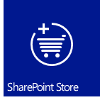</a>&nbsp;&nbsp;<a href="../sp-add-ins/deploy-and-install-a-sharepoint-hosted-sharepoint-add-in.md">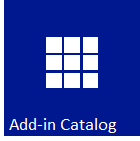</a>

## Familiar programming model using web standards

SharePoint makes it easy for any web developer, including those who work on non-Microsoft platform stacks, to create SharePoint solutions. What makes this possible is that SharePoint is based on common web standards like HTML, CSS, and JavaScript. Furthermore, implementation relies on established protocols like the Open Data protocol (OData), and OAuth.
  

  <a href="../sp-add-ins/sharepoint-add-ins.md">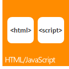</a>&nbsp;&nbsp;&nbsp;&nbsp;&nbsp;&nbsp;<a href="../sp-add-ins/authorization-and-authentication-of-sharepoint-add-ins.md">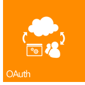</a>

## Development tools

The current release reflects enormous strides in optimizing the existing development tools like Visual Studio and SharePoint Designer, in addition to providing the release of newly developed web-based tool Napa Office 365 Development Tools for developing add-ins. The new unified project system in Visual Studio lets you develop SharePoint Add-ins, Office Add-ins, SharePoint Add-ins that include Office Add-ins, or Office Add-ins that are hosted by SharePoint. In addition to the SharePoint project templates that were provided in earlier versions, Visual Studio 2012 now includes a new add-in project template in the Add-ins folder named Add-ins for SharePoint. Several new properties have been added to the Properties window and Properties pages to support SharePoint Add-in projects. Other improvements include full support for development against the Cloud Add-in Model, including OData and OAuth support, and full support for development against the Workflow Manager Client 1.0 platform.

<a href="https://dev.office.com/docs/add-ins/overview/office-add-ins" target="_blank">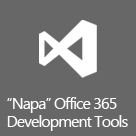</a>&nbsp;&nbsp;&nbsp;&nbsp;

## Core platform enhancements

On a broader scale, SharePoint has been improved and enhanced to support the new cloud-based architecture and app-driven development framework. From the SharePoint APIs at the lowest level to connectivity to social media integration, SharePoint is designed and executed to support a rich application development experience. In addition to the use of Representational State Transfer (REST) endpoints for web services, there is a broad new API for both server and client development. Remote event receivers and now supported in addition to client-side rendering. 
  
<a href="https://msdn.microsoft.com/library/fp161347.aspx" target="_blank">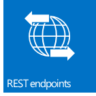</a>&nbsp;&nbsp;<a href="choose-the-right-api-set-in-sharepoint.md">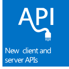</a>&nbsp;&nbsp;<a href="how-to-customize-a-field-type-using-client-side-rendering.md">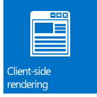</a>&nbsp;&nbsp;

    
    
    

## Mobility

With SharePoint, you can combine Windows Phone 7 applications with on-premises SharePoint services and applications, or with remote SharePoint services and applications that run in the cloud (such as those that use SharePoint Online), to create powerful applications that extend functionality beyond the traditional desktop or laptop and into a truly portable and much more accessible environment. The new mobility features in SharePoint are built on existing Microsoft tools and technologies, such as SharePoint, Windows Phone 7, Visual Studio, and Microsoft Silverlight. You can create SharePoint-powered mobile applications for Windows Phone using the new SharePoint phone application wizard template in Visual Studio, which lets you create simple list-based mobile applications. You can integrate new features introduced in SharePoint, such as the Geolocation field type and "push" notifications from SharePoint Server, into your mobile applications.

<a href="overview-of-windows-phone-sharepoint-application-templates-in-visual-studio.md">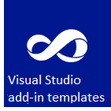</a>&nbsp;&nbsp;&nbsp;&nbsp;

## Social and collaboration

New and improved social and collaboration features make it easy for users to communicate and to stay engaged and informed. The improved My Site social feed helps users keep up to date with the people and content that they care about. The new Community Site feature provides a rich community experience that lets users easily find and share information and find people who have similar interests.

&nbsp;&nbsp;<a href="what-s-new-for-developers-in-social-and-collaboration-features-in-sharepoint-201.md#bkmk_Collab">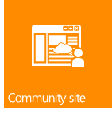</a>&nbsp;&nbsp;&nbsp;&nbsp;<a href="follow-content-in-sharepoint.md">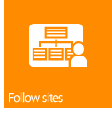</a>

## Search

Search functionality in SharePoint includes several enhancements, custom content processing with the Content Enrichment web service, and a new framework for presenting search result types. Additionally, there have been significant enhancements made to the keyword query language (KQL).

<a href="custom-content-processing-with-the-content-enrichment-web-service-callout.md">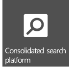</a>&nbsp;&nbsp;<a href="what-s-new-in-sharepoint-search-for-developers.md">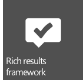</a>&nbsp;&nbsp;<a href="building-search-queries-in-sharepoint.md">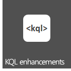</a>

## Workflows

Workflow Manager Client 1.0 is a redesigned workflow infrastructure that is built on Windows Workflow Foundation 4 and brings new power and flexibility to workflow authoring in SharePoint. A fully declarative authoring environment enables information workers to use SharePoint Designer 2013 to author powerful workflows, and a new set of Visual Studio 2012 workflow project templates let developers access more sophisticated features like custom actions. Perhaps most importantly, Workflow Manager Client 1.0 is fully integrated with the model for SharePoint Add-ins. In addition, workflows execute in the cloud, not in SharePoint, which provides enormous flexibility in designing workflow-based SharePoint Add-ins.

<a href="what-s-new-in-workflows-for-sharepoint.md">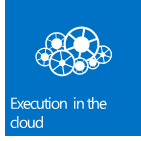</a>&nbsp;&nbsp;<a href="sharepoint-workflow-fundamentals.md">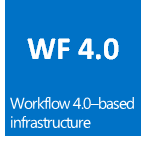</a>&nbsp;&nbsp;<a href="workflow-development-in-sharepoint-designer-and-visio.md">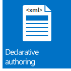</a>&nbsp;&nbsp;

## Enterprise Content Management

In SharePoint, you can now use .NET client, Silverlight, Windows Phone, and JavaScript APIs, in addition to the newly expanded set of .NET server managed APIs, to customize Enterprise Content Management (ECM) experiences and behavior.

&nbsp;&nbsp;<a href="managed-navigation-in-sharepoint.md">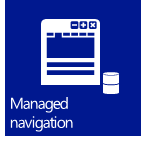</a>&nbsp;&nbsp;<a href="cross-site-publishing-in-sharepoint.md">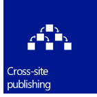</a>&nbsp;&nbsp;

## Business Connectivity Services

Business Connectivity Services (BCS) enables SharePoint to access data from external data systems such as SAP, ERP, and CRM, in addition to other data-driven applications that are exposed through WCF services or OData endpoints. BCS in SharePoint has been improved and enhanced in many ways, including OData connectivity, external events, external data in add-ins, filtering and sorting, support for REST, and others.

&nbsp;&nbsp;<a href="add-in-scoped-external-content-types-in-sharepoint.md">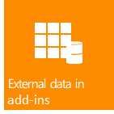</a>&nbsp;&nbsp;

## Application services

SharePoint includes several services for working with data in your SharePoint sites. New for SharePoint is the Machine Translation Service, which translates sites, documents, and streams for multilingual support. SharePoint also includes Access Services and a new data access model. For converting files and streams to other formats, SharePoint has Word Automation Services and PowerPoint Automation Services (a new feature for SharePoint). SharePoint also provides data analysis tools, like PerformancePoint Services and Visio Services, that enable business intelligence, and powerful new features in Excel Services.

<a href="external-events-and-alerts-in-sharepoint.md">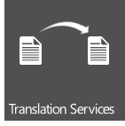</a>&nbsp;&nbsp;<a href="powerpoint-automation-services-in-sharepoint.md">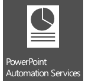</a>&nbsp;&nbsp;<a href="what-s-new-in-access.md">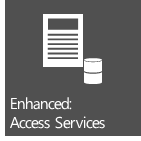</a>&nbsp;&nbsp;<a href="https://msdn.microsoft.com/library/fp161347.aspx" target="_blank">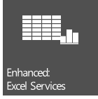</a>

## See also

-  [SharePoint development overview](sharepoint-development-overview.md)
    
  
-  [Develop SharePoint Add-ins](../sp-add-ins/sharepoint-add-ins.md)
    
  
-  [SharePoint Add-ins compared with SharePoint solutions](sharepoint-add-ins-compared-with-sharepoint-solutions.md)
    
  
-  [Choose the right API set in SharePoint](choose-the-right-api-set-in-sharepoint.md)
    
  
-  [Accessibility in SharePoint](accessibility-in-sharepoint.md)
    
  

