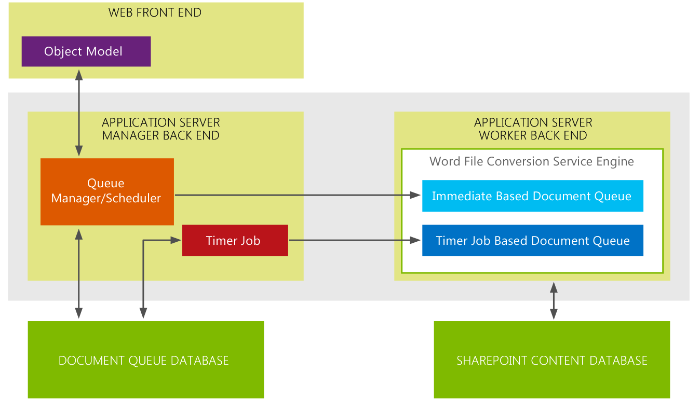

# What's new in Word Automation Services for developers
This topic provides a high-level overview of the additions and enhancements for developers in Word Automation Services. In Microsoft SharePoint the primary addition to Word Automation Services is support for "on demand" file conversion requests. The most significant enhancement to Word Automation Services is added support for using streams as input to and output from conversion jobs.
## Create an on demand file conversion

In Word Automation Services in Microsoft SharePoint you can now create on demand file conversion requests that result in file conversionthat are processed immediately. In SharePoint 2010, you would create a file conversion job in your code and then start the conversion using the ConversionJob.Start method. The conversion job would then start based on the interval set in Word Automation Services for how often to start conversion jobs. At the interval, the SharePoint Timer Job would start the conversion job. Using the Timer Job based method, the soonest you can start a conversion job is 1 minute. 
  
    
    
Now, in Word Automation Services in Microsoft SharePoint, you have the added option to create a file conversion request that's processed as soon as you submit it and the conversion is started immediately and does not depend on the SharePoint Timer Job. 
  
    
    
One way to think about the difference between on demand file conversion requests and the SharePoint Time Job-based conversion jobs is to understand that on demand file conversion requests are handled synchronously, whereas SharePoint Timer Job-based conversion jobs happen asynchronously. The Word Automation Services architecture was redesigned to support both the new kind of on demand file conversion request and the existing SharePoint Timer Job based file conversions.
  
    
    

**Figure 1. Word Automation Services 2013 architecture**

  
    
    

  
    
    

  
    
    
In figure 1, you can see that the Word Automation Services architecture maintains 2 separate queues for conversions: one queue for on demand (immediate) file conversion requests and one queue for SharePoint Timer Job-based conversion jobs on demand requests are placed in the immediate based document queue where the conversions are processed immediately.
  
    
    
In contrast, the SharePoint Timer Job-based conversion jobs are placed in the Timer Job-based document queue. Conversion jobs for these requests start at the interval set for Word Automation Services. Conversion requests in the immediate-based document queue always have priority over conversion jobs in the Timer Job-based document queue.
  
    
    

### Key points

- An on demand file conversion request is an additional feature and doesn't replace the existing SharePoint Timer Job-based conversion job. That means that solutions that compiled and ran in SharePoint 2010 will continue to compile and run in SharePoint.
    
  
- You can make on demand file conversion requests for only one file at a time
    
  
- Word Automation Services will always prioritize on demand file conversion jobs over conversion jobs based on the SharePoint Timer Job. If Word Automation Services is already working on a file conversion job that uses the SharePoint Timer Job, Word Automation Services will interrupt that job and switch over to work on the on demand file conversion job until it is completed. It will then switch back to work on the SharePoint Timer Job-based file conversion job
    
  

## Perform file conversions on streams

The other new feature in Word Automation Services in Microsoft SharePoint is support for converting streams. In SharePoint 2010, you could only convert files that were stored in SharePoint libraries. Now you can also convert files that are stored outside SharePoint using streams.
  
    
    

### Key points

- You can only use streams as input when you're creating an on demand file conversion job
    
  
- Because of the foregoing point, you can only convert one stream at a time
    
  
With the addition of on demand file conversion requests and support for converting streams, Word Automation Services has been significantly enhanced to enable a greater range of document conversion scenarios.
  
    
    

### See also

-  [Word Automation Services in SharePoint Server 2010](http://msdn.microsoft.com/en-us/library/ee558278)
    
  
-  [Word Automation Services Class Library](http://msdn.microsoft.com/en-us/library/ee559408)
    
  

