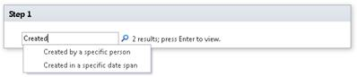
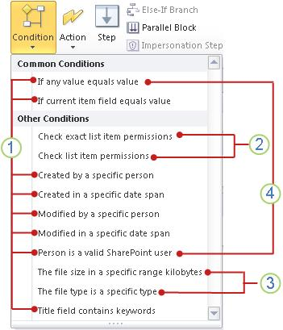
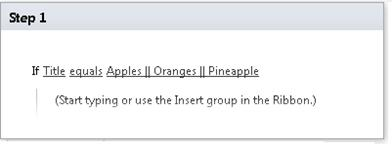

# Workflow conditions quick reference (SharePoint 2010 Workflow platform)
Learn about the workflow conditions that are available in the SharePoint 2010 Workflow Platform in Microsoft SharePoint Designer 2013.Use this article  *only*  if you are working in SharePoint Designer 2013, but want to continue to use the SharePoint 2010 Workflow Platform.If instead you want to use the SharePoint Workflow Platform, see  [Workflow actions and activities reference for SharePoint](workflow-actions-and-activities-reference-for-sharepoint), and other articles listed in the "Additional resources" section, which describe new features that are available in the newer platform.To begin creating a workflow by using the 2010 Workflow Platform, select **SharePoint 2010 Workflow** in the **Platform Type** box in the **Create Workflow** dialog box.
## Where to find the workflow conditions

There are two ways to access the menu of available workflow conditions.
  
    
    
While you are editing inside a workflow step, do one of the following:
  
    
    

- On the **Workflow** tab, in the **Insert** group, click **Conditions** to open the list of workflow actions.
    
  
- Double-click inside a workflow step. In the search box that appears, type text that appears in the name of the condition that you want, such as "created", and then press Enter. Actions and conditions that contain the text you typed appear after the text box.
    
  

  
    
    

  
    
    
Which conditions are available to you while you are creating or modifying a workflow depends on the precise context that you are working in. See the following illustration for more information.
  
    
    

  
    
    

  
    
    
 **1** General conditions in SharePoint Designer 2013.
  
    
    
 **2** **Check exact list item permissions** and **Check list item permissions** are available only inside an impersonation step.
  
    
    
 **3** **The file size is a specific range kilobytes** and **The file type is a specific type** are available only in a workflow that is associated with the Document content type, a child of the Document content type, or a library.
  
    
    
 **4** **If any value equals value** and **Person is a valid SharePoint user** are the only conditions available when you create a site workflow.
  
    
    

## General conditions

This section describes the conditions that are available in SharePoint Designer 2013 for list and reusable list workflows, no matter what list type or content type the workflow is associated to.
  
    
    

### If any value equals value

This condition is initially displayed in a workflow step as **If any value equals value**. Use this condition when you want to compare one value with another value. Each value can be static text, a dynamic string, or a lookup to a variable, to context information, or to a SharePoint field.
  
    
    
You can select from a wide range of operators in your condition, such as **contains** and **is greater than**. To do so, you must set the first **value** in the condition and then click **equals**. The operators that are available depend on what the first **value** in the condition is set to. For example, if you used the lookup dialog to set the first **value** in the condition to a Date and Time data type, such as **Created**, the **Contains** operator is not among the available options.
  
    
    
There are two variations of the **equals** and **contains** operators:
  
    
    

- The **equals** and **contains** operators are both case-sensitive.
    
  
- The **equals (ignoring case)** and **contains (ignoring case)** operators are not case-sensitive.
    
  
The option that you choose for the second **value** in the condition also depends to some extent on what the first **value** is set to. For example, suppose that you set the first **value** to **Created**, and then you look up the second **value** by using a variable that is a string, such as **Last 10 Characters**. You would probably want to return the string **As Date/Time**, so that the comparison with **Created** will return predictable results.
  
    
    

> **Note:**
> You can use logical operators such as**||**(or) or **&amp;&amp;** (and) in the condition.
  
    
    

Following are examples of what the condition might look like in a workflow step:
  
    
    

- If Variable: A week from Modifiedis greater thanToday
    
  
- If Variable: Specification Namecontains (ignoring case)SharePoint Designer || SPD
    
  
The **If any value equals value** condition is one of only two conditions available when you are working in a site workflow, the other being **Person is a valid SharePoint user**. For more information about site workflows, see the  [Conditions available within a site workflow](workflow-conditions-quick-reference-sharepoint-2010-workflow-platform#section5) section of this article.
  
    
    

### If current item field equals value

This condition is initially displayed in a workflow step as **If field equals value**. Use this condition to compare the value in a field in the current item (that is, the item that the list or reusable list workflow is currently running on) to another value. Values can be static text, dynamic strings, or lookups to variables, to context information, or to other SharePoint fields.
  
    
    
You can click **field** to see the list of options. The available options for **field** depend on the content type, list, library, or site that the workflow is associated to. For example, a workflow that is associated to a default library will have field options such as **Title**, **Created**, and **Created By**.
  
    
    
You can select from a range of operators in your condition, including **contains** and **is greater than**. Before you select an operator, you must first select a value for **field**, and then click **equals**. Which operators are available depends on the **field** setting. For example, if you used the lookup dialog to set **field** to a Date and Time data type, such as **Created**, the **Contains** operator is not listed as an option.
  
    
    
There are two variations of the **equals** and **contains** operators. The **equals** and **contains** operators are case-sensitive, while the **equals (ignoring case)** and **contains (ignoring case)** are not case-sensitive. For example, if you set **field** to **Title** and then use the **contains** operator, and if the **value** in your condition isDocument, then the condition is true only if the title contains Document, with a capital D, and not if it contains only document, without a capital D. If you use the **contains (ignoring case)** operator instead, then the condition is true for titles containing eitherDocument ordocument or both.
  
    
    
The option that you choose for **value** also depends to some extent on what **field** is set to. For example, suppose that you set **field** to **Created**, and then you look up the **value** by using a variable that is a string, such as **Last 10 Characters**. You would probably want to return the string **As Date/Time**, so that the comparison with **Created** will return predictable results.
  
    
    

> **Note:**
> You can use logical operators such as**||**(or) or **&amp;&amp;** (and) in the condition.
  
    
    

Following are examples of what the condition might look like in a workflow step. (Note that in the first example, **is less than** is interpreted to mean "earlier than".)
  
    
    

- If Current Item:Modifiedis less than1/1/2010 12:00:00 AM
    
  
- If Current Item:Pathcontains (ignoring case)Marketing || Public Relations
    
  

### Created by a specific person

This condition is initially displayed in a workflow step as **If created by specific person**. Use this condition to discover whether an item was created by a specified user. You can specify the user either by entering their user name or email address manually (for example, Olivier@contoso.com) or by selecting the user from among users already listed in SharePoint, Exchange, or Active Directory.
  
    
    

> **Note:**
> Because both the user name and the e-mail address are case sensitive, it is recommended that you use the latter method to ensure correct cases. If you must enter a user name or e-mail address manually, be careful to match the cases precisely. For example, the condition **If created by contoso\\molly** does not evaluate as true if the user account is registered as Contoso\\Molly.
  
    
    

Following is an example of what the condition might look like in a workflow step:
  
    
    

- If created by Molly Clark
    
  

### Created in a specific date span

This condition is initially displayed in a workflow step as **If created between date and date**. Use this condition to discover whether an item was created between two specified dates. You can use the current date, a specified date, or the result of a lookup.
  
    
    
Following is an example of what the condition might look like in a workflow step:
  
    
    

- If created between 1/1/2009 and1/1/2010 12:00:00 AM
    
  

### Modified by a specific person

This condition is initially displayed in a workflow step as **If modified by specific person**. Use this condition to discover whether an item was modified by a specified user. The user can be specified as an e-mail address, such as olivier@contoso.com, or selected from SharePoint, Exchange, or Active Directory users.
  
    
    

> **Note:**
> The user name and e-mail address are case sensitive. It is recommended that you select a user name or e-mail address to help ensure that you use the correct case. If you type a user name or e-mail address, you must match the case of the account. For example, **If modified by contoso\\molly** will not evaluate as true if the user account is Contoso\\Molly.
  
    
    

Following is an example of what the condition might look like in a workflow step:
  
    
    

- If modified by Molly Clark
    
  

### Modified in a specific date span

This condition is initially displayed in a workflow step as **If modified between date and date**. Use this condition to discover whether an item was modified between two specified dates. For each of the date values, you can use the current date, a specified date, or the result of a lookup.
  
    
    
Following is an example of what the condition might look like in a workflow step,
  
    
    

- If modified between 1/1/2009 and1/1/2009 12:00:00 AM
    
  

### Person is a valid SharePoint user

This condition is initially displayed in a workflow step as **If person is a valid SharePoint user**. Use this condition to discover whether the specified user is a member of the SharePoint site.
  
    
    
In SharePoint Designer 2013, you can include people outside your corporate domain (called external participants) in your workflows. For example, suppose that you have assigned tasks in your workflow to external participants. You can then use this action to make a site user follow up with the external participants until the tasks are complete.
  
    
    
Following is an example of what the condition might look like in a workflow step,
  
    
    

- If Molly Clark is a valid SharePoint user
    
  
The **Person is a valid SharePoint user** condition is one of only two conditions available when you are working in a site workflow, the other being **If any value equals value**. For more information about site workflows, see the  [Conditions available within a site workflow](workflow-conditions-quick-reference-sharepoint-2010-workflow-platform#section5) section in this article.
  
    
    

### Title field contains keywords

This condition is initially displayed in a workflow step as **If title field contains keywords**. Use this condition to discover whether the **Title** field for an item contains specified text. You can either specify the text in the String Builder (as a static value, as a dynamic string, or as a combination of the two) or insert a lookup to a field or variable.
  
    
    

> **Note:**
> When using the **Title field contains keywords** condition, you cannot search for more than a single keyword text. To search for multiple, alternative keyword texts, you can use logical operators such as**||**( or) and **&amp;&amp;** (and) in either of the following two conditions: **If any value equals value** and **If current item field equals value**. (Use the latter condition if you want to search in the **Title** field only). For an example, see the following image:> 
  
    
    

  
    
    

  
    
    

  
    
    

  
    
    

## Conditions available only within an impersonation step

By default, when a workflow is started manually it uses the permissions of the person who starts it. But what if the person who starts it doesn't have adequate rights for one or more of the operations that the workflow will need to perform? For example: What if the workflow will sometimes need to archive a document to a library for which the person who starts the workflow might have only the Read permission level, which does not include permission to archive? 
  
    
    
In such cases, you can use one or more impersonation steps in the workflow. An impersonation step uses the permissions of the person who most recently saved the workflow template???typically the author of the template, who would typically have the needed permissions for all of the workflow's operations, including in this case permission to archive the document to the appropriate library. 
  
    
    

> **Note:**
>  For both of these conditions, *all*  of the specified users and groups must pass the comparison in order for the condition to evaluate to True.>  For both of these conditions, it does not matter whether the specified permissions have been assigned *explicitly*  to the specified individual users or whether the permissions are held by those individual users only *implicitly*  (as members of a group to which the permissions have been assigned, for instance).For specified *groups*  , on the other hand, the permissions must have been assigned *explicitly*  and *not*  inherited from a parent group.
  
    
    

### Check list item permissions

This condition is initially displayed in an impersonation step as **If permissions for these users are at least these permissions on item in this list**. 
  
    
    
Use this condition to discover whether, for the specified list or library, the  *individual permissions*  that each specified user and group holds include all of the *individual permissions*  that are included in the specified security level or levels.
  
    
    
 **Examples**
  
    
    

- A user or group has only the Read permission level for a list, but the condition specifies the Approve level. The Read level does  *not*  include all of the permissions that are included in the Approve level, so in this case the condition evaluates as False.
    
  
- Another user or group has the Full Control permission level for the same list. The Full Control level  *does*  include all of the permissions that are included in the Approve level (as well as other permissions), and so this time the condition evaluates as True.
    
  
Following is an example of what the condition might look like in a workflow step:
  
    
    

- If permissions for Contoso Members are at leastRead on item inCurrent Items
    
  

### Check list item permission levels

This condition is initially displayed in an impersonation step as **If permission levels for these users are at least these permission levels on item in this list**. 
  
    
    
Use this condition to discover whether, for the specified list or library, each specified user and group has been  *explicitly*  assigned the specified permission *level or levels*  . Permissions held only *implicitly*  (for instance, by a member of a group to which the permissions have been assigned) are *not*  considered by this condition, and neither are the individual permissions held by the specified users and groups.
  
    
    
 **Examples**
  
    
    

- A user has been explicitly assigned only the Full Control permission level for a list, but the condition specifies only the Read level. Even though the user  *holds*  all of the individual permissions that are included in the Read level, the user not been *explicitly*  assigned the Read level, so the condition evaluates as False.
    
  
- A different user has been explicitly assigned only the Design permission level for a different list, but the condition specifies both the Design level and the Manage Hierarchy level. Because the user has been assigned only one of the two required levels, the condition evaluates as False.
    
  
- For a third list, a user is a member of the Members group and inherits permissions from that group. However, no permissions level has been  *explicitly*  assigned to the user. The condition requires *explicit assignment*  of the Contribute level, so because the user holds the permissions of that level only implicitly, the condition again evaluates to False.
    
  
Following is an example of what the condition might look like in a workflow step:
  
    
    

- If permission levels for Contoso Members are at leastRead on item inCurrent Items
    
  

## Conditions available only when the workflow is associated to a library or the Document content type

The conditions **The file size is a specific range kilobytes** and **The file type is a specific type** are available only when your workflow is associated with a Library or the Document content type.
  
    
    

### The file size in a specific range of kilobytes

This condition is initially displayed in a workflow step as **If the file size is between size and size kilobytes**. Use this condition to discover whether the file size of a document falls between two specified sizes measured in kilobytes. The condition does not include the specified sizes in the evaluation. For each instance of **size**, you can either enter a number or use a lookup.
  
    
    
Following is an example of what the condition might look like in a workflow step,
  
    
    

- If the file size is between 1023 and1048577 kilobytes
    
  

> **Note:**
> The specified upper and lower limits are not included in the defined range. In the example given here, a file that is 1023 KB would evaluate as false because it is not between 1023 and 1048577. 
  
    
    

### The file type is a specific type

This condition initially displays in a workflow step as **If the file type is specific type**. Use this condition to discover whether the file type of the current item is the specified type, (such as docx. You can either enter the file type as a string or use a lookup.
  
    
    
Following is an example of what the condition might look like in a workflow step:
  
    
    

- If the file type is docx
    
  

## Conditions available within a site workflow

Site workflows operate at the site level and are not associated with a list item. When you are working in a site workflow, only the following conditions are available. (All other conditions in SharePoint Designer 2013 operate on list items, and therefore none of them function in site workflows.)
  
    
    

- **If any value equals value**
    
  
- **Person is a valid SharePoint user**
    
  
From within an impersonation step in a site workflow:
  
    
    

- **Check list item permissions**
    
  
- **Check list item permission levels**
    
  
- **Person is a valid SharePoint user**
    
  
For more information about conditions, see the  [General conditions](workflow-conditions-quick-reference-sharepoint-2010-workflow-platform#section2) section of this article.
  
    
    

## Additional resources

-  [What's new in workflows for SharePoint](what-s-new-in-workflows-for-sharepoint)
    
  
-  [Get started with workflows in SharePoint](get-started-with-workflows-in-sharepoint)
    
  
-  [Workflow development in SharePoint Designer and Visio](workflow-development-in-sharepoint-designer-and-visio)
    
  

  
    
    

