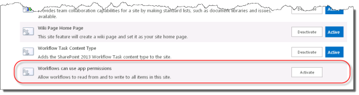
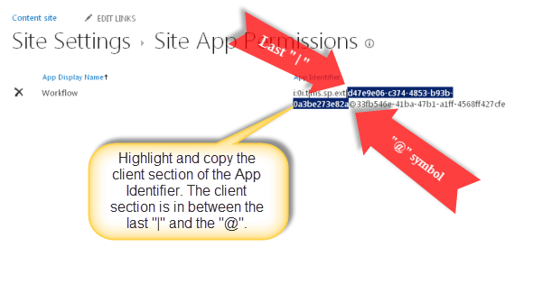

# Create a workflow with elevated permissions by using the SharePoint Workflow platform

This article describes how to create SharePoint workflows that access objects in SharePoint that require elevated permissions. These solutions use two features: granting permissions to the workflow app and wrapping actions with the App Step.

> [!NOTE]
> SharePoint 2013 workflow has been deprecated since April 2023 and will be turned off for new tenants as of April 2, 2024. It will be removed from existing tenants and will be fully retired as of April 2, 2026. If you’re using SharePoint 2013 workflow, we recommend migrating to Power Automate or other supported solutions. For more info, see [SharePoint 2013 workflow retirement in Microsoft 365](https://aka.ms/sp-workflows-2013support).
> SharePoint 2010 workflows have been retired since August 1, 2020 for new tenants and removed from existing tenants on November 1, 2020. If you’re using SharePoint 2010 workflows, we recommend migrating to Power Automate or other supported solutions. For more info, see [SharePoint 2010 workflow retirement](https://support.microsoft.com/office/sharepoint-2010-workflow-retirement-1ca3fff8-9985-410a-85aa-8120f626965f).

> [!IMPORTANT]
> The scope of this article is when you want to use workflows with elevated permissions on sites that did not yet have workflow enabled on November 7, 2024. If your sites had workflow enabled before November 7, 2024, then follow [this guidance](create-a-workflow-with-elevated-permissions-by-using-the-sharepoint-workflo.md).

To create a workflow with elevated permissions follow these steps:

1. Allow the workflow to use add-in permissions.
1. Have a SharePoint tenant admin do a *one-time update of the workflow setup to allow application permissions being used and set the required permissions.
1. Develop the workflow to wrap actions inside an App Step.

## Allow a workflow to use add-in permissions on a SharePoint site

The first step is to allow the workflow to use add-in permissions. You configure a workflow to use add-in permissions on the **Site settings** page of the SharePoint site where the workflow runs. The following procedure configures the SharePoint site to allow the workflow to use add-in permissions.

> [!IMPORTANT]
> The procedure must be completed by a user that has **Site Administrator** permissions.

### To allow workflow to use add-in permissions

1. Select the **Settings** icon as shown in the figure to open the **Site settings** page.

  

1. Go to **Site settings**.
1. In the **Site Actions** section, select **Manage site features**.
1. Locate the feature called **Workflows can use app permissions**, as shown in the figure, and then select **Activate**.

    > [!WARNING]
    > This feature will not activate unless you have properly configured the SharePoint Workflow platform and SharePoint Add-ins.

    

## Grant write permission to a workflow

For the workflow to function properly, it must be granted full control on the site. The following procedure grants full control permission to the workflow.

> [!IMPORTANT]
> The procedure must be completed by a user that is **SharePoint tenant administrator** permissions. The workflow must already be published to the SharePoint site.

### To grant write permission to a workflow

1. Select the **Settings** icon.

  

1. Go to **Site settings**.
1. In the **Users and Permissions** section, select **Site app permissions**.

    > [!IMPORTANT]
    > In SharePoint Online, select **Site collection app permissions**. This option is only visible to **Site Collection Administrators**.

1. Copy the **client** section of the **App Identifier**. This is the identifier between the last "|" and the "@" sign, as shown in the figure.

    

1. Go to the **Grant permission to an app** page **as SharePoint tenant administrator**. This must be done by browsing to the `appinv.aspx` page of the tenant.

    Example: `http://{your tenant}-admin.sharepoint.com/_layouts/15/appinv.aspx`.

    > [!IMPORTANT]
    > The 'app' in this step refers to the tenant level workflow app. The tenant level Workflow app will have app-only access to all new sites where workflow is enabled, and the Workflow app is installed.

    For more information about setting up a workflow, see the [Blog article from Sympraxis Consulting: Looping Through Content in a SharePoint Site Workflow](http://sympmarc.com/series/looping-through-content-in-a-sharepoint-2013-site-workflow/)

1. Paste the client ID in the **App Id** field, and then select **Lookup**, as shown in the previous figure.
1. Paste the following code in the **Permission Request XML** field to update the default permission to allow app-only.

    ```XML
    <AppPermissionRequests AllowAppOnlyPolicy="true">
        <AppPermissionRequest Scope="http://sharepoint/content/sitecollection/web" Right="Write" />
    </AppPermissionRequests>
    ```

    > [!WARNING]
    > There are no placeholders in the **Scope** value. It is a literal value. Enter it exactly as it appears here.

    The following figure shows an example.

    

1. Select **Create**.
1. You are then asked to trust the workflow add-in, as shown in the following figure. Select **Trust It**.

## Wrap actions inside an App Step

Finally, you need to wrap the workflow actions inside an App Step. The following procedure wraps a **Send an Email** action inside an App Step. The workflow in this example sends an acknowledgement email message from a custom list.

### To wrap actions inside an App Step

1. Open the app catalog site in SharePoint Designer.
1. Create a new Custom List on which to run the workflow. In this example, the list name is **App Demo**.
1. Select **Workflows** in the navigation window.
1. Create a new **List Workflow** for the **App Demo** list, as shown in the figure.

    

1. Insert an **App Step**, as shown in the figure.

    

1. Insert a **Send an Email** action in the **App Step**.
1. Select the **Address book** button. In the **To** field, select **Workflow Lookup for a User**, and then select **Add** as shown in the figure.

    

1. Enter the **Created By** field as the lookup value, as shown in the figure.

    

1. Enter **Email** from the **App Demo** list in the email message body.
1. Select **OK** to return to the workflow. The completed workflow is shown in the figure.

    

1. Select the **Workflow Settings** icon in the ribbon, as shown in the figure.

    

1. Clear the check box next to **Automatically update the workflow status to the current stage name**, and then select **Publish**.

    

## What are the implications of enabling app-only

Enabling app-only workflows on a new site doesn’t guarantee app-only access to just that site. The tenant level Workflow app will have app-only access to all new sites where workflow is enabled, and the Workflow app is installed. If a tenant level permission is granted to this app, the Workflow app will be able to access tenant level resources.  

> [!Important]
> For the above reasons, Microsoft does not recommend allowing app-only access, Tenant admins should weigh the risks of allowing app-only access within their tenancy.

## Deletion of workflow principals

> [!Important]
> If the workflow principals (as listed via `/_layouts/15/appprincipals.aspx` or via Microsoft Entra admin center) are deleted, then they need to be restored within 30 days.
>
> - When the deleted principal was for a site that was configured to use SharePoint 2013 workflow before November 7th , that will break workflows running for that site
> - When the deleted principal was the tenant level workflow app, this will break workflows running in all sites that were configured for workflow after November 7th, 2024

It’s critical to restore the Service Principal from the recycle bin within 30 days. If the restore does not happen during that period of time, workflows will be broken.

### How to restore deleted Service Principals?

Currently, service principals can be listed, viewed, hard deleted, or restored via the deletedItems Microsoft Graph API. To restore applications using Microsoft Graph, see [Restore deleted item - Microsoft Graph v1.0](https://learn.microsoft.com/en-us/graph/api/directory-deleteditems-restore?tabs=http).
