# Working with Tasks in SharePoint 2013 Workflows using Visual Studio 2012
Learn about the new and revised workflow task framework that was introduced in SharePoint 2013, which is built on the new Workflow Manager. 
 **Provided by:** [Andrew Connell](http://social.msdn.microsoft.com/profile/andrew%20connell%20%5bmvp%5d/),  [AndrewConnell.com](http://www.andrewconnell.com)
  
    
    


  
    
    

> **Note:**
> This article is accompanied by an end-to-end code sample that you can use to follow the article, or as a starter for your own SharePoint workflow projects. You can find the downloadable code  [here](http://assets.andrewconnell.com/media/Default/Downloads/SP2013Wf-CustomTasks.zip). 
  
    
    


  
    
    
One of the greatest benefits that the SharePoint brings to Windows Workflow Foundation is the implementation of a new and improved task management framework that incorporates the new Workflow Manager as its hosting environment.
## Reviewing workflow tasks in SharePoint 2007 and SharePoint 2010

Both SharePoint 2007 and SharePoint 2010 implemented workflow tasks in a similar manner. When you created a workflow association on a list, content type, or site (in SharePoint 2010), you designated a specific list as the location where the workflow tasks would be created. This list was a standard SharePoint **Task** list (ID = 107) that used the standard SharePoint **Task** content type (ID = 0x0108). Users then could access items in the list to view, edit, and complete the task. The workflow instances monitored the task items in the list for updates if the workflow was configured to do so.
  
    
    
However, the default rendering of the task form in SharePoint was pre-determined, even for custom workflows. For full flexibility, you needed to use ASP.NET [Web Forms](http://www.asp.net/web-forms) or [InfoPath Forms](http://msdn.microsoft.com/en-us/library/ms540731%28v=office.14%29.aspx) when you created custom form solutions to support your tasks.
  
    
    

## What's new with tasks in SharePoint 2013

The manner in which tasks are created, managed, and handled in SharePoint 2013 has changed due to changes in the SharePoint architecture.
  
    
    
The central change is that workflows are no longer managed and processed inside of SharePoint. Instead, SharePoint 2013 utilizes a new component called Workflow Manager, which runs externally. Workflow Manager hosts the Windows Workflow Foundation runtime and necessary services required by the Windows Workflow Foundation. When a workflow is published or a new instance of a published workflow is started, SharePoint notifies Workflow Manager, which in turn processes the workflow episodes. When a workflow needs to access information in SharePoint, such as list item properties or user properties, it authenticates itself using the OAuth and talks back to SharePoint with web service calls using the REST APIs.
  
    
    
The overall customization trend for the SharePoint platform also changed in SharePoint 2013, although this change started with the implementation of sandboxed solutions in SharePoint 2010. In SharePoint 2013, Microsoft introduced changes that moved customizations off of SharePoint Server and onto either to the client's browser or to external resources. These changes include the new SharePoint app model, support for assigning app identity, authentication using OAuth, improvements to the client-side object model (CSOM), and the REST APIs.
  
    
    

## Architectural changes to workflow tasks in SharePoint 2013

How do the architectural changes in SharePoint 2013 affect workflow tasks? For workflow tasks, the impact is not significant except when you are working with custom task forms. In the past, you created task forms using InfoPath or ASP.NET Web Forms. SharePoint 2013, on the other hand, uses the default list item rendering form for workflow tasks. 
  
    
    
You may sometimes need to customize the appearance or the behavior of task fields. To do this, create a custom task content type that contains a site column. The site column can then use the new client-side rendering framework in SharePoint 2013, which requires creating a JavaScript file that defines how the field should look and act in the browser. 
  
    
    
For more information about using client-side rendering, see  [How To Customize a List View in Apps for SharePoint Using Client-Side Rendering](http://msdn.microsoft.com/en-us/library/jj220045.aspx).
  
    
    
Individual task items are based on content types. Importantly, there are some changes to content types in SharePoint 2013. In SharePoint 2007 and SharePoint 2010, workflow tasks were created with the **Task** content type (ID = 0x0108). This is the same content type that is used to manually create non-workflow tasks in the task lists. SharePoint 2013 changes this by introducing a new content type, **Workflow Task (SharePoint 2013)** (ID = 0x0108003365C4474CAE8C42BCE396314E88E51F), which inherits from the Task content type and which indicates that the tasks are to be used only for workflow.
  
    
    
This new **Workflow Task** content type differs from the earlier **Task** content type in that it has two new columns:
  
    
    

- **WorkflowInstanceId**: Contains a reference to the workflow instance identifier that created the task, which is used in such places as the workflow instance status page. The status page can use this field to query the associated workflow task list for all list items whose **WorkflowInstanceId** column contains the specified ID.
    
  
- **TaskOutcome**: A choice field that is used in the presentation of the task form to allow the user to select different completion criteria options. The task edit form presents the specified workflow task outcomes as buttons at the bottom of the form, next to the **Save** and **Cancel** buttons. Workflows in SharePoint 2013 are not limited to just the two options **Approved** and **Rejected**, as shown in Figure 1.
    
   **Figure 1. Workflow task outcomes**

  

  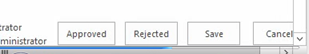
  

  

  
Of course, content types are a part of workflow tasks. Content types simply dictate the structure of the task list items. Equally important is the task list template, which has also changed in SharePoint 2013.
  
    
    
Prior to SharePoint 2013, the workflow task list used the same list template as the standard task list (ID = 107). It was a standard SharePoint task list that could also contain non-workflow tasks. But in SharePoint 2013 the approach is different in that it introduces a new type of a list. This list, called the hierarchy tasks list, introduces a timeline view at the top of the page to show the scheduling of tasks, as shown in Figure 2. Note that it also lets users view task dependencies.
  
    
    

**Figure 2. Hierarchy tasks list**

  
    
    

  
    
    
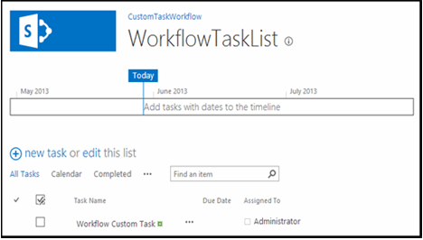
  
    
    

  
    
    

  
    
    

## Creating workflow task options in SharePoint 2013

Both SharePoint Designer 2013 and Visual Studio 2012 provide workflow authors two ways to create workflow tasks. One is to create a single task that is assigned to a person or a group. The other is to create a task and assign it to multiple people. When creating a single task in a custom workflow using Visual Studio 2012, use the **SingleTask** activity. By using this activity, you can modify the properties either in the **Properties** tool window, or with the wizard, as shown in Figure 3.
  
    
    

**Figure 3. Single-task wizard**

  
    
    

  
    
    
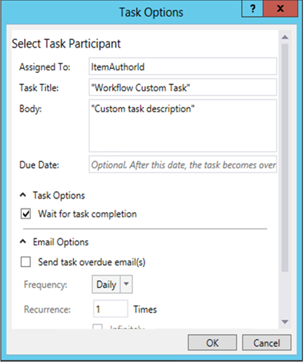
  
    
    
SharePoint lets you specify whether multiple tasks should run serially or in parallel, as well as specifying the criteria for task completion. Should SharePoint wait for all tasks to be completed, or for a percentage of them to be completed with a specific outcome? To create multiple tasks in Visual Studio 2012, use the **CompositeTask** activity, whose wizard and properties resemble the **SingleTask** activity, as shown in Figure 4.
  
    
    

**Figure 4. Composite task wizard**

  
    
    

  
    
    
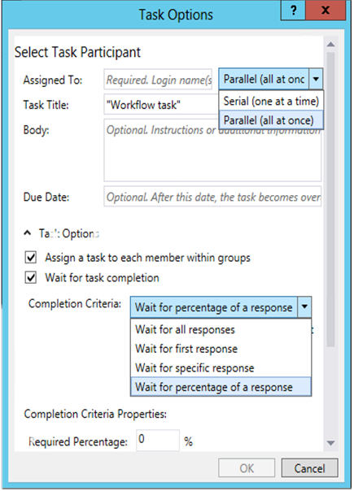
  
    
    

  
    
    

  
    
    

## How to: Create and assign tasks in custom workflows

Following is a walkthrough that demonstrates how to create and assign tasks in a custom workflow. Before starting, make sure that you have access to a SharePoint 2013 developer site.
  
    
    

### 1. Create a new SharePoint 2013 app project


1. Create a new SharePoint 2013 app project and configure the project as a SharePoint-hosted add-in.
    
  
2. To the project, add a new **Announcement** list instance to the project. This will be used as the container for items used to test the workflow.
    
  
3. Add a workflow item the project by right-clicking the project icon in **Solution Explorer** and selecting **Add**, followed by **New Item**.
    
  
4. In the **Add New Item** dialog box, select the **Workflow** project item from the **Office/SharePoint** category and name it "CustomTaskWorkflow", and then click **Next**.
    
  

### 2. Collect information on the New Announcement item

We are going to create a task in our workflow and assign it to the person who created the announcement list item that kicks off the workflow. The list item itself will provide the information to the workflow. We will use a **LookupSPListItemProperties** activity, which returns a dynamic value from the REST web service that it calls in SharePoint. We're then going to store this value in a new variable named **AnnouncementItemProperties**, whose data type we will change to **DynamicValue**.
  
    
    

1. Create an **AnnouncementItemAuthorId** variable to store the ID of the person who created the list item, as shown in Figure 5.
    
   **Figure 5. LookupSPListItemProperties activity**

  

  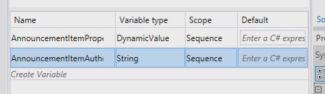
  

  

  
2. Drop the **LookupSPListItem** activity onto the workflow design surface and set the **ListID** property to _(current list)_.
    
  
3. Set the **ItemId** to _(current item)_.
    
  
4. Set the **Result** output to the **AnnouncementItemProperties** variable that we created earlier.
    
  
5. To get the author of the item from the variable, click the **Get Properties** link in the **LookupSPListItem** activity and add a **GetDynamicValueProperties** activity to the design surface. Set its **Source** property to the output of the **LookupSPListItem** activity.
    
  
6. Click the **[…]** button on the **Properties** property to bring up the **Properties** dialog box.
    
  
7. In the **Properties** dialog box, change the **Entity Type** to **List Item of Announcements**, as shown in Figure 6.
    
  
8. Assign the **Created By** path to the variable **AnnouncementItemAuthorId**, as shown in Figure 6.
    
   **Figure 6. Properties dialog**

  

  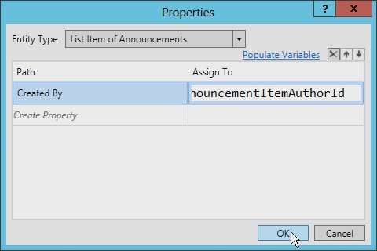
  

  

  

### 3. Create and Assign the task

At this point we can create and assign the task to the author of the announcement item.
  
    
    

1. From the toolbox, add a **SingleTask** activity to the workflow design surface.
    
  
2. Click the **Configure** link in the activity to open the **Task Options** dialog box.
    
  
3. Set the **Assigned To** property to the variable used to store the author identifier.
    
  
4. Modify the title and body of the task, as shown in Figure 7.
    
   **Figure 7. Task Options dialog**

  

  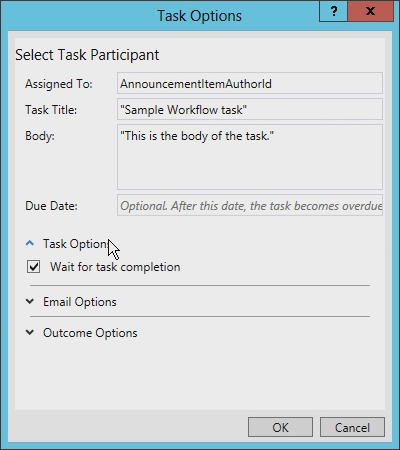
  

  

  
There are several other options that can be set in the **Task Options** dialog box. For example, you can set the workflow to wait for the task to complete by simply checking the box (see Figure 7). Previous versions of SharePoint workflows required a difficult workaround to accomplish this.
  
    
    
Notice in Figure 8 the email options that you can set. Among other options, you can ensure that email messages are sent whenever the task is overdue as well as specifying how often the reminders are sent. 
  
    
    

**Figure 8. Email Options settings**

  
    
    

  
    
    
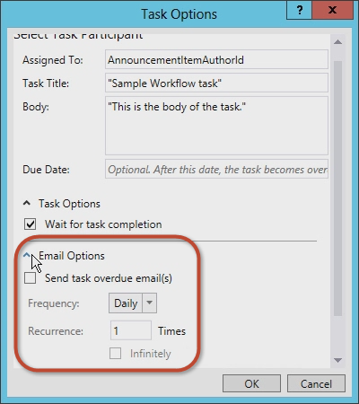
  
    
    
You can also set the task outcome options. You can select the workflow task content type, the **Outcome Field**, and the **Default Outcome**, as shown in Figure 9.
  
    
    

**Figure 9. Outcome Options settings**

  
    
    

  
    
    
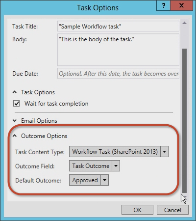
  
    
    

  
    
    

  
    
    

### 4. Examine and modify the task properties

Once you have accepted values in the **Task Options** dialog box, select the **SingleTask** activity and then inspect the **Properties** property grid (see Figure 10).
  
    
    

**Figure 10. Properties tool window**

  
    
    

  
    
    
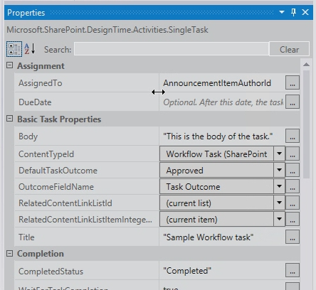
  
    
    
Using the **Properties** property grid, you can specify whether you want the task to wait for completion before proceeding, and you can configure the email messages that the task generates, including the initial assignment email message, the overdue email message, and the task cancellation email message.
  
    
    
Notice that the **Outcome** property automatically created a variable named **outcome_0** for the task. To see what is contained in this variable, add a **WriteToHistory** activity on the design surface and update the message to write out the result, as shown in Figure 11.
  
    
    

**Figure 11. Outcome property value**

  
    
    

  
    
    
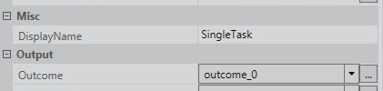
  
    
    

  
    
    

  
    
    

### 5. Test the workflow

To test the workflow, do the following:
  
    
    

1. Press **F5** to build and run, or click the **Start** button in Visual Studio 2012. If you are testing in an on-premises installation of SharePoint 2013, Visual Studio 2012 starts the Workflow Manager Test Service Host utility and deploys the workflow to the developer site. After a moment, the developer site opens.
    
  
2. Navigate to the **Announcements** list and create a list item, then start the custom workflow manually.
    
  
3. Return to the workflow instance status page to find the task that was created by the workflow. Click on the task to see the form. Note the **Task Name** and **Assigned To** fields that were defined in the workflow, as shown in Figure 12.
    
   **Figure 12. Task form**

  

  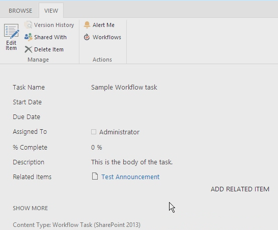
  

  

  
4. Finally, return to the task, edit the form, and then click the **Approve** or **Reject** to complete the task. Notice that the result of the task is shown in the **Workflow History** list for the workflow instance, as shown in Figure 13.
    
   **Figure 13. Workflow History list**

  

  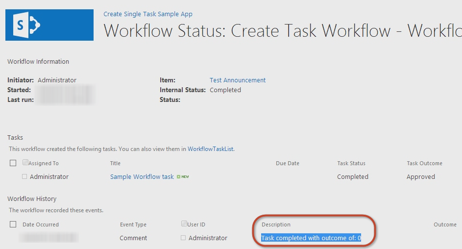
  

  

  

## How to: Create a custom task type with a custom outcome

The previous walkthrough demonstrated how to create a simple task and configure its properties. However, sometimes the default options may not meet your needs. For example, consider a task that asks someone to review a document. Upon reviewing the draft document, the reviewer should exercise one of two options: send the draft document back to the author for revision, or forward the document to the editor. Unfortunately, neither of the default options ( **Approved** and **Rejected**) meets the reviewers needs. More appropriate options would be "Return to Author" and "Proceed to Editor".
  
    
    
When creating workflows using either SharePoint Designer 2013 or Visual Studio 2012 you can create custom workflow tasks that include custom task outcomes. To do this, you create a custom task as a special content type and then add a custom site column that defines the outcomes you desire. You can derive the custom column from the field type called **OutcomeChoice**, which is a choice field.
  
    
    
This approach can pose a challenge, however, in that the content type that the custom task is derived from is the **Workflow Task (SharePoint 2013)** content type, which includes the default **TaskOutcome** site column that contains the **Approved** and **Rejected** options. However, you can work around the default setting by removing the **TaskOutcome** column from the custom task content type and ensure it is not present in the workflow task list. Otherwise, it would result in showing multiple options. For example, consider a custom outcome that had two options, "Red Pill" and "Blue Pill." If the default outcome is not removed, then the users completing the task would be presented with all available outcome options, as shown in Figure 14, even if those outcome options do not apply.
  
    
    

**Figure 14. Outcome options**

  
    
    

  
    
    
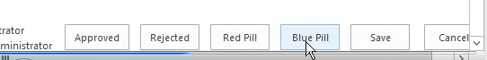
  
    
    
As a best practice, you want to create a different workflow task list for each type of task that you create. 
  
    
    

### Create a SharePoint 2013 app project

To begin the walkthrough for creating a custom workflow task using Visual Studio 2012, you first want to ensure that you have access to a SharePoint 2013 developer site. 
  
    
    

1. In Visual Studio 2012, create a new SharePoint 2013 app project that is configured as a SharePoint-hosted add-in.
    
  
2. To the project, add a new **Announcement** list instance. You will use this as the container for items used to test the workflow.
    
  
3. Next, add a workflow item the project by right-clicking the project icon in the **Solution Explorer** and selecting **Add**, followed by **New Item**.
    
  
4. In the **Add New Item** dialog box, select the **Workflow** project item from the **Office/SharePoint** category and name it "CustomTaskWorkflow"; then click **Next**.
    
  

### Create the custom outcome column

Once we have the **Announcements** list created, we next want to create the custom content type that will contain the custom task and the site column for the custom outcome field.
  
    
    

1. Right-click the project and select **Add**, followed by **New Item**.
    
  
2. Now choose the **Site Column** project item template and set the name of this field to "CustomOutcomeColumn". Within the template for the site column there are a few changes that need to be made.
    
  
3. Set the field type of the column to **OutcomeChoice**, which is the required field type for an outcome column.
    
  
4. Remove the **Required** column.
    
  
5. Next, because the **OutcomeChoice** field type is based on the choice field type, add a few choices of your own.
    
  
The new custom site column markup should now look like the following:
  
    
    


```XML

<?xml version="1.0" encoding="utf-8"?>
<Elements xmlns="http://schemas.microsoft.com/sharepoint/">  
  <Field
       ID="{7b7edd9e-f5d1-4558-a2c8-e733dcfb0a5e}"
       Name="CustomSiteColumn"
       DisplayName="Better State"
       Type="Choice"
       Required="FALSE"
       Group="Custom Site Columns">
       <CHOICES>
         <CHOICE>Florida</CHOICE>
         <CHOICE>Georgia</CHOICE>
       </CHOICES>
       <Default>Florida</Default>
  </Field>
</Elements>
```


### Create a custom task content type

After creating the site column, the next step is to create a specialized content type for the custom task.
  
    
    

1. Add a new content type project item to the project with the name **CustomTaskContentType**.
    
  
2. When prompted to select which content type this is based on, select the **Workflow Task (SharePoint 2013)** content type.
    
  
3. Next, add the custom outcome column to the list of available columns and also remove the default outcome column so the markup of the content type looks like the following example.
    
```XML
  
<?xml version="1.0" encoding="utf-8"?>
<Elements xmlns="http://schemas.microsoft.com/sharepoint/">
  <!-- Parent ContentType: Workflow Task (SharePoint 2013) (0x0108003365C4474CAE8C42BCE396314E88E51F) -->
  <ContentType 
      ID="0x0108003365C4474CAE8C42BCE396314E88E51F00D368DFB2B31A447BB184BA1334E5119E" 
      Name="CustomContentType" 
      Group="Custom Content Types" 
      Description="My Content Type" 
      Inherits="TRUE" Version="0">
      <FieldRefs>
         <FieldRef 
            ID="{7b7edd9e-f5d1-4558-a2c8-e733dcfb0a5e}" 
            DisplayName="Better State" 
            Required="FALSE" 
            Name="CustomSiteColumn" />
            <RemoveFieldRef 
               ID="{55B29417-1042-47F0-9DFF-CE8156667F96}" 
               Name="TaskOutcome" />
      </FieldRefs>
  </ContentType>
</Elements>
```


### Create a workflow

Now we create a workflow so we can test the custom site column and content type. 
  
    
    

1. Add a workflow to our project configure it to be a list workflow.
    
  
2. Create an association with this workflow using the **Announcements** list that we created earlier.
    
  
3. Create a new variable of type **DynamicValue** and name it "ItemProperties"; we are going to use this variable to store the item that kicks off the workflow's properties.
    
  
4. Create an **Int32** variable and name it "ItemAuthorId", as shown in Figure 15.
    
   **Figure 15. Creating a workflow variable**

  

  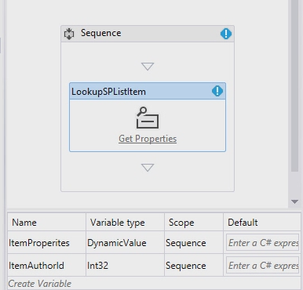
  

  

  

### Collect the list item properties

Now we collect the list item properties.
  
    
    

1. Drop the **LookupSPListItem** activity onto the design surface and set the **ListID** property to _(current list)_ and the **ItemId** property to _(current item)_. 
    
  
2. Now set the **Result** output to the **ItemProperties** **DynamicValue** variable that we created a moment ago.
    
  
3. To get the author of the item from the variable, click the **Get Properties** link in the **LookupSPListItem** activity and add a **GetDynamicValueProperties** activity on the design surface.
    
  
4. Set the item's **Source** property to the output of the **LookupSPListItem** activity automatically.
    
  
5. Click the **[…]** button on the **Properties** property to display the **Properties** dialog box.
    
  
6. Change the **Entity Type** to **List Item of Announcements** to give the dialog box a context and assign the **Created By** path to the variable **ItemAuthorId**, as shown in Figure 16.
    
   **Figure 16. Properties dialog**

  

  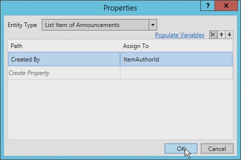
  

  

  

### Create a single task

Now we can create the single task. 
  
    
    

1. Add a **SingleTask** activity to the design surface.
    
  
2. Click the **Configure** link in the activity to open the **Task Options** dialog box.
    
  
3. Set the **Body** field to some string (it doesn't matter what), then set the **Assigned To** property to the variable you are using to store the author identifier (in our case, **ItemAuthorId**).
    
  
4. Change the title of the task, as shown in Figure 17.
    
   **Figure 17. Task Title setting**

  

  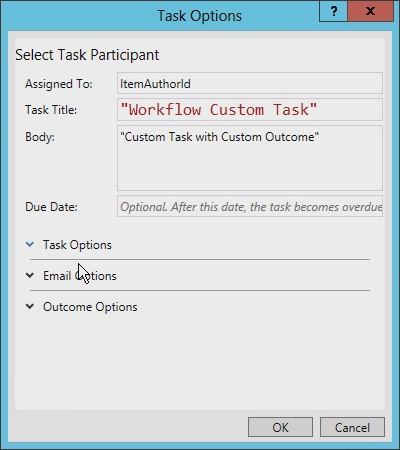
  

  

  
5. Finally, set the **Outcome Options** to use the new custom content type and custom outcome column.
    
    The dialog box determines what is available by looking at all the content types that are derived from the **Workflow Task (SharePoint 2013)** content type, as shown in Figure 18.
    

   **Figure 18. Outcome Options settings**

  

  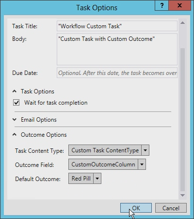
  

  

  

### Update the AssignedTo field

Before we go any further, we need to update the **AssignedTo** field on the **SingleTask** activity because it is expecting a string, not an integer. To remedy this, add **ToString()** to the end of the expression.
  
    
    
Also, notice that the **Outcome** property automatically created a variable named **outcome_0**. To see what is in this variable, add a **WriteToHistory** activity on the design surface and update the message to write out the result.
  
    
    

### Update the workflow task list

The final step is to configure the workflow task list. By default, the task list that the app creates only accepts the content type **Workflow Task (SharePoint 2013)**. This workflow uses a custom content type for the custom outcome. Open the  `Elements.xml` file for the workflow task list and change the **<ContentTypeBinding>** element's **ContentTypeId** attribute to match the content type in the project, as shown in the code example following.
  
    
    

```XML

<?xml version="1.0" encoding="utf-8" ?>
<Elements xmlns="http://schemas.microsoft.com/sharepoint/">
  <ListInstance 
      FeatureId="{f9ce21f8-f437-4f7e-8bc6-946378c850f0}"
      TemplateType="171"
      Title="WorkflowTaskList"
      Description="This list instance is used for workflow Task items."
      Url="Lists/WorkflowTaskList"
      RootWebOnly="FALSE" />
  <!-- CustomContentType -->
  <ContentTypeBinding 
      ListUrl="Lists/WorkflowTaskList"
      RootWebOnly="FALSE"
      ContentTypeId="0x0108003365C4474CAE8C42BCE396314E88E51F00D368DFB2B31A447BB184BA1334E5119E"/>
</Elements>
```


### Test the custom content task with a custom task outcome

Now let's test the workflow. 
  
    
    

1. In Visual Studio 2012, press **F5** or click the **Start** button. If testing in an on-premises local install of SharePoint 2013, Visual Studio 2012 will start the Workflow Manager Test Service Host utility and deploy the workflow to the developer site. After a moment, the developer site will open.
    
  
2. Navigate to the **Announcements** list and create a new item. After creating the item, start the custom workflow manually.
    
  
3. Next, return to the workflow instance's status page to find the task that was created by the workflow.
    
  
4. Click on the task and, using the **Edit** button in the ribbon, switch to edit mode. At the bottom of the form there should be four buttons. The first two buttons are the custom outcome buttons that, when pressed, will mark the task as complete. The second two buttons are the default **Save** and **Cancel** buttons that simply update the list item without completing the task, as shown in Figure 19.
    
   **Figure 19. Custom outcome buttons**

  

  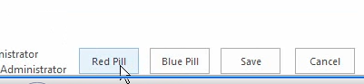
  

  

  

## Conclusion

Microsoft introduced workflows into the SharePoint 2007 platform, and they remained mostly unchanged in SharePoint 2010 in architecture, implementation, or process. This was also true for tasks in SharePoint workflows. However, SharePoint 2013 has introduced many changes to workflows in architecture and implementation.
  
    
    
This article discussed the changes related to workflow tasks that were driven from changes to the workflow story in SharePoint 2013. It demonstrated how to create a simple workflow that leveraged tasks in SharePoint 2013 using Visual Studio 2012. These types of tasks are suitable for many developers, although at times custom tasks and custom outcomes are desired, which can be accomplished using Visual Studio 2012 as has been shown.
  
    
    

## Additional resources
<a name="bk_addresources"> </a>


-  [Workflows in SharePoint 2013](http://msdn.microsoft.com/en-us/library/jj163986.aspx)
    
  
-  [Authorization and authentication for apps in SharePoint 2013](http://msdn.microsoft.com/en-us/library/office/fp142384.aspx)
    
  
-  [How To Customize a List View in Apps for SharePoint Using Client-Side Rendering](http://msdn.microsoft.com/en-us/library/jj220045.aspx)
    
  

