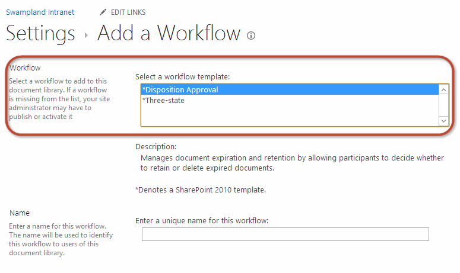
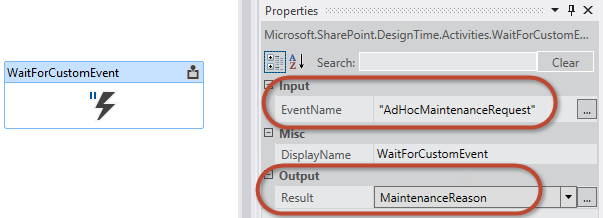

# Working with the SharePoint 2013 Workflow Services Client Side Object Model
Demonstrates how to use the SharePoint 2013 client-side object model (CSOM) API to create and control Workflow Manager 1.0 workflow definitions and instances. 
 **Provided by:** [Andrew Connell](http://social.msdn.microsoft.com/profile/andrew%20connell%20%5bmvp%5d/),  [AndrewConnell.com](http://www.andrewconnell.com)
  
    
    


## Working with the SharePoint 2013 Workflow Services Client Side Object Model

The implementation of workflows in SharePoint 2007 and SharePoint 2010 remained largely the same from version to version. Microsoft did add some new functionality in SharePoint 2010, such as the ability to associate workflows with sites, and improved the workflow authoring tools, SharePoint Designer 2010 and Visual Studio 2010, from their predecessors. However, the implementation of workflow tasks, workflow forms, and the workflow server-side APIs remains largely unchanged. 
  
    
    
In SharePoint 2010, Microsoft introduced features and capabilities that encouraged customers to move their customizations into sandboxed solution. These would run in an isolated process and were friendly to both types of SharePoint deployments: on-premises, where the SharePoint was installed on company servers and maintained by the company , and to the cloud, or more specifically, Office 365. 
  
    
    
In SharePoint 2013, Microsoft added even more capabilities; these updates were oriented toward cloud deployments. Specifically, Microsoft introduced the new SharePoint app model, which went further than the sandboxed solution in that, unlike sandboxed solution, they explicitly blocked server-side code from running in the SharePoint process. Microsoft also built up existing technologies in SharePoint, such as the client-side object model (CSOM), and introduced new capabilities, like support for app identities using  [OAuth](http://msdn.microsoft.com/library/office/fp142382.aspx).
  
    
    
And then, with the introduction of SharePoint Server 2013, Microsoft introduced an entirely new workflow architecture and platform that reflect fundamental shifts in the product direction. 
  
    
    
The most prominent change in the new architecture is that workflow execution in SharePoint Server 2013 no longer takes place in SharePoint. Instead, SharePoint Server 2013 uses a completely new execution engine: Workflow Manager 1.0. Workflow Manager hosts the Windows Workflow Foundation runtime and all the necessary services required by Windows Workflow Foundation. When a workflow is published, or a new instance of a published workflow is started, SharePoint notifies Workflow Manager, which in turn processes the workflow episodes. When the workflow access information in SharePoint, such as list item properties or user properties, it authenticates using the OAuth support and communicates over new and improved REST APIs.
  
    
    
These changes in the workflow architecture had significant impacts in certain areas, such as custom workflow forms, as discussed in the MSDN article How to: Create Custom SharePoint Server 2013 Workflow Forms with Visual Studio 2012. This article touches on one of the things that Microsoft added to SharePoint 2013 to support the new style of creating custom workflow forms: the improvements to the CSOM and addition of the Workflow Services CSOM API.
  
    
    

## Introduction to the Workflow Services CSOM API in SharePoint 2013

In SharePoint 2007 and SharePoint 2010, the workflow API was manifested only in the server-side object model. In SharePoint 2013, this same workflow API is still present, since SharePoint 2013 includes the old workflow execution engine in SharePoint for backward compatibility. 
  
    
    
However, the new and preferred workflow architecture introduced with SharePoint 2013 that uses Workflow Manager includes a brand new server-side API. In SharePoint 2013, Microsoft extended the CSOM to include a robust API for the new workflow architecture. Note that this addition to the CSOM only applies to the new SharePoint 2013 and Workflow Manager 1.0 workflow architecture, not the legacy version that is still hosted by SharePoint.
  
    
    
The Workflow Services CSOM API, like the rest of the CSOM, is implemented both in a .NET Silverlight managed API and a JavaScript API known as the JavaScript Object Model (JSOM). JSOM is what developers must use when creating custom workflow forms as those forms will be ASP.NET web forms that must not have any server-side code. Thus the Workflow Services JSOM API is used in custom association forms to create workflow associations as well as on initiation forms to start new workflow instances.
  
    
    
However, the possibilities do not stop there. The Workflow Services CSOM and JSOM is very robust and enables developers to do almost anything with workflows in SharePoint 2013. Aside from creating workflow associations and instances, developers can also programmatically deploy new workflow definitions and even communicate with running workflow instances from the CSOM and JSOM, as is discussed in the remainder of this article.
  
    
    
This article focuses on the topic of workflow forms in the context of SharePoint Sever 2013. It is based on the SharePoint Server 2013 with the March 2013 Public Update applied and Office Developer Tools for Visual Studio 2013. Everything in this article applies to both SharePoint Server 2013 on-premises deployments as well as Office 365.
  
    
    

## Workflow Services CSOM and JSOM API components

This article focuses on the Workflow Services CSOM API and thus, by extension, the JSOM API as well; the server side Workflow Services API is not discussed here. The Workflow Services CSOM consists of several different services that are used to perform different tasks. Each of these is discussed in the following sections. 
  
    
    

> **Note:**
> There is one additional service that is not present in the CSOM, but is present instead with the server-side API. This is the Messaging Service, which is used to manage message queuing and message transport. 
  
    
    

To work with the Workflow Services CSOM and JSOM APIs, developers must add the necessary references to their projects (in the case of CSOM) and pages (in the case of JSOM). Both implementations have the same requirements:
  
    
    

- Reference the core SharePoint 2013 CSOM and JSOM libraries:
    
  - Microsoft.SharePoint.Client.dll
    
  
  - Microsoft.SharePoint.Client.Runtime.dll
    
  
  - Microsoft.SharePoint.Client.WorkflowServices.dll
    
  

- Reference the Workflow Services CSOM and JSOM libraries:
    
  - SP.js
    
  
  - SP.Runtime.js
    
  
  - SP.WorkflowServices.js
    
  

### Workflow Service Manager

The gateway to all services included in the Workflow Services CSOM API is the Workflow Service Manager. This object is what developers use to obtain instances to all the other services described in the following sections. Similar to other CSOM API implementations, the  [WorkflowServicesManager](https://msdn.microsoft.com/library/Microsoft.SharePoint.WorkflowServices.WorkflowServicesManager.aspx) has a dependency on the core SharePoint 2013 CSOM and, therefore, you must pass in a valid client context and reference to the SharePoint site you want to connect to, as shown in the following CSOM and JSOM code examples.
  
    
    

#### CSOM: Creating a WorkflowServicesManager instance


```

var clientContext = new ClientContext(siteCollectionUrl);
var workflowServicesManager = new WorkflowServicesManager(clientContext, clientContext.Web); 

```


#### JSOM: Creating a WorkflowServicesManager instance


```

var clientContext = SP.ClientContext.get_current();
var workflowServicesManager = SP.WorkflowServices.WorkflowServicesManager.newObject(context, context.get_web()); 

```


### Deployment service

When you create custom workflows using Visual Studio 2012, either using a solution package (*.wsp) or as a SharePoint app (*.app), you are creating workflow definitions. A definition is the workflow process and all business rules and attributes defined within it, such as the location of custom association and initiation forms. On their own, these definitions are not very useful because they cannot be run outside the context of an association with a site, list, or document library. The workflow definitions published and available in a site can be found by going to the page where a new workflow association can be created, as shown in the following figure.
  
    
    

**Figure 1. Add a workflow association**

  
    
    

  
    
    

  
    
    
The collection of published workflow definitions is accessible through the deployment service. This service enables you to get a list of all currently saved and published definitions on the site, as well as to publish both saved and new definitions, remove existing definitions, and determine what workflow actions are available to SharePoint Designer 2013-authored workflows.
  
    
    
The **WorkflowDeploymentService** object is available through the **WorkflowServicesManager** class, as shown in the following code examples.
  
    
    

#### CSOM: Obtaining a WorkflowDeploymentService instance


```

var clientContext = new ClientContext(siteCollectionUrl);
var workflowServicesManager = new WorkflowServicesManager(clientContext, clientContext.Web);
var workflowDeploymentService = workflowServicesManager.GetWorkflowDeploymentService(); 

```


#### JSOM: Obtaining a WorkflowDeploymentService instance


```

var clientContext = SP.ClientContext.get_current();
var workflowServicesManager = SP.WorkflowServices.WorkflowServicesManager.newObject(context, context.get_web()); 
var workflowDeploymentService = workflowServicesManager.getWorkflowDeploymentService();

```


### Subscription service

Recall from the previous section that you create workflows and publish them to SharePoint as definitions. To use these definitions, a user must create an association that links the definition to a specific SharePoint site, list, or document library along with additional metadata. This process basically works and behaves the same way in SharePoint 2010 but the implementation in SharePoint 2013 is very different. Workflow Manager 1.0 takes advantage of an instance of Microsoft Azure Service Bus 1.0.
  
    
    
Service Bus is instrumental because it supports the publication and subscription service (also known as PubSub). This is an asynchronous messaging framework that supports a publisher sending a message to a topic stored in Service Bus. Any number of subscribers can request to be notified when a message is published to that topic that meets specific criteria. 
  
    
    
SharePoint 2013 and Workflow Manager 1.0 use the PubSub model to create associations. Workflow associations are created as subscriptions on topics. For instance, an association for workflow definition may be created on list and set to start automatically when items are added to the list. When an item is added to the list, SharePoint publishes an event to Workflow Manager 1.0, which it sends to the Service Bus topic. The message is evaluated and the registered subscriptions are notified of the event. The subscribed association is found and the workflow is started. For more information about how this process works, see the MSDN article,  [SharePoint 2013 workflow fundamentals](sharepoint-workflow-fundamentals.md). 
  
    
    
This should clarify, then, why workflow associations are now called subscriptions within the API (that is, under the covers). You can use a Subscription Service in the Workflow Services CSOM to explore existing associations and subscriptions, create and delete associations and subscriptions, and request to be notified of events.
  
    
    
The  [WorkflowSubscriptionService](https://msdn.microsoft.com/library/Microsoft.SharePoint.WorkflowServices.WorkflowSubscriptionService.aspx) object is available through the **WorkflowServicesManager** class, as shown in the following code examples.
  
    
    

#### CSOM: Obtaining a WorkflowSubscriptionService instance


```

var clientContext = new ClientContext(siteCollectionUrl);
var workflowServicesManager = new WorkflowServicesManager(clientContext, clientContext.Web);
var workflowSubscriptionService = workflowServicesManager.GetWorkflowSubscriptionService();

```


#### JSOM: Obtaining a WorkflowSubscriptionService instance


```

var clientContext = SP.ClientContext.get_current();
var workflowServicesManager = SP.WorkflowServices.WorkflowServicesManager.newObject(context, context.get_web()); 
var workflowSubscriptionService = workflowServicesManager.getWorkflowSubscriptionService();

```


### Instance service

The final service that we'll cover is the instance service. You can use this service to perform several tasks with workflow instances, such as starting, suspending, resuming, terminating, and cancelling workflow instances. You can also use it to collect debug information, as well as enumerate through all currently running workflows, as well as those that have already completed. Finally, you can use this service to publish events to workflows that are currently running, as we'll see later in this article.
  
    
    
The  [WorkflowInstanceService](https://msdn.microsoft.com/library/Microsoft.SharePoint.WorkflowServices.WorkflowInstanceService.aspx) object is available through the **WorkflowServicesManager** class, as shown in the following code examples.
  
    
    

#### CSOM: Obtaining a WorkflowInstanceService instance


```

var clientContext = new ClientContext(siteCollectionUrl);
var workflowServicesManager = new WorkflowServicesManager(clientContext, clientContext.Web);
var workflowInstanceService = workflowServicesManager.GetWorkflowInstanceService();

```


#### JSOM: Obtaining a WorkflowInstanceService instance


```

var clientContext = SP.ClientContext.get_current();
var workflowServicesManager = SP.WorkflowServices.WorkflowServicesManager.newObject(context, context.get_web()); 
var workflowInstanceService = workflowServicesManager.getWorkflowInstanceService();

```


### Interop service

In previous versions of SharePoint, specifically SharePoint 2007 and SharePoint 2010, SharePoint hosted the Windows Workflow Foundation runtime. As previously explained, Microsoft moved away from this approach in SharePoint 2013 by introducing a dependency on Workflow Manager 1.0, which hosts the workflow runtime outside of SharePoint. Consequently, workflows are no longer executed and managed within SharePoint; instead, SharePoint hands off workflow management and execution responsibilities to Workflow Manager 1.0.
  
    
    
However, to provide backward compatibility, Microsoft retained the legacy model of hosting pre-SharePoint 2013-style workflows within SharePoint by keeping the Windows Workflow Foundation runtime engine. Therefore, all workflows created in SharePoint 2010 will still run as expected in a SharePoint 2013 environment. In addition, Microsoft included a new activity, **InvokeSharePointWorkflow**, which can be used in a SharePoint 2013 workflow to start an existing workflow in the SharePoint 2010 workflow host that is included in SharePoint 2013. This allows you to take advantage of existing workflow investments migrated from previous versions.
  
    
    

> **Note:**
> The **InvokeSharePointWorkflow** activity is a wrapper for the CSOM method, [StartWorkflow](https://msdn.microsoft.com/library/Microsoft.SharePoint.Client.WorkflowServices.InteropService.StartWorkflow.aspx) .
  
    
    

The SharePoint 2013 Workflow Services CSOM also includes a special service that enables developers to interact with these legacy workflows. The  [InteropService](https://msdn.microsoft.com/library/Microsoft.SharePoint.Client.WorkflowServices.InteropService.aspx) lets you start and stop workflows, as well as enable and disable event notifications for running workflows.
  
    
    
The  [WorkflowDeploymentService](https://msdn.microsoft.com/library/Microsoft.SharePoint.Client.WorkflowServices.WorkflowDeploymentService.aspx) object is available through the **WorkflowServicesManager** class, as shown in the following CSOM and JSOM code examples.
  
    
    

#### CSOM: Obtaining an InteropService instance


```

var clientContext = new ClientContext(siteCollectionUrl);
var workflowServicesManager = new WorkflowServicesManager(clientContext, clientContext.Web);
var workflowInteropService = workflowServicesManager.GetWorkflowInteropService();

```


#### JSOM: Obtaining an InteropService instance


```

var clientContext = SP.ClientContext.get_current();
var workflowServicesManager = SP.WorkflowServices.WorkflowServicesManager.newObject(context, context.get_web()); 
var workflowInteropService = serviceManager.getWorkflowInteropService();

```


## Example: Workflow Services CSOM scenarios

The following sections demonstrate how to use the different services in the Workflow Services CSOM to perform common tasks in custom solutions. 
  
    
    

### Get all workflows installed

Most of the other services in the Workflow Services CSOM require that you get references to the workflow definition that was previously published. Workflow definitions are usually referenced by their IDs, which are GUIDs. 
  
    
    
To get a list of all the published workflow definitions, first get an instance of the deployment service by using the  [GetWorkflowDeploymentService](https://msdn.microsoft.com/library/Microsoft.SharePoint.Client.WorkflowServices.WorkflowServicesManager.GetWorkflowDeploymentService.aspx) method. Then, retrieve the collection of all workflow definitions by using the [EnumerateDefinitions(Boolean)](https://msdn.microsoft.com/library/Microsoft.SharePoint.Client.WorkflowServices.WorkflowDeploymentService.EnumerateDefinitions.aspx) method. Here is example code:
  
    
    


```

// connect to the workflow services via a CSOM client context
var clientContext = new ClientContext(siteCollectionUrl);
var workflowServicesManager = new WorkflowServicesManager(clientContext, clientContext.Web);

// connect to the deployment service 
var workflowDeploymentService = workflowServicesManager.GetWorkflowDeploymentService();

// get all installed workflows
var publishedWorkflowDefinitions = workflowDeploymentService.EnumerateDefinitions(true);
clientContext.Load(publishedWorkflowDefinitions);
clientContext.ExecuteQuery();

// display list of all installed workflows
foreach (var workflowDefinition in publishedWorkflowDefinitions) {
  Console.WriteLine("{0} - {1}", workflowDefinition.Id.ToString(), workflowDefinition.DisplayName);
}

```


### Get all associations and subscriptions

To start a new workflow instance, you need to first get a reference to an existing workflow association. Building on the previous code example, the following example demonstrates how to get a list of all workflow associations for a specific workflow definition in a site. 
  
    
    
Once you have obtained a workflow definition using the example above, use the  [GetWorkflowSubscriptionService](https://msdn.microsoft.com/library/Microsoft.SharePoint.Client.WorkflowServices.WorkflowServicesManager.GetWorkflowSubscriptionService.aspx) method to create an instance of the subscription service. Next, use the [EnumerateSubscriptionsByDefinition](https://msdn.microsoft.com/library/Microsoft.SharePoint.Client.WorkflowServices.WorkflowSubscriptionService.EnumerateSubscriptionsByDefinition.aspx) method (passing in the ID of a workflow definition) to get a list of all the associations that exist for the specified workflow. Note that there are several methods available for getting workflow associations, including the following:
  
    
    

-  [EnumerateSubscriptions](https://msdn.microsoft.com/library/Microsoft.SharePoint.Client.WorkflowServices.WorkflowSubscriptionService.EnumerateSubscriptions.aspx)
    
  
-  [EnumerateSubscriptionsByDefinition](https://msdn.microsoft.com/library/Microsoft.SharePoint.Client.WorkflowServices.WorkflowSubscriptionService.EnumerateSubscriptionsByDefinition.aspx)
    
  
-  [EnumerateSubscriptionsByEventSource](https://msdn.microsoft.com/library/Microsoft.SharePoint.Client.WorkflowServices.WorkflowSubscriptionService.EnumerateSubscriptionsByEventSource.aspx)
    
  
-  [EnumerateSubscriptionsByList](https://msdn.microsoft.com/library/Microsoft.SharePoint.Client.WorkflowServices.WorkflowSubscriptionService.EnumerateSubscriptionsByList.aspx)
    
  
The following code example demonstrates getting associations and subscriptions.
  
    
    


```

// connect to the workflow services via a CSOM client context
var clientContext = new ClientContext(siteCollectionUrl);
var workflowServicesManager = new WorkflowServicesManager(clientContext, clientContext.Web);

// connect to the deployment service
var workflowDeploymentService = workflowServicesManager.GetWorkflowDeploymentService();

// get all installed workflows
var publishedWorkflowDefinitions = workflowDeploymentService.EnumerateDefinitions(true);
clientContext.Load(publishedWorkflowDefinitions);
clientContext.ExecuteQuery();

// find the first workflow definition
var firstWorkflowDefinition = publishedWorkflowDefinitions.First();

// connect to the subscription service
var workflowSubscriptionService = workflowServicesManager.GetWorkflowSubscriptionService();

// get all workflow associations
var workflowAssociations = workflowSubscriptionService.EnumerateSubscriptionsByDefinition(firstWorkflowDefinition.Id);
clientContext.Load(workflowAssociations);
clientContext.ExecuteQuery();

foreach (var association in workflowAssociations) {
  Console.WriteLine("{0} - {1}",
    association.Id, association.Name);
}

```


### Creating a workflow association

Creating a new workflow association, which can also be referred to as a subscription, requires additional effort before actually publishing the association to SharePoint. This is because each subscription needs to have additional information, which is usually collected on the association page. This metadata includes the following:
  
    
    

- The ID of the workflow definition the association is based on.
    
  
- The ID of the SharePoint site, list or document library the workflow association is created on.
    
  
- The display name of the association. 
    
  
- The startup options (whether started manually or automatically when a list item is added or updated).
    
  
- The ID of the list that will store all history list messages for this association.
    
  
- The ID of the list that will store all tasks for this association.
    
  
- Optionally, a collection of any name/value pairs that should be sent to the workflow. These are the fields that are usually passed in from a custom association form.
    
  

### Creating a custom workflow association


1. To create a custom association, first use the  [GetWorkflowSubscriptionService](https://msdn.microsoft.com/library/Microsoft.SharePoint.Client.WorkflowServices.WorkflowServicesManager.GetWorkflowSubscriptionService.aspx) method to get a reference to the subscription service.
    

  
// connect to the deployment service
var workflowDeploymentService = workflowServicesManager.GetWorkflowDeploymentService();

// get all installed workflows
var publishedWorkflowDefinitions = workflowDeploymentService.EnumerateDefinitions(true);
clientContext.Load(publishedWorkflowDefinitions);
clientContext.ExecuteQuery();

// find the first workflow definition
var firstWorkflowDefinition = publishedWorkflowDefinitions.First();

// connect to the subscription service
var workflowSubscriptionService = workflowServicesManager.GetWorkflowSubscriptionService();


2. Create a new object instance of the  [WorkflowSubscription](https://msdn.microsoft.com/library/Microsoft.SharePoint.Client.WorkflowServices.WorkflowSubscription.aspx) class.
    
  
3. Set the required properties on the **WorkflowSubscription** object, as illustrated in the following code example. In the example, code comments explain each of the property settings. Note that some properties that are not relevant to CSOM workflow services have been left out for readability. These properties have been omitted:
    
1. **listId**. The ID of the list on which the association is created.
    
  
2. **historyListId**. The ID of the list that stores all history list messages for the association.
    
  
3. **taskListId**. The ID of the list that will store all tasks for the association.
    
  
4. Once created, the subscription must be published to SharePoint using the  [PublishSubscriptionForList](https://msdn.microsoft.com/library/Microsoft.SharePoint.Client.WorkflowServices.WorkflowSubscriptionService.PublishSubscriptionForList.aspx) method, as demonstrated in the following code example:
    

  
// create a new association / subscription
WorkflowSubscription newSubscription = new WorkflowSubscription(clientContext) {
  DefinitionId = firstWorkflowDefinition.Id,
  Enabled = true,
  Name = "New Workflow Association"
};


var startupOptions = new List<string>();
// automatic start
startupOptions.Add("ItemAdded");
startupOptions.Add("ItemUpdated");
// manual start
startupOptions.Add("WorkflowStart");

// set the workflow start settings
newSubscription.EventTypes = startupOptions;


// set the associated task and history lists
newSubscription.SetProperty("HistoryListId", workflowHistoryListId.ToString());
newSubscription.SetProperty("TaskListId", workflowTaskListId.ToString());

// OPTIONAL: add any association form values
newSubscription.SetProperty("Prop1","Value1");
newSubscription.SetProperty("Prop2","Value2");

// create the association
workflowSubscriptionService.PublishSubscriptionForList(newSubscription, listId);
clientContext.ExecuteQuery();


### Get all workflow instances

You can also use the Workflow Services instance service to view all workflow instances that are running on a SharePoint site, list, or document library. The instance object that is returned contains information on the instance, such as when it was last updated, the current status, and any errors that may have occurred when it ran previously. Additionally, it provides a collection of name/value pairs that were submitted to the workflow from the custom initiation form.
  
    
    
To do this, start by using the  [GetWorkflowInstanceService](https://msdn.microsoft.com/library/Microsoft.SharePoint.Client.WorkflowServices.WorkflowServicesManager.GetWorkflowInstanceService.aspx) method to get a reference to the instance service. Note that the [WorkflowInstanceService](https://msdn.microsoft.com/library/Microsoft.SharePoint.Client.WorkflowServices.WorkflowInstanceService.aspx) provides several methods for obtaining the collection of running workflow instances:
  
    
    

-  [Enumerate](https://msdn.microsoft.com/library/Microsoft.SharePoint.Client.WorkflowServices.WorkflowInstanceService.Enumerate.aspx) . Accepts a workflow association (that is, a subscription) as a parameter, and can be used to get all the instances that have been created based on the specified association.
    
  
-  [EnumerateInstancesForSite](https://msdn.microsoft.com/library/Microsoft.SharePoint.Client.WorkflowServices.WorkflowInstanceService.EnumerateInstancesForSite.aspx) : Gets a list of all workflow instances that have been started on the SharePoint site that was set when creating the original **WorkflowServiceManager** object.
    
  
-  [EnumerateInstancesForListItem](https://msdn.microsoft.com/library/Microsoft.SharePoint.Client.WorkflowServices.WorkflowInstanceService.EnumerateInstancesForListItem.aspx) . Accepts a list ID and item ID; use this method to get all workflow instances that have been created on a specific list item.
    
  
Each of theses methods also has an alternate ***WithOffset()** method (for example, [EnumerateWithOffset](https://msdn.microsoft.com/library/Microsoft.SharePoint.Client.WorkflowServices.WorkflowInstanceService.EnumerateWithOffset.aspx) ). These alternative methods allow you to get a subset of the workflow instances in cases where working with the entire collection would be cumbersome. To get a count of the number of workflow instances, use the [CountInstances](https://msdn.microsoft.com/library/Microsoft.SharePoint.Client.WorkflowServices.WorkflowInstanceService.CountInstances.aspx) method, or the [CountInstancesWithStatus](https://msdn.microsoft.com/library/Microsoft.SharePoint.Client.WorkflowServices.WorkflowInstanceService.CountInstancesWithStatus.aspx) method.
  
    
    
The following code example illustrates getting workflow instances:
  
    
    


```

// connect to the instance service
var workflowInstanceService = workflowServicesManager.GetWorkflowInstanceService();

// get all instances
var workflowInstances = workflowInstanceService.EnumerateInstancesForListItem(listId, listItemId);
foreach (var instance in workflowInstances)
{
  Console.WriteLine("{0} - {1} - {2}",
                    instance.Id.ToString(),
                    instance.LastUpdated,
                    instance.Status.ToString());
}
```


### Start a workflow instance

Starting a new instance of a workflow association involves repeating many of the steps that have been demonstrated in the previous examples. To start a workflow on an item in a list or document library, first obtain a reference to the workflow association and the ID of the item in the list. A collection of name/value pairs of information can be sent to the workflow when it is started. This happens when there is a custom initiation form that is used to collect data from the user starting the workflow. Then pass in a collection, even if it is an empty collection, when starting the workflow or the workflow will fail to start and return an error.
  
    
    
Building from previous examples, use the  [GetWorkflowInstanceService](https://msdn.microsoft.com/library/Microsoft.SharePoint.Client.WorkflowServices.WorkflowServicesManager.GetWorkflowInstanceService.aspx) method to get an instance of the workflow instance service. Next, start the workflow by calling one of two methods. One starts workflows on a site, while the other starts a workflow on a list item.
  
    
    

-  [StartWorkflow](https://msdn.microsoft.com/library/Microsoft.SharePoint.Client.WorkflowServices.WorkflowInstanceService.StartWorkflow.aspx) . Starts a workflow on the SharePoint site that was set when creating the original [WorkflowServicesManager](https://msdn.microsoft.com/library/Microsoft.SharePoint.Client.WorkflowServices.WorkflowServicesManager.aspx) object. When using this method, you must pass in the workflow association and any additional startup properties present on the initiation form.
    
  
-  [StartWorkflowOnListItem](https://msdn.microsoft.com/library/Microsoft.SharePoint.Client.WorkflowServices.WorkflowInstanceService.StartWorkflowOnListItem.aspx) . Starts a workflow on a specific list item. Using this method requires you to pass in the ID of the desired list item, in addition to other parameter values required by the **StartWorkflow** method.
    
  
The following code example demonstrates how to start a workflow instance.
  
    
    


```

// connect to the deployment service
var workflowDeploymentService = workflowServicesManager.GetWorkflowDeploymentService();

// get all installed workflows
var publishedWorkflowDefinitions = workflowDeploymentService.EnumerateDefinitions(true);
clientContext.Load(publishedWorkflowDefinitions);
clientContext.ExecuteQuery();

// find the first workflow definition
var firstWorkflowDefinition = publishedWorkflowDefinitions.First();

// connect to the subscription service
var workflowSubscriptionService = workflowServicesManager.GetWorkflowSubscriptionService();

// get all workflow associations
var workflowAssociations = workflowSubscriptionService.EnumerateSubscriptionsByDefinition(firstWorkflowDefinition.Id);
clientContext.Load(workflowAssociations);
clientContext.ExecuteQuery();

// find the first association
var firstWorkflowAssociation = workflowAssociations.First();

// connect to the instance service
var workflowInstanceService = workflowServicesManager.GetWorkflowInstanceService();

// start the workflow
var startParameters = new Dictionary<string, object>();
workflowInstanceService.StartWorkflowOnListItem(firstWorkflowAssociation, listItemId, startParameters);
clientContext.ExecuteQuery();

```


### Publishing messages and events to running workflows

Another powerful feature that was added in SharePoint 2013 is the ability to publish custom events to running workflow instances. These workflows can have an activity, **WaitForCustomEvent**, which listens for a specific event to be published to the workflow. The event can also contain a string as part of the message, which the activity can store as a variable.
  
    
    
To publish an event from the client using the Workflow Service CSOM, first get a reference to the specific workflow instance that the event should be published to. Then, using the instance service, publish the event using the  [PublishCustomEvent](https://msdn.microsoft.com/library/Microsoft.SharePoint.Client.WorkflowServices.WorkflowInstanceService.PublishCustomEvent.aspx) method. When using this method, you must pass in the desired instance, event name, and an optional payload, as shown in the following code example.
  
    
    


```

// connect to the instance service
var workflowInstanceService = workflowServicesManager.GetWorkflowInstanceService();

// get all instances
var workflowInstances = workflowInstanceService.EnumerateInstancesForListItem(listId, listItemId);

var targetInstance = workflowInstances.First();

// publish custom event
instanceService.PublishCustomEvent(targetInstance, "AdHocMaintenanceRequest", "Flat Tire");
clientContext.ExecuteQuery();
```

To receive the message in the workflow, add a **WaitForCustomEvent** activity and, using the **Properties** window, set the **EventName** property to the name of the event the activity is listening for (in the example above, this would be the string, "AdHocMaintenanceRequest"). Then, set the **Result** property to the variable in which the event's payload is stored, as shown in Figure 2.
  
    
    

**Figure 2. Input EventName and output Result**

  
    
    

  
    
    

  
    
    
This technique of publishing a custom event is demonstrated in the MSDN Code Sample: SharePoint 2013: Route Workflows to States Depending on Actions and Events.
  
    
    

## Conclusion

Microsoft introduced workflows into the SharePoint 2007 platform, and the workflow platform remained largely unchanged in SharePoint 2010. This was also true when it came to Custom Forms in SharePoint workflows. SharePoint 2013, on the other hand, introduced many changes to workflow platform and architecture.
  
    
    
One of the major improvements to workflows in SharePoint 2013 is the expansion of CSOM to include a complete Workflow Services API. This addition enables developers to interact with workflow definitions, associations, and subscriptions, and to create and interact with instances of these workflows.
  
    
    

## Additional resources
<a name="bk_addresources"> </a>


-  [Workflows in SharePoint 2013](http://msdn.microsoft.com/en-us/library/jj163986.aspx)
    
  
-  [What is Workflow Manager 1.0?](http://msdn.microsoft.com/en-us/library/windowsazure/jj193471%28v=azure.10%29.aspx)
    
  

