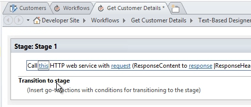
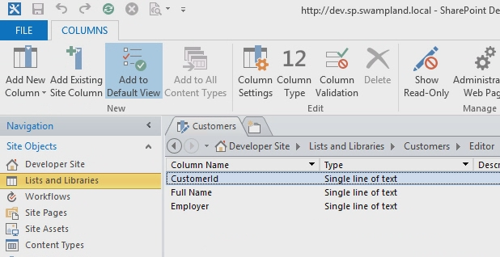
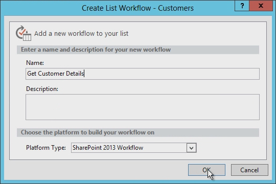
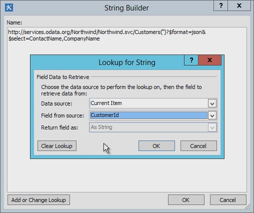
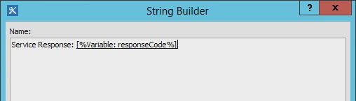
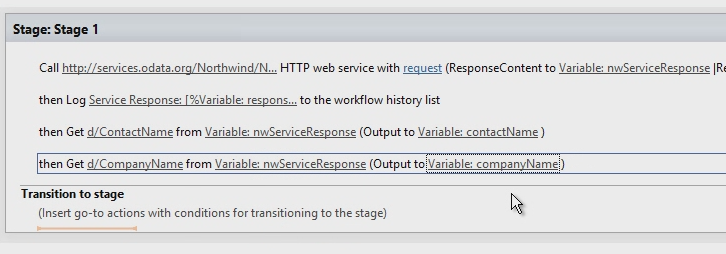
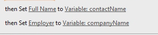
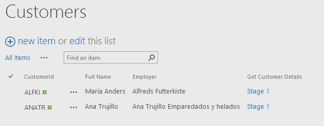

# Working with Web Services in SharePoint Workflows using SharePoint Designer 2013
Demonstrates how to use web services in SharePoint Designer 2013 workflows. 
 **Provided by:** [Andrew Connell](http://social.msdn.microsoft.com/profile/andrew%20connell%20%5bmvp%5d/),  [www.AndrewConnell.com](http://www.andrewconnell.com)
  
    
    

Microsoft has taken a fresh approach to workflows in SharePoint. The workflow team worked with the Microsoft Azure team to create a new product called Workflow Manager. Workflow Manager serves as the host for the latest version of the Windows Workflow Foundation runtime and provides all of the necessary services as well as leveraging the Microsoft Azure Service Bus to enhance performance and scalability. Once deployed, it runs the same whether in an on-premises deployment or deployed to the cloud. Importantly, SharePoint hands off all workflow execution and related tasks to the Workflow Manager farm, which is external to SharePoint.
One of the more significant changes to the workflow architecture is that now all workflows are authored in a declaratively, on a designer surface, including those built using Visual Studio 2012. In previous versions of SharePoint, workflows developed with Visual Studio 2012 were not exclusively declarative. Instead, they were a mix of declarative XAML and a compiled assembly that contained the workflow business logic.
  
    
    

For those customers who have created workflows using SharePoint Designer in the past, this is nothing new. Workflows authored using SharePoint Designer have always been fully declarative. This change does benefit customers who create workflows using SharePoint Designer 2013, however, because SharePoint Designer 2013 workflows now support calling and consuming web services.
## Why are web services important for SharePoint workflows

Let's start by understanding scenarios in which using web services makes sense. In the days of SharePoint 2007 or SharePoint 2010, writing custom code was common when using Visual Studio to author workflows because that was the best way to perform calculations or implement custom business logic. Any time you encountered a situation in which the out-of-the-box actions and activities didn't meet your needs, you could fall back on custom code in a managed assembly.
  
    
    
For the non-developer users of SharePoint Designer 2013, on the other hand, this was not so easy. When you ran into a use cases that you couldn't handle with existing workflow actions, you had to call in a developer to write a custom action. Often, this was difficult because they could only create code for the sandbox (when in a hosted environment), or could only use fully-trusted solutions if in an on-premises deployment. In other cases, the workflow had to be completely handed over to a developer to build as a fully-trusted solution because what was needed could not be achieved in SharePoint Designer.
  
    
    
Now comes the good news: In the world of SharePoint, when SharePoint Designer 2013 lacks an action that you need, all you need is to create a custom web service. And creating a custom web service is much easier than creating a custom action. Not only that, but whereas a custom action could only be used by the workflow in which it's installed (or, at best, by only a SharePoint workflow), a custom web service is portable and can be used by any number of consumers.
  
    
    
Perhaps best of all, in cases where there is an existing web service that you need to access - either a public one, or perhaps a private web service that is hosted by your company - SharePoint Designer 2013 now provides an action that you can use to call the web service. There is no longer any need to rely on a developer when you need to call an existing web service.
  
    
    
While SharePoint can consume any type of web service, it is easiest (and recommended) that you use web services that accept and return data using the standard  [OData](http://www.odata.org/) formats of [Atom](http://msdn.microsoft.com/en-us/library/ff478141.aspx) or [JSON](http://json.org/) (JavaScript Object Notation).
  
    
    
This recommendation is based on their being support for these OData formats in SharePoint workflow authoring tools (both SharePoint Designer 2013 and Visual Studio 2012). Both tools support building payloads to submit to the service and for handling the responses returned by the web services. Additionally, the OData formats support communication with anonymous web services as well as with those protected by various types of authentication. In short, you have full control over the request and response for each service call. This allows you to use a series of activities within a workflow to first authenticate using one service and obtain an OAuth token, and then include that token in future requests to services secured using the  [OAuth 2.0](http://oauth.net/2/) protocol.
  
    
    

## Leveraging web services in SharePoint workflows

Invoking web services from workflows using SharePoint takes place in two stages: first is calling the web service, then is exchanging data with the web service.
  
    
    
In SharePoint workflows, you call a web service using a new action introduced in SharePoint named **Call HTTP Web Service**. This action is flexible and allow you to make simple calls to a web service easily, or, if needed, you can create more complex calls using HTTP verbs as well as allowing you to add HTTP headers. Figure 1 shows you the **Call HTTP Web Service** action on the SharePoint Designer 2013 surface.
  
    
    

**Figure 1. SharePoint Designer 2013 stage showing the Call HTTP Web Service action**

  
    
    

  
    
    

  
    
    
The **Call HTTP Web Service** action lets you specify any of several request methods, including **GET**, **PUT**, **POST**, and **DELETE**. This lets you tell the web services, specifically  [RESTful](http://msdn.microsoft.com/en-us/library/office/jj164022.aspx) services, what to do on the service that you've specified with the URI property on the activity.
  
    
    
For instance, to get all the properties of a specific item, the service URL would contain the unique address of the item, and you would set the method to **GET**. To delete the item, the process is the same, except you set the method to **DELETE**. The same is true for updating an item, except for setting the method to **POST**. When you create an item, set the URL to the unique address of the collection where the item is to be created, and then set the method to **POST**. When creating or updating items, services generally require the data to use, which you pass along as content in the request, then indicate using the **request** property on the **Call HTTP Web Service** action.
  
    
    
The second stage of working with web services involves submitting data to, and receiving data from, a web service, which you do by using either the **request** or **response** properties on the **Call HTTP Web Service** action. Note, however, that rather than as a stream, data is passed as a complex structure using the [Dynamic Value](http://msdn.microsoft.com/en-us/library/windowsazure/microsoft.activities.dynamicvalue%28v=azure.10%29.aspx) object. (For more information about dynamic values, see [Understanding Dynamic Value](http://msdn.microsoft.com/en-us/library/windowsazure/jj193505%28v=azure.10%29.aspx).)
  
    
    
Dynamic value data structures are formatted as JavaScript Object Notation (JSON) strings. However, instead of having a developer create and manipulate strings manually within the workflow, Microsoft has provided the object type **DynamicValue** that can be used to store both hierarchal data as well as the response to a web service call.
  
    
    
There is a series of activities associated with the **DynamicValue** type that can be used to count the number of items in the response, extract values from the response, or build up a new structure for updating or creating items. Note that SharePoint Designer 2013 does not support working directly with the **DynamicValue** type and instead, workflow authors will use the **Dictionary** type.
  
    
    

## Creating web services for SharePoint workflows

So we've learned that SharePoint Designer 2013 supports calling web services, but that it  *doesn't*  support invoking custom code from workflows. Consequently, you will need to know how to create a web service if you wish to extend the functionality of your workflows beyond the default actions.
  
    
    
Fortunately, there are plenty of options for creating custom web services for use in SharePoint workflows. Specifically, the **HttpSend** activity, along with the **DynamicValue** data type, are ideally suited for creating RESTful web services that conform to the OData protocol.
  
    
    
 OData is a protocol for creating and consuming data based on the principles of REST services. It was developed to standardize exchanging data using mature, reliable, and robust HTTP protocols. Once the OData specification was complete, different organizations implemented the protocol on their own technology stacks. Microsoft implemented its own version of OData, which it branded [WCF Data Services](http://msdn.microsoft.com/en-us/library/hh487257%28v=vs.103%29.aspx).
  
    
    
Following are discussions of two common scenarios in which RESTful web services are useful to workflow developers:
  
    
    

- Implementing OData service CRUD-Q operations
    
  
- Implementing OData service operations
    
  

### Implementing OData service CRUD-Q operations

A common use for web services is performing simple create, read, update, delete, and query (CRUD-Q) operations on data in a database. It is relatively easy to create an OData web service for a SharePoint workflow WCF data service an OData service to be used by a workflow by using WCF Data services. You can review the walkthroughs and samples on creating web services at sites like  [WCF Data Services](http://msdn.microsoft.com/en-us/library/cc668792.aspx),  [www.OData.org](http://www.odata.org), and others. 
  
    
    
Assuming that you already have database that you can operate against, there are four short steps:
  
    
    

1. Create a model of the database using the Microsoft  [Entity Framework](http://msdn.microsoft.com/en-us/data/aa937723). There is no code required as this is a wizard-based creation in Visual Studio. For additional information, see  [Entity Framework 4.0 and WCF Data Services 4.0 in Visual Studio 2010](http://msdn.microsoft.com/en-us/magazine/ee336128.aspx) and [Entity Framework Designer Gets Some Love in Visual Studio 2012](http://msdn.microsoft.com/en-us/magazine/jj721589.aspx).
    
  
2. Create a new WCF Data Service. Again, no code is required in this Visual Studio wizard. For more information, see Walkthrough:  [Creating and Accessing a WCF Data Service in Visual Studio](http://msdn.microsoft.com/en-us/library/vstudio/cc668184.aspx).
    
  
3. In the service code file, set the name of the entity model that you created in step one to the source of the service; then, set the accessibility and permission for the entities in the model (both steps implemented in as little as two lines of code).
    
  
4. Publish the service to a location that Workflow Manager can access.
    
  

### Implementing OData service operations

There's a pretty good chance that your workflow wants to run some business logic that doesn't fit into limited the CRUD-Q model. For example, there may be an OData service that supports CRUD-Q operations when it creates a new bank loan. This service might also ask for consumers to call the service and provide a credit score so it can then retrieve the current interest rate. Such a task exceeds the capability of simple CRUD-Q operations, since it calls a method, passes in an integer, and receives a response.
  
    
    
However, you can support this scenario by using OData and WCF Data Services, through which you can implement  [Service Operations](http://msdn.microsoft.com/en-us/library/cc668788.aspx). Service operations are common, and are even used in the SharePoint services. For example, when SharePoint retrieves a specific list using the address format  `http://[..]/_api/web/lists/GetByTitle('ListTitle')`, the **GetByTitle()** function in the address is actually a service operator that was created by the SharePoint team. Typically, developers create their custom service operations in web services they create using WCF Data Services.
  
    
    

## Create a workflow with SharePoint Designer 2013

The following walkthrough demonstrates how to create a custom workflow that calls the OData web service of the Northwind database, which you can find publically hosted at the  [www.odata.org](http://www.odata.org) site. In this sample, the user enters a customer ID and then starts the workflow, which takes the customer ID and uses it to query the web service to collect additional information about the customer - specifically, the user's full name and employer. The workflow then takes this information and updates the list item by adding the user's customer name and employer.
  
    
    

### Create a customer list

1. In SharePoint Designer 2013, create a custom list and name it "Customers".
    
  
2. Rename the **Title** field **to Customer Id**.
    
  
3. Add two new fields of type **String** and name them **Full Name** and **Employer**, as shown in Figure 2.
    
   **Figure 2. Creating the Customers list in SharePoint Designer 2013**

  

  
  

  

  

### Create the workflow

1. In the SharePoint Designer 2013 navigation pane, select the **Workflows** option.
    
  
2. On the ribbon, click the **List Workflows** button and select **Customers** from the resulting drop-down list.
    
  
3. Name the workflow "Get Customer Details".
    
  
4. Set the **Platform Type** to **SharePoint Workflow**, as shown in Figure 3.
    
   **Figure 3. Creating a new List Workflow using SharePoint Designer 2013**

  

  
  

  

  

### Query the web service for the customer details

Now that we've created the workflow, we want to enable it to call a web service, which we do by adding a **Call HTTP Web Service** action to the workflow's default stage.
  
    
    

1. Click on the link labled **this**.
    
  
2. To the right of the **Enter the HTTP web service URL** text box, click the builder button ( **???**) to open the **String Builder** dialog box.
    
  
3. In the **String Builder**, enter this URL:  `http://services.odata.org/Northwind/Northwind.svc/Customers('CUSTOMERID')?$format=json&amp;$select=ContactName,CompanyName`. Notice the " `$select`" portion of the URL is retrieving only the fields that are relevant to this list. 
    
  
4. In the URL, locate the URL segment  `CUSTOMERID` and remove it. Leave the parentheses and single quotes in place.
    
  
5. To then dynamically create the full URL, click the **Add or Change Lookup** button in the **String Builder**.
    
  
6. In the resulting **Lookup for String** dialog box, set the **Data Source** to **Current Item** and set the **Field from Source** to **CustomerId**, as shown in Figure 4.
    
   **Figure 4. Dynamically creating the URL for the web service request**

  

  
  

  

  
7. Click **OK**, then **OK** again to accept the new URL.
    
    Now that we've set this up to receive results from the web service, next we need to store the results in another variable.
    
  
8. In the **Call HTTP Web Service** action, click the **response** link in the action and create a new variable of type **Dictionary** and name it **nwServiceResponse**.
    
    The entire **Call HTTP Web Service** action is not likely visible, since it is a long sentence in the designer. Scroll to the right and notice that the response status code is stored in a variable called **responseCode**. This is convenient, and something that can be written to the workflow instance's statistics page using the workflow history list.
    
  
9. Add a **Log to History List** action after the **Call HTTP Web Service** action and set its **message** to write the status code for the response to the log, as shown in Figure 5.
    
   **Figure 5. Writing the Web Service Response Code to the History List**

  

  
  

  

  

### Extract values from response

Now that we have the web service response stored in the **nwServiceResponse** variable, the next step is to extract these values and place them in local variables.
  
    
    
To do this, we're going to add two **Get item from dictionary** actions to the workflow. Note that the path to the item from which we're going to extract a value has to match the structure of the response and be in a specific format. A good way to figure this out is to enter the URL into the browser to see the response that comes back. Notice that the results are nested within the object called **d**. Therefore the path to the field **CompanyName** in the web service response is `d/CompanyName`.
  
    
    

1. Add two **Get item from dictionary** actions to the workflow.
    
  
2. On the first of these new actions, set **item by name or path** to `d/ComopanyName`.
    
  
3. Set the **dictionary** link to **nwServiceResponse**.
    
  
4. Set the **item** link to a new **String** variable named **CompanyName**.
    
  
5. Repeat steps 2, 3, and 4 on the second **Get item from dictionary** action, except to use **ContactName** instead of "CompanyName", as shown in Figure 6.
    
   **Figure 6. Extracting Values from the Web Service Dictionary Response**

  

  
  

  

  

### Update the list item

The final step is to update the list item using two of the **Set field in current item** actions. These set the fields in the list item to the values stored in the variables we created, as shown in Figure 7.
  
    
    

**Figure 7. Update the List Item**

  
    
    

  
    
    

  
    
    
And finally, we complete the **Transition to stage** section of the workflow stage.
  
    
    

1. Add a **Go To Stage** action.
    
  
2. Select **End of workflow**.
    
  
3. Save and publish the workflow.
    
  

### Test the workflow

1. Open a browser and navigate to the **Customers** list.
    
  
2. Add the two customer IDs that are in the Northwind service on two new list items, **ALFKI** and **ANATR**.
    
  
3. Manually start the workflows by selecting each item, then clicking the **Workflows** button on the ribbon.
    
  
4. Select the **Get Customer Details** workflow.
    
    At this point the workflow will start and will query the web service.
    
  
5. Navigate back to the **Customers** list and refresh the page. It might take a few refreshes for the workflows to complete, but eventually it should look like the image in Figure 8. You should see both list items updated with the customer's full name and their employer, which came from the Northwind web service.
    
   **Figure 8. List Items Updated by Custom Workflow**

  

  
  

  

  

## Conclusion

SharePointintroduced a new workflow architecture facilitated by a new product, Workflow Manager 1.0. To ensure that all custom workflows worked regardless of the SharePoint deployment choice, either on-premises or hosted in Office 365, all workflows are now 100 percent declarative. The added support for calling web services from SharePoint Designer 2013-authored workflows provides a more flexible and powerful workflow authoring process than in previous versions.
  
    
    
 Microsoft introduced support for calling web services in Workflow Manager using the new **Call HTTP Web Service** action in SharePoint Designer 2013. Workflow Manager also introduced support for creating structures to submit to web services as well as consuming their responses using the **Dictionary** variable type. When creating workflows, use the **Dictionary** type and associated actions in SharePoint workflows that use external web services.
  
    
    

## See also

-  [Workflows in SharePoint](workflows-in-sharepoint.md)
    
  
-  [OData](http://www.odata.org/)
    
  
-  [Introducing JSON](http://json.org/)
    
  
-  [Get started with the SharePoint REST service](http://msdn.microsoft.com/en-us/library/office/fp142380.aspx)
    
  
-  [Entity Framework 4.0 and WCF Data Services 4.0 in Visual Studio 2010](http://msdn.microsoft.com/en-us/magazine/ee336128.aspx)
    
  

  
    
    

