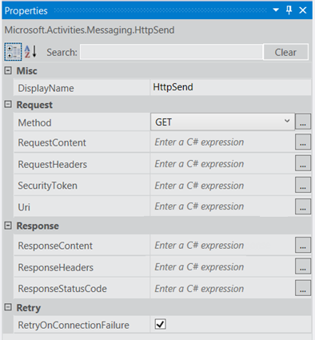
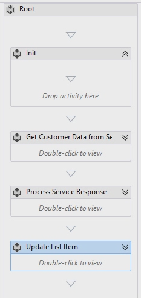
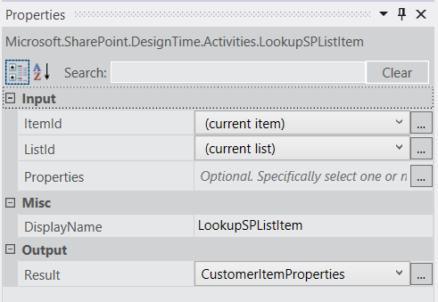
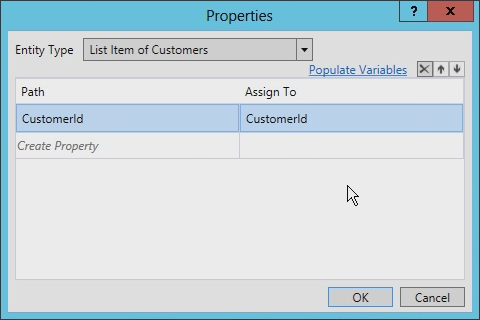
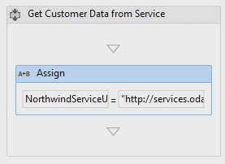
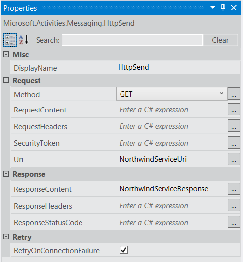
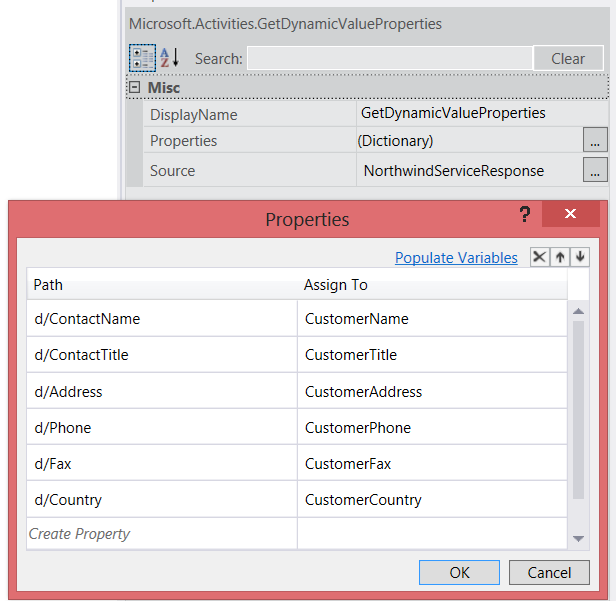
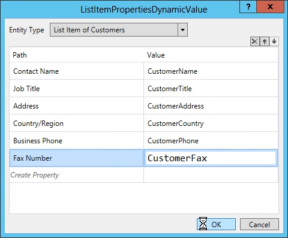
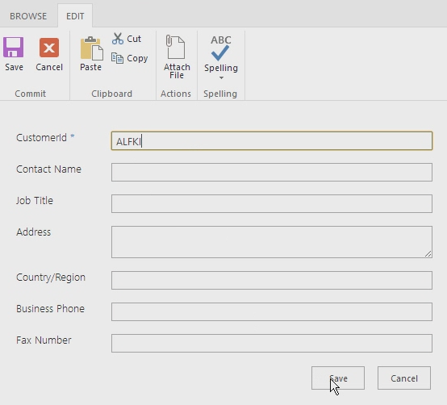
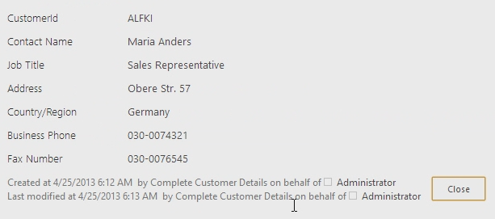

# Working with Web Services in SharePoint 2013 Workflows using Visual Studio 2012
Demonstrates how to use web services in SharePoint 2013 workflows using Visual Studio 2012.
 **Provided by:** [Andrew Connell](http://social.msdn.microsoft.com/profile/andrew%20connell%20%5bmvp%5d/),  [AndrewConnell.com](http://www.andrewconnell.com)
  
    
    

  
    
    

> **Note:**
> This article is accompanied by an end-to-end code sample that you can use to follow the article, or as a starter for your own SharePoint workflow projects. You can find the downloadable code in the MSDN Code Gallery, here:  [Working with Web Services in SharePoint 2013 Workflows using Visual Studio 2012](http://code.msdn.microsoft.com/Working-with-Web-in-46148199). 
  
    
    

  
    
    
Microsoft has taken a very different approach to workflow in SharePoint Server 2013 than in previous versions of SharePoint. The workflow team worked with the Azure team to create a new product called Workflow Manager. Workflow Manager serves the role of hosting the latest version of the Windows Workflow Foundation (version 4) runtime and all the necessary services in a highly available and scalable way. It takes advantage of Microsoft Azure Service Bus for performance and scalability, and when deployed, it runs the same whether in an on-premises deployment or a deployment in the cloud. SharePoint 2013 is then connected and configured to hand off all workflow execution and related tasks to the Workflow Manager farm.One of the more important changes in the new workflow architecture is that all custom workflows in SharePoint 2013 completely declarative, including those built using Visual Studio 2012. In previous versions of SharePoint, workflows developed with Visual Studio 2012 were not exclusively declarative. Instead, they were a pairing of declarative XAML with a compiled assembly. The managed assembly contained the workflow's business logic.This might come as a shock to seasoned SharePoint developers who may be asking, "so how do I implement my custom business logic without a compiled assembly?". Microsoft suggests that instead you create a custom web service, ideally a WCF, OData, or RESTful web service that returns data in the JavaScript Object Notation (JSON) format, and to use some of the new activities and objects in this new version. 
## Scenarios for using web services in SharePoint 2013 workflows

It is not difficult to conceive of scenarios where you would leverage a custom web services in a SharePoint 2013 workflow. Developers who authored workflows using SharePoint 2007 or SharePoint 2010 are accustomed to working with custom code, since these workflows were inherently programmatic. You were not required to add custom code to these workflows, but doing so was quite common.
  
    
    
With SharePoint 2013 workflows to being purely declarative, many cases where you may have written custom code must now be handled with code written in an external web service that is called and consumed by the workflow. 
  
    
    
SharePoint 2013 workflows can consume any sort of web service. That said, it is easiest for workflows to interact with web services that pass data using the Open Data protocol ( **OData** ), as provided in either of the formats **Atom** or **json**. OData is the best approach because it is fully supported by the SharePoint 2013 workflow authoring tools (both SharePoint Designer 2013 and Visual Studio 2012).
  
    
    
In addition, both anonymous web services as well as those protected with different types of authentication are supported. In fact, you have full control over the request and response handling for each service call. Thus, for example, you can use a series of activities within a workflow to first authenticate using one service to obtain an OAuth token, and then include that token in future requests to services secured using  [OAuth 2.0](http://oauth.net/2/).
  
    
    

## Leveraging web services in workflows

Working with web services in SharePoint 2013 workflows involves two stages. The first is simply calling the web service, which you do by using a new **HttpSend** activity introduced with SharePoint 2013. **HttpSend** lets you call into the simplest web services or, for more complex tasks, provides HTTP verbs and provides specific HTTP headers. Figure 1 shows many of the properties that are available on the **HttpSend** activity.
  
    
    

**Figure 1. Properties Tool Window for the HttpSend Activity**

  
    
    

  
    
    

  
    
    
You must also specify the method type you wish to use in the service request. Notice in Figure 1 that in the **Request** block you can specify the method type (in this case, **GET**). Available options include **GET**, **PUT**, **POST**, and **DELETE** (although there are others). This is the primary way to tell web services, specifically RESTful services, what to do on the resource defined in the URI of the activity.
  
    
    
For instance, to get all the properties of a specific item, the **Uri** would contain the unique address of the item, and the method would be set to **GET**. To delete the item, the **Uri** would remain the same unique address of the item but the method would be set to **DELETE**. The same is true for updating an item except the method would be set to **POST**. In creating an item, the **Uri** would point to the unique address of the collection where the item is to be created, and the method would be set to **POST**. When creating or updating items, services require the data to use what is passed along as content in the request, indicated using the **RequestContent** property on the **HttpSend** activity.
  
    
    
The second stage of working with web services that we're going to cover involves submitting or receiving data from a web service. Regardless of whether you use the **RequestContent** or **ResponseContent** properties on the **HttpSend** activity) you can pass the data as a complex structure, which are formatted as JavaScript Object Notation (JSON) strings. The good news is, you don't have to create and manipulate these json strings manually. Instead, Microsoft gives you a new object type, the [DynamicValue](http://msdn.microsoft.com/en-us/library/windowsazure/jj193446%28v=azure.10%29.aspx), that makes your task much easier. 
  
    
    
 **DynamicValue** objects can store hierarchal data as well as store the response of a web service call. Furthermore, there is a series of activities associated with **DynamicValue** objects that you can use to count the number of items in the response, extract values from the response, or build up a new structure for updating or creating items.
  
    
    

## Creating web services for SharePoint 2013 workflows

With the support for calling web services and the lack of supporting custom code within workflows, developers will now need to know how to create services. There are plenty of options for creating custom web services for use in SharePoint 2013 workflows. The **HttpSend** activity and **DynamicValue** data type are best suited for RESTful services and those that conform to the OData Protocol.
  
    
    
OData is a protocol for creating and consuming data based on the principles of REST services. It was developed in an effort to standardize exchanging data using the mature, reliable, and robust HTTP protocol. Once the OData specification was complete, different organizations implemented the protocol on their own technology stacks. Microsoft implemented its own version of OData and branded it  [Windows Communication Foundation (WCF) Data Services 5.0](http://msdn.microsoft.com/en-us/library/hh487257%28v=vs.103%29.aspx).
  
    
    
The RESTful services implemented by SharePoint 2013 actually support OData because they were built using WCF Data Services, specifically WCF Data Services 5.0, which implements the OData 3.0 specification.
  
    
    

### Implement OData Service CRUD-Q operations

A common use for web services is performing simple create, read, update, delete, and query (CRUD-Q) operations on data within a database. Creating an OData service for use with a SharePoint 2013 workflow is quite simple using WCF. Assuming you have an existing database there are four short steps that require very little coding:
  
    
    

1. Create a model of your database using the  [Entity Framework](http://msdn.microsoft.com/en-us/library/bb399567%28v=vs.110%29.aspx). There is no code required (Visual Studio, provides a wizard).
    
  
2. Create a new WCF data service. There is no code required (Visual Studio provides a wizard).
    
  
3. In the service code file, set the name of the entity model (created in step #1) to the source of the service, then set the accessibility and permission for the entities in the model. Both steps require as little as two lines of code.
    
  
4. Publish the service to a location that Workflow Manager can access.
    
  

### Implement OData service operations

Another task you'll want to accomplish using web services is running business logic that may not fit into the CRUDQ model. For example, consider an OData service that supports CRUD-Q operations for creating new bank loans. Suppose this service also supports consumers calling the service and providing a credit score to retrieve a current interest rate for a prospective loan. This type of task does not fall into the CRUDQ model, since it calls a method and passes in an integer to receive a response.
  
    
    
OData and WCF data services support this scenario by providing you with  [service operations](http://msdn.microsoft.com/en-us/library/cc668788%28v=vs.110%29.aspx). Service operations are common and are even used within SharePoint 2013 services, for instance, when retrieving a specific list using the address  `http://[..]/_api/web/lists/GetByTitle('ListTitle')`. The **GetByTitle** method is a service operator the SharePoint 2013 team created. Developers create their own custom service operations in custom web services created using WCF Data Services.
  
    
    

## Walkthrough: Create a workflow with Visual Studio 2012

The following walkthrough demonstrates how to create a custom workflow that calls an OData web service on the Northwind database. You can find the Northwind database hosted at  [OData.org](http://www.odata.org). 
  
    
    
When the workflow is completed, users will enter a customer ID, then start the workflow. When started, the workflow retrieves additional customer information and updates the list item with the data it has retrieved.
  
    
    

1. Start Visual Studio 2012 and create a new SharePoint-hosted app project.
    
  
2. In this project, create a new custom list and name it "Customers".
    
  
3. In this new list, create the following fields. Leave the default data type for each field as **string**:
    
  - CustomerId (renamed from the default "Title" field)
    
  
  - Customer Name
    
  
  - Job Title
    
  
  - Address
    
  
  - Country/Region
    
  
  - Business Phone
    
  
  - Fax Number
    
  
4. Now, add a workflow to the project by clicking in **Solution Explorer** on **Add** > **New Item**; then, in the **Add New Item** dialog box, select the **Workflow** project item from the **Office/SharePoint** category.
    
  
5. Name the workflow "CompleteCustomerDetails" and click **Next**.
    
  
6. When prompted by the **Customization wizard**, name the workflow "Complete Customer Details" and set it to be a **List** workflow. Cick **Next**.
    
  
7. On the next wizard page, check the box to create an association, select the **Customer** list, then select **Create New** for the workflow history and task lists. Click **Next**.
    
  
8. On the final wizard page, check the box to start the workflow manually; leave the option to start automatically **un** -checked. Click **Finish**.
    
  
9. At this point, Visual Studio displays the workflow designer surface that contains a single **Sequence** activity.
    
  
10. Change the name of the **Sequence** activity to **Root**.
    
  
11. Add four more **Sequence** activities inside the Root activity and name them as follows:
    
  - Init
    
  
  - Get Customer Data From Service
    
  
  - Process Service Response
    
  
  - Update List Item
  
    
    

    
  
12. At this point, the workflow will appear as shown in Figure 2.
    
   **Figure 2. Complete Customer Details Workflow with Four Empty Sequences**

  

     
  

  

  

### Get the customer ID entered by the user

The first thing the workflow needs to do is retrieve the customer ID, as entered by the user. To do this, you need to create two variable.
  
    
    

1. Click the **Variables** tab at near the bottom of the workflow designer and create two variables
    
  - **CustomerItemProperties** (data type = **DynamicValue**; scope = **Init**). Use this variable to store the result set returned by the activity that gets all properties from the list item.
    
    > **Note:**
      > The **DynamicValue** data type is not shown by default. To find it, select the **Browse for Types** option in the **Variable Type** column. In the search box at the top of the dialog, enter **DynamicValue**, and then select the **Microsoft.Activities.DynamicValue**. 
  - **CustomerId** (data type = **String**; scope = **Root**): Use this variable to store the customer ID entered by the user.
    
  
2. Locate the **LookupSpListItem** activity in the **SP - List** section of the toolbox and drag it to the **Init** sequence. Set the activity properties as shown in Figure 3.
    
   **Figure 3. Properties Tool Window for the LookupSPListItem Activity**

  

     
  

    This activity tells Workflow Manager to use the SharePoint REST API to retrieve the properties of the current list item and to store the **JSON** response in the **DynamicValue** variable that you just created.
    
  
3. Retrieve the customer ID from the list item by clicking the Get Properties link in the **LookupSpListItem** activity. Doing this adds a **GetDynamicValueProperties** activity to the design surface.
    
  
4. In the **Properties** dialog box, click the ellipsis ( **…**) to open the Property selector, shown in Figure 4. In the wizard, set the **Entity Type** to **List Item of Customers**, then add a single property, CustomerId, with the Path set to CustomerId and Assign To set to CustomerId (the variable previously created), as shown in the following figure.
    
  
5. Click **Create Property** and enter **CustomerId** in the **Path** column.
    
  
6. In the **Assign To** column, enter **CustomerId**, which is the variable we created earlier. Figure 4 shows the completed **Properties** dialog box.
    
   **Figure 4. Properties dialog for the GetDynamicValueProperties Activity.**

  

     
  

  

  

### Call the Northwind OData web service

The workflow now has a reference to the customer ID, so the next step is to call the web service. To do this, we'll be working primarily with the **Get Customer Data from Service** sequence.
  
    
    

1. Select the **Get Customer Data from Service** sequence and create two new variables:
    
  - **NorthwindServiceUri** (data type = **String**; scope = **Get Customer Data from Service**). This variable stores the URI that is used to query the web service.
    
  
  - **NorthwindServiceResponse** (data type = **DynamicValue**; scope = **Root**): This variable will store the web service response.
    
  
2. To create the URL to query the web service, start by locating an **Assign** activity in the workflow toolbox and drag it to the **Get Customer Data from Service** sequence. Notice that the **Assign** activity has two parts representing a name-value pair.
    
  
3. Set the left portion of the **Assign** activity to **NorthwindServiceUri**.
    
  
4. Set the right portion of the activity to the string  `"http://services.odata.org/Northwind/Northwind.svc/Customers('" + CustomerId + "')?$format=json"`. Figure 5 shows the completed activity.
    
   **Figure 5. Assign Activity Used to Set a Variable Containing the OData Service**

  

     
  

  

  
5. Drag an **HttpSend** activity from the toolbox to the **Get Customer Data from Service** sequence, immediately following the **Assign** activity.
    
  
6. Set the properties on the **HttpSend** activity using the values shown in Figure 6.
    
   **Figure 6. HttpSend Properties**

  

     
  

  

  

### Process the Northwind OData web service response

Once the web service request has been made and the results are stored in a local variable, the next step is to process the response. Each value in the response needs to be added to a different variable. 
  
    
    

1. Create a variable for each of the fields that we created at the start of this walkthrough (except the customer ID field), shown here:
    
  - Customer Name
    
  
  - Job Title
    
  
  - Address
    
  
  - Country/Region
    
  
  - Business Phone
    
  
  - Fax Number
    
  
2. Name each of these variables according to its respective field name.
    
  
3. All of the variables should be of type **String**; all of the variables should be scoped to **Root**.
    
  
4. Add a **GetDynamicValueProperties** activity to the **Process Service Request** sequence.
    
  
5. In the **Properties** window, set the **Source** value to **NorthwindServiceResponse**, as shown in Figure 7.
    
  
6. Click the ellipsis button ( **…**) button on the **Properties** property and then provide values in the **Path** and **Assign To** columns as shown in Figure 7. Notice that the values in the **Assign To** column are the variable you created for each of the **Customers** list fields.
    
   **Figure 7. Properties tool window for GetDynamicValueProperties and contents for Properties dialog**

  

     
  

  

  

### Update the customer list item

The last step is to update the list item. 
  
    
    

1. Add an **UpdateListItem** activity to the **Update List Item** sequence and use the **Properties** window to set the following values:
    
  - **ListId**: (current list)
    
  
  - **ItemId**: (current item)
    
  
2. Click the ellipsis button ( **…**) button on the **ListItemPropertiesDynamicValues** property and in the resulting dialog box, set **Entity Type** to **List Item of Customers**. 
    
  
3. Finally, for each of the values extracted from the web service, set the values on the list item to the variables in the workflow, as shown in Figure 8.
    
   **Figure 8. ListItemPropertiesDynamicValue Dialog with Values Set**

  

     
  

  

  

### Test the workflow

The workflow is now complete and should function properly. To confirm its stability, you should test it.
  
    
    

1. Press **F5** to start debugging; Visual Studio builds and deploys the SharePoint-hosted app.
    
  
2. When the browser opens, navigate to the **Customers** list, create a single customer record with a **Customer Id** of "ALFKI", as shown in Figure 9, and then save the item.
    
   **Figure 9. New List Item**

  

     
  

  

  
3. Next, manually start the workflow and then go back to the list item. Keep refreshing the page to see the workflow update the list item, as shown in Figure 10
    
   **Figure 10. Updated List Item**

  

     
  

    Notice that the list item was updated by the SharePoint hosted app on behalf of the person who started the workflow. In this walkthrough, however, it was started by the administrator.
    
  

## Conclusion

SharePoint 2013 introduced a new workflow architecture facilitated by a new product: Workflow Manager 1.0. To ensure that all custom workflows worked regardless of the SharePoint 2013 deployment choice, either on-premises or hosted in Office 365, all workflows are now 100-percent declarative. Therefore, custom business logic previously implemented as custom code in Visual Studio-authored workflows in previous versions of SharePoint are no longer supported. 
  
    
    
 Microsoft introduced support for calling web services in Workflow Manager using the new **HttpSend** activity. Workflow Manager also introduced support for creating structures to submit to web services as well as consuming their responses called the **DynamicValue** data type. When creating workflows, use this data type and associated actions to facilitate creating and leveraging robust business processes in SharePoint 2013 workflows by using external web services.
  
    
    

## Additional resources

-  [Working with complex data in a workflow](http://msdn.microsoft.com/en-us/library/windowsazure/jj193446%28v=azure.10%29.aspx)
    
  
-  [Workflows in SharePoint 2013](http://msdn.microsoft.com/en-us/library/jj163986.aspx)
    
  

