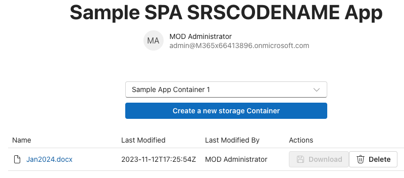
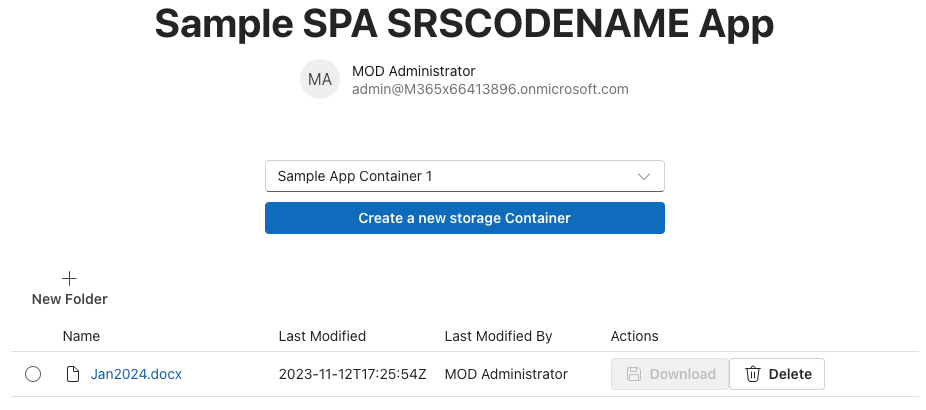
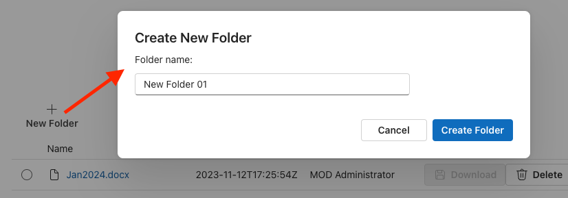
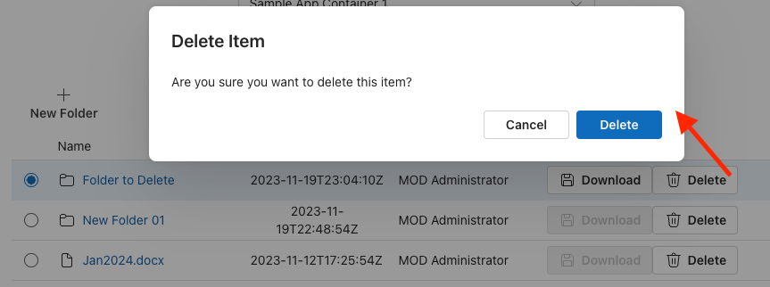

# Hands on Lab - Create, update and delete files within a Container

In this exercise, you’ll update the existing project to store files in a SharePoint repository services Container.

## Add Microsoft Graph Type Declarations to the project

Before we create the new React components, let’s start by updating out project.

Throughout this exercise, we’ll use types provided by Microsoft Graph. Because we haven’t installed the NPM package that includes them, we need to do that first.

From the command line, run the following command from the root folder for our project:

```console
npm install @microsoft/microsoft-graph-types -DE
```

## Update the React Containers component to display files

Recall from the previous exercise, we left a placeholder in our Containers component that will be used to display the contents of the selected Container.

We haven’t created our `Files` component, but let’s start by updating the `Containers` component to replace the placeholder with the `Files` component we’ll create.

Locate and open the **./src/components/containers.tsx** file.

Add the following import statement to the list of existing imports at the top of the file:

```typescript
import { Files } from "./files";
```

Next, locate the following placeholder code near the end of the file…

```typescript
{selectedContainer && (`[[TOOD]] container "${selectedContainer.displayName}" contents go here`)}
```

… and replace it with the following code:

```typescript
{selectedContainer && (<Files container={selectedContainer} />)}
```

## Create the Files React component

Let’s start by creating a new React component to display and manage the contents of the Containers.

Create a new file, **./src/components/files.tsx**, and add the following code it it. This is the boilerplate boilerplate component that includes all imports and the skeleton of our component:

```tsx
import React, {
  useState,
  useEffect,
  useRef
} from 'react';
import { Providers } from "@microsoft/mgt-element";
import {
  AddRegular, ArrowUploadRegular,
  FolderRegular, DocumentRegular,
  SaveRegular, DeleteRegular,
} from '@fluentui/react-icons';
import {
  Button, Link, Label, Spinner,
  Input, InputProps, InputOnChangeData,
  Dialog, DialogActions, DialogContent, DialogBody, DialogSurface, DialogTitle, DialogTrigger,
  DataGrid, DataGridProps,
  DataGridHeader, DataGridHeaderCell,
  DataGridBody, DataGridRow,
  DataGridCell,
  TableColumnDefinition, createTableColumn,
  TableRowId,
  TableCellLayout,
  OnSelectionChangeData,
  SelectionItemId,
  Toolbar, ToolbarButton,
  makeStyles
} from "@fluentui/react-components";
import {
  DriveItem
} from "@microsoft/microsoft-graph-types-beta";
import { IContainer } from "./../common/IContainer";
require('isomorphic-fetch');

interface IFilesProps {
  container: IContainer;
}

interface IDriveItemExtended extends DriveItem {
  isFolder: boolean;
  modifiedByName: string;
  iconElement: JSX.Element;
  downloadUrl: string;
}

export const Files = (props: IFilesProps) => {

  // BOOKMARK 1 - constants & hooks

  // BOOKMARK 2 - handlers go here

  // BOOKMARK 3 - component rendering return (
  return
  (
    <div>
    </div>
  );
}

export default Files;
```

> [!NOTE]
> Notice the `// BOOKMARK #` comments in the component. We’ll use these to ensure you’re adding code in the correct places.

### Display a table of the selected Container contents

The first thing we need to address is to display the contents of the selected Container. To do this, we’ll use the `DataGrid` component from the Fluent UI React library.

Add the following markup inside the `<div>` element in the `return()` statement after the `// BOOKMARK 3` comment:

```tsx
<DataGrid
  items={driveItems}
  columns={columns}
  getRowId={(item) => item.id}
  resizableColumns
  columnSizingOptions={columnSizingOptions}
  >
  <DataGridHeader>
    <DataGridRow>
      {({ renderHeaderCell }) => (
        <DataGridHeaderCell>{renderHeaderCell()}</DataGridHeaderCell>
      )}
    </DataGridRow>
  </DataGridHeader>
  <DataGridBody<IDriveItemExtended>>
    {({ item, rowId }) => (
      <DataGridRow<IDriveItemExtended> key={rowId}>
        {({ renderCell, columnId }) => (
          <DataGridCell>
            {renderCell(item)}
          </DataGridCell>
        )}
      </DataGridRow>
    )}
  </DataGridBody>
</DataGrid>
```

The `DataGrid` contains a few references to collections, settings, and methods that we need to setup. Let’s start with the visual things, then we’ll get the data.

The columns in the `DataGrid` can be resized according to the properties we set. Create a new constant, `columnSizingOptions`, and add the code immediately before the `// BOOKMARK 3` comment:

```typescript
const columnSizingOptions = {
  driveItemName: {
    minWidth: 150,
    defaultWidth: 250,
    idealWidth: 200
  },
  lastModifiedTimestamp: {
    minWidth: 150,
    defaultWidth: 150
  },
  lastModifiedBy: {
    minWidth: 150,
    defaultWidth: 150
  },
  actions: {
    minWidth: 250,
    defaultWidth: 250
  }
};
```

Next, define the structure and rendering settings for all the columns in the `DataGrid`. Do this by creating a new collection, `columns`, and add it immediately before the `columnSizingOptions` you just created:

```tsx
const columns: TableColumnDefinition<IDriveItemExtended>[] = [
  createTableColumn({
    columnId: 'driveItemName',
    renderHeaderCell: () => {
      return 'Name'
    },
    renderCell: (driveItem) => {
      return (
        <TableCellLayout media={driveItem.iconElement}>
          <Link href={driveItem!.webUrl!} target='_blank'>{driveItem.name}</Link>
        </TableCellLayout>
      )
    }
  }),
  createTableColumn({
    columnId: 'lastModifiedTimestamp',
    renderHeaderCell: () => {
      return 'Last Modified'
    },
    renderCell: (driveItem) => {
      return (
        <TableCellLayout>
          {driveItem.lastModifiedDateTime}
        </TableCellLayout>
      )
    }
  }),
  createTableColumn({
    columnId: 'lastModifiedBy',
    renderHeaderCell: () => {
      return 'Last Modified By'
    },
    renderCell: (driveItem) => {
      return (
        <TableCellLayout>
          {driveItem.modifiedByName}
        </TableCellLayout>
      )
    }
  }),
  createTableColumn({
    columnId: 'actions',
    renderHeaderCell: () => {
      return 'Actions'
    },
    renderCell: (driveItem) => {
      return (
        <>
          <Button aria-label="Download"
            disabled={!selectedRows.has(driveItem.id as string)}
            icon={<SaveRegular />}>Download</Button>
          <Button aria-label="Delete"
            icon={<DeleteRegular />}>Delete</Button>
        </>
      )
    }
  }),
];
```

This code will use the utility method `createTableColumn()` to give each column an ID and specify how the header and body cells in the table are rendered.

With the `DataGrid` configured, add the following constants to manage the React app’s state with the properties our existing code is using. Add the following code immediately before the `// BOOKMARK 1` comment:

```typescript
const [driveItems, setDriveItems] = useState<IDriveItemExtended[]>([]);
const [selectedRows, setSelectedRows] = useState<Set<SelectionItemId>>(new Set<TableRowId>([1]));
```

Now, let’s add some handlers to fetch and display the data from our Container.

Add the following handler and React hook to get the contents of the selected Container. The `useEffect` hook will run the first time the component is rendered as well as when the `<Files />`component’s input properties change.

Add the following code immediately before the `// BOOKMARK 2` comment:

```typescript
useEffect(() => {
  (async () => {
    loadItems();
  })();
}, [props]);

const loadItems = async (itemId?: string) => {
  try {
    const graphClient = Providers.globalProvider.graph.client;
    const driveId = props.container.id;
    const driveItemId = itemId || 'root';

    // get Container items at current level
    const graphResponse = await graphClient.api(`/drives/${driveId}/items/${driveItemId}/children`).get();
    const containerItems: DriveItem[] = graphResponse.value as DriveItem[]
    const items: IDriveItemExtended[] = [];
    containerItems.forEach((driveItem: DriveItem) => {
      items.push({
        ...driveItem,
        isFolder: (driveItem.folder) ? true : false,
        modifiedByName: (driveItem.lastModifiedBy?.user?.displayName) ? driveItem.lastModifiedBy!.user!.displayName : 'unknown',
        iconElement: (driveItem.folder) ? <FolderRegular /> : <DocumentRegular />,
        downloadUrl: (driveItem as any)['@microsoft.graph.downloadUrl']
      });
    });
    setDriveItems(items);
  } catch (error: any) {
    console.error(`Failed to load items: ${error.message}`);
  }
};
```

The `loadItems` function uses the Microsoft Graph client to get a list of all the files within the current folder, defaulting to the `root` if no folder is already selected.

It then takes the collection of `DriveItems` returned by the Microsoft Graph and adds a few additional properties to simplify our code later. At the end of the method, it calls the `setDriveitems()` state accessor method that will trigger a re-rendering of the component. The `driveItems` are set on the `DataGrid.items` property which explains why the table displays some information.

## Test the rendering of listing the contents of a Container

Now let’s test the client-side React app to ensure the `<Files />` component is displaying the contents of the selected Container.

From the command line in the root folder of the project, run the following command:

```console
npm run start
```

When the browser loads, sign-in using the same **Work and School** account you’ve been using.

After signing-in, select an existing Container. If that Container already has some content in it, it will be displayed as follows:



If you select the file, in this case a Word document, it will open a new tab and load the URL of the item. For this example, the file is opened in Word online.

> [!NOTE]
> Previously in this module, we’ve stopped the web server and restarted it the end and start of each testing step. From this point forward, we can leave it running because we’re now only going to modify the React app.
>
> When the component’s file changes, the web server will rebuild and refresh the browser to speed up our development and testing cycle.

## Add support for downloading files

With the content display feature complete, let’s update the component to support downloading files.

Start by adding the following code immediately before the `// BOOKMARK 1` comment:

```typescript
const downloadLinkRef = useRef<HTMLAnchorElement>(null);
```

Next, we want to make sure an item in the `DataGrid` is selected before they can download it. Otherwise the **Download** button will be disabled as it currently is.

In the `DataGrid`, add three properties to set it to support a single item selection mode (`selectionMode`), keep track of which items are selected (`selectedItems`), and what to do when the selection changes (`onSelectionChange`).

```tsx
<DataGrid
  ...
  selectionMode='single'
  selectedItems={selectedRows}
  onSelectionChange={onSelectionChange}>
```

Next, add the following handler immediately before the `// BOOKMARK 2` comment:

```typescript
const onSelectionChange: DataGridProps["onSelectionChange"] = (event: React.MouseEvent | React.KeyboardEvent, data: OnSelectionChangeData): void => {
  setSelectedRows(data.selectedItems);
}
```

Now when an item in the list is selected, you’ll see the **Download** button is no longer disabled.


The download option will use a hidden hyperlink that we’ll programmatically first set the download link for the selected item and then programmatically do the following:

1. Set the URL of the hyperlink to the download URL of the item.
1. Click the hyperlink.

This will trigger the download for the user.

Add the following markup just after the opening `<div>` in the `return()` method:

```tsx
<a ref={downloadLinkRef} href="" target="_blank" style={{ display: 'none' }} />
```

Now, locate the existing `columns` constant you added previously and find the `createTableColumn` that references the `columnId: 'actions'`. In the `renderCell` property, add a `onClick` handler that will call the `onDownloadItemClick`. The button should look like the following when you’re complete:

```tsx
<Button aria-label="Download"
        disabled={!selectedRows.has(driveItem.id as string)}
        icon={<SaveRegular />}
        onClick={() => onDownloadItemClick(driveItem.downloadUrl)}>Download</Button>
```

Finally, add the following handler immediately after the existing `onSelectionChange` event handler you previously added. This will handle those two programmatic steps previously mentioned:

```typescript
const onDownloadItemClick = (downloadUrl: string) => {
  const link = downloadLinkRef.current;
  link!.href = downloadUrl;
  link!.click();
}
```

Save your changes, refresh the browser, and select the **Download** link to see the file get downloaded.


## Add the ability to create a folder in a Container

Let’s continue building out the `<Files />` component by adding support to creating and displaying folders.

Start by adding the following code immediately before the `// BOOKMARK 1` comment. This will add the necessary React state values we’ll use:

```typescript
const [folderId, setFolderId] = useState<string>('root');
const [folderName, setFolderName] = useState<string>('');
const [creatingFolder, setCreatingFolder] = useState<boolean>(false);
const [newFolderDialogOpen, setNewFolderDialogOpen] = useState(false);
```

To create a new folder, we’ll display a dialog to the user when they click a button in the toolbar.

Within the `return()` method, immediately before the `<DataGrid>`, add the following code to implement the dialog:

```tsx
<Toolbar>
  <ToolbarButton vertical icon={<AddRegular />} onClick={() => setNewFolderDialogOpen(true)}>New Folder</ToolbarButton>
</Toolbar>

<Dialog open={newFolderDialogOpen}>
  <DialogSurface>
    <DialogBody>
      <DialogTitle>Create New Folder</DialogTitle>
      <DialogContent className={styles.dialogContent}>
        <Label htmlFor={folderName}>Folder name:</Label>
        <Input id={folderName} className={styles.dialogInputControl} autoFocus required
          value={folderName} onChange={onHandleFolderNameChange}></Input>
        {creatingFolder &&
          <Spinner size='medium' label='Creating folder...' labelPosition='after' />
        }
      </DialogContent>
      <DialogActions>
        <DialogTrigger disableButtonEnhancement>
          <Button appearance="secondary" onClick={() => setNewFolderDialogOpen(false)} disabled={creatingFolder}>Cancel</Button>
        </DialogTrigger>
        <Button appearance="primary"
          onClick={onFolderCreateClick}
          disabled={creatingFolder || (folderName === '')}>Create Folder</Button>
      </DialogActions>
    </DialogBody>
  </DialogSurface>
</Dialog>
```

The dialog makes use of some custom styles which we haven’t added yet. Do that now by first adding the following code immediately before the declaration of the `Files` component:

```typescript
const useStyles = makeStyles({
  dialogInputControl: {
    width: '400px',
  },
  dialogContent: {
    display: 'flex',
    flexDirection: 'column',
    rowGap: '10px',
    marginBottom: '25px'
  }
});
```

Then, add the following code immediately before the `return()` method in our component:

```typescript
const styles = useStyles();
```

Now that the UI is setup, we now need to add some handlers. Add the following handlers immediately before the `// BOOKMARK 2` comment. These will handle opening the dialog, saving the value of the new folder’s name, and what happens when they select the button in the dialog:

```typescript
const onFolderCreateClick = async () => {
  setCreatingFolder(true);

  const currentFolderId = folderId;
  const graphClient = Providers.globalProvider.graph.client;
  const endpoint = `/drives/${props.container.id}/items/${currentFolderId}/children`;
  const data = {
    "name": folderName,
    "folder": {},
    "@microsoft.graph.conflictBehavior": "rename"
  };
  await graphClient.api(endpoint).post(data);

  await loadItems(currentFolderId);

  setCreatingFolder(false);
  setNewFolderDialogOpen(false);
};

const onHandleFolderNameChange: InputProps["onChange"] = (event: React.ChangeEvent<HTMLInputElement>, data: InputOnChangeData): void => {
  setFolderName(data?.value);
};
```

Save your changes, refresh the browser, and select the **New Folder** button above the Container’s contents:



Select the **New Folder** button, enter a name, and select the **Create Folder** button in the dialog.



When the folder is created, you’ll see it listed in the contents table:


We need to make one more change to our component. Right now, when you select a folder, it will launch the URL in a new tab leaving out app. That’s not what we want… we want it to simply drill into the folder.

Let’s fix that by locating the existing `columns` constant you added previously and find the `createTableColumn` that references the `columnId: 'driveItemName'`. In the `renderCell` property, replace the existing `<Link />` component with the following code. This will generate two links based on if the current item being rendered is a folder or a file:

```tsx
{(!driveItem.isFolder)
  ? <Link href={driveItem!.webUrl!} target='_blank'>{driveItem.name}</Link>
  : <Link onClick={() => {
    loadItems(driveItem.id);
    setFolderId(driveItem.id as string)
  }}>{driveItem.name}</Link>
}
```

Now when you select a folder, the app will show the contents of the folder.

## Add ability to delete a file or folder

The next step is to add the ability to delete a folder or file from the Container.

To do this, start by adding the following code to the existing list of `useState()` calls before the `// BOOKMARK 1` comment

```typescript
const [deleteDialogOpen, setDeleteDialogOpen] = useState(false);
```

Next, add a dialog to act as a confirmation when the user selects the **Delete** button. Add the following code just after the existing `<Dialog>` component in the `return()` method:

```tsx
<Dialog open={deleteDialogOpen} modalType='modal' onOpenChange={() => setSelectedRows(new Set<TableRowId>([0]))}>
  <DialogSurface>
    <DialogBody>
      <DialogTitle>Delete Item</DialogTitle>
      <DialogContent>
        <p>Are you sure you want to delete this item?</p>
      </DialogContent>
      <DialogActions>
        <DialogTrigger>
          <Button
            appearance='secondary'
            onClick={() => setDeleteDialogOpen(false)}>Cancel</Button>
        </DialogTrigger>
        <Button
          appearance='primary'
          onClick={onDeleteItemClick}>Delete</Button>
      </DialogActions>
    </DialogBody>
  </DialogSurface>
</Dialog>
```

Update the the **Delete** button to do something when it’s selected. Locate the existing `columns` constant you added previously and find the `createTableColumn` that references the `columnId: 'actions'`. In the `renderCell` property, add a `onClick` handler that will call the `onDeleteDialogOpen`. The button should look like the following when you’re complete:

```tsx
<Button aria-label="Delete"
        icon={<DeleteRegular />}
        onClick={() => setDeleteDialogOpen(true)}>Delete</Button>
```

Finally, add the following code immediately before the `// BOOKMARK 2` comment to handle the deletion of the currently selected item:

```typescript
const onDeleteItemClick = async () => {
  const graphClient = Providers.globalProvider.graph.client;
  const endpoint = `/drives/${props.container.id}/items/${selectedRows.entries().next().value[0]}`;
  await graphClient.api(endpoint).delete();
  await loadItems(folderId || 'root');
  setDeleteDialogOpen(false);
}
```

Save your changes and refresh the browser. Select the **Delete**  button on one of the existing folders or files in your Collection. The confirmation dialog will appear and when you select the **Delete** button in the dialog, the Container’s contents table will refresh to show the item has been deleted:



## Add the ability to upload files to the Container

The last step is to add the ability to upload files to a Container or a folder within a Container.

Start by adding the following code immediately before the `// BOOKMARK 1` comment:

```typescript
const uploadFileRef = useRef<HTMLInputElement>(null);
```

Next, we’ll repeat a similar technique using a hidden `<Input>` control to upload a file. Add the following code immediately after the opening `<div>` in the the component’s `return()` method:

```tsx
<input ref={uploadFileRef} type="file" onChange={onUploadFileSelected} style={{ display: 'none' }} />
```

Add a button to the toolbar to trigger the file selection dialog. Do this by adding the following code immediately after the existing toolbar button that adds a new folder:

```tsx
<ToolbarButton vertical icon={<ArrowUploadRegular />} onClick={onUploadFileClick}>Upload File</ToolbarButton>
```

Finally, add the following code immediately before the `// BOOKMARK 2` comment to add two event handlers. The `onUploadFileClick` handler is triggered when you select the **Upload File** toolbar button and the `onUploadFileSelected` handler is triggered when the user selects a file:

```typescript
const onUploadFileClick = () => {
  if (uploadFileRef.current) {
    uploadFileRef.current.click();
  }
};

const onUploadFileSelected = async (event: React.ChangeEvent<HTMLInputElement>) => {
  const file = event.target.files![0];
  const fileReader = new FileReader();
  fileReader.readAsArrayBuffer(file);
  fileReader.addEventListener('loadend', async (event: any) => {
    const graphClient = Providers.globalProvider.graph.client;
    const endpoint = `/drives/${props.container.id}/items/${folderId || 'root'}:/${file.name}:/content`;
    graphClient.api(endpoint).putStream(fileReader.result)
      .then(async (response) => {
        await loadItems(folderId || 'root');
      })
      .catch((error) => {
        console.error(`Failed to upload file ${file.name}: ${error.message}`);
      });
  });
  fileReader.addEventListener('error', (event: any) => {
    console.error(`Error on reading file: ${event.message}`);
  });
};
```

Test you changes by saving the file, refreshing the browser, and selecting the **Upload File** button:


After selecting a file, our app will upload the file and refresh the table of the Container’s contents:


## Summary

In this exercise, you updated the existing project to store and manage files in a SharePoint repository services Container.
