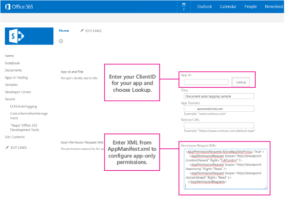
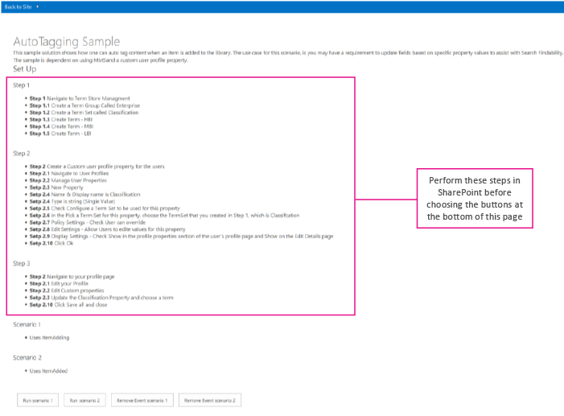
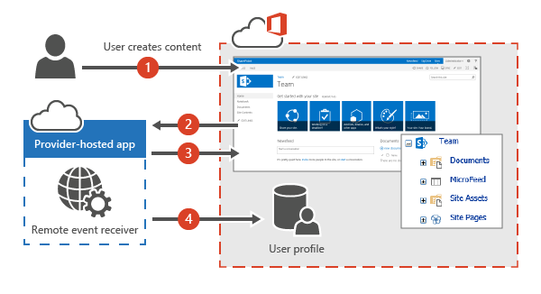
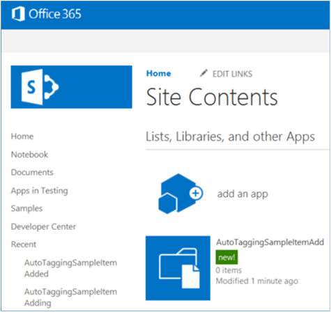
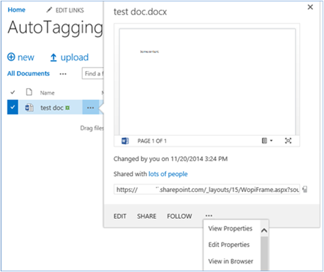
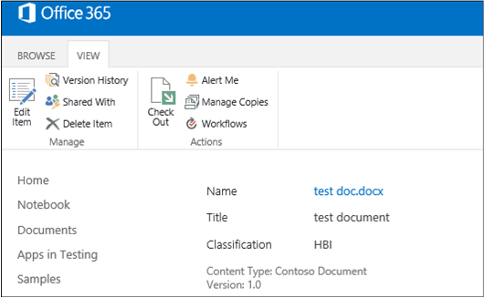

# Auto-tagging sample SharePoint Add-in

The ECM.AutoTagging sample shows you how to use a provider-hosted add-in to automatically tag content added to a SharePoint library with data sourced from a custom user profile property. 

This add-in uses remote event receivers, hosted on an Azure website, to:   

- Create fields, content types, and document libraries.
- Retrieve the value of a custom user profile property.
- Set taxonomy fields.
    
Use this solution if you want to:

- Implement event receivers in SharePoint Online. 
- Improve search results by attaching additional metadata to content when it's created.
- Classify your content.
- Modernize your code before migrating to a newer version of SharePoint, and you've used event receivers in the past.
    
## Before you begin

To get started, download the [ECM.AutoTagging](https://github.com/SharePoint/PnP/tree/master/Samples/ECM.AutoTagging) sample add-in from the Office 365 Developer Patterns and Practices project on GitHub.

> [!NOTE] 
> The code in this article is provided as-is, without warranty of any kind, either express or implied, including any implied warranties of fitness for a particular purpose, merchantability, or non-infringement.

Before you run this add-in, do the following:

1. Create an Azure website and deploy the ECM.AutoTaggingWeb project to it.
    
2. Register your add-in by using the Appregnew.aspx page in Office 365. 
    
3. This add-in uses app-only permissions. You need to assign app-only permissions using the AppInv.aspx page in Office 365. Copy the following XML from the AppManifest.xml file to the **Permission Request XML** box on the AppInv.aspx page, as shown inthe following figure. 

   ```XML 
	  <AppPermissionRequests AllowAppOnlyPolicy="true">
	    <AppPermissionRequest Scope="http://sharepoint/content/tenant" Right="FullControl" />
	    <AppPermissionRequest Scope="http://sharepoint/taxonomy" Right="Read" />
	    <AppPermissionRequest Scope="http://sharepoint/social/tenant" Right="Read" />
	  </AppPermissionRequests>
   ```

   

4. In the ECM.AutoTaggingWeb project, in the ReceiverHelper.cs file, in the **CreateEventReciever** method, update the **ReceiverUrl** property with the URL of your Azure website.

   ```csharp
	    public static EventReceiverDefinitionCreationInformation CreateEventReciever(string receiverName, EventReceiverType type)
	        {
	
	            EventReceiverDefinitionCreationInformation _rer = new EventReceiverDefinitionCreationInformation();
	            _rer.EventType = type;
	            _rer.ReceiverName = receiverName;
	            _rer.ReceiverClass = "ECM.AutoTaggingWeb.Services.AutoTaggingService";
	            _rer.ReceiverUrl = "https://<Your domain>.azurewebsites.net/Services/AutoTaggingService.svc";
	            _rer.Synchronization = EventReceiverSynchronization.Synchronous;
	            return _rer;
	        }
	
   ```

   <br/>

5. Package and deploy your add-in. 
    
When you start the add-in, the start page of the Document Autotagging provider-hosted add-in displays, as shown in the following figure. The start page shows some additional configuration steps that you need to perform before you assign or remove the event receivers.



## Using the ECM.AutoTagging sample add-in 

This sample uses a remote event receiver to automatically tag (add metadata to) documents that are added to a document library, with data from a custom user profile property. 

The process flow for autotagging documents using the remote event receiver is shown in the following figure.



To assign metadata to the newly created document in the document library by using a remote event receiver:

1. A user creates or uploads new content to a document library. A remote event receiver is assigned to handle **ItemAdding** or **ItemAdded** events on this document library.
    
2. The **ItemAdding** or **ItemAdded** method makes a call to the remove event receiver.
    
3. The provider-hosted add-in fetches the value of a custom user profile property in the User Profile Service of SharePoint for that user. In this sample add-in, the Classification custom user profile property that was added previously is retrieved.
    
4. The remote event receiver updates the metadata on the new document with the value of the custom user profile property for that user. 

### Run Scenario 1 button

When you choose the button **Run Scenario 1**, the add-in does the following:

1. Creates a document library.
    
2. Creates the remote event receiver for the ItemAdding event.
    
    > [!NOTE] 
    > This article discusses the ItemAdding event receiver type. Generally, the ItemAdding event receiver type performs better than the ItemAdded event receiver type. The ECM.AutoTagging sample provides code for both the ItemAdding and ItemAdded event receiver types.

3. Adds the remote event receiver to the document library.
    
The following code, in the **btnScenario1_Click** method of the Default.aspx.cs page in the ECM.AutoTaggingWeb project, shows these steps.

```csharp
protected void btnScenario1_Click(object sender, EventArgs e)
        {
            var _libraryToCreate = this.GetLibaryInformationItemAdding();
 
            var spContext = SharePointContextProvider.Current.GetSharePointContext(Context);
            using (var ctx = spContext.CreateUserClientContextForSPHost())
            {
                try 
                { 
                    if(!ctx.Web.ListExists(_libraryToCreate.Title))
                    {
                        ScenarioHandler _scenario = new ScenarioHandler();
                        _scenario.CreateContosoDocumentLibrary(ctx, _libraryToCreate);
                    }
                    List _list = ctx.Web.Lists.GetByTitle(_libraryToCreate.Title);
                    EventReceiverDefinitionCreationInformation _rec = ReceiverHelper.CreateEventReciever(ScenarioHandler.AUTOTAGGING_ITEM_ADDING_RERNAME, EventReceiverType.ItemAdding);
                    ReceiverHelper.AddEventReceiver(ctx, _list, _rec);
                }
                catch(Exception _ex)
                {

                }
            }
        }  
```

<br/>

A call is made to the **CreateContosoDocumentLibrary** method. The following code in the ScenarioHandler.cs file uses methods from OfficeDevPnP.Core to create a custom document library with a custom content type. The default content type in the document library is removed.

```csharp
public void CreateContosoDocumentLibrary(ClientContext ctx, Library library)
        {
            // Check the fields.
            if (!ctx.Web.FieldExistsById(FLD_CLASSIFICATION_ID))
            {
                ctx.Web.CreateTaxonomyField(FLD_CLASSIFICATION_ID,
                                            FLD_CLASSIFICATION_INTERNAL_NAME,
                                            FLD_CLASSIFICATION_DISPLAY_NAME,
                                            FIELDS_GROUP_NAME,
                                            TAXONOMY_GROUP,
                                            TAXONOMY_TERMSET_CLASSIFICATION_NAME);
            }

            // Check the content type.
            if (!ctx.Web.ContentTypeExistsById(CONTOSODOCUMENT_CT_ID))
            {
                ctx.Web.CreateContentType(CONTOSODOCUMENT_CT_NAME,
                                          CT_DESC, CONTOSODOCUMENT_CT_ID,
                                          CT_GROUP);
            }

            // Associate fields to content types.
            if (!ctx.Web.FieldExistsByNameInContentType(CONTOSODOCUMENT_CT_NAME, FLD_CLASSIFICATION_INTERNAL_NAME))
            {
                ctx.Web.AddFieldToContentTypeById(CONTOSODOCUMENT_CT_ID,
                                                  FLD_CLASSIFICATION_ID.ToString(),
                                                  false);
            }

            
            CreateLibrary(ctx, library, CONTOSODOCUMENT_CT_ID);
        }

private void CreateLibrary(ClientContext ctx, Library library, string associateContentTypeID)
        {
            if (!ctx.Web.ListExists(library.Title))
            {
                ctx.Web.AddList(ListTemplateType.DocumentLibrary, library.Title, false);
                List _list = ctx.Web.GetListByTitle(library.Title);
                if (!string.IsNullOrEmpty(library.Description))
                {
                    _list.Description = library.Description;
                }

                if (library.VerisioningEnabled)
                {
                    _list.EnableVersioning = true;
                }

                _list.ContentTypesEnabled = true;
                _list.RemoveContentTypeByName("Document");
                _list.Update();
                
     
                ctx.Web.AddContentTypeToListById(library.Title, associateContentTypeID, true);
                ctx.Web.Context.ExecuteQuery();
               
            }
            else
            {
                throw new Exception("A list, survey, discussion board, or document library with the specified title already exists in this website.  Please choose another title.");
            }
        }
```

<br/>

After this code runs, the AutoTaggingSampleItemAdding document library is created in Site Contents4.



<br/>

In the ECM.AutoTaggingWeb project, in the ReceiverHelper.cs file, the **CreateEventReciever** method creates the ItemAdding event receiver definition. In the ECM.AutoTaggingWeb project, the Services folder includes a web service called AutoTaggingService.svc. When you published the ECM.AutoTaggingWeb project to your Azure website, this web service was also deployed to your site. The **CreateEventReciever** method assigns this web service as the remote event receiver on the document library. 

The following code from the **CreateEventReciever** method shows how to assign the web service to the remote event receiver.

```csharp
public static EventReceiverDefinitionCreationInformation CreateEventReciever(string receiverName, EventReceiverType type)
        {

            EventReceiverDefinitionCreationInformation _rer = new EventReceiverDefinitionCreationInformation();
            _rer.EventType = type;
            _rer.ReceiverName = receiverName;
            _rer.ReceiverClass = "ECM.AutoTaggingWeb.Services.AutoTaggingService";
            _rer.ReceiverUrl = "https://<Your domain>.azurewebsites.net/Services/AutoTaggingService.svc";
            _rer.Synchronization = EventReceiverSynchronization.Synchronous;
            return _rer;
        }

```

<br/>

The following code from the **AddEventReceiver** method assigns the remote event receiver to the document library.

```csharp
public static void AddEventReceiver(ClientContext ctx, List list, EventReceiverDefinitionCreationInformation eventReceiverInfo)
        {
            if (!DoesEventReceiverExistByName(ctx, list, eventReceiverInfo.ReceiverName))
            {
                list.EventReceivers.Add(eventReceiverInfo);
                ctx.ExecuteQuery();
            }
        }

```

<br/>

Now the remote event receiver is added to the document library. When you upload a document to the **AutoTaggingSampleItemAdding** document library, the document is tagged with the value of the Classification custom user profile property for that user. 

The following figure shows how to view the properties on a document. 



<br/>

The following figure shows the document's metadata with the Classification field.



<br/>

The **HandleAutoTaggingItemAdding** method in the AutoTaggingService.svc.cs file uses the **GetProfilePropertyFor** method to retrieve the value of the Classification user profile property.

```csharp
public void HandleAutoTaggingItemAdding(SPRemoteEventProperties properties,SPRemoteEventResult result)
        {
            using (ClientContext ctx = TokenHelper.CreateRemoteEventReceiverClientContext(properties))
            {
                if (ctx != null)
                {
                    var itemProperties = properties.ItemEventProperties;
                    var _userLoginName = properties.ItemEventProperties.UserLoginName;
                    var _afterProperites = itemProperties.AfterProperties;
                    if(!_afterProperites.ContainsKey(ScenarioHandler.FLD_CLASSIFICATION_INTERNAL_NAME))
                    {
                        string _classficationToSet = ProfileHelper.GetProfilePropertyFor(ctx, _userLoginName, Constants.UPA_CLASSIFICATION_PROPERTY);
                        if(!string.IsNullOrEmpty(_classficationToSet))
                        { 
                            var _formatTaxonomy = AutoTaggingHelper.GetTaxonomyFormat(ctx, _classficationToSet);
                            result.ChangedItemProperties.Add(ScenarioHandler.FLD_CLASSIFICATION_INTERNAL_NAME, _formatTaxonomy);
                        }
                    }
                }
            }
        }

```
 
<br/>
   
> [!IMPORTANT] 
> After retrieving the **Classification** value from the **GetProfilePropertyFor** method, the **Classification** value must be formatted in a certain way before it can be stored as metadata on the document. The **GetTaxonomyFormat** method in the AutoTaggingHelper.cs file shows how to format the **Classification** value.

```csharp
public static string GetTaxonomyFormat(ClientContext ctx, string term)
        { 
            if(string.IsNullOrEmpty(term))
            {
                throw new ArgumentException(string.Format(EXCEPTION_MSG_INVALID_ARG, "term"));
            }
            string _result = string.Empty;
            var _list = ctx.Web.Lists.GetByTitle(TAXONOMY_HIDDEN_LIST_NAME);
            CamlQuery _caml = new CamlQuery();

            _caml.ViewXml = string.Format(TAXONOMY_CAML_QRY, term);
            var _listItemCollection = _list.GetItems(_caml);

            ctx.Load(_listItemCollection,
                eachItem => eachItem.Include(
                    item => item,
                    item => item.Id,
                    item => item[TAXONOMY_FIELDS_IDFORTERM]));
            ctx.ExecuteQuery();

            if (_listItemCollection.Count > 0)
            {
                var _item = _listItemCollection.FirstOrDefault();
                var _wssId = _item.Id;
                var _termId = _item[TAXONOMY_FIELDS_IDFORTERM].ToString(); ;
                _result = string.Format(TAXONOMY_FORMATED_STRING, _wssId, term, _termId);
            }

            return _result;
        }

```

### Remove Event Scenario 1 button

When you choose the button **Remove Event Scenario 1**, the following code runs to remove the event receiver from the document library.

```csharp
public static void RemoveEventReceiver(ClientContext ctx, List list, string receiverName)
        {
            ctx.Load(list, lib => lib.EventReceivers);
            ctx.ExecuteQuery();

            var _rer = list.EventReceivers.Where(e => e.ReceiverName == receiverName).FirstOrDefault();
            if(_rer != null)
            {
                _rer.DeleteObject();
                ctx.ExecuteQuery();
            }
        }

```

## See also

- [OfficeDevPnP.Core sample](https://github.com/SharePoint/PnP-Sites-Core/tree/master/Core)  
- [Enterprise Content Management solutions for SharePoint](enterprise-content-management-solutions-for-sharepoint.md)