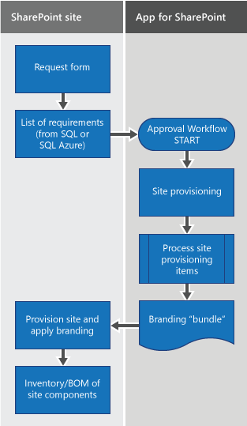

# Branding and site provisioning solutions for SharePoint

The introduction of the Cloud Add-in Model and SharePoint Add-ins provides alternatives to existing, established ways of branding and provisioning SharePoint sites. 

Up to now, you might have used the SharePoint feature framework, site templates, web templates, and site definitions to provision your sites and site collections. 

The articles in this section provide information about using SharePoint Add-ins to provision and manage site branding, a pattern that is sometimes referred to as **remote provisioning**. The remote provisioning pattern shows you how to create custom SharePoint Add-ins that provision site branding and perform other site provisioning tasks. 

This guidance applies to SharePoint Server 2013, SharePoint Server 2016, and SharePoint Online.

## What you need to know about SharePoint

To use the branding and site provisioning capabilities in SharePoint, you need to be familiar with the following:

- Key SharePoint terms and concepts
    
- The hierarchy of SharePoint structural elements

- SharePoint Add-ins

- The file system and content databases, and how they work together

- File customization states and their long-term impact on upgrades
    
- Types of SharePoint sites and why you would use them
    
- Client-side programming in SharePoint with the .NET client-side object model (CSOM) and REST APIs

## Terms and concepts

The following table lists terms and concepts that are useful to know as you start to work with SharePoint site provisioning and branding with the remote provisioning pattern.

**Table 1: Key SharePoint terms and concepts**

|Term or concept|Description|For more information|
|:-----|:-----|:-----|
|App web|The website from which an add-in is deployed.| [Host webs, add-in webs, and SharePoint components in SharePoint](../sp-add-ins/host-webs-add-in-webs-and-sharepoint-components-in-sharepoint.md)|
|Approval workflow|Workflows specific to publishing sites that specifies who approves the publication of a page and when.|- [SharePoint 2013 approval workflow](https://blogs.msdn.microsoft.com/thirusrinivasan1/2013/10/31/sharepoint-2013-workflow-calling-a-wcf-service/) - [Get started with workflows in SharePoint 2013](../general-development/get-started-with-workflows-in-sharepoint.md)|
|ClientContext|A central object that serves as a "center of gravity" for all SharePoint CSOM and JSOM operations.| [T:Microsoft.SharePoint.Client.ClientContext](https://msdn.microsoft.com/en-us/library/office/microsoft.sharepoint.client.clientcontext.aspx)|
|Cloud Add-in Model |SharePoint Add-ins are self-contained pieces of functionality that extend the capabilities of a SharePoint website. You can use the Cloud Add-in Model to author and deliver secure, reliable, flexible, and consistent SharePoint Add-ins.| [Overview of SharePoint Add-ins](../sp-add-ins/sharepoint-add-ins.md)|
|Content database|Content databases store all content for a site collection, including the following: - Site documents and files in document libraries - List data - Web part properties - User names and rights | [Database types and descriptions in SharePoint Server](https://docs.microsoft.com/en-us/SharePoint/technical-reference/database-types-and-descriptions)|
|CSOM|Client-side object model. A model for writing client-side code for SharePoint using the .NET Framework.|- [Get started using the client object model with external data in SharePoint](../general-development/get-started-using-the-client-object-model-with-external-data-in-sharepoint.md) - [[MS-CSOM]: SharePoint Client Query Protocol](https://msdn.microsoft.com/en-us/library/dd912094%28v=office.15%29.aspx) - [SharePoint .NET Server, CSOM, JSOM, and REST API index](../sp-add-ins/sharepoint-net-server-csom-jsom-and-rest-api-index.md)|
|Hive|SharePoint's physical files; the files in the file system. These files are distinct from content stored in a content database. The following is the location of the hive. `%program files%/Common Files/Microsoft Shared/Web Server Extensions/15/`||
|Host web|The website on which an add-in is installed.| [Host webs, add-in webs, and SharePoint components in SharePoint](../sp-add-ins/host-webs-add-in-webs-and-sharepoint-components-in-sharepoint.md)|
|OneDrive for Business|A personal library for storing and organizing work documents that are shareable within your organization.|- [OneDrive for Business is different from OneDrive](https://support.office.microsoft.com/en-us/article/What-is-OneDrive-for-Business-187f90af-056f-47c0-9656-cc0ddca7fdc2?CorrelationId=2ac1e496-1807-483a-a39f-c1a460efc7af&ui=en-US&rs=en-US&ad=US#differences) - [OneDrive for Business is different from your team site](https://support.office.microsoft.com/en-us/article/Should-I-save-my-documents-to-OneDrive-for-Business-or-a-team-site-d18d21a0-1f9f-4f6c-ac45-d52afa0a4a2e?CTT=5&origin=HA102822076&CorrelationId=e3a0512c-ab5f-4ae7-a58f-e33878242936&ui=en-US&rs=en-US&ad=US)|
|Remote provisioning|A model that provisions sites by using templates and code that runs outside SharePoint in a provider-hosted add-in.|- [Site provisioning techniques and remote provisioning in SharePoint 2013](https://blogs.msdn.microsoft.com/vesku/2013/08/23/site-provisioning-techniques-and-remote-provisioning-in-sharepoint-2013/) - [Self-Service Site Provisioning using Apps for SharePoint 2013](https://blogs.msdn.microsoft.com/richard_dizeregas_blog/2013/04/04/self-service-site-provisioning-using-apps-for-sharepoint-2013/)|
|REST| A stateless architectural style that abstracts architectural elements and uses HTTP verbs to read and write data from webpages that contain XML files.| [Set custom permissions on a list by using the REST interface](../sp-add-ins/set-custom-permissions-on-a-list-by-using-the-rest-interface.md)|
|Root web|The first web inside of a site collection. The root web is also sometimes referred to as the "Web Application Root." ||
|SharePoint Add-in|(Formerly "app for SharePoint") Lightweight web applications that integrate popular web standards and technologies to extend the capabilities of a SharePoint website by using the Cloud Add-in Model.| [SharePoint Add-ins](../sp-add-ins/sharepoint-add-ins.md)|
|SharePoint Online|Cloud-based SharePoint offering in Office 365. | [SharePoint Online General Reference](https://msdn.microsoft.com/en-us/library/office/gg271151%28v=office.14%29.aspx)|
|Site|A group of sites that share the same owner and administrative settings, such as permissions.| [T:Microsoft.SharePoint.Client.Web](https://msdn.microsoft.com/en-us/library/office/microsoft.sharepoint.client.web.aspx)|
|Site collection|A group of sites that share the same owner and administrative settings, such as permissions.| [Create a site collection in SharePoint Server](https://docs.microsoft.com/en-us/SharePoint/sites/create-a-site-collection)|
|Site provisioning|A process for equipping sites with the features, structure, brand, and other functionality.|- [Site provisioning techniques and remote provisioning in SharePoint 2013](https://blogs.msdn.microsoft.com/vesku/2013/08/23/site-provisioning-techniques-and-remote-provisioning-in-sharepoint-2013/) - [Self-Service Site Provisioning using Apps for SharePoint 2013](https://blogs.msdn.microsoft.com/richard_dizeregas_blog/2013/04/04/self-service-site-provisioning-using-apps-for-sharepoint-2013/)|
|Subsite|A single SharePoint site in a SharePoint site collection. A subsite can inherit navigation and permissions from a parent site, or it can have unique permissions and navigation. You can create subsites that are based on the root site collection, or sites based on other site collections. You can choose to inherit permissions from the site collection or specify unique permissions for the subsite.||

## Hierarchy of structural elements

Conceptually, the hierarchy of SharePoint objects is expressed in terms of containers: the types of objects and the type of the hierarchy contain all the types of objects under them in the hierarchy. Table 2 lists the hierarchy of SharePoint structural elements.

**Table 2. Hierarchy of SharePoint structural elements**

|Object type (in hierarchical order)|Description|
|:-----|:-----|
|Web applications|Applications that exist on a server and respond to requests from a browser. Web applications are the central structure in Internet Information Services (IIS). In SharePoint, a web application is a website with a unique URL and a separate content database stored in SQL Server.|
|Site collections|Containers of sites that define permissions, and that can define some aspects of branding, depending on the configuration, for all sites within the container.|
|Sites|A collection of lists, libraries, structure, navigation, and look and feel elements usually organized around a central topic or theme. Sites that are children of other sites in the same site collection are sometimes called subsites. A subsite is a site that is stored in a subfolder of the parent website. A subsite can inherit permissions and navigation structure from its parent site, or administration and authoring permissions might be unique for the subsite. Subsites can have child subsites.|
|Apps, lists, and document libraries|Containers of content and data that are organized into specific structures. The Master Page Gallery is a special document library in SharePoint 2010 publishing sites where all branding elements (master pages, page layouts, JavaScript files, CSS, and images) are stored by default. Every site has its own Master Page Gallery. In team sites, the master page comes from the site, not the site collection.|
|Items|Individual pieces of content or data that are contained in add-ins, lists, and document libraries.|

## SharePoint Add-ins

SharePoint Add-ins are lightweight solutions that don't install on the SharePoint host server, which means they don't make excessive API calls to the host server. You can build SharePoint Add-ins by using the Cloud Add-in Model. Users can discover and download add-ins from AppSource (formerly the Office Store) or from the enterprise's app catalog. For more information, see [Overview of SharePoint Add-ins](../sp-add-ins/sharepoint-add-ins.md). 

## File system and content databases

To understand your branding options and the implications that site customization can have on upgrade and migration, you'll need to understand the SharePoint file system and content databases and how they work together.

### File system

SharePoint stores files in the file system ("hive"). 

In SharePoint Server 2013 and SharePoint Server 2016, this location is called the **15-hive** or **16-hive**. 

The following is the path to this location: 

SharePoint Server 2013: `%program files%/Common Files/Microsoft Shared/Web Server Extensions/15/`

SharePoint Server 2016: `%program files%/Common Files/Microsoft Shared/Web Server Extensions/16/`

The 15-hive and 16-hive include several subfolders that store files you'll use when branding and provisioning sites.

### Content databases

Content databases store SharePoint content objects, such as site collections. A content database is automatically installed for every site collection when you deploy SharePoint Server 2013 or SharePoint Server 2016. All the content for a site collection is stored in one content database on one server. However, a content database can be associated with more than one site collection, and you can attach content databases to a SharePoint web application. You might need to move content from one content database to another, for example when the size of the content will soon exceed the size of the content database.

Some characteristics of a content database vary depending on how the site collection is used. For example, sites are often write-intensive, while other types of content, such as read-only documents, are read-intensive. How content is used affects aspects of the content database, such as size and performance. 

## File customization states 

The state of SharePoint files and content affects how easy it is to apply updates, and controls whether SharePoint serves the file from the content database or the file system. By default, all SharePoint files are uncustomized and ghosted, and reside in matching states in the SharePoint file system and in the content database. When a file, a content database entry, or both are used in specific ways or changed, the state of that content might be affected.

**Table 3. File and content states and their effects on upgrade**

|File or content state |Definition |Comment|
|:-----|:-----|:-----|
|**uncustomized**|An attribute associated with a file that indicates that it hasn't been modified.|More than one copy of a file can point to the same source. This makes it easier for designers to implement changes.|
|**customized**|An attribute associated with a file that indicates that it has been modified.|After a file becomes customized, it becomes more difficult to apply broad updates.  Be very careful about what you customize. As a general rule, it's better to use the default SharePoint files and functionality than to customize system files or introduce customizations that need to be manually updated.|
|**ghosted**|A file with a source that is stored outside the content database.|A pointer in the content database (the ghost of the file) still exists that tells SharePoint to look for the file's source on the server's file system.|
|**unghosted**|An uncustomized version of the source file resides in the content database.|Example: The SharePoint 2013 Design Manager creates a sandboxed solution to package branding files. It's never added to the file system of the server; therefore, by definition its files are considered unghosted. However, the files it deploys are still in an uncustomized state. |

> [!NOTE] 
> If a file has been customized, it won't be updated when you install new service packs or the SharePoint Online service is updated.

## Branding and site provisioning with the Cloud Add-in Model

In SharePoint Server 2013 or SharePoint Server 2016, you can use custom CSOM code in SharePoint Add-ins to provision SharePoint site collections, sites, and subsites with branding elements. This site provisioning pattern is called **remote provisioning**. SharePoint is increasingly focused on cloud-based deployments, so this pattern was created to help you use SharePoint's out-of-the-box capabilities to provision site branding in a way that reduces complexity and long-term operational costs.

### What can I do with the Cloud Add-in Model?

Sometimes there is no correlation between features in full-trust code and the Cloud Add-in Model. When developing a customization based on SharePoint Add-ins and the Cloud Add-in Model, consider an alternative approach rather than a direct conversion, and strive to keep customizations as simple as possible. Here are some examples:

- Replace event receivers with remote event receivers (see [Create a remote event receiver in SharePoint Add-ins](../sp-add-ins/create-a-remote-event-receiver-in-sharepoint-add-ins.md)).
    
- Replace site templates, web templates, and site definitions with remote provisioning. This works for both subsites and site collections.
    
- Replace timer jobs with Microsoft Azure.
    
Some things, such as HTTP modules and HTTP handlers, cannot be built with the Cloud Add-in Model. Before you try to replicate an existing customization in the Cloud Add-in Model, first consider why these customizations were built and whether an out-of-the-box SharePoint feature can work.

### Remote provisioning pattern

Remote provisioning uses new add-in patterns to move provisioning logic outside of the SharePoint farm entirely. This approach eliminates the need to use the feature framework or other customizations in the SharePoint farm, and instead enables you to control customizations outside of SharePoint. This approach makes it possible to update and change the provisioning engine without affecting SharePoint availability. For more information about the feature framework, see  [Site Definitions and Provisioning: the Feature Framework](https://docs.microsoft.com/en-us/previous-versions/office/developer/sharepoint-services/ms454453(v=office.12)). 

Aspects and implementations of the remote provisioning pattern are documented in detail in this section. You may find it useful to get started with the following introductions to the pattern:

-  [Self-Service Site Provisioning using Apps for SharePoint 2013](https://blogs.msdn.microsoft.com/richard_dizeregas_blog/2013/04/04/self-service-site-provisioning-using-apps-for-sharepoint-2013/)
    
-  [SharePoint 2013 site provisioning techniques presentation video recording](https://blogs.msdn.microsoft.com/vesku/2013/09/09/sharepoint-2013-site-provisioning-techniques-presentation-video-recording/)
    
-  [Why did we introduce SharePoint App pattern?](https://blogs.msdn.microsoft.com/vesku/2013/09/06/why-did-we-introduce-sharepoint-app-pattern/)
    
In the simplest implementation of the remote provisioning pattern, provisioning requirements are stored in a SQL Server or Azure SQL Database or XML file; a SharePoint Add-in then reads requirements from the data source, reads branding elements from their source location, and applies branding elements to the target site based on the provisioning requirements.

The branding and provisioning code samples follow this sequence of events to show the remote provisioning pattern.

**Table 4. Basic remote provisioning sequence and associated samples**

|Step|Description|Samples|Article|
|:-----|:-----|:-----|:-----|
|1|The user requests a change to the site through a form, which kicks off an approval workflow. The data that the user submits via the request form are stored using potentially any data storage format (SQL, Azure SQL, XML).| 
[SharePoint 2013: Use workflow to provision a SharePoint site (host web)](https://code.msdn.microsoft.com/SharePoint-2013-Use-e2ee88dd)

[SharePoint 2013: Use workflow to provision a SharePoint site (app web)](https://code.msdn.microsoft.com/SharePoint-2013-Use-2b96feb7)
| [SharePoint site provisioning solutions](sharepoint-site-provisioning-solutions.md)|
|2|If the workflow is approved, the SharePoint Add-in calls the stored data, and provisions the site according to the metadata that user submitted in step 1.| 
[Provision sites in batches with the add-in model](https://code.msdn.microsoft.com/Provision-sites-in-batches-fcf31bc6)

[SharePoint 2013: Use workflow to provision a SharePoint site (host web)](https://code.msdn.microsoft.com/SharePoint-2013-Use-e2ee88dd)

[SharePoint 2013: Use workflow to provision a SharePoint site (app web)](https://code.msdn.microsoft.com/SharePoint-2013-Use-2b96feb7)

[SharePoint 2013: Use SharePoint Add-ins to provision on-prem site collection](https://code.msdn.microsoft.com/SharePoint-2013-Use-apps-9094e012)
| [SharePoint site provisioning solutions](sharepoint-site-provisioning-solutions.md)|
|3|The SharePoint Add-in scopes provisioning to the instructions in the request form by using the data available in the add-in web and content database. During this stage, applicable branding elements are provisioned to the site.| 
[SharePoint 2013: Use a SharePoint Add-in to configure CSS](https://code.msdn.microsoft.com/SharePoint-2013-Use-an-app-c5d78f25)

[SharePoint 2013: Use a SharePoint Add-in to apply a theme to a SharePoint site](https://code.msdn.microsoft.com/SharePoint-2013-Use-an-app-d90a49e3)

[SharePoint 2013: Brand a SharePoint OneDrive For Business site](https://code.msdn.microsoft.com/SharePoint-2013-Brand-a-6da627cb)

[SharePoint 2013: Provision custom CSS to a site with remote provisioning](https://code.msdn.microsoft.com/SharePoint-2013-Provision-bf1d878a)

[SharePoint 2013: Use a SharePoint Add-in to provision a wiki page](https://code.msdn.microsoft.com/SharePoint-2013-Use-an-app-5db977e8)
|
[SharePoint pages and the page model](sharepoint-pages-and-the-page-model.md)

[SharePoint site branding and page customization solutions](sharepoint-site-branding-and-page-customization-solutions.md)

[SharePoint site provisioning solutions](sharepoint-site-provisioning-solutions.md)|

> [!NOTE] 
> Table 4 lists the steps that might be typical of a remote provisioning scenario. The samples you use depend on the approach that works best for your enterprise. For example, if you don't have a business need to create a custom approval workflow, you won't use that sample. 

**Example of a site provisioning and branding workflow using the remote provisioning pattern**

### How remote provisioning affects pre-existing site content

Depending on the specific site elements that you want to provision, your code will override default or pre-existing site content with a hook for the remote provisioning SharePoint Add-in. The add-in will select site templates and other capabilities based on the provisioning requirements stored in the database, without configuring SharePoint at all.

The basic remote provisioning pattern is the same regardless of additional requirements. However, when you plan to use this pattern to provision site branding, map your brand development strategy in the context of the customization capabilities that SharePoint CSOM, JSOM, and REST APIs provide (the code samples described in this section use CSOM). Also consider: 

- Site architecture. Are you building an Internet-facing site, an intranet site, or an extranet that requires authorized users to sign in through the Internet-facing site to access company data?
    
- The degree of control that specific users have to define and request provisioning requirements. Should users be able to specify custom provisioning options by using a form? Are changes applied to the site automatically, only after people with decision-making power approve the changes, or are they managed by a governance policy?
    
- The types of branding customizations you want to apply (structural, look and feel, or both).

## Branding and site provisioning code samples

The code samples described in this section show the core scenario and extend it to cover some more specific use cases. The articles in this section also include some code examples. The following tables list and describe the samples.

**Table 5. Site provisioning samples**

|Sample|Description|Related article|
|:-----|:-----|:-----|
|Batch provisioning|Provisions site collections in a console app.| [SharePoint site provisioning solutions](sharepoint-site-provisioning-solutions.md)|
| [Provisioning.Pages](https://github.com/SharePoint/PnP/tree/master/Samples/Provisioning.Pages)|Shows how to use the remote provisioning model to provision a wiki page and add remote web parts and HTML from the wiki page.| [SharePoint pages and the page model](SharePoint-pages-and-the-page-model.md)|
|SiteProvisioningWorkflow|Provisions site collections with a workflow on the host web and a remote event receiver.| [SharePoint site provisioning solutions](sharepoint-site-provisioning-solutions.md)|
|SiteProvisioningWorkflowAppWeb|Provisions site collections with a workflow on the add-in web and a remote event receiver.| [SharePoint site provisioning solutions](sharepoint-site-provisioning-solutions.md)|

> [!NOTE] 
> The BatchProvisioning, SiteProvisioningWorkflow, and SiteProvisioningWorkflowAppWeb samples demonstrate the core concepts and functions of the remote provisioning pattern. The ProvisionWikiPages sample addresses a specific use case (wiki page provisioning).

**Table 6. Branding samples**

|Sample|Description|Related article|
|:-----|:-----|:-----|
| [Branding.Theme](https://github.com/SharePoint/PnP/tree/master/Samples/Branding.Themes)|Shows how to apply a theme (CSOM).| [SharePoint site branding and page customization solutions](sharepoint-site-branding-and-page-customization-solutions.md)|
| [OD4B.Configuration.Async](https://github.com/SharePoint/PnP/tree/master/Solutions/OD4B.Configuration.Async)|Shows how to use the remote provisioning model to provision a wiki page and add remote web parts and HTML from the wiki page.| [SharePoint site branding and page customization solutions](SharePoint-site-branding-and-page-customization-solutions.md)|
| [Branding.AlternateCSSAndSiteLogo ](https://github.com/SharePoint/PnP/tree/master/Samples/Branding.AlternateCSSAndSiteLogo)|Shows how to set custom CSS to the host site by using a user customer action and embedded JavaScript (CSOM).| [SharePoint site branding and page customization solutions](sharepoint-site-branding-and-page-customization-solutions.md)|
| [Provisioning.OnPrem.Async](https://github.com/SharePoint/PnP/tree/master/Samples/Provisioning.OnPrem.Async) [Provisioning.SiteCol.OnPrem](https://github.com/SharePoint/PnP/tree/master/Samples/Provisioning.SiteCol.OnPrem)|Shows how to use a service to encapsulate all the information in SharePoint host web to the Prem)|Shows how to use a service to encapsulate all the information in SharePoint host web to the add-in web, get a web, get a list of site collections in a specified web application, and create a content type with a specific ContentTypeId.  This sample is especially useful when you want to use the remote provisioning pattern to provision sites by using SharePoint Add-ins, but the CSOM member you need to complete your scenario is not yet available in CSOM. | [SharePoint site provisioning solutions](sharepoint-site-provisioning-solutions.md)|

## SharePoint branding workflow

Branding a SharePoint website is a lot like branding other websites. You use web technologies that you're familiar with, such as HTML, CSS, and JavaScript to build the structure, look and feel, and custom behavior of your sites. SharePoint is also based on ASP.NET, and uses a page model that is very similar to the ASP.NET master page/page layout model. The page model encompasses the structure and provides hooks and logic for applying look and feel elements.

SharePoint provides several web parts that you can use to incorporate data views, images, scripts, search results, and more into your site design. Composed looks provide an easy way for users to customize the look and feel of their site while reinforcing designer and IT department control over design details and look and feel options that are available, and both the theming engine and custom CSS capabilities open the door for more advanced branding customizations. 

The branding design and development workflow for SharePoint websites closely resembles the design workflow the industry uses:

- Plan your site architecture and design.
    
- Create design assets using familiar web design tools and technologies.
    
- Build your site using SharePoint tools such as Design Manager.
    
- Package your site design, and use SharePoint Add-ins and the remote provisioning pattern to provision site branding.

> [!NOTE] 
> Applying branding in SharePoint means modifying the look and feel of a default SharePoint site. This can include making both structural and cosmetic changes to the site's appearance.

### Branding cost and complexity

Branding changes range from low-cost and simple to high-cost and complex. Through the UI, users can apply composed looks, which include a background image, color palette, fonts, and a master page associated with these elements, and a preview file associated with the master page. You can use the SharePoint theming engine to create your own themes, and you can create custom CSS to modify the look and feel of your site. 

> [!IMPORTANT] 
> Although it's possible to create custom master pages and other structural elements as part of a custom branding project, the long-term cost of supporting structural customizations can be high, and might make it more costly for your organization to apply upgrades and support the long-term applicability of short-term investments in customization.

### Branding SharePoint sites hosted on-premises or on a dedicated farm

You can use the remote provisioning pattern to brand team sites, publishing sites, and OneDrive for Business sites that are hosted on-premises or on a dedicated farm at both the site collection and subsite level. 

### SharePoint Online

Part of planning a SharePoint branding project is deciding which types of sites you want to build, brand, and provision. SharePoint Online licensing affects whether publishing site capabilities are available to you. While all licenses enable you to specify at least one public website that has some of the features of a SharePoint Server publishing site, not all licenses provide full publishing site capabilities.

**Table 7. Site options in SharePoint Online**

|Office 365 edition|Team site|Public website|Publishing site|Notes|
|:-----|:-----|:-----|:-----|:-----|
|Small business|Yes|Yes|No|Includes one team site and the public website. Does not include publishing site functionality. The public website capabilities were designed with small business in mind.|
|Enterprise|Yes|No|Yes|Includes a team site collection at the root web application for the domain that does not include publishing, and you can create new publishing site collections under that root web application. |
For more information, see [Select an Office 365 plan for business](https://products.office.com/en-us/compare-all-microsoft-office-products?tab=2) and [Model: Design and branding in SharePoint 2013](https://www.microsoft.com/en-us/download/details.aspx?id=30715).

## When should I customize?

Most functionality that you need to meet your business needs is available out-of-the-box in SharePoint. Therefore, before creating a customization, determine whether there is an actual business case for creating the customization and what the long-term costs of creating and supporting this customization would be to the enterprise. How are features and functionality provided for end users? Look at business goals and user experience considerations before technology.

When working with an existing custom SharePoint solution and weighing whether and how to migrate it to the Cloud Add-in Model, first understand why the customization was done and what purpose it serves. 

When considering moving an existing customization from full-trust code to the Cloud Add-in Model, there usually isn't a one-to-one relationship between features and functionality. Rather than trying to find a one-to-one match between server-side and client-side code, consider alternative approaches. Table 8 maps some commonly used concepts and functionality of SharePoint solutions to their equivalents in SharePoint Add-ins.

**Table 8. Mapping SharePoint concepts to add-ins**

|Task|In SharePoint solution|In SharePoint Add-ins|Guidance|
|:-----|:-----|:-----|:-----|
|Display information in SharePoint pages|Web parts|App parts|Web parts run on the SharePoint Server with user permission or full-permissions/elevated privilege.  App parts run in the browser or on an external server with an app identity with specifically granted permissions. They are completely isolated on the client in their own domain.  Add-in parts are executed outside of SharePoint and incur no performance impact on the SharePoint Server.  [Create add-in parts to install with your SharePoint Add-in](../sp-add-ins/create-add-in-parts-to-install-with-your-sharepoint-add-in.md)|
|Create and manage notifications|Event receivers and feature receivers|Remote event receivers and add-in event receivers|Event receivers and feature receivers require server-side code and can't notify external systems of events.  Remote event receivers use client-side code, can be used in SharePoint solutions or SharePoint Add-ins, and can notify external systems of events.  App event receivers execute code when add-ins are installed, uninstalled, or upgraded.  - [Handle events in SharePoint Add-ins](../sp-add-ins/handle-events-in-sharepoint-add-ins.md) - [Create a remote event receiver in SharePoint Add-ins](../sp-add-ins/create-a-remote-event-receiver-in-sharepoint-add-ins.md)|
|Access data|.NET server object model (SSOM), .NET client object model (CSOM), and OData|.NET client object model (CSOM, JSOM), OData, REST, cross-domain libraries|- [Complete basic operations using SharePoint client library code](../sp-add-ins/complete-basic-operations-using-sharepoint-client-library-code.md) - [Complete basic operations using JavaScript library code in SharePoint](../sp-add-ins/complete-basic-operations-using-javascript-library-code-in-sharepoint.md) - [Get to know the SharePoint REST service](../sp-add-ins/get-to-know-the-sharepoint-rest-service.md) - [SharePoint .NET Server, CSOM, JSOM, and REST API index](../sp-add-ins/sharepoint-net-server-csom-jsom-and-rest-api-index.md)|
|Package and deploy|Solution packages (WSPs, feature packages)|App catalog and AppSource (Office Store)|Solution packages are difficult to deploy across a SharePoint farm. You can publish a SharePoint Add-in to AppSource if you want to make it publicly available or sell it. Use the add-in catalog to make a SharePoint Add-in available within your organization. Guidance and code samples in the solution pack demonstrate how to use SharePoint Add-ins to provision branding elements to your SharePoint site.  - [Use the site collection app catalog](../general-development/site-collection-app-catalog.md)  - [Make your solutions available in AppSource and within Office](https://docs.microsoft.com/en-us/office/dev/store/submit-to-the-office-store) - [Choose patterns for developing and hosting your SharePoint Add-in](../sp-add-ins/choose-patterns-for-developing-and-hosting-your-sharepoint-add-in.md)|
|Use external data|External content types|App-scoped external content types|SharePoint site administrators or SharePoint Designer users must create and/or install external content types, which can be installed only at the farm level.  App-scoped external content types apply only to the SharePoint Add-in for which they were created, require no administration, and can access OData sources.  - [Add-in-scoped external content types in SharePoint](../general-development/add-in-scoped-external-content-types-in-sharepoint.md) - [Create an external content type from an OData source in SharePoint](../general-development/how-to-create-an-external-content-type-from-an-odata-source-in-sharepoint.md)|
|Add custom pages and master pages|Application pages and site pages|Web-hosted pages|Application pages are shared across all sites on the server and are hosted on SharePoint.  Site pages are hosted by SharePoint, and require that page controls be listed in a safe controls list.  While application pages are ideal for custom code, custom code on site pages will break after customization. Instead, use web-hosted pages. They are designed to be customizable, support the use of built-in web parts on site pages, are hosted externally, and are available anywhere the add-in is installed.|

## See also

-  [SharePoint development and design tools and practices](sharepoint-development-and-design-tools-and-practices.md)   
-  [Office 365 development and SharePoint PnP solution guidance](office-365-development-patterns-and-practices-solution-guidance.md)
    
