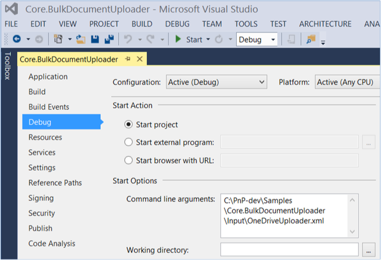

# Bulk upload documents sample SharePoint Add-in

> [!NOTE] 
> The sample uploads one file to a document library. To upload multiple files, you'll need to extend the sample.

The Core.BulkDocumentUploader sample add-in uses a console application to upload files by using REST API calls. Configuration settings are specified in an XML and a CSV file. 

Use this solution if you want to:

- Upload files to SharePoint Online. 
- Migrate to Office 365 and use a custom migration tool to move your files.

## Before you begin

To get started, download the [Core.BulkDocumentUploader](https://github.com/SharePoint/PnP/tree/master/Samples/Core.BulkDocumentUploader) sample add-in from the Office 365 Developer Patterns and Practices project on GitHub.

> [!NOTE] 
> The code in this article is provided as-is, without warranty of any kind, either express or implied, including any implied warranties of fitness for a particular purpose, merchantability, or non-infringement.

Before you run the code sample, do the following:

1. Edit the OneDriveUploader.xml file with the following information:
    
	- The location where you want to save your text and CSV log files.
	- The file path to your CSV mapping file (for example, C:\PnP\Samples\Core.BulkDocumentUploader\Input\SharePointSites.csv).
	- The location of the company policy files to upload (for example, C:\PnP\Samples\Core.BulkDocumentUploader\Input\OneDriveFiles).
	- Your SharePoint Online credentials.
	- The document action to perform (either upload or delete).
	- The new file name to apply to the file after the file is uploaded to the document library (for example, COMPANY POLICY DOCUMENT.xlsx).
    
2. In the SharePointSites.csv mapping file, list the document library URL to upload files to, and the name of the company policy file to upload. 
    
3. Add the file path of the OneDriveUploader.xml file as a command-line argument. To do this, open the Core.BulkDocumentUploader project properties in Solution Explorer, and then choose **Properties** > **Debug**.

    


## Using the Core.BulkDocumentUploader sample add-in

From the **Main** method in Program.cs, the **RecurseActions** method calls the **Run** method in OneDriveMapper.cs. The **Run** method gets the location of the file to upload from SharePointSites.csv, and then calls the **IterateCollection** method.

```csharp
public override void Run(BaseAction parentAction, DateTime CurrentTime, LogHelper logger)
        {
            CsvProcessor csvProcessor = new CsvProcessor();

            logger.LogVerbose(string.Format("Attempting to read mapping CSV file '{0}'", this.UserMappingCSVFile));

            using (StreamReader reader = new StreamReader(this.UserMappingCSVFile))
            {
                csvProcessor.Execute(reader, (entries, y) => { IterateCollection(entries, logger); }, logger);
            }
        }

```

<br/>

The SharePointSite.csv file lists a file to upload and the document library to upload that file to. The  **IterateCollection** method then does the following to upload the file to the document library:

1. Gets the file to upload. 
    
2. Ensures that the user has permissions to add items.
    
3. Creates the **HttpWebRequest** object with the authentication cookie, the REST string request to upload the document, and the HTTP request action method.
    
4. Performs the file upload.

> [!NOTE] 
> The file name is overwritten with the value of **FileUploadName** specified in OneDriveUploader.xml.

```csharp
public override void IterateCollection(Collection<string> entries, LogHelper logger)
        {
            Stopwatch IterationSW = new Stopwatch();
            IterationSW.Start();

            logger.LogVerbose(string.Format(CultureInfo.CurrentCulture, "Establishing context object to: '{0}'", entries[this.SiteIndex]));

            try
            {
                // Use the context of the current iteration URL for current user item.
                using (ClientContext context = new ClientContext(entries[this.SiteIndex]))
                {
                    using (SecureString password = new SecureString())
                    {
                        foreach (char c in this.Password.ToCharArray())
                        {
                            password.AppendChar(c);
                        }

                        context.Credentials = new SharePointOnlineCredentials(this.UserName, password);

                        // Get the file to upload from the directory.
                        FileInfo theFileToUpload = new FileInfo(Path.Combine(this.DirectoryLocation + "\\", entries[this.FileIndex] + ".xlsx"));

                        logger.LogVerbose(string.Format(CultureInfo.CurrentCulture, "Attempting to {0} file {1}", this.DocumentAction, theFileToUpload));

                        // Ensure that the account has permissions to access.
                        BasePermissions perm = new BasePermissions();
                        perm.Set(PermissionKind.AddListItems);

                        ConditionalScope scope = new ConditionalScope(context, () => context.Web.DoesUserHavePermissions(perm).Value);

                        using(scope.StartScope())
                        {
                            Stopwatch tempSW = new Stopwatch();
                            tempSW.Start();

                            int success = 0;

                            while(tempSW.Elapsed.TotalSeconds < 20)
                            {
                                var digest = context.GetFormDigestDirect();

                                string cookie = ((SharePointOnlineCredentials)context.Credentials).GetAuthenticationCookie(new Uri(entries[this.SiteIndex])).TrimStart("SPOIDCRL=".ToCharArray());

                                using (Stream s = theFileToUpload.OpenRead())
                                {
                                    // Define REST string request to upload document to context. This string specifies the Documents folder, but you can specify another document library.
                                    string theTargetUri = string.Format(CultureInfo.CurrentCulture, "{0}/_api/web/lists/getByTitle('Documents')/RootFolder/Files/add(url='{1}',overwrite='true')?", entries[this.SiteIndex], this.FileUploadName);

                                    // Define REST HTTP request object.
                                    HttpWebRequest SPORequest = (HttpWebRequest)HttpWebRequest.Create(theTargetUri);

                                    // Define HTTP request action method.
                                    if (this.DocumentAction == "Upload")
                                    {
                                        SPORequest.Method = "POST";
                                    }
                                    else if (this.DocumentAction == "Delete")
                                    {
                                        SPORequest.Method = "DELETE";
                                    }
                                    else
                                    {
                                        logger.LogVerbose(string.Format(CultureInfo.CurrentCulture, "There was a problem with the HTTP request in DocumentAction attribute of XML file"));
                                        throw new Exception("The HTTP Request operation is not supported, please check the value of DocumentAction in the XML file");
                                    }

                                    // Build out additional HTTP request details.
                                    SPORequest.Accept = "application/json;odata=verbose";
                                    SPORequest.Headers.Add("X-RequestDigest", digest.DigestValue);
                                    SPORequest.ContentLength = s.Length;
                                    SPORequest.ContentType = "application/octet-stream";

                                    // Handle authentication to context through cookie.
                                    SPORequest.CookieContainer = new CookieContainer();
                                    SPORequest.CookieContainer.Add(new Cookie("SPOIDCRL", cookie, string.Empty, new Uri(entries[this.SiteIndex]).Authority));

                                    // Perform file upload/deletion.
                                    using (Stream requestStream = SPORequest.GetRequestStream())
                                    {
                                        s.CopyTo(requestStream);
                                    }

                                    // Get HTTP response to determine success of operation.
                                    HttpWebResponse SPOResponse = (HttpWebResponse)SPORequest.GetResponse();

                                    logger.LogVerbose(string.Format(CultureInfo.CurrentCulture, "Successfully '{0}' file {1}", this.DocumentAction, theFileToUpload));
                                    logger.LogOutcome(entries[this.SiteIndex], "SUCCCESS");

                                    success = 1;

                                    // Dispose of the HTTP response.
                                    SPOResponse.Close();

                                    break;
                                }
                                                       
                            }

                            tempSW.Stop();

                            if (success != 1)
                            {
                                throw new Exception("The HTTP Request operation exceeded the timeout of 20 seconds");
                            }

                        }
                    }
                }

            }
            catch(Exception ex)
            {
                logger.LogVerbose(string.Format(CultureInfo.CurrentCulture, "There was an issue performing '{0}' on to the URL '{1}' with exception: {2}", this.DocumentAction, entries[this.SiteIndex], ex.Message));
                logger.LogOutcome(entries[this.SiteIndex], "FAILURE");
            }
            finally
            {
                IterationSW.Stop();
                logger.LogVerbose(string.Format(CultureInfo.CurrentCulture, "Completed processing URL:'{0}' in {1} seconds", entries[this.SiteIndex], IterationSW.ElapsedMilliseconds/1000));
            }
        }

```

## See also
  
- [Core.LargeFileUpload sample](https://github.com/SharePoint/PnP/tree/master/Samples/Core.LargeFileUpload)  
- [Enterprise Content Management solutions for SharePoint](enterprise-content-management-solutions-for-sharepoint.md)
