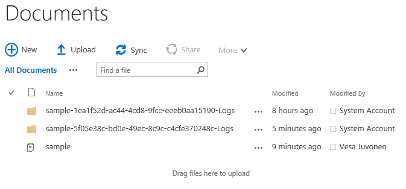

# Introducing the API for Bulk Updating Custom User Profile Properties for SharePoint Online


_**Applies to:** SharePoint Online_

As part of the new Client Side Object Model (CSOM) version (4622.1208 or newer), SharePoint has the ability to bulk import custom user profile properties. Prior to this release, your only option was to take advantage of the user profile CSOM operations for updating specific properties for individual user profiles. However, this approach is inefficient and too time consuming (especially when dealing with thousands of profiles).

Many enterprises need to replicate custom attributes to the SharePoint user profile service and so a more performant user profile bulk API has been released.

## An Overview of the Bulk User Profile Update Process
<a name="sectionSection0"> </a>


1. User attributes are synchronized from the corporate Active Directory to the Azure Active Directory. You can select which attributes are replicated across on-premises and Azure.
2. A standardized set of attributes are replicated from Azure Active Directory to the SharePoint Online User Profile Store within Office 365. Unlke on-premises SharePoint, these attributes cannot be customized.
3. A custom synchronization tool taking advantage of the new bulk update APIs. This tool uploads a JSON file to the Office 365 tenant and queues the import process. This tool can be implemented using managed code (.NET) or as a PowerShell script using the new CSOM APIs.
4. A Line of Business (LOB) system, or any external system, which is the source of the information in the JSON file. This could also be a combination of data from Active Directory and any external system. Notice that from an API perspective, the LOB system could even be an on-premises SharePoint 2013 or 2016 farm.
5. An out-of-the-box server side timer job running in SharePoint online which checks for queued import requests and will perform the actual import operation based on the API calls and the information within the provided JSON file.
6. Extended user profile information is available within user profiles and can be used for any out-of-the-box or custom functionality in SharePoint online.

> [!NOTE] 
> The import only works for user profile properties which have **not** been set to be editable by end users. This is to prevent the user profile import process from overriding any information which an end user has already updated. Additionally, the import only allows custom properties that are not active directory core properties. These must be synchronized to Azure Active Directory. For the list of these core directory properties, see the table listed in the FAQ section below.

Below is a brief video that demonstrates using the new CSOM API from both managed code (.NET) and from PowerShell. You can find the sample code used, including the sample PowerShell script, in the [Office Dev PnP Code Gallery](http://dev.office.com/patterns-and-practices-detail/7202).

<iframe id="ytplayer" type="text/html" width="640" height="390" src="https://www.youtube.com/embed/-X_2T0SRUBk?autoplay=0&origin=https://msdn.microsoft.com" frameborder="0"></iframe>

## Import File Format
<a name="sectionSection1"> </a>

The import process uses a JSON file containing the properties and their values. Below is the expected structure of that file:   

```JSON
{
   "value": [
     {
       "<IdName>": "<UserIdValue_1>",
       "<AttributeName_1>": "<User1_AttributeValue_1>",
       "<AttributeName_2>": "<User1_AttributeValue_2>",
     },
     {
       "<IdName>": "<UserIdValue_2>",
       "<AttributeName_1>": "<User2_AttributeValue_1>",
       "<AttributeName_2>": "<User2_AttributeValue_2>",
     },
     {
       "<IdName>": "<UserIdValue_n>",
       "<AttributeName_1>": "<Usern_AttributeValue_1>",
       "<AttributeName_2>": "<Usern_AttributeValue_2>",
     }
   ]
}
```

Below is a simple example file using the format above:

```JSON
{
  "value": [
    {
      "IdName": "vesaj@contoso.com",
      "City": "Helsinki",
      "Office": "Viper"
    },
    {
      "IdName": "bjansen@contoso.com",
      "City": "Brussels",
      "Office": "Beetle"
    },
    {
      "IdName": "unknowperson@contoso.com",
      "City": "None",
      "Office": ""
    },
    {
      "IdName": "erwin@contoso.com",
      "City": "Stockholm",
      "Office": "Elite"
    }
  ]
}
```

In the example above, identity resolution is based on the `IdName` property and there are two properties which are being updated called `City` and `Office`. The file contains information for four different accounts within the tenant. Property names used in this source file are not necessarily the same as the names used within the SharePoint Online User Profile Service since we will provide correct property mapping within our code. 

### Source Data File Restrictions
There are few restrictions on individual source data files:
- Maximum file size: 2GB
- Maximum number of properties: 500,000
- The source file must be uploaded to the same SharePoint Online tenant where the process is started


## User Profile Property Import Process
<a name="sectionSection2"> </a>

Here’s the full process:

1. Create or synchronize users in an Office 365 tenant or to the Azure AD associated to it
	 - When users are synchronized to Azure AD, it will also synchronize a standardized set of attributes to the SharePoint Online User Profile Service.
2. Create any needed custom properties within the User Profile Service
	 - Since there’s no remote APIs for creating custom properties in the User Profile Service, this step must be performed manually for each of the tenants where custom user profile properties are needed (this only needs to be done once per tenant).
	 - Only user profile properties which are not “allowed to be edited by end users” can be imported. Trying to import a JSON object property to a user profile property which is marked as “editable by end users” will result in an exception when the CSOM API is called.
3. Create and upload the JSON file to the Office 365 tenant
	 - You’ll need to upload the JSON data file containing the information to be updated to the Office 365 tenant.
	 - In the case of any exception during the import process, SharePoint will provide additional logging information saved in the same document library where the file existed within a new sub folder.
	 - Cleaning of the log files and JSON files are not done automatically and is the responsibility of the custom solution using the API. You should consider the life cycle of these files within your implementation. These files are stored in document libraries so they will be consuming a portion of the assigned storage for the site collection.
4. Call the bulk UPA Import API for queuing the import job
	 - Use the CSOM API to queue the import process. This can be achieved by executing CSOM code using either managed code (.NET) or PowerShell.
	 - The method to queue the job requires property mapping information and the location of the data file. This method will quickly execute because it just queues the actual import process, which will later be executed as part of a back end process in SharePoint Online.
5. Check the status of the import job
	 - You can also use remote APIs to check the status of a specific import job or all of the recent import jobs. To be able to check the status of a specific call, you should store the unique job identifier received as a return value when the job is queued.


## CSOM API for the Bulk Import Process
<a name="sectionSection3"> </a>

### Queue Import
You can queue the import process by calling the [`QueueImportProfileProperties`](https://msdn.microsoft.com/en-us/library/office/microsoft.online.sharepoint.tenantmanagement.office365tenant.queueimportprofileproperties.aspx) method located in the [`Office365Tenant`](https://msdn.microsoft.com/en-us/library/office/microsoft.online.sharepoint.tenantmanagement.office365tenant.aspx) object. This is an asynchronous call in that it doesn’t download the source data or perform the import, it simply adds a work item to the queue for doing this later. Here’s the full signature of the method:

```c#
public ClientResult<Guid> QueueImportProfileProperties(
                          ImportProfilePropertiesUserIdType idType, 
                          string sourceDataIdProperty, 
                          IDictionary<string, string> propertyMap, 
                          string sourceUri);
```

#### Parameters

**idType**: _[`ImportProfilePropertiesUserIdType`](https://msdn.microsoft.com/en-us/library/office/microsoft.online.sharepoint.tenantmanagement.importprofilepropertiesuseridtype.aspx)_

The type of id to use when looking up the user profile. Possible values are `Email`, `CloudId`, and `PrincipalName`. Note that regardless of the type, the user must already exist in the User Profile Service for the import to work. It’s recommended to use the `CloudId` to ensure uniqueness.

Property mapping between ID Type and Azure AD property:

UPA Bulk Import ID Type | Azure Directory Attribute
--- | ---
CloudId | ObjectID
PrincipalName | userPrincipalName
Email | mail

**sourceDataIdProperty**: _`System.String`_

The name of the id property in the source data. The value of the property from the source data will be used to lookup the user. The User Profile Service property used for the lookup depends on the value of `idType`.

**propertyMap**: _`IDictionary<string, string>`_

A map from the source property name to the User Profile Service property name. Note that the User Profile Service properties must already exist. The key is the property name used in the source file, the value is the property name used in the User Profile Service.

**sourceUri**: _`System.String`_

The URI of the source data file to import. The file should not be moved or deleted right away as it may not be downloaded for some time.

#### Return value
A Guid that identifies the import job that has been queued.

#### Example
Below is an example using C# of how to start the process using the sample input file above:

```c#
// Create an instance of the Office 365 Tenant object. Loading this object is not technically needed for this operation. 
Office365Tenant tenant = new Office365Tenant(ctx);
ctx.Load(tenant);
ctx.ExecuteQuery();

// Type of user identifier ["PrincipalName", "Email", "CloudId"] in the 
// User Profile Service. In this case, we use Email as the identifier at the UPA storage
ImportProfilePropertiesUserIdType userIdType = 
      ImportProfilePropertiesUserIdType.Email;

// Name of the user identifier property within the JSON file
var userLookupKey = "IdName";

var propertyMap = new System.Collections.Generic.Dictionary<string, string>();

// The key is the property in the JSON file, 
// The value is the user profile property Name in the User Profile Service
// Notice that we have 2 custom properties in UPA called 'City' and 'OfficeCode'
propertyMap.Add("City", "City");
propertyMap.Add("Office", "OfficeCode");

// Returns a GUID which can be used to check the status of the execution and the end results
var workItemId = tenant.QueueImportProfileProperties(
      userIdType, userLookupKey, propertyMap, fileUrl
      );

ctx.ExecuteQuery();
```

### Check the Status of an Import Job
You can also check the status of the User Profile Service import jobs by using the new CSOM APIs. There are two new methods for this in the Tenant object.

You can check status of an individual import job by using the [`GetImportProfilePropertyJob`](https://msdn.microsoft.com/en-us/library/office/microsoft.online.sharepoint.tenantmanagement.office365tenant.getimportprofilepropertyjob.aspx) method located in the [`Office365Tenant`](https://msdn.microsoft.com/en-us/library/office/microsoft.online.sharepoint.tenantmanagement.office365tenant.aspx) object. You will need to have the unique identifier of a specific import job provided as a parameter to this method. Here’s the full signature of the method:

```c#
public ImportProfilePropertiesJobInfo GetImportProfilePropertyJob(Guid jobId);
```

#### Parameters
**jobID**: _`System.Guid`_

The id of the job for which to get the high-level status.

#### Return value

An [`ImportProfilePropertiesJobStatus`](https://msdn.microsoft.com/en-us/library/office/microsoft.online.sharepoint.tenantmanagement.importprofilepropertiesjobinfo.aspx) object with high level status information about the specified job.

#### Example
Below is an example using C# of retrieving the status of a specific import job using a stored identifier:

```c#
// Check the status of a specific request based on the job id received when we queued the job
Office365Tenant tenant = new Office365Tenant(ctx);
var job = tenant.GetImportProfilePropertyJob(workItemId);
ctx.Load(job);
ctx.ExecuteQuery();
```

You can check the status of all import jobs by using the [`GetImportProfilePropertyJobs`](https://msdn.microsoft.com/en-us/library/office/microsoft.online.sharepoint.tenantmanagement.office365tenant.getimportprofilepropertyjobs.aspx) method located in the [Office365Tenant](https://msdn.microsoft.com/en-us/library/office/microsoft.online.sharepoint.tenantmanagement.office365tenant.aspx) object. Here’s the full signature of the method:

```c#
public ImportProfilePropertiesJobStatusCollection GetImportProfilePropertyJobs(); 
```

#### Return value
An [`ImportProfilePropertiesJobStatusCollection`](https://msdn.microsoft.com/en-us/library/office/microsoft.online.sharepoint.tenantmanagement.importprofilepropertiesjobstatuscollection.aspx) object which is a collection of [`ImportProfilePropertiesJobStatus`](https://msdn.microsoft.com/en-us/library/office/microsoft.online.sharepoint.tenantmanagement.importprofilepropertiesjobinfo.aspx) objects with high level status information about each of the jobs.

#### Example
Below is an example using C# of getting the status of all import jobs currently saved in the tenant. These could be already processed or queued jobs:

```c#
// Load all import jobs – old and queued ones
Office365Tenant tenant = new Office365Tenant(ctx);
var jobs = tenant.GetImportProfilePropertyJobs();
ctx.Load(jobs);
ctx.ExecuteQuery();
foreach (var item in jobs)
{
   // Check whatever properties needed
   var state = item.State;
}
```

An [`ImportProfilePropertiesJobInfo`](https://msdn.microsoft.com/en-us/library/office/microsoft.online.sharepoint.tenantmanagement.importprofilepropertiesjobinfo.aspx) object returned with the import status information has the following properties. 

**JobId**: _`System.Guid`_

The Id of the import job

**State**: _[`ImportProfilePropertiesJobState`](https://msdn.microsoft.com/en-us/library/office/microsoft.online.sharepoint.tenantmanagement.importprofilepropertiesjobstate.aspx)_

An enum with following values:
- `Unknown` - We cannot determine the state of the job
- `Submitted` - The job has been submitted to the system
- `Processing` - The job is being processed
- `Queued` - The job has passed validation and queued for import to UPA
- `Succeeded` - The job completed with no error
- `Error` - The job completed with error

**SourceUri**: _`System.String`_

The URI to the data source file

**Error**: _[`ImportProfilePropertiesJobError`](https://msdn.microsoft.com/en-us/library/office/microsoft.online.sharepoint.tenantmanagement.importprofilepropertiesjoberror.aspx)_

An enum representing the possible error:
- `NoError` - No error found
- `InternalError` - The error was caused by a failure in the service
- `DataFileNotExist` - The data source file could not be found
- `DataFileNotInTenant` - The data source file did not belong to the same tenant
- `DataFileTooBig` - The size of the data file was too big
- `InvalidDataFile` - The data source file did not pass validation (There may be additional details in the log file)
- `ImportCompleteWithError` - The data has been imported, but there was an error encountered

**ErrorMessage**: _`System.String`_

The error message

**LogFileUri**: _`System.String`_

The Uri to the folder where the logs have been written

## Calling the Import API from PowerShell
<a name="sectionSection4"> </a>

You can take advantage of the User Profile Service bulk import API with PowerShell. This means that you’ll use the CSOM code directly in a PowerShell script using the necessary parameters. This requires that the updated CSOM redistributable package has been installed on the computer where the script is executed.

By using PowerShell, you do not need to compile your code within Visual Studio, which may be a more suitable model for some customers.

### Sample PowerShell script
Below is a sample PowerShell script which performs the same operations as the code above: 

```powershell
# Get needed information from the end user
$adminUrl = Read-Host -Prompt 'Enter the admin URL of your tenant'
$userName = Read-Host -Prompt 'Enter your user name'
$pwd = Read-Host -Prompt 'Enter your password' -AsSecureString
$importFileUrl = Read-Host -Prompt 'Enter the URL to the file located in your tenant'

# Get instances to the Office 365 tenant using CSOM
$uri = New-Object System.Uri -ArgumentList $adminUrl
$context = New-Object Microsoft.SharePoint.Client.ClientContext($uri)

$context.Credentials = New-Object Microsoft.SharePoint.Client.SharePointOnlineCredentials($userName, $pwd)
$o365 = New-Object Microsoft.Online.SharePoint.TenantManagement.Office365Tenant($context)
$context.Load($o365)

# Type of user identifier ["Email", "CloudId", "PrincipalName"] in the User Profile Service
$userIdType=[Microsoft.Online.SharePoint.TenantManagement.ImportProfilePropertiesUserIdType]::Email

# Name of user identifier property in the JSON
$userLookupKey="idName"

# Create property mapping between the source file property name and the O365 property name
# Notice that we have here 2 custom properties in UPA called 'City' and 'OfficeCode'
$propertyMap = New-Object -type 'System.Collections.Generic.Dictionary[String,String]'
$propertyMap.Add("City", "City")
$propertyMap.Add("Office", "OfficeCode")

# Call to queue UPA property import 
$workItemId = $o365.QueueImportProfileProperties($userIdType, $userLookupKey, $propertyMap, $importFileUrl);

# Execute the CSOM command for queuing the import job
$context.ExecuteQuery();

# Output the unique identifier of the job
Write-Host "Import job created with the following identifier:" $workItemId.Value 
```

## Handling Exceptions
<a name="sectionSection5"> </a>
There are two levels of validation when this API is used. When you queue the import process with CSOM there will be an initial level of validation of the provided values. This includes confirmation that the provided mapping properties exist in the User Profile Service and that these properties are not editable by the end user. When the queue API is called, only an initial level of validation is applied and final validation of the provided information is performed when the import job is actually executed.

If there are any exceptions during the actual import job execution, a logging file with additional details is generated in the same document library where the import file was located. Log files for specific import jobs are saved to sub folders named using the unique identifier of the specific import job.

Below is an example of the results of running an import job. In the picture below, you can see two sub folders for two different executions created in the document library where the import file is stored:



The actual log file is saved in the sub folder and you can download that from Office 365 for detailed analysis:


### Common Exceptions

Following table contains typical exceptions which you could encounter when you start using the User Profile Service bulk API.

Example Exception | Details
--- | ---
_Property Names [AboutMe] are editable by user._ | This would be thrown by the CSOM API when you call the **ExecuteQuery** method when submitting the job to your tenant. The API will validate that all properties currently being mapped are NOT user editable. The exception will point out the property which cannot be used. In this example, we have tried to map a JSON property to the **AboutMe** property in the User Profile Service properties, but this is not allowed since **AboutMe** is a user editable property.
_InvalidProperty - vesaj@contoso.com Property 'AboutMe' is not mapped to any property in the user profile application._ | The JSON data file contained a property which has not been mapped to the User Profile Service property in SharePoint Online. This means that the source data file contains properties for which you have not provided a mapping in the **propertyMap** parameter. You will need to have a mapping definition for each of the properties in the JSON data object.
_MissingIdentity - The identity is missing for the user object_ | The identity property could not be found in the user object. The most likely cause is that the **sourceDataIdProperty** attribute is wrongly set for the **QueueImportProfileProperties** method. Ensure that you have the right property in the JSON source file and that your code/script is assigning this attribute accordingly.
_IdentityNotResolvable unknown@contoso.com User identity cannot be resolved_ | The data file contained an identity, which could not be resolved or was not present in the User Profile Service. In this case, the user profile with email of _unknown@contoso.com_ could not be located in the User Profile Service.
_DataFileNotJson - JsonToken EndObject is not valid for closing JsonType Array. Path 'value', line 8, position 10._ | Your import file format is not valid JSON and does not match the expected format. 

## Frequently Asked Questions
<a name="sectionSection6"> </a>

**Can I execute the code using app-only/add-in only permissions?**

Yes, you’ll need to register the client id and secret to be able to execute the APIs. Since the actual import of the file does not occur synchronously with the identity of the caller, this works without any issues.

**This API is updating properties in the User Profile Service, but how would I create those properties in the tenant?**

There’s no remote API to create custom user profile properties programmatically, so this is manual operation which needs to be completed once per given tenant. You can refer to [this article](https://support.office.com/en-us/article/Add-and-edit-user-profile-properties-85091402-737F-4BB9-99A7-BC5F194502A8) for instructions on how to create these custom properties.

**Is this capability available in on-premises SharePoint?**

Unfortunately, this capability is currently only for SharePoint Online. In on-premises SharePoint this capability would be useful but not as critical since you can modify the attribute mapping in the on-premises User Profile Service Application. You can also take advantage of importing user profile attributes using the Business Connectivity Service (BCS) in SharePoint 2013. However, this option is not available in SharePoint 2016, which means that for SharePoint 2016 the only option currently is to implement customizations which take advantage of the user profile web services.

**Could I use this API for synchronizing user profile property values from my on-premises SharePoint 2013 or 2016 farm(s) to SharePoint Online?**
Yes, on-premises SharePoint can be used just like any other source system. You'll need to export the user profile values from your on-premises SharePoint to the JSON file format and then the process would be exactly the same as importing values from any other system.

**Can I import string based, multi-value properties?**
No, this is not currently supported with this API.

**What permissions are required for executing this API??**
You will need to have Global Admin permissions currently. SharePoint Admin is not sufficient.

**Can I import taxonomy based properties?**
No, this is not currently supported with this API.

**What if I define a mapping in the code which is not used or have properties in the JSON file which are not mapped?**
If your code/script defines a mapping which is not used or the data file does not contain properties for that mapping, execution will continue without any exceptions and the import will be applied based on the mapped properties. If you, however, have a property in the JSON file which is not mapped, the import process will be aborted and exception details will be provided in the log file for the specific job execution.

**What if I have a need to update custom properties that are beyond the size limitations of this bulk API (i.e. >2 GB file or >500,000 properties)?**
You would need to batch your jobs accordingly by triggering multiple jobs in sequence (i.e. finishing one job at a time with the maximum limit on this API). You should expect these high bandwidth imports will take a long time to complete. Also, you should optimize the import jobs only for delta changes in custom profile properties rather than importing a full set of values in all jobs.

**Which Azure Active Directory attributes are being sync’d to SharePoint Online user profile by default?**
See the following table for the official list of synchronized attributes and their mapping between Azure Active Directory and the SharePoint Online User Profile Service.

Azure Directory Attribute  | SharePoint Online Profile Property
---------|----------
ObjectSid | SPS-SavedSID
msonline-UserPrincipalName | UserName
msonline-UserPrincipalName | AccountName
msonline-UserPrincipalName | SPS-ClaimID
msonline-UserPrincipalName | SPS-UserPrincipalName
GivenName | FirstName
sn | LastName
Manager | Manager
DisplayName | PreferredName
telephoneNumber | WorkPhone
proxyAddresses | WorkEmail
proxyAddresses | SPS-SIPAddress
PhysicalDeliveryOfficeName | Office
Title | Title
Title | SPS-JobTitle
Department | Department
Department | SPS-Department
ObjectGuid | ADGuid
WWWHomePage | PublicSiteRedirect
DistinguishedName | SPS-DistinguishedName
msOnline-ObjectId | msOnline-ObjectId
PreferredLanguage | SPS-MUILanguages
msExchHideFromAddressList | SPS-HideFromAddressLists
msExchRecipientTypeDetails | SPS-RecipientTypeDetails
msonline-groupType | IsUnifiedGroup
msOnline-IsPublic | IsPublic
msOnline-ObjectId | msOnline-ObjectId
msOnline-UserType | SPS-UserType
GroupType | GroupType
SPO-IsSharePointOnlineObject | SPO-IsSPO

## See also

- [User profile solutions for SharePoint](user-profile-solutions-for-sharepoint.md)