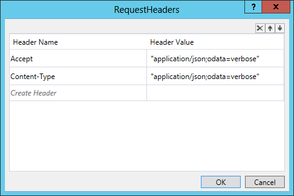

# Call web services from SharePoint workflows

You can use the SharePoint Add-in model to create and deploy workflows that run on either the add-in web or the host web. These workflows can interact with the remotely hosted portions of provider-hosted add-ins. 

The workflows can also call remote web services that contain important business data in one of two ways: 

- By passing query information to the remotely hosted portion of the add-in. The remote web application then calls the web service and passes the information back to SharePoint.
    
- By querying the web service by using the SharePoint web proxy. The workflow passes the results of the query to the remotely hosted portion of the add-in, which then passes the information to SharePoint.
    
The information retrieved from the web service can be stored in SharePoint lists. 

This article describes three code samples that show you how to call web services from workflows, as listed in the following table. In the first two samples, the workflows and the lists are deployed to the add-in web when the add-in installs. The last sample provides the basic shell of a workflow and instructions for how to deploy it to the host web and associate it with a list on the host web. 

**Workflow tasks and associated samples**

|Task|Sample|
|:-----|:-----|
|Call custom web services from a workflow.|[Workflow.CallCustomService](https://github.com/SharePoint/PnP/tree/master/Samples/Workflow.CallCustomService)|
|Call a custom web service from a workflow and update SharePoint by using the SharePoint web proxy.|[Workflow.CallServiceUpdateSPViaProxy](https://github.com/SharePoint/PnP/tree/master/Samples/Workflow.CallServiceUpdateSPViaProxy)|
|Associate a workflow with the host web.|[Workflow.AssociateToHostWeb](https://github.com/SharePoint/PnP/tree/master/Samples/Workflow.AssociateToHostWeb)|

<a name="bk1"> </a>

## Call custom web services from a workflow

The Workflow.CallCustomService sample shows you how to create a workflow that calls a custom web service that updates SharePoint list data. It also shows you how to design a provider-hosted add-in so that it queries a web service by using the remotely hosted web application that deploys with the add-in. This sample is useful when you want all the interactions with the web service to be handled by the remotely hosted portion of your provider-hosted add-in.

The sample works by starting a workflow from a remote web application. This workflow passes query information submitted by the user to the remote web application, which then uses that information to construct a query to the Northwind OData web service. The query returns the product suppliers for a given country. After it receives that information, the remote web application updates a product suppliers list that the add-in has deployed to the add-in web.

> [!NOTE] 
> The Workflow.CallCustomService sample page contains instructions for deploying this add-in. You can also deploy and test with F5 debugging in Visual Studio if you follow the instructions in the blog post [Debugging SharePoint 2013 workflows using Visual Studio 2013](https://blogs.msdn.microsoft.com/officeapps/2013/10/30/debugging-sharepoint-2013-workflows-using-visual-studio-2013/).

The Workflow.CallCustomService sample add-in start page includes a drop-down menu from which you can select a country for which you want to create a product suppliers list. 


The **Create** button on the screen calls a **Create** method in the Controllers\PartSuppliersController.cs file that creates a new entry in the Part Suppliers list on the add-in web. The **Create** method then calls the **Add** method that is defined in the Services\PartSuppliersService.cs file. The sequence is shown in the following two code examples.

**Create method**

```cs
public ActionResult Create(string country, string spHostUrl)
        {
            var spContext = SharePointContextProvider.Current.GetSharePointContext(HttpContext);
            using (var clientContext = spContext.CreateUserClientContextForSPAppWeb())
            {
                var service = new PartSuppliersService(clientContext);
                var id = service.GetIdByCountry(country);
                if (id == null)
                {
                    id = service.Add(country);
                    TempData["Message"] = "Part Supplier Successfully Created!";
                }
                else
                    TempData["ErrorMessage"] = string.Format("Failed to Create The Part Supplier: There's already a Part Supplier who's country is {0}.", country);

                return RedirectToAction("Details", new { id = id.Value, SPHostUrl = spHostUrl });
            }
        }

```

<br/>

**Add method**

```cs
public int Add(string country)
        {
            var item = list.AddItem(new ListItemCreationInformation());
            item["Country"] = country;
            item.Update();
            clientContext.ExecuteQuery();
            return item.Id;
        }

```

<br/>

After creating that new list item, the add-in presents a **Start Workflow** button that starts the approval workflow.


Choosing the **Start Workflow** button triggers the **StartWorkflow** method that is defined in the Controllers\PartSuppliersController.cs file. This method packages the add-in web URL, the web service URL (for your remotely hosted web application, not for the Northwind web service), and the context token values, and passes them to the **StartWorkflow** method. The **PartSuppliersService** method needs the context token to interact with SharePoint.

```cs
public ActionResult StartWorkflow(int id, Guid workflowSubscriptionId, string spHostUrl)
        {
            var spContext = SharePointContextProvider.Current.GetSharePointContext(HttpContext) as SharePointAcsContext;

            var webServiceUrl = Url.RouteUrl("DefaultApi", new { httproute = "", controller = "Data" }, Request.Url.Scheme);
            var payload = new Dictionary<string, object>
                {
                    { "appWebUrl", spContext.SPAppWebUrl.ToString() },
                    { "webServiceUrl", webServiceUrl },
                    { "contextToken",  spContext.ContextToken }
                };

            using (var clientContext = spContext.CreateUserClientContextForSPAppWeb())
            {
                var service = new PartSuppliersService(clientContext);
                service.StartWorkflow(workflowSubscriptionId, id, payload);
            }

            TempData["Message"] = "Workflow Successfully Started!";
            return RedirectToAction("Details", new { id = id, SPHostUrl = spHostUrl });
        }

```

<br/>

The **StartWorkflow** method then creates a workflow instance and passes the three values (appWebUrl, webServiceUrl, contextToken) stored in the payload variable to the workflow.

```cs
 {
            var workflowServicesManager = new WorkflowServicesManager(clientContext, clientContext.Web);

            var subscriptionService = workflowServicesManager.GetWorkflowSubscriptionService();
            var subscription = subscriptionService.GetSubscription(subscriptionId);

            var instanceService = workflowServicesManager.GetWorkflowInstanceService();
            instanceService.StartWorkflowOnListItem(subscription, itemId, payload);
            clientContext.ExecuteQuery();
        }

```

<br/>

After the workflow starts, it makes a **POST HTTP** request to the remotely hosted web application. This request tells the web application to update the suppliers list with the suppliers for the country that the user has just added. The Controllers\DataController.cs file contains a **POST** method that receives the contents of this request.

```cs
public void Post([FromBody]string country)
        {
            var supplierNames = GetSupplierNames(country);
            UpdateSuppliers(country, supplierNames);
        }

```

<br/>

The **GetSupplierNames** method (in the Controllers\DataController.cs file) constructs and executes a LINQ query to the Northwind OData web service for all the suppliers associated with the selected country. 

```cs
private string[] GetSupplierNames(string country)
        {
            Uri uri = new Uri("http://services.odata.org/V3/Northwind/Northwind.svc");
            var entities = new NorthwindEntities(uri);
            var names = entities.Suppliers
                .Where(s => s.Country == country)
                .AsEnumerable()
                .Select(s => s.CompanyName)
                .ToArray();
            return names;
        }

```

<br/>

The **UpdateSuppliers** method then updates the **Suppliers** field of the newly added list item.

```cs
private void UpdateSuppliers(string country, string[] supplierNames)
        {
            var request = HttpContext.Current.Request;
            var authority = request.Url.Authority;
            var spAppWebUrl = request.Headers["SPAppWebUrl"];
            var contextToken = request.Headers["SPContextToken"];

            using (var clientContext = TokenHelper.GetClientContextWithContextToken(
                spAppWebUrl, contextToken, authority))
            {
                var service = new PartSuppliersService(clientContext);
                service.UpdateSuppliers(country, supplierNames);
            }
        }

```

<br/>

If you look at the design view of the workflow.xaml file in the Approve Suppliers directory of the add-in project, you see (by choosing the **Arguments** tab at the bottom left of the design view) that the workflow stores the three values in the payload variable that is passed to it as workflow arguments.


<br/>

The **HttpSend** activity occurs before workflow approval. This activity sends the **POST** query to your remote web application that triggers the call to the Northwind web service and then to the list item update (with the suppliers list). This activity is configured to send the request to the webServiceUrl value that was passed as a workflow argument.


<br/>

The **POST** request also passes the country value that is stored in the list item on which the workflow is operating.


<br/>

The workflow sends the appWebUrl and contextToken values to the web application through the request headers. The headers also set the content types for sending and accepting requests.


If the workflow is approved, it changes the value of the **isApproved** field of the list item to **true**.

<a name="bk2"> </a>

## Call a custom web service from a workflow and update SharePoint by using the SharePoint web proxy

The Workflow.CallServiceUpdateSPViaProxy sample shows how to design a provider-hosted add-in to query a web service and then pass that information to a SharePoint list via the SharePoint web proxy.

The sample shows a task that is useful when you want to encapsulate all the interactions with a web service so that they are handled directly by the workflow. Using the web proxy makes it easier to update the remote web application logic without having to update the workflow instance. If you're not using the proxy and you have to update the logic in your web application, you must remove the existing workflow instances and then redeploy the add-in. For this reason, we recommend this design when you need to call a remote web service. 

> [!NOTE] 
> The Workflow.CallServiceUpdateSPViaProxy sample page contains instructions for deploying this add-in. You can also deploy and test the add-in by using **F5** debugging in Visual Studio if you follow the instructions in the blog post [Debugging SharePoint 2013 workflows using Visual Studio 2013](https://blogs.msdn.microsoft.com/officeapps/2013/10/30/debugging-sharepoint-2013-workflows-using-visual-studio-2013/).

The sample starts a workflow from a remote web application. This workflow passes query information submitted by the user to the Northwind OData web service. The query returns the product suppliers for a given country. After it receives the web service response, the workflow passes the information from the response to the remote web application. The remote web application then updates a product suppliers list that the add-in has deployed to the add-in web.

When you start the Workflow.CallServiceUpdateSPViaProxy sample add-in, the start page includes a drop-down menu from which you can select a country for which you want to create a product suppliers list.


That button calls a method in the Controllers\PartSuppliersController.cs file that creates a new entry in the **Part Suppliers** list on the add-in web. The **Create** method in that file calls the **Add** method that is defined in the Services\PartSuppliersService.cs file. Both are shown in the following two code examples.

**Create method**

```cs
public ActionResult Create(string country, string spHostUrl)
        {
            var spContext = SharePointContextProvider.Current.GetSharePointContext(HttpContext);
            using (var clientContext = spContext.CreateUserClientContextForSPAppWeb())
            {
                var service = new PartSuppliersService(clientContext);
                var id = service.GetIdByCountry(country);
                if (id == null)
                {
                    id = service.Add(country);
                    TempData["Message"] = "Part Supplier Successfully Created!";
                }
                else
                    TempData["ErrorMessage"] = string.Format("Failed to Create The Part Supplier: There's already a Part Supplier who's country is {0}.", country);

                return RedirectToAction("Details", new { id = id.Value, SPHostUrl = spHostUrl });
            }
        }

```

<br/>

**Add method**

```cs
public int Add(string country)
        {
            var item = list.AddItem(new ListItemCreationInformation());
            item["Country"] = country;
            item.Update();
            clientContext.ExecuteQuery();
            return item.Id;
        }

```

<br/>

After it creates that new list item, the add-in presents a **Start Workflow** button that starts the approval workflow.


Choosing the **Start Workflow** button triggers the **StartWorkflow** method in the Controllers\PartSuppliersController.cs file. This method packages the add-in web URL and the web service URL (for your remotely hosted web application, not for the Northwind web service) and passes them to the **StartWorkflow** method in the Services\PartSuppliersService.cs file. The workflow communicates with the remote web application via the web proxy, and the web proxy adds the access token in a request header. This is why the workflow doesn't pass a context token to the **StartWorkflow** method in this sample. The code is shown in the following example.

```cs
public ActionResult StartWorkflow(int id, Guid workflowSubscriptionId, string spHostUrl)
        {
            var spContext = SharePointContextProvider.Current.GetSharePointContext(HttpContext);

            var webServiceUrl = Url.RouteUrl("DefaultApi", new { httproute = "", controller = "Data" }, Request.Url.Scheme);
            var payload = new Dictionary<string, object>
                {
                    { "appWebUrl", spContext.SPAppWebUrl.ToString() },
                    { "webServiceUrl", webServiceUrl }
                };

            using (var clientContext = spContext.CreateUserClientContextForSPAppWeb())
            {
                var service = new PartSuppliersService(clientContext);
                service.StartWorkflow(workflowSubscriptionId, id, payload);
            }

            TempData["Message"] = "Workflow Successfully Started!";
            return RedirectToAction("Details", new { id = id, SPHostUrl = spHostUrl });
        }

```

<br/>

The **StartWorkflow** method creates a workflow instance and passes the two values (appWebUrl and webServiceUrl) stored in the payload variable to the workflow.

```cs
public void StartWorkflow(Guid subscriptionId, int itemId, Dictionary<string, object> payload)
        {
            var workflowServicesManager = new WorkflowServicesManager(clientContext, clientContext.Web);

            var subscriptionService = workflowServicesManager.GetWorkflowSubscriptionService();
            var subscription = subscriptionService.GetSubscription(subscriptionId);

            var instanceService = workflowServicesManager.GetWorkflowInstanceService();
            instanceService.StartWorkflowOnListItem(subscription, itemId, payload);
            clientContext.ExecuteQuery();
        }

```

<br/>

After the workflow starts, and before it is approved, the workflow makes a query to the Northwind web service to retrieve the suppliers list for the country that you selected. It does this by using an **HTTPSend** activity that sends an OData query to this endpoint: `"http://services.odata.org/V3/Northwind/Northwind.svc/Suppliers/?$filter=Country eq '" + country.Replace("'", "''") + "'&amp;$select=CompanyName"`. 

The **HttpSend** activity should be configured as a **GET** request with an **Accept** header that specifies JSON with no metadata: ` application/json;odata=nometadata`.


If the user selected Canada for the new supplier list item, for example, the JSON-formatted response will be as shown in the following example.

```cs
{
    value: [
        {
            CompanyName: "Ma Maison"
        },
        {
            CompanyName: "Forêts d'érables"
        }
    ]
}

```

<br/>

After the workflow starts, it makes a **POST HTTP** request that contains the suppliers list to the remotely hosted web application via the proxy. It does this via an **HttpSend** activity that queries the web proxy URL: `appWebUrl + "/_api/SP.WebProxy.invoke"`. 

The workflow then passes the supplier list that it received from the Northwind service by building and passing a custom service payload. The **Create Custom Service Payload** activity properties contain the supplier list and the ID for the supplier country.


The **Create WebProxy Payload** activity constructs a payload that passes the contents of this payload to the web proxy URL.


The properties for the **WebProxy Payload** activity specify the add-in web URL, the POST request content length and type, and the request acceptance type via request headers.


After the workflow has constructed the payload and the request, it passes the request to the web proxy by using an  **HttpSend** activity that's configured as a POST request to the web proxy URL. The request headers specify JSON-formatted OData in the **Content-Type** and **Accept** headers.



The **Post** method inside the Controllers\DataController.cs file accepts the contents of the request that the workflow sends through the web proxy. The **Post** method in the previous sample called a method for retrieving the supplier list from Northwind as well as one for updating the corresponding SharePoint supplier list. 

Because the workflow in this sample has already queried the Northwind service, this version of the method needs only to update the SharePoint list. It also passes the add-in web URL and the access token (which is passed by the web proxy) to the **UpdateSuppliers** method in the Services\PartSuppliersService.cs file, as shown in the following code example.

```cs
public void Post(UpdatePartSupplierModel model)
        {
            var request = HttpContext.Current.Request;
            var authority = request.Url.Authority;
            var spAppWebUrl = request.Headers["SPAppWebUrl"];
            var accessToken = request.Headers["X-SP-AccessToken"];

            using (var clientContext = TokenHelper.GetClientContextWithContextToken(spAppWebUrl, accessToken, authority))
            {
                var service = new PartSuppliersService(clientContext);
                service.UpdateSuppliers(model.Id, model.Suppliers.Select(s => s.CompanyName));
            }
        }

```

<br/>

The **UpdateSuppliers** method in the PartSuppliers.cs file updates the **Suppliers** field of the newly created list item.

```cs
public void UpdateSuppliers(int id, IEnumerable<string> supplierNames)
        {
            var item = list.GetItemById(id);
            clientContext.Load(item);
            clientContext.ExecuteQuery();

            string commaSeparatedList = String.Join(",", supplierNames);
            item["Suppliers"] = commaSeparatedList;
            item.Update();
            clientContext.ExecuteQuery();
        }

```

<br/>

If the workflow is approved, it changes the value of the **isApproved** field of the list item to **true**.

<a name="bk3"> </a>

## Associate a workflow with the host web

The Workflow.AssociateToHostWeb sample shows you how to deploy a workflow to the host web and associate it with a list on the host web by using tools in Visual Studio. The instructions for this sample show you how to create a workflow in Visual Studio, deploy it to the host web, and associate it with a list on the host web.

The sample contains a simple workflow that can be associated with any list. The instructions for deploying this workflow show you how to work around the current limitations of the Visual Studio workflow tools by packaging the add-in, opening it up and editing a configuration file, and then repackaging it manually before deploying it to the host web.

When you open this project in Visual Studio, you'll see that it is a simple, generic workflow that is designed to work with any SharePoint list. Other than the workflow task list, it doesn't deploy any list with which it can be associated.

> [!NOTE] 
> You cannot perform the task shown in this sample by using Visual Studio 2013. This sample provides a useful workaround. If the Visual Studio tools are updated in the future, you might not need to use this workaround.

### Deploy a workflow to the host web

1. Open the shortcut menu (right-click) for the Workflow.AssociateToHostWeb add-in project in the project explorer, and choose **Publish**. You'll see a window that contains a **Package the app** button.
	
	

2. When you choose **Package the app**, Visual Studio creates a Workflow.AssociateToHostWeb.app file in the  `bin\Debug\app.publish\1.0.0.0` directory of your solution. This .app file is a type of .zip file.
    
3. Extract the contents of the file by first changing the file extension to .zip. 
    
4. In the directory that you've extracted, locate and open the XML file named WorkflowManifest.xml. The file is empty.
    
5. Add the following XML fragment to the file, and then save the file.
    
   ```xml
	  <SPIntegratedWorkflow xmlns="http://schemas.microsoft.com/sharepoint/2014/app/integratedworkflow">
	    <IntegratedApp>true</IntegratedApp>
	  </SPIntegratedWorkflow>
   ```

6. Select all the files in the extracted folder, and then open the shortcut menu (right-click) for the files and select **Send to** > **Compressed (zipped) folder**.
    
7. On the zip file you just created, change the file extension to .app. You should now have a new Workflow.AssociateToHostWeb.app package that contains the updated WorkflowManifest.xml file.
    
8. Add the add-in to your app catalog.
    
9. Install the add-in to your host site.
    
10. Go to a list on your host site and select the **List** editing option on the top left of the page. You see a **Workflow Settings** drop-down menu.
	
	

11. Select **Add a Workflow** from the drop-down menu.
    
12. You now see a selection option similar to the image in the following figure. Select the **Workflow.AssociateToHostWeb** add-in from the list of available options.
	
	

You have now deployed the workflow to the host web and associated it with a list on the host web. You can trigger a workflow manually, or you can update the workflow in Visual Studio so that it is triggered in other ways.

## See also

- [Composite business SharePoint Add-ins](composite-business-apps-for-sharepoint.md)