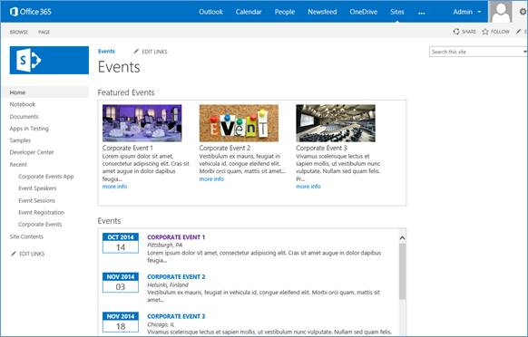

# Corporate event add-in integration with SharePoint

The [BusinessApps.CorporateEventsApp](https://github.com/SharePoint/PnP/tree/master/Solutions/BusinessApps.CorporateEventsApp) sample shows you how to implement a centralized corporate events management system as a provider-hosted add-in that integrates with your existing line-of-business (LOB) applications.

More specifically, the BusinessApps.CorporateEventsApp sample shows you how to implement an ASP.NET web application that interacts with SharePoint as a data store for LOB entities. It also shows you how to implement multiple steps in a complex business task with a single provider-hosted add-in.

This sample app implements a centralized management system that consists of SharePoint entities (lists and content types). For each new content type, it creates corresponding LOB entities in an ASP.NET web application. Components of the web application run as remotely hosted add-in parts within the SharePoint interface and also as pages running entirely on the remote web host. The add-in overrides the default welcome page for your SharePoint site so that it can present a custom-branded interface on the site home page.

## Using the BusinessApps.CorporateEventsApp sample

### Configure the sample

When you start the BusinessApps.CorporateEventsApp sample app, the Home page provides an option for you to configure the sample. It also points you to a number of resources for more information.

When you choose **Start configuration**, you go to the Configuration page, as shown in the following figure. When you choose **Initialize the data store** on the Configuration page, the sample deploys the SharePoint entities and sample data that support the sample.


<br/>

After you initialize the data store, you can go back to your site to see a new welcome page (the EventsHome.aspx page), which is populated by two web parts that the add-in deployed, as shown in the following figure. In the left column, you see the four new lists installed by the add-in. The Corporate Events list is populated by sample data.



<br/>

Each web part contains links to each of the displayed events, where you can see the event details. When you choose a link, the event details page runs separately on the remote host, as shown in the following figure. You can choose **Back to Site** on the page to return to the SharePoint site and register for the event.


<br/>

The registration page runs separately on the remote host and contains a link back to the SharePoint host site. When you finish registering for the event, your name appears on the newly installed **Event Registration** list.


<br/>

### Models/DataInitializer.cs file

The Models/DataInitializer.cs file contains the code that runs when you choose this button. The code in this file creates and deploys four new SharePoint lists, along with four corresponding content types:

- Corporate Events 
- Event Registration
- Event Speakers
- Event Sessions
    
The code in this file uses a method similar to the one that is used in the [Core.ModifyPages](https://github.com/SharePoint/PnP/tree/master/Samples/Core.ModifyPages) sample to add a custom page to the site.

```cs
            // Create default wiki page.
            web.AddWikiPage("Site Pages", "EventsHome.aspx");
AddWikiPage is an extension method from the Core.DevPnPCore project to add a new page to the site. This new page also becomes the new WelcomePage for the site. It also prepares to add the web parts to this page.
            var welcomePage = "SitePages/EventsHome.aspx";
            var serverRelativeUrl = UrlUtility.Combine(web.ServerRelativeUrl, welcomePage);

            File webPartPage = web.GetFileByServerRelativeUrl(serverRelativeUrl);

            if (webPartPage == null) {
                return;
            }

            web.Context.Load(webPartPage);
            web.Context.Load(webPartPage.ListItemAllFields);
            web.Context.Load(web.RootFolder);
            web.Context.ExecuteQuery();

            web.RootFolder.WelcomePage = welcomePage;
            web.RootFolder.Update();
            web.Context.ExecuteQuery();

```

<br/>

The Models\DataInitializer.cs file also defines the XML for both web parts that are displayed on the new welcome page and then adds each one to the page. The following examples show how this works for the Featured Events web part.

**Define web part XML**

```xml
            var webPart1 = new WebPartEntity(){
                WebPartXml = @"<webParts>
  <webPart xmlns='http://schemas.microsoft.com/WebPart/v3'>
    <metaData>
      <type name='Microsoft.SharePoint.WebPartPages.ClientWebPart, Microsoft.SharePoint, Version=16.0.0.0, Culture=neutral, PublicKeyToken=71e9bce111e9429c' />
      <importErrorMessage>Cannot import this web part.</importErrorMessage>
    </metaData>
    <data>
      <properties>
        <property name='Description' type='string'>Displays featured events</property>
        <property name='FeatureId' type='System.Guid, mscorlib, Version=4.0.0.0, Culture=neutral, PublicKeyToken=b77a5c561934e089'>3a6d7f41-2de8-4e69-b4b4-0325bd56b32c</property>
        <property name='Title' type='string'>Featured Events</property>
        <property name='ProductWebId' type='System.Guid, mscorlib, Version=4.0.0.0, Culture=neutral, PublicKeyToken=b77a5c561934e089'>12ae648f-27db-4a97-9c63-37155d3ace1e</property>
        <property name='WebPartName' type='string'>FeaturedEvents</property>
        <property name='ProductId' type='System.Guid, mscorlib, Version=4.0.0.0, Culture=neutral, PublicKeyToken=b77a5c561934e089'>3a6d7f41-2de8-4e69-b4b4-0325bd56b32b</property>
        <property name='ChromeState' type='chromestate'>Normal</property>
      </properties>
    </data>
  </webPart>
</webParts>",
                WebPartIndex = 0,
                WebPartTitle = "Featured Events",
                WebPartZone = "Rich Content"
            };

```

**Add the web parts to the page**

```cs
        var limitedWebPartManager = webPartPage.GetLimitedWebPartManager(Microsoft.SharePoint.Client.WebParts.PersonalizationScope.Shared);
        web.Context.Load(limitedWebPartManager.WebParts);
        web.Context.ExecuteQuery();

        for (var i = 0; i < limitedWebPartManager.WebParts.Count; i++) {
            limitedWebPartManager.WebParts[i].DeleteWebPart();
        }
        web.Context.ExecuteQuery();

        var oWebPartDefinition1 = limitedWebPartManager.ImportWebPart(webPart1.WebPartXml);
        var oWebPartDefinition2 = limitedWebPartManager.ImportWebPart(webPart2.WebPartXml);
        var wpdNew1 = limitedWebPartManager.AddWebPart(oWebPartDefinition1.WebPart, webPart1.WebPartZone, webPart1.WebPartIndex);
        var wpdNew2 = limitedWebPartManager.AddWebPart(oWebPartDefinition2.WebPart, webPart2.WebPartZone, webPart2.WebPartIndex);
        web.Context.Load(wpdNew1);
        web.Context.Load(wpdNew2);
        web.Context.ExecuteQuery();

```

<br/>

In the Models directory of your web project, you'll notice that this MVC ASP.NET web application contains four class names that correspond to the lists and content types that the add-in installed:

- Event.cs (Corporate Events)
- Registration.cs (Event Registration)
- Session.cs (Event Sessions)
- Speaker.cs (Event Speakers)
    
These four classes and their corresponding SharePoint content types together make up the four LOB entities used in this add-in.

The DataInitializer.cs file adds sample data for the **Corporate Events** list by creating sample **Event** objects that correspond with the **Corporate Events** content type and which the add-in adds to the **Corporate Events** list. 

When you register for an event, the add-in creates a **Registration** object that corresponds with the **Event Registration** content type and which the add-in adds to the **Event Registration** list. The sample has not yet fully implemented the **Session** and **Speaker** objects, so the add-in currently doesn't work with those objects.

The following table lists the properties that need to be implemented by the classes that inherit from the **BaseListItem** abstract class.

|Member|Description|
|:-----|:-----|
|**ContentTypeName**|Gets the content type that is associated with the item. If null, the default library content type will be assigned to the item when you save it.|
|**FieldInternalNames**|A list of field names that can be cached to improve performance when used for checking field data prior to save.|
|**ListTitle**|Gets the title of the list (case-sensitive).|

<br/>

The following table lists the methods that have to be implemented by the classes that inherit from the **BaseListItem** abstract class. These methods return parameters that should be set to [blittable types](https://docs.microsoft.com/en-us/dotnet/framework/interop/blittable-and-non-blittable-types) so that they can be used on multiple platforms.

|Method|Description|
|:-----|:-----|
|**ReadProperties(ListItem)**|Reads properties from the **ListItem** object using the **BaseGet** and **BaseGetEnum** methods and assigns them to properties of the subclass.|
|**SetProperties(ListItem)**|Sets properties on the **ListItem** object using the **BaseSet** and **BaseSetTaxonomyField** methods of the abstract class.|

<br/>

The following table lists the helper methods from the **BaseListItem** class that the subclasses need in order to implement the **ReadProperties** and **SetProperties** methods.

|Helper method|Description|
|:-----|:-----|
|**BaseGet(ListItem item, string internalName)**|Gets the property defined by the *internalName* parameter from **ListItem** and returns them of generic type **T**.|
|**BaseSet(ListItem item, string internalName, object value)**|Sets the **ListItem** property defined by the *internalName* parameter.|
|**BaseSetTaxonomyField(ListItem item, string internalName, string label, Guid termId)**|Sets the **ListItem** taxonomy field defined by the *internalName* and *termId* parameters.|
|**BaseGetEnum(ListItem item, string internalName, T defaultValue)**|Gets the value of the enum property defined by the *internalName* parameter. Returns the value of the *defaultValue* parameter if the property is not set.|

<br/>

The Event.cs file contains the following implementations of the **ReadProperties** and **SetProperties** methods.

**ReadProperties**

```csharp
        protected override void ReadProperties(ListItem item) {
            RegisteredEventId = BaseGet<string>(item, FIELD_REGISTERED_EVENT_ID);
            Description = BaseGet<string>(item, FIELD_DESCRIPTION);
            Category = BaseGet<string>(item, FIELD_CATEGORY);
            EventDate = BaseGet<DateTime?>(item, FIELD_DATE);
            Location = BaseGet<string>(item, FIELD_LOCATION);
            ContactEmail = BaseGet<string>(item, FIELD_CONTACT_EMAIL);
            Status = BaseGetEnum<EventStatus>(item, FIELD_STATUS);
            var imageUrl = BaseGet<FieldUrlValue>(item, FIELD_IMAGE_URL);

            if (imageUrl != null)
                ImageUrl = imageUrl.Url;
        }
```        

<br/>

**SetProperties**

```csharp
        protected override void SetProperties(ListItem item) {
            BaseSet(item, FIELD_REGISTERED_EVENT_ID, RegisteredEventId);
            BaseSet(item, FIELD_DESCRIPTION, Description);
            BaseSet(item, FIELD_CATEGORY, Category);
            BaseSet(item, FIELD_DATE, EventDate);
            BaseSet(item, FIELD_LOCATION, Location);
            BaseSet(item, FIELD_CONTACT_EMAIL, ContactEmail);
            BaseSet(item, FIELD_STATUS, Status.ToEnumDescription());
            BaseSet(item, FIELD_IMAGE_URL, ImageUrl);
        }
```

<br/>

The following code examples show how the underlying **BaseGet** and **BaseSet** methods are defined in BaseListItem.cs.

**BaseGet**

```cs
protected T BaseGet<T>(ListItem item, string internalName){
            var field = _fields[internalName.ToLowerInvariant()];
            var value = item[field.InternalName];
            return (T)value;
        }

```

<br/>

**BaseSet**

```cs
protected void BaseSet(ListItem item, string internalName, object value) {
            if (_fields.ContainsKey(internalName)) {
                var field = _fields[internalName.ToLowerInvariant()];

                if (field is FieldUrl &amp;&amp; value is string) {
                    var urlValue = new FieldUrlValue() {
                        Url = value.ToString()
                    };
                    value = urlValue;
                }
            }
            item[internalName] = value;
        }
```

<br/>

The **BaseListItem** class also contains a **Save** method that is used to save each LOB entity that the add-in creates and manipulates. This method loads the list and determines whether the current item has an ID that is greater than 0. If the ID is not greater than 0, it assumes that it's not valid and creates a new list item. It uses the **SetProperties** method to set properties on the **ListItem**, and then sets the properties on the subclass by using the **ReadProperties** method.

```cs
public void Save(Web web) {
            var context = web.Context;
            var list = web.GetListByTitle(ListTitle);
            if (!IsNew &amp;&amp; Id > 0) {
                ListItem = list.GetItemById(Id);
            }
            else {
                var listItemCreationInfo = new ListItemCreationInformation();
                ListItem = list.AddItem(listItemCreationInfo);
            }

            // Ensure that the fields have been loaded.
            EnsureFieldsRetrieved(ListItem);

            // Set the properties on the list item.
            SetProperties(ListItem);
            BaseSet(ListItem, TITLE, Title);

            // Use if you want to override the created/modified date.
            //BaseSet(ListItem, CREATED, Created);
            //BaseSet(ListItem, MODIFIED, Modified);

            ListItem.Update();

            if (!string.IsNullOrEmpty(ContentTypeName)) {
                var contentType = list.GetContentTypeByName(ContentTypeName);
                if (contentType != null)
                    BaseSet(ListItem, "ContentTypeId", contentType.Id.StringValue);
            }

            ListItem.Update();

            // Execute the batch.
            context.ExecuteQuery();

            // Reload the properties.
            ListItem.RefreshLoad();
            UpdateBaseProperties(ListItem);
            ReadProperties(ListItem);
        }

```

## See also
       
- [Provisioning.Pages sample](https://github.com/SharePoint/PnP/tree/master/Samples/Provisioning.Pages)   
- [OfficeDevPnP.Core sample](https://github.com/SharePoint/PnP-Sites-Core/tree/master/Core)   
- [Composite business SharePoint Add-ins](composite-business-apps-for-sharepoint.md)