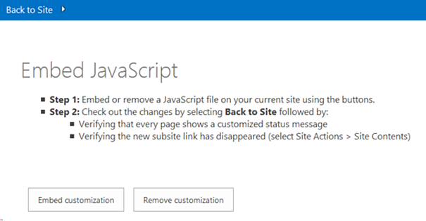
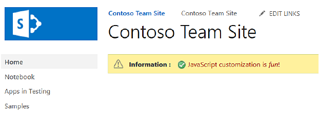
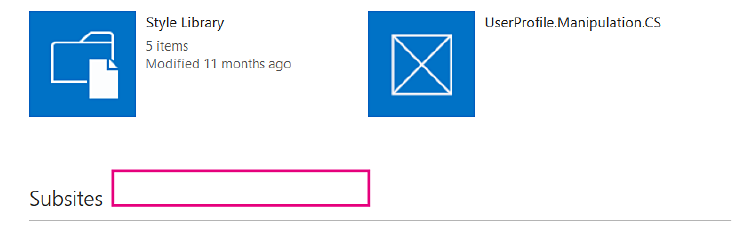

# Customize your SharePoint site UI by using JavaScript

You can update your SharePoint site's UI by using JavaScript.
    
_**Applies to:** Office 365 | SharePoint 2013 | SharePoint Online_
    
The [Core.EmbedJavaScript](https://github.com/SharePoint/PnP/tree/master/Samples/Core.EmbedJavaScript) sample add-in adds a status bar message to all pages on a SharePoint site, and removes the **new subsite** link from the **Site Contents** page by using JavaScript. 
    
Use this solution if you want to apply UI updates to your SharePoint site by using JavaScript (sometimes referred to as the Embed JavaScript technique) instead of creating custom master pages. 

## Before you begin
<a name="sectionSection0"> </a>

To get started, download the  [Core.EmbedJavaScript](https://github.com/SharePoint/PnP/tree/master/Samples/Core.EmbedJavaScript) sample add-in from the [Office 365 Developer patterns and practices](https://github.com/SharePoint/PnP/tree/dev) project on GitHub.

## Using the Core.EmbedJavaScript app
<a name="sectionSection1"> </a>

When you run this code sample, a provider-hosted add-in appears, as shown in Figure 1. 

**Figure 1. Screen shot of Core.EmbedJavaScript add-in start page**



Choosing  **Embed customization** customizes the SharePoint site by:

- Creating a status bar message on all pages in the SharePoint site, as shown in Figure 2.
    
- Removing the  **new subsite** link from **Site Contents** as shown in Figure 3.

**Figure 2. Screen shot of status bar added to all pages**



**Figure 3. Screen shot of new subsite link removed from the Site Contents page**



In Figure 1, choosing  **Embed customization** calls **btnSubmit_Click** in default.aspx. **btnSubmit_Click** calls **AddJsLink**, which does the following:

1. Creates a string representing a script block definition. This script block definition points to a JavaScript file (scenario1.js) which is included on all pages on the SharePoint site. 
    
2. Uses  [UserCustomActions](https://msdn.microsoft.com/library/office/microsoft.sharepoint.spweb.usercustomactions%28v=office.15%29.aspx) to get all user custom actions defined on the SharePoint site. Any existing reference to a JavaScript file called scenario1.js is removed.
    
3.  Creates a new custom action, and assigns the script block definition created in step 1 to the new custom action.
    
4. Adds the new custom action to the website.
    
All pages on your SharePoint site will now run scenario1.js and display the UI customizations shown in Figure 2 and Figure 3.
    
> [!NOTE] 
> The code in this article is provided as-is, without warranty of any kind, either express or implied, including any implied warranties of fitness for a particular purpose, merchantability, or non-infringement.

```csharp
 public void AddJsLink(ClientContext ctx, Web web)
        {
            string scenarioUrl = String.Format("{0}://{1}:{2}/Scripts", this.Request.Url.Scheme, 
                                                this.Request.Url.DnsSafeHost, this.Request.Url.Port);
            string revision = Guid.NewGuid().ToString().Replace("-", "");
            string jsLink = string.Format("{0}/{1}?rev={2}", scenarioUrl, "scenario1.js", revision);

            StringBuilder scripts = new StringBuilder(@"
                var headID = document.getElementsByTagName('head')[0]; 
                var");

            scripts.AppendFormat(@"
                newScript = document.createElement('script');
                newScript.type = 'text/javascript';
                newScript.src = '{0}';
                headID.appendChild(newScript);", jsLink);
            string scriptBlock = scripts.ToString();

            var existingActions = web.UserCustomActions;
            ctx.Load(existingActions);
            ctx.ExecuteQuery();
            var actions = existingActions.ToArray();
            foreach (var action in actions)
            {
                if (action.Description == "scenario1" &amp;&amp;
                    action.Location == "ScriptLink")
                {
                    action.DeleteObject();
                    ctx.ExecuteQuery();
                }
            }

            var newAction = existingActions.Add();
            newAction.Description = "scenario1";
            newAction.Location = "ScriptLink";

            newAction.ScriptBlock = scriptBlock;
            newAction.Update();
            ctx.Load(web, s => s.UserCustomActions);
            ctx.ExecuteQuery();
        }
```

SharePoint uses Minimal Download Strategy (MDS) to reduce the amount of data the browser downloads when users navigate between pages on a SharePoint site. For more information, see  [Minimal Download Strategy overview](https://msdn.microsoft.com/library/office/dn456544%28v=office.15%29.aspx). In scenario1.js, the following code ensures that whether or not your SharePoint site uses Minimal Download Strategy,  **RemoteManager_Inject** always runs.

```
// Is MDS enabled?
if ("undefined" != typeof g_MinimalDownload &amp;&amp; g_MinimalDownload &amp;&amp; (window.location.pathname.toLowerCase()).endsWith("/_layouts/15/start.aspx") &amp;&amp; "undefined" != typeof asyncDeltaManager) {
    // Register script for MDS if possible
    RegisterModuleInit("scenario1.js", RemoteManager_Inject); //MDS registration
    RemoteManager_Inject(); //non MDS run
} else {
    RemoteManager_Inject();
}
```

**RemoteManager_Inject** performs the following tasks on your SharePoint site:

- Creates a status bar on the host web.  **RemoteManager_Inject** uses [SP.SOD.executeOrDelayUntilScriptLoaded](https://msdn.microsoft.com/library/office/ff411788%28v=office.14%29.aspx) to ensure sp.js is loaded first, before calling **SetStatusBar** to add the status bar to the site. Because JavaScript files load asynchronously, using **SP.SOD.executeOrDelayUntilScriptLoaded** ensures your JavaScript file (sp.js) is loaded before your code calls a function defined in that JavaScript file.
    
- Hides the  **new subsite** link on the **Site Contents** page.

```
function RemoteManager_Inject() {

    loadScript(jQuery, function () {
        $(document).ready(function () {
            var message = " <font color='#AA0000'>JavaScript customization is <i>fun</i>!</font>"

            // Execute status setter only after SP.JS has been loaded
            SP.SOD.executeOrDelayUntilScriptLoaded(function () { SetStatusBar(message); }, 'sp.js');

            // Customize the viewlsts.aspx page
            if (IsOnPage("viewlsts.aspx")) {
                //hide the subsites link on the viewlsts.aspx page
                $("#createnewsite").parent().hide();
            }
        });
    });
}

function SetStatusBar(message) {
    var strStatusID = SP.UI.Status.addStatus("Information : ", message, true);
    SP.UI.Status.setStatusPriColor(strStatusID, "yellow");
}

function IsOnPage(pageName) {
    if (window.location.href.toLowerCase().indexOf(pageName.toLowerCase()) > -1) {
        return true;
    } else {
        return false;
    }
}

```

## See also
<a name="bk_addresources"> </a>

-  [Office 365 development patterns and practices solution guidance](Office-365-development-patterns-and-practices-solution-guidance.md)
    
-  [Core.JavaScriptCustomization](https://github.com/SharePoint/PnP/tree/master/Samples/Core.JavaScriptCustomization)
    
-  [How to: Customize a list view in add-ins for SharePoint using client-side rendering](https://msdn.microsoft.com/library/8d5cabb2-70d0-46a0-bfe0-9e21f8d67d86.aspx)
