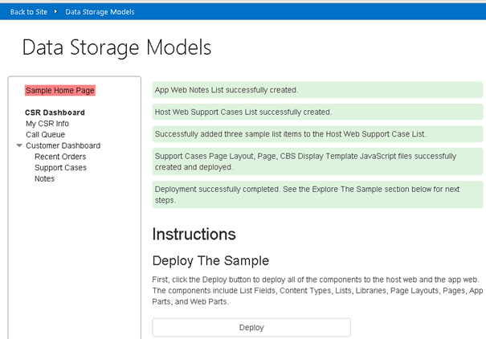
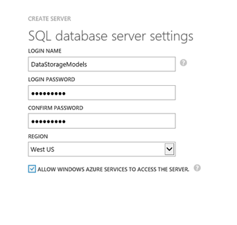
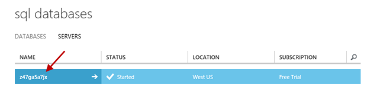
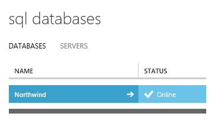
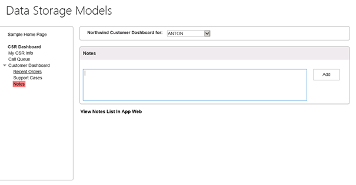
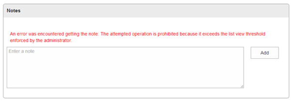
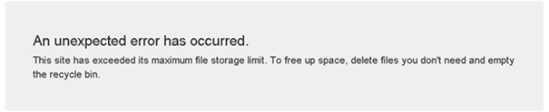
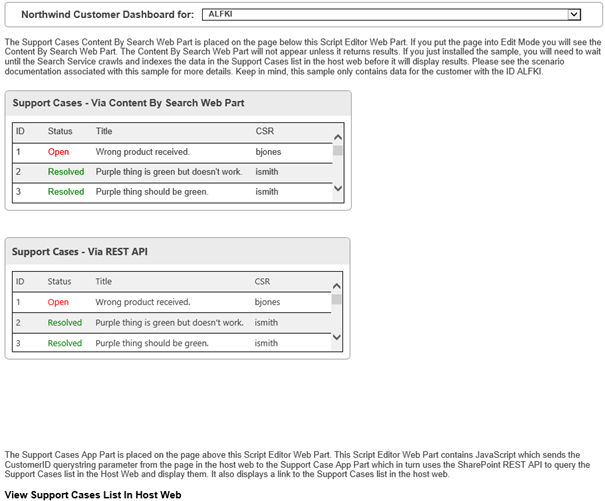
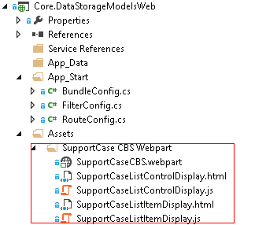

# Data storage options in SharePoint Online

This article describes the [Core.DataStorageModels](https://github.com/SharePoint/PnP/tree/master/Samples/Core.DataStorageModels) sample app, which shows you each of the following data storage options and the advantages and disadvantages of each:

- SharePoint list on the add-in web
- SharePoint list on the host web 
- External web service
- Azure Table storage 
- Azure Queue storage   
- Azure SQL Database  
 
The Core.DataStorageModels sample app is a provider-hosted add-in written in C# and JavaScript that deploys a number of SharePoint artifacts (lists, add-in part, web part) to both the host web and the add-in web. It interacts with SharePoint lists on the add-in web and host web, and also makes calls to Azure SQL Database, Azure Queue storage, and Azure Table storage, and a remote web service that implements OData. This sample uses the Model-View-Controller pattern.

The Core.DataStorageModels sample app applies each data storage option to a specific function for which the option is well-suited, as described in the following table.

|Sample app storage option|Used for|
|:--|:--|
|SharePoint list add-in web|Customer notes|
|SharePoint list host web|Support cases|
|Northwind OData web service|Customers|
|Azure Table storage|CSR ratings|
|Azure Queue storage|Call queue|
|Azure SQL Northwind database|Orders, order details, products|

The sample app implements a customer service dashboard and related interfaces that show recent orders, customer representative survey ratings, customer notes, support cases, and a customer representative call queue. 

The first two scenarios let you retrieve data by using relatively simple client object model code or REST queries, but are limited by list query thresholds. The next four scenarios use different types of remote storage. 

**Data storage models start page prompting you to deploy SharePoint components**



## Before you begin

Before you use this sample, make sure that you have the following:

- A Microsoft Azure account where you can deploy an Azure SQL Database and create an Azure Storage account. 
    
- A [SharePoint developer site](https://docs.microsoft.com/en-us/office/developer-program/office-365-developer-program) so that you can deploy the sample from Visual Studio.
    
Also, you need to deploy the Northwind database to Microsoft Azure.

### To deploy the Northwind database

1. Sign in to the [Azure portal](https://ms.portal.azure.com) and choose **SQL Databases** > **Servers**.
    
2. Choose **Create a SQL Database Server**.
    
3. In the **Create Server** form, enter values for **Login Name**, **Login Password**, and **Region**.

    

4. Select the check box to finish and create the server.
    
5. Now that you've created the database, choose the server name that you created.

    

6. Choose **CONFIGURE**, choose the arrow in the lower-right corner to complete the configuration, and then choose **SAVE**.
    
7. Open SQL Server Management Studio on your local development computer, and create a new database named **NorthWind**.
    
8. In the **Object Explorer**, select the **Northwind** database, and then choose **New Query**.
    
9. In a text editor of your choice, open the northwind.sql SQL script that is provided with the  [Core.DataStorageModels](https://github.com/SharePoint/PnP/tree/master/Samples/Core.DataStorageModels) sample.
    
10. Copy the text in the northwind.sql file and paste it into the **SQL Query** window in SQL Server Management Studio, and then choose **Execute**.
    
11. In the **Object Explorer**, open the shortcut menu for (right-click) the **Northwind** database, select **Tasks**, and then select **Deploy Database to SQL Azure**.
    
12. On the **Introduction** screen, choose **Next**.
    
13. Choose **Connect**, and then enter the **Server name** for the Azure SQL Database server you just created.
    
14. In the **Authentication** list, select **SQL Server Authentication**.
    
15. Enter the user name and password you used when you created the Azure SQL Database server, and then choose **Connect**.
    
16. Choose **Next**, and then choose **Finish**, and wait until the database is created. After it is created, choose **Close** to close the wizard.
    
17. Return to the [Azure portal](https://ms.portal.azure.com) to verify that the Northwind database was created successfully. You should see it listed on the **sql databases** screen.

    

18. Select the Northwind database, and then select **View SQL Database connection strings**.
    
19. Copy the connection string and paste it into a text file and save it locally. You will need this connection string later. Close the **Connection Strings** dialog box.
    
20. Choose the **Set up Windows Azure firewall rules for this IP address** link, and add your IP address to the firewall rules to allow you to access the database.
    
21. Open the Core.DataStorageModels.sln project in Visual Studio.
    
22. In the Visual Studio **Solution Explorer**, locate the Web.config file.
    
23. In the Web.config file, locate the add `name="NorthWindEntities"` element and replace the existing `connectionString` value with the connection string information that you saved locally in step 19. 
    
	```XML
	  <add name="NorthWindEntities" 
      connectionString="metadata=res://*/Northwind.csdl|res://*/Northwind.ssdl|res://*/Northwind.msl;provider=System.Data.SqlClient;provider connection string=&amp;quot;data source=<Your Server Here>.database.windows.net;initial catalog=NorthWind;user id=<Your Username Here>@<Your Server Here>;password=<Your Password Here>;MultipleActiveResultSets=True;App=EntityFramework&amp;quot;"
      providerName="System.Data.EntityClient" />
	```

    <br/>

24. Save the Web.config file.

## SharePoint list on the add-in web (Notes scenario)

The Notes scenario, which uses a SharePoint list on an add-in web, shows how lists perform in a SharePoint Add-in web. The Notes list is created in the add-in web with a title and description field. The SharePoint REST API queries the Notes list and returns all the notes based on a customer ID.

Using lists in the add-in web has one important advantage over other storage solutions: you can use simple SharePoint REST API calls to query data. 

However, there are some disadvantages:

- To update list metadata, you must update and redeploy the add-in.
- To update the data structure, you must rewrite application logic for storing and updating data.  
- Information stored in the list cannot be shared easily with other add-ins.  
- You cannot search for data in SharePoint. 
- The amount of data that you can store in lists and the size of query result sets are limited.
    
The code that underlies the Notes section of the customer dashboard uses REST queries to retrieve data from a list that is deployed to the add-in web. This list contains fields for titles, authors, customer IDs, and descriptions. You can use the add-in's interface to add and retrieve notes for a specified customer, as shown in the following figure.

**User interface for the Notes add-in**



The **View Notes List in App Web** link provides an out-of-the-box view of the list data.

This add-in uses the Model-View-Controller pattern. You can see the code for the Notes scenario in the Views/CustomerDashboard/Notes.cshtml file. It uses simple REST calls to add and retrieve data. 

The following code retrieves notes from the Notes list for a specified customer.

```csharp
function getNotesAndShow() {
    var executor = new SP.RequestExecutor(appWebUrl);
    executor.executeAsync(
       {
           url: appWebUrl + "/_api/web/lists/getByTitle('Notes')/items/" +
                "?$select=FTCAM_Description,Modified,Title,Author/ID,Author/Title" +
                "&amp;$expand=Author/ID,Author/Title" +
                "&amp;$filter=(Title eq '" + customerID + "')",
           type: "GET",
           dataType: 'json',
           headers: { "accept": "application/json;odata=verbose" },
           success: function (data) {
               var value = JSON.parse(data.body);
               showNotes(value.d.results);
           },
           error: function (error) { console.log(JSON.stringify(error)) }
       }

    );
}
```

<br/>

The following code adds a note for a given customer to the Notes list.

```csharp
function addNoteToList(note, customerID) {
    var executor = new SP.RequestExecutor(appWebUrl);
    var bodyProps = {
        '__metadata': { 'type': 'SP.Data.NotesListItem' },
        'Title': customerID,
        'FTCAM_Description': note
    };
    executor.executeAsync({
        url: appWebUrl + "/_api/SP.AppContextSite(@target)/web/lists/getbytitle('Notes')/items?@target='" + appWebUrl + "'",
        contentType: "application/json;odata=verbose",
        method: "POST",
        headers: {
            "accept": "application/json;odata=verbose",
            "content-type": "application/json;odata=verbose",
            "X-RequestDigest": $("#__REQUESTDIGEST").val()
        },
        body: JSON.stringify(bodyProps),
        success: getNotesAndShow,
        error: addNoteFailed
    });
}
```

<br/>

You can add 5,000 items to the list to show that list queries that generate a result set of 5,000 or more items reach the list query threshold and fail. You can also add so much data to your list on the add-in web that you exceed the storage limit for your site collection (which depends on how much storage space you've allocated to it). 

These scenarios show two of the most important limitations of this approach: list query size limits and storage space limits. If your business needs require you to work with large data sets and query result sets, this approach won't work.

<a name="bk_listquerythreshold"> </a>

### List query threshold

To load enough data to exceed the list query threshold limit:

1. In the left menu, choose **Sample Home Page**.
    
2. In the **List Query Thresholds** section, choose **Add list items to the Notes list in the add-in web**.
    
3. Per the instructions that appear above the button, perform this operation 10 times.
    
    When the Notes list is updated, a message appears at the top of the page that indicates how many list items (Notes) you added and how many are left to add.
    
    > [!NOTE] 
    > The operation takes about one minute to run each time you choose the button. The end result of running the operation 10 times is shown in the next figure.

4. After you've added 5,001 items to the list, choose **Notes** in the left menu. When the page loads, you see the error message shown in the following figure, which comes from the SharePoint REST API.

    

5. Choose **View Notes List in App Web** and page through the list to see that it includes 500 rows. Note that although SharePoint list views can accommodate browsing of this many entries, the REST API fails due to the list query throttling threshold.
    
### Data storage limit

To load enough data to exceed the data storage limit:

1. In the left menu, choose **Sample Home Page**.
    
2. In the Data Threshold section, choose **Fill the App Web Notes list with 1 GB of data**.
    
3. Per the instructions that appear above the **Fill the App Web Notes list with 1 GB of data** button, perform this operation 11 times.
    
    When the Notes list is updated, a message appears at the top of the page that indicates how many list items (Notes) you added and how many are left to add.
    
    > [!NOTE] 
    > The operation takes about one minute to run each time you choose the button. The end result of running the operation 11 times is shown in the next figure.

4. After you perform the operation 11 times, an error message occurs when you choose the button, as shown in the following figure.

   

5. After you exceed the data storage limit, choose the back button in the web browser, and then choose the **Notes** link in the left menu.
    
6. Choose **View Notes List in App Web**.
    
    When the page loads, an error message appears at the top of the page that indicates that the site is out of storage space.

## SharePoint list on the host web (Support Cases scenario)

The Support Cases scenario displays data that is stored in a SharePoint list in the host web. This scenario uses two different patterns to access and interact with the data. The first pattern includes the SharePoint Search Service and the Content-by-Search web part with a custom display template applied. The second pattern includes an app part (client web part) that displays a Model-View-Controller view, which uses the **SP.RequestExecutor** class to call the SharePoint REST API.

There are several advantages to using this approach:

- You can query data easily by using simple REST queries or client object model code. 
- You can search for data in SharePoint.
- You can update the list metadata and create new views for a list without updating and redeploying the add-in. These changes won't affect the behavior of your add-in.
- Lists on the host web are not deleted when you uninstall your add-in, unless the add-in uses the **AppUninstalled** event to remove the list and/or delete the data.
    
Offsetting these advantages are the following disadvantages:

- The host web limits both the amount of data you can store in lists and the size of the query results. If your business needs require storing and/or querying large data sets, this is not a recommended approach.  
- For complex queries, lists do not perform as well as databases. 
- For backing up and restoring data, lists do not perform as well as databases.
    
The data for this scenario is stored in a SharePoint list deployed to the host web. Data is retrieved and displayed by means of the following: 

- A [Content Search web part](../general-development/content-search-web-part-in-sharepoint.md). 
- An app part that's implemented as a Model-View-Controller view. 
    
The code in this view uses REST queries to retrieve information from the list, while the Content Search web part uses the SharePoint Search Service to retrieve the data. The two approaches demonstrate the significant advantage of this option: you can use both the Search Service and the REST/CSOM APIs to retrieve information from a list on the host web.

When you select a customer from the support cases list, you see the support case data for that customer displayed in both the web part and the app part. The web part might not return content right away, because it can take up to 24 hours for the SharePoint Search Service to index the data. You can also choose the **View Support Cases List in Host Web** link to see a conventional view of the list data.

**User interface for the Support Cases scenario**



<br/>

The Content Search web part deployed by this add-in uses a custom display template. The following figure shows where in the **Assets** directory of the web project you can find the web part and the associated template.

**Contents of the Assets directory of the web project**



<br/>

The following JavaScript code that you'll find in the Views/SupportCaseAppPart/Index.cshtml file uses the cross-domain library to invoke a REST query on the SharePoint list on the host web. 

```csharp
function execCrossDomainRequest() {
var executor = new SP.RequestExecutor(appWebUrl);

executor.executeAsync(
   {
        url: appWebUrl + "/_api/SP.AppContextSite(@@target)" +
                "/web/lists/getbytitle('Support Cases')/items" +
              "?$filter=(FTCAM_CustomerID eq '" + customerID + "')" +
            "&amp;$top=30" +
                    "&amp;$select=Id,Title,FTCAM_Status,FTCAM_CSR" +
                    "&amp;@@target='" + hostWebUrl + "'",
method: "GET",
              headers: { "Accept": "application/json; odata=verbose" },
              success: successHandler,
              error: errorHandler
   }
);
}
```

<br/>

You can add 5,000 items to the list to show that list queries that generate a result set of 5,000 or more items reach the list query threshold and fail. This scenario shows one of the most important limitations of this approach: list query size limits. If your business needs require you to work with large data and query result sets, this approach won't work. For more information, see [List query threshold](#bk_listquerythreshold) earlier in this article.

## Northwind OData web service (Customer Dashboard scenario)

The Customer Dashboard scenario uses JQuery AJAX to invoke the NorthWind OData service to return customer information. The add-in stores its data in a web service, and then uses [OData](http://www.odata.org/) to retrieve it.

The following are the advantages to using this approach:

- A given web service can support multiple add-ins.   
- You can update your web service without having to update and redeploy your add-ins.
- Your SharePoint and web service installations do not affect one another.
- Hosting services such as Microsoft Azure enable you to scale your web services.
- You can back up and restore information on your web services separately from your SharePoint site.
- You don't lose data when uninstalling your add-in, unless the add-in uses the **AppUninstalled** event to delete the data.
    
The Customer Dashboard scenario stores its data in a web service that implements the OData standard to retrieve data. In the customer dashboard interface, you select a customer from a drop-down menu, and customer information displays in the **Customer Info** pane.

This UI page is a Model-View-Controller view. The display is defined in the Views/CustomerDashboard/Home.cshtml file. The underlying code is in the Scripts/CustomerDashboard.js file. The JavaScript code uses AJAX to query the Northwind web service. Because this is an OData service, the web service query consists of query string arguments attached to a URL that points to a web service endpoint. The service returns customer information in JSON format.

The following code runs when you choose the **Customer Dashboard** link. It retrieves all the customer names and IDs  to populate the drop-down menu.

```csharp
var getCustomerIDsUrl = "https://odatasampleservices.azurewebsites.net/V3/Northwind/Northwind.svc/Customers?$format=json&amp;$select=CustomerID";
    $.get(getCustomerIDsUrl).done(getCustomerIDsDone)
        .error(function (jqXHR, textStatus, errorThrown) {
            $('#topErrorMessage').text('Can\'t get customers. An error occurred: ' + jqXHR.statusText);
        });
```

<br/>

The following code runs when you select a customer name from the drop-down menu. It uses the OData **$filter** argument to specify the customer ID and other query string arguments to retrieve information related to this customer.

```csharp
var url = "https://odatasampleservices.azurewebsites.net/V3/Northwind/Northwind.svc/Customers?$format=json" +  "&amp;$select=CustomerID,CompanyName,ContactName,ContactTitle,Address,City,Country,Phone,Fax" + "&amp;$filter=CustomerID eq '" + customerID + "'";

$.get(url).done(getCustomersDone)
   .error(function (jqXHR, textStatus, errorThrown) {
          alert('Can\'t get customer ' + customerID + '. An error occurred: ' + 
                 jqXHR.statusText);
});
```

<br/>

## Azure Table storage (Customer Service Survey scenario)

The Customer Service Survey scenario allows a customer service representative to see their rating based on customer surveys and uses Azure Table storage and the **Microsoft.WindowsAzure.Storage.Table.CloudTable** API to store and interact with the data.

The following are the advantages to using this approach:

- Azure Table storage supports more than one add-in.
- You can update Azure Table storage without having to update and redeploy your add-in.
- Your SharePoint installation and Azure Table storage have no effect on each other's performance.
- Azure Table storage scales easily.
- You can back up and restore your Azure Table storage separately from your SharePoint site.
- You don't lose data when you uninstall your add-in, unless the add-in uses the **AppUninstalled** event to delete the data.
    
The add-in's interface displays the current user's survey rating in the center page. If that Azure Table storage is empty, the add-in adds some information to the table before it displays it.

The following code from the CSRInfoController.cs defines the **Home** method that retrieves the user's **nameId**.

```csharp
[SharePointContextFilter]
public ActionResult Home()
{
    var context = 
        SharePointContextProvider.Current.GetSharePointContext(HttpContext);
    var sharePointService = new SharePointService(context);
    var currentUser = sharePointService.GetCurrentUser();
    ViewBag.UserName = currentUser.Title;

    var surveyRatingsService = new SurveyRatingsService();
    ViewBag.Score = surveyRatingsService.GetUserScore(currentUser.UserId.NameId);

    return View();
}
```

<br/>

The following code from the SurveyRatingService.cs file defines the **SurveyRatingsService** constructor, which sets up the connection to the Azure Storage account.

```csharp
public SurveyRatingsService(string storageConnectionStringConfigName = 
        "StorageConnectionString")
{
    var connectionString = Util.GetConfigSetting("StorageConnectionString");
    var storageAccount = CloudStorageAccount.Parse(connectionString);

    this.tableClient = storageAccount.CreateCloudTableClient();
    this.surveyRatingsTable = this.tableClient.GetTableReference("SurveyRatings");
    this.surveyRatingsTable.CreateIfNotExists();
}
```

<br/>

The following code from the same file defines the **GetUserScore** method, which retrieves the user's survey score from Azure Table storage.

```csharp
public float GetUserScore(string userName)
{
    var query = new TableQuery<Models.Customer>()
    .Select(new List<string> { "Score" })
    .Where(TableQuery.GenerateFilterCondition("Name", 
    QueryComparisons.Equal, userName));

    var items = surveyRatingsTable
         .ExecuteQuery(query)
             .ToArray();

    if (items.Length == 0)           
    return AddSurveyRatings(userName);

    return (float)items.Average(c => c.Score);
}
```

<br/>

If the table doesn't contain any survey data related to the current user, the **AddSurveyRating** method randomly assigns a score for the user.

```csharp
private float AddSurveyRatings(string userName)
{
    float sum = 0;
    int count = 4;
    var random = new Random();

    for (int i = 0; i < count; i++)
    {
    var score = random.Next(80, 100);
    var customer = new Models.Customer(Guid.NewGuid(), userName, score);

    var insertOperation = TableOperation.Insert(customer);
    surveyRatingsTable.Execute(insertOperation);

    sum += score;
    }
    return sum / count;
}
```

## Azure Queue storage (Customer Call Queue scenario)

The Customer Call Queue scenario lists callers in the support queue and simulates taking calls. The scenario uses Azure Queue storage to store data and the **Microsoft.WindowsAzure.Storage.Queue.CloudQueue** API with Model-View-Controller.

The following are the advantages to using this approach:

- Azure Queue storage supports more than one add-in.
- You can update Azure Queue storage without having to update and redeploy your add-in.
- Your SharePoint installation and Azure Queue storage have no effect on each other's performance.
- Azure Queue storage scales easily.
- You can back up and restore your Azure Queue storage separately from your SharePoint site.
- You don't lose data when you uninstall your add-in, unless the add-in uses the **AppUninstalled** event to delete the data.
    
The add-in's interface displays a support call queue in the center pane when you choose the **Call Queue** link. You can simulate receiving calls (adding a call to the queue) by choosing **Simulate Calls**, and you can simulate taking the oldest call (removing a call from the queue) by choosing the **Take Call** action associated with a given call.

This page is a Model-View-Controller view that is defined in the Views/CallQueue/Home.cshtml file. The Controllers/CallQueueController.cs file defines the **CallQueueController** class, which contains methods for retrieving all calls in the queue, adding a call to the queue (simulating a call), and removing a call from the queue (taking a call). Each of these methods calls methods defined in the Services/CallQueueService.cs file, which uses the Azure Queue storage API to retrieve the underlying information in the storage queue.

```csharp
public class CallQueueController : Controller
{
    public CallQueueService CallQueueService { get; private set; }

    public CallQueueController()
    {
        CallQueueService = new CallQueueService();
    }

    // GET: CallQueue
    public ActionResult Home(UInt16 displayCount = 10)
    {
        var calls = CallQueueService.PeekCalls(displayCount);
        ViewBag.DisplayCount = displayCount;
        ViewBag.TotalCallCount = CallQueueService.GetCallCount();
        return View(calls);
    }

    [HttpPost]
    public ActionResult SimulateCalls(string spHostUrl)
    {
        int count = CallQueueService.SimulateCalls();
        TempData["Message"] = string.Format("Successfully simulated {0} calls and added them to the call queue.", count);
        return RedirectToAction("Index", new { SPHostUrl = spHostUrl });
    }

    [HttpPost]
    public ActionResult TakeCall(string spHostUrl)
    {
        CallQueueService.DequeueCall();
        TempData["Message"] = "Call taken successfully and removed from the call queue!";
        return RedirectToAction("Index", new { SPHostUrl = spHostUrl });
    }
}
```

<br/>

The CallQueueService.cs file defines the **CallQueueService** class, which establishes the connection to Azure Queue storage. That class also contains the methods for adding, removing (dequeuing), and retrieving the calls from the queue.

```csharp
public class CallQueueService
{
    private CloudQueueClient queueClient;

    private CloudQueue queue;

    public CallQueueService(string storageConnectionStringConfigName = "StorageConnectionString")
    {
        var connectionString = CloudConfigurationManager.GetSetting(storageConnectionStringConfigName);
        var storageAccount = CloudStorageAccount.Parse(connectionString);

        this.queueClient = storageAccount.CreateCloudQueueClient();
        this.queue = queueClient.GetQueueReference("calls");
        this.queue.CreateIfNotExists();
        }

        public int? GetCallCount()
        {
        queue.FetchAttributes();
        return queue.ApproximateMessageCount;
    }

    public IEnumerable<Call> PeekCalls(UInt16 count)
    {
        var messages = queue.PeekMessages(count);

        var serializer = new JavaScriptSerializer();
        foreach (var message in messages)
        {
        Call call = null;
        try
        {
        call = serializer.Deserialize<Call>(message.AsString);
        }
        catch { }

        if (call != null) yield return call;
        }
    }

    public void AddCall(Call call)
    {
        var serializer = new JavaScriptSerializer();
        var content = serializer.Serialize(call);
        var message = new CloudQueueMessage(content);
        queue.AddMessage(message);
    }

    public void DequeueCall()
    {
        var message = queue.GetMessage();
        queue.DeleteMessage(message);
    }

    public int SimulateCalls()
    {
        Random random = new Random();
        int count = random.Next(1, 6);
        for (int i = 0; i < count; i++)
        {
        int phoneNumber = random.Next();
        var call = new Call
        {
        ReceivedDate = DateTime.Now,
        PhoneNumber = phoneNumber.ToString("+1-000-000-0000")
        };
        AddCall(call);

        return count;
    }
}
```

## Azure SQL Database (Recent Orders scenario)

The Recent Orders scenario uses a direct call to the Northwind Azure SQL Database to return all the orders for a given customer.

The following are the advantages to using this approach:

- A database can support more than one add-in.
- You can update your database schema without having to update and redeploy your add-in, as long as the schema changes don't affect the queries in your add-in.
- A relational database can support many-to-many relationships and thus support more complex business scenarios.
- You can use database design tools to optimize the design of your database.
- Relational databases provide better performance than the other options when you need to execute complex operations in your queries, such as calculations and joins.
- An Azure SQL Database allows you to import and export data easily, so it's easier to manage and move your data.
- You don't lose any data when you uninstall your add-in, unless the add-in uses the **AppUninstalled** event to delete the data.
    
The recent orders interface works much like the customer dashboard interface. You choose the **Recent Orders** link in the left column, and then choose a customer from the drop-down menu at the top of the center pane. A list of orders from that customer appears in the center pane.

This page is a Model-View-Controller view defined in the Views/CustomerDashboard/Orders.cshtml file. Code in the Controllers/CustomerDashboardController.cs file uses the [Entity Framework](https://msdn.microsoft.com/en-us/library/aa937723(v=vs.113).aspx) to query the **Orders** table in your Azure SQL Database. The customer ID is passed by using a query string parameter in the URL that is passed when the user selects a customer from the drop-down menu. The query creates a join on the **Customer**, **Employee**, and **Shipper** tables. The query result is then passed to the Model-View-Controller view that displays the results.

The following code from the CustomerDashboardController.cs file performs the database query and returns the data to the view.

```csharp
public ActionResult Orders(string customerId)
{            
    Order[] orders;
    using (var db = new NorthWindEntities())
    {
            orders = db.Orders
                  .Include(o => o.Customer)
                  .Include(o => o.Employee)
                  .Include(o => o.Shipper)
                  .Where(c => c.CustomerID == customerId)
                  .ToArray();
    }

    ViewBag.SharePointContext = 
        SharePointContextProvider.Current.GetSharePointContext(HttpContext);

    return View(orders);
}
```

## See also

- [Office 365 Developer Patterns and Practices on GitHub](https://github.com/SharePoint/PnP)
- [Composite business SharePoint Add-ins](composite-business-apps-for-sharepoint.md)
