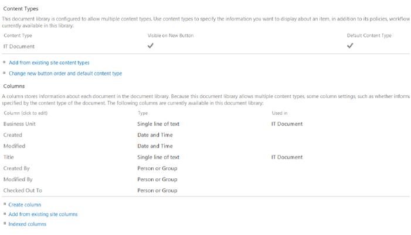
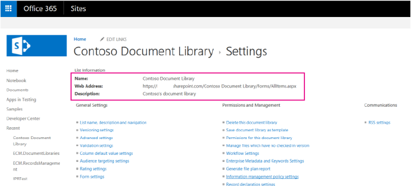

# Document library templates sample add-in for SharePoint

As part of your Enterprise Content Management (ECM) strategy, you can implement a custom document library template, and customize site columns, site content types, taxonomy fields, version settings, and the default document content type.
    
_**Applies to:** Office 365 | SharePoint 2013 | SharePoint Online_

The [ECM.DocumentLibraries](https://github.com/SharePoint/PnP/tree/master/Samples/ECM.DocumentLibraries) sample shows you how to use a provider-hosted add-in to create a list or document library, assign a content type to it, and remove the default content type. Use this solution if you want to:    

- Create a list or document library and apply a default content type.
    
- Assert greater control over the addition, maintenance, or implementation of localized versions of your custom fields.
    
- Remove the default content type on a list or library.
    
- Apply library configuration settings when you create a list or library.

## Before you begin
<a name="sectionSection0"> </a>

To get started, download the  [ECM.DocumentLibraries](https://github.com/SharePoint/PnP/tree/master/Samples/ECM.DocumentLibraries) sample add-in from the [Office 365 Developer patterns and practices](https://github.com/SharePoint/PnP/tree/dev) project on GitHub.

Users accessing the ECM.DocumentLibraries add-in must have permissions to manage lists. The  **DoesUserHavePermission** method in Default.aspx.cs checks the user's permissions to ensure they can manage lists. If the user does not have permissions to manage lists, the add-in presents an error message to the user.

```C#
private bool DoesUserHavePermission()
        {
            var spContext = SharePointContextProvider.Current.GetSharePointContext(Context);
            using (var ctx = spContext.CreateUserClientContextForSPHost())
            {
                BasePermissions perms = new BasePermissions();
                perms.Set(PermissionKind.ManageLists);
                ClientResult<bool> _permResult = ctx.Web.DoesUserHavePermissions(perms);
                ctx.ExecuteQuery();
                return _permResult.Value;
            }
        }

```

## Using the ECM.DocumentLibraries sample add-in 
<a name="sectionSection1"> </a>

When you start this add-in , the start page displays as shown in Figure 1. The ECM.DocumentLibraries start page looks like the page to add a new document library when you select  **Site Contents** > **add an app** > **Document Library** > **Advanced Options** - with one difference. When you start the add-in , the Document Template dropdown list displays custom document library template, IT Document and Contoso Document. When the user chooses **Create**, the selected custom content type is assigned to the new document library. 

**Figure 1. Start page of the ECM.DocumentLibraries add-in **



When users choose  **Create**, the  **CreateLibrary_Click** method in Default.aspx.cs checks the selected default template and makes calls to either the **CreateITDocumentLibrary** or **CreateContosoDocumentLibrary** method in ContentTypeManager.cs, as shown in the following code.
    
> [!NOTE] 
> The code in this article is provided as-is, without warranty of any kind, either express or implied, including any implied warranties of fitness for a particular purpose, merchantability, or non-infringement.

```C#
protected void CreateLibrary_Click(object sender, EventArgs e)
        {
            try
            {
                var _spContext = SharePointContextProvider.Current.GetSharePointContext(Context);
                var _templateSelectedItem = this.DocumentTemplateType.Value;
                var _libraryToCreate = this.GetLibraryToCreate();
                using (var _ctx = _spContext.CreateUserClientContextForSPHost())
                {
                    
                    _ctx.ApplicationName = "AMS ECM.DocumentLibraries";
                    ContentTypeManager _manager = new ContentTypeManager();
                    switch(_templateSelectedItem)
                    {
                        case "IT Document":
                            _manager.CreateITDocumentLibrary(_ctx, _libraryToCreate);
                            break;
                        case "Contoso Document":
                            _manager.CreateContosoDocumentLibrary(_ctx, _libraryToCreate);
                            break;
                    }
                 }

                Response.Redirect(this.Url.Value);
            }
            catch (Exception _ex)
            {
                throw;
            }
        }

```

The  **CreateContosoDocumentLibrary** method then performs the following tasks, as shown in the next code example:

1. Creates custom fields in the Managed Metadata Service.
    
2. Creates a content type. 
    
3. Associates the custom fields with the content types.
    
4. Creates the document library with the content type.

```C#
        public void CreateContosoDocumentLibrary(ClientContext ctx, Library library)
        {
            // Check the fields.
            if (!ctx.Web.FieldExistsById(FLD_CLASSIFICATION_ID)){
                ctx.Web.CreateTaxonomyField(FLD_CLASSIFICATION_ID, 
                                            FLD_CLASSIFICATION_INTERNAL_NAME, 
                                            FLD_CLASSIFICATION_DISPLAY_NAME, 
                                            FIELDS_GROUP_NAME, 
                                            TAXONOMY_GROUP, 
                                            TAXONOMY_TERMSET_CLASSIFICATION_NAME);
            }
            
            // Check the content type.
            if (!ctx.Web.ContentTypeExistsById(CONTOSODOCUMENT_CT_ID)){
                ctx.Web.CreateContentType(CONTOSODOCUMENT_CT_NAME, 
                                          CT_DESC, CONTOSODOCUMENT_CT_ID, 
                                          CT_GROUP);
            }

            // Associate fields to content types.
            if (!ctx.Web.FieldExistsByNameInContentType(CONTOSODOCUMENT_CT_NAME, FLD_CLASSIFICATION_INTERNAL_NAME)){
                ctx.Web.AddFieldToContentTypeById(CONTOSODOCUMENT_CT_ID, 
                                                  FLD_CLASSIFICATION_ID.ToString(), 
                                                  false);
            }
            CreateLibrary(ctx, library, CONTOSODOCUMENT_CT_ID);
          
        }

```

**CreateContosoDocumentLibrary** calls the **CreateTaxonomyField** method, which is part of the OfficeDevPnP.Core. **CreateTaxonomyField** creates a field in the managed metadata service from the provider-hosted add-in .

```C#
public static Field CreateTaxonomyField(this Web web, Guid id, string internalName, string displayName, string group, TermSet termSet, bool multiValue = false)
		{
			internalName.ValidateNotNullOrEmpty("internalName");
			displayName.ValidateNotNullOrEmpty("displayName");
			termSet.ValidateNotNullOrEmpty("termSet");

			try
			{
				var _field = web.CreateField(id, internalName, multiValue ? "TaxonomyFieldTypeMulti" : "TaxonomyFieldType", true, displayName, group, "ShowField=\"Term1033\"");

				WireUpTaxonomyField(web, _field, termSet, multiValue);
				_field.Update();

				web.Context.ExecuteQuery();

				return _field;
			}
			catch (Exception)
			{
				/// If there is an exception, the hidden field might be present.
				FieldCollection _fields = web.Fields;
				web.Context.Load(_fields, fc => fc.Include(f => f.Id, f => f.InternalName));
				web.Context.ExecuteQuery();
				var _hiddenField = id.ToString().Replace("-", "");

				var _field = _fields.FirstOrDefault(f => f.InternalName == _hiddenField);
				if (_field != null)
				{
					_field.DeleteObject();
					web.Context.ExecuteQuery();
				}
				throw;

			}
		}
```

**CreateContosoDocumentLibrary** calls the **CreateContentType** method which is part of OfficeDevPnP.Core. **CreateContentType** creates a new content type.

```C#
public static ContentType CreateContentType(this Web web, string name, string description, string id, string group, ContentType parentContentType = null)
        {
            LoggingUtility.Internal.TraceInformation((int)EventId.CreateContentType, CoreResources.FieldAndContentTypeExtensions_CreateContentType01, name, id);

            // Load the current collection of content types.
            ContentTypeCollection contentTypes = web.ContentTypes;
            web.Context.Load(contentTypes);
            web.Context.ExecuteQuery();
            ContentTypeCreationInformation newCt = new ContentTypeCreationInformation();

            // Set the properties for the content type.
            newCt.Name = name;
            newCt.Id = id;
            newCt.Description = description;
            newCt.Group = group;
            newCt.ParentContentType = parentContentType;
            ContentType myContentType = contentTypes.Add(newCt);
            web.Context.ExecuteQuery();

            // Return the content type object.
            return myContentType;
        }

```

**CreateContosoDocumentLibrary** calls the **AddFieldToContentTypeById** method, which is part of OfficeDevPnP.Core. **AddFieldToContentTypeById** associates a field with a content type.

```C#
public static void AddFieldToContentTypeById(this Web web, string contentTypeID, string fieldID, bool required = false, bool hidden = false)
        {
            // Get content type.
            ContentType ct = web.GetContentTypeById(contentTypeID);
            web.Context.Load(ct);
            web.Context.Load(ct.FieldLinks);
            web.Context.ExecuteQuery();

            // Get field.
            Field fld = web.Fields.GetById(new Guid(fieldID));

            // Add field association to content type.
            AddFieldToContentType(web, ct, fld, required, hidden);
        }
```

**CreateContosoDocumentLibrary** calls the **CreateLibrary** method in ContentTypeManager.cs to create the document library. The **CreateLibrary** method assigns library settings such as the document library's description, document versioning, and associated content types.

```C#
private void CreateLibrary(ClientContext ctx, Library library, string associateContentTypeID)
        {
            if (!ctx.Web.ListExists(library.Title))
            {
                ctx.Web.AddList(ListTemplateType.DocumentLibrary, library.Title, false);
                List _list = ctx.Web.GetListByTitle(library.Title);
                if(!string.IsNullOrEmpty(library.Description)) {
                    _list.Description = library.Description;
                }

                if(library.VerisioningEnabled) {
                    _list.EnableVersioning = true;
                }

                _list.ContentTypesEnabled = true;
                _list.Update();
                ctx.Web.AddContentTypeToListById(library.Title, associateContentTypeID, true);
                // Remove the default Document Content Type.
                _list.RemoveContentTypeByName(ContentTypeManager.DEFAULT_DOCUMENT_CT_NAME);
                ctx.Web.Context.ExecuteQuery();
            }
            else
            {
                throw new Exception("A list, survey, discussion board, or document library with the specified title already exists in this website.  Please choose another title.");
            }
        }
```

**CreateLibrary** calls **RemoveContentTypeByName** in ListExtensions.cs, which is part of OfficeDevPnP.Core. **RemoveContentTypeByName** removes the default content type on the document library.

```C#
        public static void RemoveContentTypeByName(this List list, string contentTypeName)
        {
            if (string.IsNullOrEmpty(contentTypeName))
            {
                throw (contentTypeName == null)
                  ? new ArgumentNullException("contentTypeName")
                  : new ArgumentException(CoreResources.Exception_Message_EmptyString_Arg, "contentTypeName");
            }

            ContentTypeCollection _cts = list.ContentTypes;
            list.Context.Load(_cts);

            IEnumerable<ContentType> _results = list.Context.LoadQuery<ContentType>(_cts.Where(item => item.Name == contentTypeName));
            list.Context.ExecuteQuery();

            ContentType _ct = _results.FirstOrDefault();
            if (_ct != null)
            {
                _ct.DeleteObject();
                list.Update();
                list.Context.ExecuteQuery();
            }
        }
```

After you create the document library, go to the  **Library settings** on your document library to review the name, description, document versioning setting, content type, and custom fields the add-in assigned to your document library.

**Figure 2. Library settings applied by the add-in **



## See also
<a name="bk_addresources"> </a>

-  [Enterprise Content Management solutions for SharePoint 2013 and SharePoint Online](Enterprise-Content-Management-solutions-for-SharePoint-2013-and-SharePoint-Online.md)
    
-  [ECM.Autotagging sample app](https://github.com/SharePoint/PnP/tree/master/Samples/ECM.Autotagging)
