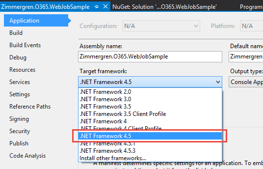

# Getting Started with azure WebJobs ("timer jobs") for your Office 365 Sites #

### Summary ###
In this post I’ll talk about how you can build an Azure WebJob to act as a scheduled job for your Office 365 (or on-prem, should you like) SharePoint installation. With Office 365, if you’re running and utilizing the SharePoint Online service, you’ll need to re-think the way you run the things that used to be *timer jobs* in your traditional Farm-solutions. Follow along while we walk through the basic concepts of getting started with building custom jobs for Office 365 sites.

# Introduction to Azure WebJob as a Timer Job for your Office 365 sites #
In traditional SharePoint development we have [Timer Jobs](http://tz.nu/1DNtqH8), which performs scheduled tasks in your SharePoint farms. A commonly used technique is to develop custom timer jobs in order to continuously or iteratively perform certain tasks in your environment.

With Office 365 and SharePoint Online, you don’t have the luxury to deploy your farm solutions, which is where your traditional timer jobs normally live. Instead, we have to find another way to schedule our tasks – this brings us to the concept of an [Azure WebJob](http://tz.nu/1ueFvMZ).

## Steps for building the WebJob using Visual Studio 2015 (Preview)  ##
In order to build a new WebJob from scratch, all we need to do is create a new console application and make sure we add the required assemblies to the project. In this sample I’ll use [Visual Studio 2015 (preview)](http://tz.nu/1CagngX), which as its name implies is currently in a beta release.

### Step 1: Create your console application ###
Start by creating a new project and make sure you’ve selected the "**Console Application**" template. Also, and this is important, make sure you've chosen **.NET Framework 4.5**!


### Step 2: Add the SharePoint-specific assemblies from NuGet ###
If you’re using Visual Studio 2015 as I’m doing, the NuGet package manager dialog will look slightly different from earlier versions of Visual Studio, but the concept’s the same.

 - Go to "**Tools**" -> "**NuGet Package Manager**" -> "**Manage NuGet Packages for Solution…**"
 - Search for "**App for SharePoint**"
 - Install the package called "**AppForSharePointWebToolkit**" which will
   install the required helper classes for working with the SharePoint
   Client Object Model.


Make sure the NuGet package worked by making sure there’s these two new classes in your console application project:


### Step 3: Add the required code to execute the job on your Office 365 site ###
At this point we’ve created our Console Application and we’ve added the required assemblies that will make it easy for us to communicate with SharePoint. Next steps are to make use of these helper classes in order to execute commands in our SharePoint environment through our Console Application. Tag along.

***Note:*** In the finished sample I’ll be using an account+password approach (like a service account). We’ll discuss authentication options further down in the article and check out links to other alternatives.

#### Wire up the calls to the SharePoint Online site collection ####

The following code demonstrates how to wire up the call to your site quite easily now that we’ve added the helper classes from our NuGet package.

```C#
 static void Main(string[] args)
  {
      using (ClientContext context = new ClientContext("https://redacted.sharepoint.com"))
      {
	      // Use default authentication mode
          context.AuthenticationMode = ClientAuthenticationMode.Default;
          // Specify the credentials for the account that will execute the request
          context.Credentials = new SharePointOnlineCredentials(GetSPOAccountName(), GetSPOSecureStringPassword());

          // TODO: Add your logic here!
      }
  }
 
 
  private static SecureString GetSPOSecureStringPassword()
  {
      try
      {
          Console.WriteLine(" --> Entered GetSPOSecureStringPassword()");
          var secureString = new SecureString();
          foreach (char c in ConfigurationManager.AppSettings["SPOPassword"])
          {
              secureString.AppendChar(c);
          }
          Console.WriteLine(" --> Constructed the secure password");
 
          return secureString;
      }
      catch
      {
          throw;
      }
  }
 
  private static string GetSPOAccountName()
  {
      try
      {
          Console.WriteLine(" --> Entered GetSPOAccountName()");
          return ConfigurationManager.AppSettings["SPOAccount"];
      }
      catch
      {
          throw;
      }
   }
``` 

You can see in my sample application that I’ve added two helper methods for fetching the Account Name and Account Password from the app.config file. These are explained in the authentication-section further down in this article.

As for the main method, that’s all we need to wire things up to our portal. Before we dig deeper into how we can manipulate SharePoint from our code, let’s discuss options for authentication.

## Authentication considerations ##
We’ll check out two options for authentication and see how they differ. There may be other options for authentication down the road, but here are two commonly used approaches.

### Option 1: Use a Service Account (Username + Password) ###
This approach is pretty straight forward and enables you to simply enter an account and password to your Office 365 tenant and then use for example CSOM to execute code on your sites. This is what you see in my sample code above as well.

#### Create a new Service Account in Office 365 ####
In order for this to work a specific account should be created that acts as a service account – either for this specific application or a generic service application account that all your jobs and services can use.

For the sake of this demo, I’ve created a new account called "**SP WebJob**":


Depending on what permissions the job should have, you will have to edit the permissions of the account when you set it up.

#### Store credentials in your app.config ####
Within your project’s app.config file you can specify the credentials so they’re easily fetchable from the code executable. This is what my app.config looks like:
```XML
<?xml version="1.0" encoding="utf-8" ?>
<configuration>
 <startup> 
   <supportedRuntime version="v4.0" sku=".NETFramework,Version=v4.5" />
 </startup>
 <appSettings>
   <add key="SPOAccount" value="spwebjob@redacted.onmicrosoft.com"/>
   <add key="SPOPassword" value="redacted"/>
 </appSettings>
</configuration>

```
You can see the two settings in the App.config:

 - SPOAccount
 - SPOPassword

If you review the first code snippet, I’m fetching these settings from the app.config file. Just keep in mind that this means storing the account name and password in clear text in your app.config. You need to make a decision in your own projects for how and where to store and protect your passwords, should you choose this approach.

#### The job runs under the specified account ####
Once the application runs, you will see that it runs using the account specified in the SharePointOnlineCredentials() constructor:


In my sample above I’m showing a WebJob that is executing actions on a custom list in one of my sites hosted in my SharePoint Online site collection.

Because of this, we can get a pretty good traceability of changes in the portal performed by our service account. This is why its important to name the account wisely – everyone will know that the modifications were done automatically by our service simply by looking at the modified/created metadata.

### Option 2: Use OAuth and include authentication tokens in your requests to avoid specifying account/password ###
This has been explained in great detail by my friend [Kirk Evans](http://blogs.msdn.com/b/kaevans/) at Microsoft.

In his post called "[Building a SharePoint Add-in as a Timer Job](http://tz.nu/1xBA76K)" he explains how you can utilize and pass along the access tokens in order to avoid username/password setups like I explained above, in case you don't want to store the passwords and credentials in your application.

## Extending the code with some CSOM magic ##
At this point we have a working Console Application which can authenticate and execute requests to your Office 365 sites. Nothing fancy has been done in the code yet, so here’s a sample snippet for pulling out some information from a list called "Automatic Translations" that I have created, and the code logic will see if there’s any items in the list that haven’t been translated and then it’ll execute a call to a translation-service and translate the text to the desired output language.
```C#
static void Main(string[] args)
{
   try
   {
      Console.WriteLine("Initiating Main()");

      using (ClientContext context = new ClientContext("https://redacted.sharepoint.com"))
      {
         Console.WriteLine("New ClientContext('https://redacted.sharepoint.com') opened. ");

         context.AuthenticationMode = ClientAuthenticationMode.Default;
         context.Credentials = new SharePointOnlineCredentials(GetSPOAccountName(), GetSPOSecureStringPassword());

         Console.WriteLine("Authentication Mode and Credentials configured");

         List translationlist = context.Web.Lists.GetByTitle("Automatic Translations");
         context.Load(translationlist);
         context.ExecuteQuery();

         Console.WriteLine("TranslationList fetched, loaded and ExecuteQuery'ed");

         if (translationlist != null && translationlist.ItemCount > 0)
         {
             Console.WriteLine("The list exist, let's do some magic");

             CamlQuery camlQuery = new CamlQuery();
             camlQuery.ViewXml =
             @"<View>  
             <Query> 
                 <Where><Eq><FieldRef Name='IsTranslated' /><Value Type='Boolean'>0</Value></Eq></Where> 
             </Query> 
         </View>";

             ListItemCollection listItems = translationlist.GetItems(camlQuery);
             context.Load(listItems);
             context.ExecuteQuery();

             Console.WriteLine("Query for listItems executed.");

             foreach (ListItem item in listItems)
             {
                 item["Output"] = TranslatorHelper.GetTranslation(item["Title"], item["Target Language"], item["Original Language"]);
                 item["IsTranslated"] = true;
                 item.Update();
             }


             context.ExecuteQuery();
             Console.WriteLine("Updated all the list items we found. Carry on...");
         }
      }
   }
   catch (Exception ex)
   {
       Console.WriteLine("ERROR: " + ex.Message);
       Console.WriteLine("ERROR: " + ex.Source);
       Console.WriteLine("ERROR: " + ex.StackTrace);
       Console.WriteLine("ERROR: " + ex.InnerException);
   }
}

```
The **TranslatorHelper** class is a helper class which calls a custom translation API but it will not be discussed in detail in this post since it's pretty far outside of the scope.

**Note:** *As seen from the code this is a demo and definitely not for production use, please revise it and adjust according to your coding standards and security principles. However all the Console.WriteLine additions are added in order for us to review the execution of the jobs easily from the Azure Portal. More on logging and monitoring further down in this article.*

## Publishing your WebJob to Azure ##
When you’ve developed your WebJob and you’re ready to deploy it to your Azure environment (deploys to an Azure WebSite), you have two main options as described below.

### Option 1: Upload a zip file with the WebJob binaries to your Azure Portal ###
Using the Azure Portal where you keep all of your awesomeness in Azure, you can upload a zip-file containing the output from Visual Studio’s build. This is an easy way for compiling and shipping your code to someone else who will do the deployment for you.

#### Create the zip file ####
Simply grab all the output files from your Visual Studio build (normally in your bin/Debug or bin/Release folder):


Compress them so you’ll get a nice Zip file for your web job:


#### Find a web site where the job should be deployed ####

Okay, so you’ve got your package. That’s easy enough. Next step is to head on to https://portal.azure.com and login to your Windows Azure Portal. From there you’ll need to either create a new web site, or use an existing one – this website will be the host for our web job.

In my case, I already have an Azure WebSite for some of my Office 365 demos so I’ll just use that one.

If you scroll down in the settings pane for your website, you’ll find a something called "**WebJobs**" under the "**Operations**" header:


**Click where the arrow points!**

#### Upload your WebJob ####

Upload your web job by clicking the **[+ Add]** sign:


Choose a Name, how the job should run and the actual zip file:


***Important:*** The "How To Run" alternative only offers "On Demand" or "Continuous" at this point, but soon there will be support for "Scheduled" as well – which is what we really want.

*(Hint: In the next section for publishing directly from Azure, you can schedule it from inside VS).*

Okay, done – you can now run your webjob from your Azure Portal:


While this is all fine and dandy, since the portal doesn’t have the dialogs for supporting scheduling just yet – I would urge you to check out how to publish from inside Visual Studio 2015 instead (or 2013, if that’s your choice).

### Option 2: Publish directly to Azure from Visual Studio ###
This is my favorite one at this point because I can use the tooling in Visual Studio to quickly publish any changes directly to my hosted service. The other benefit will become clear soon, as you can also schedule the job exactly how you want it to execute directly from the dialogs in Visual Studio.

#### Choose to publish the WebJob from Visual Studio 2015 ####

***Note:*** *These dialogs may differ slightly if you’re running an earlier version of Visual Studio. Also, I am already logged in so if you’re doing this for the first time you may get a login-dialog in order to sign in to your Azure account. That’s a pre-requisite.*

Simply right-click your project and select "**Publish as an Azure WebJob…**":


#### Add Azure WebJob ####
This will bring you to a new dialog where you can configure the job, and since we want a recurring job that should be executed on a schedule (in my case once every night) you can configure the schedule directly from the dialogs:


 - Make sure the name is web friendly
 - Select your run mode, I’m on "Run on a Schedule" because we want to have it occur on a specific time every day
 - Should the job be a recurring job or a one-time job? Since we want to simulate a Timer Job it needs to be recurring, and in my case without any end date since it’ll be running every night
 - You can schedule the recurrence down to every minute, should you want.
 - When do we start? :-)

Hit **OK** and you’ll see that Visual Studio will drop you a message saying "**Installing WebJobs Publishing NuGet Package**".

#### Visual Studio added WebJobs Publishing NuGet Package ####


This actually adds a new file called "**webjob-publish-settings.json**" to our project, containing the configuration for the job.

The file looks like this:
```json
{
  "$schema": "http://schemastore.org/schemas/json/webjob-publish-settings.json",
  "webJobName": "Zimmergren-O365-WebJobSample",
  "startTime": "2015-01-09T01:00:00+01:00",
  "endTime": null,
  "jobRecurrenceFrequency": "Day",
  "interval": 1,
  "runMode": "Scheduled"
}
```
Right, we don’t need to bother with this file at the moment since we already designed the scheduling using the dialogs.

#### Select publishing/deployment target ####
The next step in the dialog will be where to publish/deploy your WebJob. You can either import a publishing profile or select Microsoft Azure WebSites in order to authenticate and select one of your existing sites.

Since I’ve got a habit of always downloading my publishing profiles from my Azure Portal, I’ll go ahead and select "**Import**" and simply specify the publishing profile file that I’ve downloaded from my Azure website:


With that done, all we need to do is click the button called "Publish". Don’t be afraid, it wont bite. I think.

#### Publish ####
Once you hit Publish, the Web Publish Activity dialog will display the progress of your Web Job deployment:


Once it’s done, you should see the WebJob in your Azure Portal:


The WebJob status is now displayed as Completed. It would say failure/error if it would throw any unhandled exceptions or otherwise provide unhealthy behavior.

It still says "On Demand", but this job actually runs once every hour now.

## Monitoring the job and reviewing logs ##
If you’ve done all the previous steps, you’ve got a job working for you as a scheduled task in the cloud, performing actions toward your Office 365 site(s).

### View all job executions and status ###
If you want to review when the job last ran, what the outcome of every execution of the job was or review what happened during execution of the job, you can click on the link under "Logs" when you’re in the WebJobs overview:


This will give you an overview of all the executions of the selected jobs, including the status /outcome:


By clicking the highlighted link, you can dig down into a specific execution to review the logs of the job and make sure things look okay. This is probably more relevant if the job actually caused an error and you needed to investigate what went wrong, or if the outcome of the job is incorrect or not as expected.

You can also see that the Console.WriteLine statements that I so nicely used in my Console Application for this demo now shows up in the job execution log:


## Tips & Tricks ##
While this can all be done with earlier versions of Visual Studio, I made everything work with Visual Studio 2015. But along the way there were some gotchas, I’m adding them here in case you bump into the same thing.

### Exit code -2146232576 problem when running the job ###
Since I started a Visual Studio 2015 (Preview) project, it started the project up as a Console Application based on **.NET Framework 4.5.3**.

Running the job locally works fine, since .NET Framework 4.5.3 exist on my dev machine. However, once I deployed the job to My Windows Azure Web Site as a WebJob, it failed with "**exit code -2146232576**".

#### Solution: Make sure you’re on the correct .NET version ####
It took a while before I realized that Azure didn’t like .NET Framework version 4.5.3, but when I changed to **.NET Framework 4.5**, it works.

If you bump into that problem, just make sure your job is executing under the correct .NET framework version.


# Summary #
While there’s not very much to building an Azure WebJob, you can make them quite complex. The overall concept is very straight forward – but then as with all complex projects comes the decisions around authentication, code stability and reliability, high availability scenarios, maintainability and so on. These are variables unique to each project and should be carefully considered before "just deploying" a job to Azure.

### Related links ###
-  [Original blog post on Azure WebJobs](http://zimmergren.net/technical/getting-started-with-building-azure-webjobs-timer-jobs-for-your-office-365-sites) by Tobias Zimmergren
-  [Recommended Resources for Azure WebJobs](http://azure.microsoft.com/en-us/documentation/articles/websites-webjobs-resources/)
-  [Visual Studio 2015 (Preview) Download](http://www.visualstudio.com/en-us/downloads/visual-studio-2015-downloads-vs.aspx)
-  [Building a SharePoint Add-in as a Timer Job](http://blogs.msdn.com/b/kaevans/archive/2014/03/02/building-a-sharepoint-app-as-a-timer-job.aspx) by Kirk Evans
-  [How to Deploy Azure WebJobs to Azure Websites](http://azure.microsoft.com/en-us/documentation/articles/websites-dotnet-deploy-webjobs/)
-  [Simple remote timer job that interacts with SharePoint Online](http://channel9.msdn.com/Blogs/Office-365-Dev/Simple-remote-timer-job-that-interacts-with-SharePoint-Online-Office-365-Developer-Patterns-and-Prac) by Andrew Connell on Channel9

### Applies to ###
-  Office 365 Multi Tenant (MT)
-  Office 365 Dedicated (D)
-  SharePoint 2013 on-premises 
