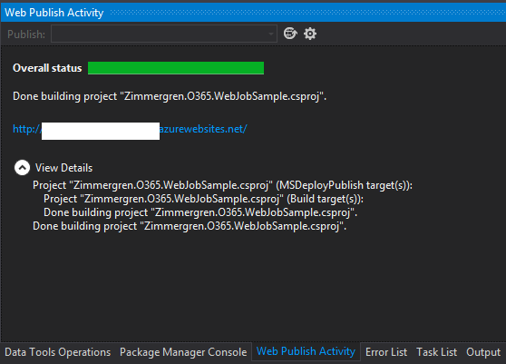

# Get started with Azure WebJobs for Office 365 sites

With Office 365, if you’re running and utilizing the SharePoint Online service, you must rethink the way that you run what used to be **timer jobs** in your traditional farm solutions. 

In traditional SharePoint development, you use timer jobs to perform scheduled tasks in SharePoint farms. A commonly used technique is to develop custom timer jobs to continuously or iteratively perform certain tasks in your environment. With Office 365 and SharePoint Online, you don’t have the luxury of deploying your farm solutions, which is where your traditional timer jobs normally live. Instead, you have to find another way to schedule your tasks, which brings us to [Azure WebJobs](https://github.com/Azure/azure-webjobs-sdk/wiki).

This article describes the basic concepts for getting started with building custom jobs for Office 365 sites, and how you can build an Azure WebJob to act as a scheduled job for your Office 365 (or on-premises) SharePoint installation. 

## Build the WebJob using Visual Studio

To build a new WebJob, all you need to do is create a new console application and make sure that you add the required assemblies to the project. In this sample, we use [Visual Studio](https://www.visualstudio.com/downloads/).

### Step 1: Create your console application

Start by creating a new project, and ensure that you choose the **Console Application** template. Also, be sure to choose **.NET Framework 4.5** or later.


### Step 2: Add the SharePoint-specific assemblies from NuGet

If you’re using Visual Studio, the NuGet package manager dialog may look slightly different from earlier versions of Visual Studio, but the concept is the same.

1. Go to **Tools** > **NuGet Package Manager** > **Manage NuGet Packages for Solution**, and search for **App for SharePoint**.

2. Install the package called **AppForSharePointWebToolkit**.

3. The toolkit installs the required helper classes for working with the SharePoint client-side object model (CSOM).


<br/>

Ensure that the NuGet package worked by making sure that the following two new classes appear in your console application project:
- SharePointContext.cs
- TokenHelper.cs


### Step 3: Add the required code to execute the job on your Office 365 site

At this point, you’ve created your console application and have added the required assemblies that will enable you to easily communicate with SharePoint. The next steps are to make use of these helper classes to execute commands in your SharePoint environment by using your console application.

> [!NOTE] 
> In the finished sample, you'll use an account + password approach (like a service account). Authentication options are discussed later in this article.

#### Wire up the calls to the SharePoint Online site collection

The following code demonstrates how to wire up the call to your site now that you’ve added the helper classes from your NuGet package.

```csharp
 static void Main(string[] args)
  {
      using (ClientContext context = new ClientContext("https://redacted.sharepoint.com"))
      {
	      // Use default authentication mode
          context.AuthenticationMode = ClientAuthenticationMode.Default;
          // Specify the credentials for the account that will execute the request
          context.Credentials = new SharePointOnlineCredentials(GetSPOAccountName(), GetSPOSecureStringPassword());

          // TODO: Add your logic here!
      }
  }
 
 
  private static SecureString GetSPOSecureStringPassword()
  {
      try
      {
          Console.WriteLine(" - > Entered GetSPOSecureStringPassword()");
          var secureString = new SecureString();
          foreach (char c in ConfigurationManager.AppSettings["SPOPassword"])
          {
              secureString.AppendChar(c);
          }
          Console.WriteLine(" - > Constructed the secure password");
 
          return secureString;
      }
      catch
      {
          throw;
      }
  }
 
  private static string GetSPOAccountName()
  {
      try
      {
          Console.WriteLine(" - > Entered GetSPOAccountName()");
          return ConfigurationManager.AppSettings["SPOAccount"];
      }
      catch
      {
          throw;
      }
   }
``` 

You can see in the sample application that two helper methods have been added for fetching the account name and account password from the app.config file. These are explained in the authentication section later in this article.

As for the **Main** method, that’s all you need to wire things up to your portal. Before you dig deeper into how you can manipulate SharePoint from your code, let’s discuss options for authentication.

## Consider authentication options

You have two options for authentication. The following sections describe these commonly used approaches and how they differ. 

### Option 1: Use a service account (username + password)

This approach is pretty straightforward, and enables you to simply enter an account and password to your Office 365 tenant and then use, for example, CSOM to execute code on your sites. This is what was done in the previous sample code as well.

#### Create a new service account in Office 365

For this to work, you should create a specific account that acts as a service account for either this specific application or a generic service application account that all your jobs and services can use.

For the sake of this demo, we created a new account called **SP WebJob**.


Depending on the permissions that the job should have, you must edit the permissions of the account when you set it up.

#### Store credentials in your app.config

Within your project’s app.config file, you can specify the credentials so they’re easily fetchable from the code executable. This is what the app.config looks like:

```XML
<?xml version="1.0" encoding="utf-8" ?>
<configuration>
 <startup> 
   <supportedRuntime version="v4.0" sku=".NETFramework,Version=v4.5" />
 </startup>
 <appSettings>
   <add key="SPOAccount" value="spwebjob@redacted.onmicrosoft.com"/>
   <add key="SPOPassword" value="redacted"/>
 </appSettings>
</configuration>

```

You can see the two settings in the app.config file:

 - SPOAccount
 - SPOPassword

If you review the first code snippet, these settings are from the app.config file. Just keep in mind that this means storing the account name and password in clear text in your app.config. You need to make a decision in your own projects for how and where to store and protect your passwords should you choose this approach.

#### Run the job under the specified account

After the application runs, it runs by using the account specified in the SharePointOnlineCredentials() constructor.


In the previous sample, the WebJob is executing actions on a custom list in one of the sites hosted in a SharePoint Online site collection.

Because of this, you can get a pretty good traceability of changes in the portal performed by your service account. This is why its important to name the account wisely; everyone will know that the modifications were done automatically by your service simply by looking at the modified/created metadata.

### Option 2: Use OAuth and include authentication tokens in your requests to avoid specifying account/password

In a blog post by [Kirk Evans](https://blogs.msdn.microsoft.com/kaevans/) called [Building a SharePoint Add-in as a Timer Job](https://blogs.msdn.microsoft.com/kaevans/2014/03/02/building-a-sharepoint-app-as-a-timer-job/), he explains how you can utilize and pass along access tokens to avoid username/password setups, in case you don't want to store the passwords and credentials in your application.

## Extend the code with CSOM

At this point you have a working console application that can authenticate and execute requests to your Office 365 sites. Nothing fancy has been done in the code yet, so here’s a sample snippet for pulling out some information from a list called **Automatic Translations**. The code logic determines if there are any items in the list that haven’t been translated. It will then execute a call to a translation service and translate the text to the desired output language.

```csharp
static void Main(string[] args)
{
   try
   {
      Console.WriteLine("Initiating Main()");

      using (ClientContext context = new ClientContext("https://redacted.sharepoint.com"))
      {
         Console.WriteLine("New ClientContext('https://redacted.sharepoint.com') opened. ");

         context.AuthenticationMode = ClientAuthenticationMode.Default;
         context.Credentials = new SharePointOnlineCredentials(GetSPOAccountName(), GetSPOSecureStringPassword());

         Console.WriteLine("Authentication Mode and Credentials configured");

         List translationlist = context.Web.Lists.GetByTitle("Automatic Translations");
         context.Load(translationlist);
         context.ExecuteQuery();

         Console.WriteLine("TranslationList fetched, loaded and ExecuteQuery'ed");

         if (translationlist != null && translationlist.ItemCount > 0)
         {
             Console.WriteLine("The list exist, let's do some magic");

             CamlQuery camlQuery = new CamlQuery();
             camlQuery.ViewXml =
             @"<View>  
             <Query> 
                 <Where><Eq><FieldRef Name='IsTranslated' /><Value Type='Boolean'>0</Value></Eq></Where> 
             </Query> 
         </View>";

             ListItemCollection listItems = translationlist.GetItems(camlQuery);
             context.Load(listItems);
             context.ExecuteQuery();

             Console.WriteLine("Query for listItems executed.");

             foreach (ListItem item in listItems)
             {
                 item["Output"] = TranslatorHelper.GetTranslation(item["Title"], item["Target Language"], item["Original Language"]);
                 item["IsTranslated"] = true;
                 item.Update();
             }


             context.ExecuteQuery();
             Console.WriteLine("Updated all the list items you found. Carry on...");
         }
      }
   }
   catch (Exception ex)
   {
       Console.WriteLine("ERROR: " + ex.Message);
       Console.WriteLine("ERROR: " + ex.Source);
       Console.WriteLine("ERROR: " + ex.StackTrace);
       Console.WriteLine("ERROR: " + ex.InnerException);
   }
}

```

The **TranslatorHelper** class is a helper class that calls a custom translation API, but it will not be discussed in detail in this post because it's out of the scope of this article.

> [!NOTE] 
> As seen from the code, this is a demo and definitely not for production use. Please revise it and adjust according to your coding standards and security principles. However, all the Console.WriteLine additions are added in order for you to review the execution of the jobs easily from the [Azure portal](https://ms.portal.azure.com/). More information about logging and monitoring appears later in this article.

## Publish your WebJob to Azure

When you’ve developed your WebJob and you’re ready to deploy it to your Azure environment (to an Azure website), you have two main options as described in the following sections.

### Option 1: Upload a zip file with the WebJob binaries to your Azure portal

Using the Azure portal where you keep all of your awesomeness in Azure, you can upload a zip file that contains the output from Visual Studio’s build. This is an easy way for compiling and shipping your code to someone else who will do the deployment for you.

#### Create the zip file

Simply grab all the output files from your Visual Studio build (normally in your bin/Debug or bin/Release folder).


<br/>

Compress them so that you get a nice zip file for your WebJob.


#### Find a website where the job should be deployed

1. Now that you’ve got your package, the next step is to go to your [Azure portal](https://ms.portal.azure.com/) and sign in. 

2. From there you must either create a new website or use an existing one. This website is the host for your WebJob.

3. If you scroll down in the settings pane for your website, you’ll find a tile called **WebJobs** under the **Operations** header.

    

4. Click the area where the arrow is pointing.

#### Upload your WebJob 

1. Upload your WebJob by choosing the **[+ Add]** sign.

    

2. Choose a name and how the job should run, and then upload the actual zip file.

    

    > [!IMPORTANT] 
    > The **How To Run** alternative currently only offers **On Demand** or **Continuous**, but soon there will be support for **Scheduled** as well, which is what you really want. In the section Publishing directly to Azure, you can schedule it from inside Visual Studio.

3. You can now run your WebJob from your Azure portal.

    


### Option 2: Publish directly to Azure from Visual Studio

You can use the tooling in Visual Studio to quickly publish any changes directly to your hosted service. You can also schedule the job exactly the way you want it to execute directly from the dialogs in Visual Studio.

#### Publish the WebJob from Visual Studio 

> [!NOTE] 
> These dialogs may differ slightly if you’re running an earlier version of Visual Studio. Also, if you’re doing this for the first time, you may get a sign-in dialog to sign in to your Azure account. 

Right-click your project, and then choose **Publish as Azure WebJob**.


#### Add Azure WebJob 

This brings you to a new dialog where you can configure the job. Because you want a recurring job that should be executed on a schedule (such as once every night), you can configure the schedule directly from the dialogs.


1. Make sure the **WebJob name** is web friendly.

2. Select your **WebJob run mode**. If you want to have it occur on a specific time every day, choose **Run on a Schedule**.

3. Should the job be a **recurring** job or a one-time job? Because you want to simulate a timer job, it needs to be recurring, and if it will run every night, without any end date.

4. You can **schedule the recurrence** down to every minute if you want.

5. Indicate the starting **date** and **time**, as well as the **time zone**. 

6. Choose **OK**. Visual Studio sends the following message: **Installing WebJobs Publishing NuGet Package**.

    

    This actually adds a new file called **webjob-publish-settings.json** to your project, containing the configuration for the job.

    The file looks like this:

   ```json
    {
    "$schema": "http://schemastore.org/schemas/json/webjob-publish-settings.json",
    "webJobName": "Zimmergren-O365-WebJobSample",
    "startTime": "2015-01-09T01:00:00+01:00",
    "endTime": null,
    "jobRecurrenceFrequency": "Day",
    "interval": 1,
    "runMode": "Scheduled"
    }
   ```

    > [!NOTE] 
    > You don’t need this file at the moment because you already designed the scheduling by using the dialogs.

#### Select publishing/deployment target

The next step in the dialog is to indicate where to publish/deploy your WebJob. You can either import a publishing profile or select Azure websites to authenticate and select one of your existing sites.

In your Azure portal, choose **Import** and specify the publishing profile file that you downloaded from your Azure website.


#### Publish

With that done, all you need to do is choose **Publish**. The **Web Publish Activity** dialog then displays the progress of your WebJob deployment.



<br/>

When it’s done, you should see the WebJob in your Azure portal.


The WebJob status is now displayed as **Completed**. It would say **failure/error** if it threw any unhandled exceptions or otherwise provided unhealthy behavior.

**Type** still says **On Demand**, but this job actually runs once every hour now.

## Monitor the job and review logs

If you’ve completed all the previous steps, you now have a job working for you as a scheduled task in the cloud, performing actions toward your Office 365 sites.

If you want to review when the job last ran, what the outcome of every execution of the job was, or what happened during execution of the job, you can choose the link under **Logs** when you’re in the WebJobs overview.


<br/>

This gives you an overview of all the executions of the selected jobs, including the status /outcome.


<br/>

By choosing the highlighted link, you can dig down into a specific execution to review the logs of the job and make sure things look okay. This is probably more relevant if the job actually caused an error and you needed to investigate what went wrong, or if the outcome of the job is incorrect or not as expected.

You can also see that the Console.WriteLine statements that we used in the console application for this demo now show up in the job execution log.


## See also

-  [Original blog post on Azure WebJobs](http://zimmergren.net/technical/getting-started-with-building-azure-webjobs-timer-jobs-for-your-office-365-sites) by Tobias Zimmergren
-  [Develop and deploy WebJobs using Visual Studio - Azure App Service](https://docs.microsoft.com/en-us/azure/app-service/websites-dotnet-deploy-webjobs)
-  [Simple remote timer job that interacts with SharePoint Online](https://channel9.msdn.com/Blogs/Office-365-Dev/Simple-remote-timer-job-that-interacts-with-SharePoint-Online-Office-365-Developer-Patterns-and-Prac) video by Andrew Connell on Channel9
- [Use Microsoft Azure WebJobs with Office 365](use-microsoft-azure-webjobs-with-office-365.md)
- [PnP remote timer job framework](pnp-remote-timer-job-framework.md)