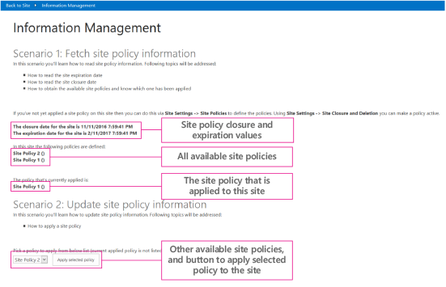

# Information management sample SharePoint Add-in

The Core.InformationManagement sample shows you how to use an ASP.NET provider-hosted add-in to get and set a site policy on a site. 

Use this solution if you want to:

- Apply policy settings during your custom site provisioning process. 
- Create a new or modify an existing site policy.
- Create a custom expiration formula. 
    
## Before you begin

To get started, download the [Core.InformationManagement](https://github.com/SharePoint/PnP/tree/master/Samples/Core.InformationManagement) sample add-in from the Office 365 Developer Patterns and Practices project on GitHub.

> [!NOTE] 
> The code in this article is provided as-is, without warranty of any kind, either express or implied, including any implied warranties of fitness for a particular purpose, merchantability, or non-infringement.

We recommend that you create at least one site policy and assign it to your site before you run this add-in. Otherwise, the add-in will start without displaying sample data. For more information, see [Overview of site policies in SharePoint Server](https://docs.microsoft.com/en-us/SharePoint/sites/site-policy-overview).

## Using the Core.InformationManagement sample add-in

When you start the Information Management add-in, the start page displays the following information, as shown in the following figure:

- The site's closure and expiration dates. These dates are specific to a site and are based on the configuration settings of the site policy that is applied.
- All site policies that can be applied to the site.
- The site policy that is currently applied.
- The option box to select and apply a new site policy to the site.



From your SharePoint site, you can go to the add-in, which runs on the remote host, by choosing **Recent** > **Core.InformationManagement**. To return to your SharePoint site, choose **Back to Site**.

The Pages\Default.aspx.cs file in the Core.InformationManagementWeb project contains the code for the page displayed in the previous figure. 

The following code in the **Page_Load** method of the Default.aspx.cs page fetches and displays the closure and expiration dates of the site, based on the applied site policy. This code calls the **GetSiteExpirationDate** and **GetSiteCloseDate** extension methods of the OfficeDevPnP.Core project.
    
```csharp
// Get site expiration and closure dates.
if (cc.Web.HasSitePolicyApplied())
{
        lblSiteExpiration.Text = String.Format("The expiration date for the site is {0}", cc.Web.GetSiteExpirationDate());
        lblSiteClosure.Text = String.Format("The closure date for the site is {0}", cc.Web.GetSiteCloseDate());
}

```

<br/>

The following code in the **Page_Load** method of the Default.aspx.cs page displays the names of all site policies that can be applied to the site (including the currently applied site policy). This code calls the **GetSitePolicies** extension method of the OfficeDevPnP.Core project.

```csharp
// List the defined policies.
List<SitePolicyEntity> policies = cc.Web.GetSitePolicies();
string policiesString = "";
foreach (var policy in policies)
                    {
                        policiesString += String.Format("{0} ({1}) <BR />", policy.Name, policy.Description);
                    }
lblSitePolicies.Text = policiesString;
            };

```

<br/>

The following code in the **Page_Load** method of the Default.aspx.cs page displays the name of the site policy currently applied to the site. This calls the **GetAppliedSitePolicy** extension method of the OfficeDevPnP.Core project.

```csharp
// Show the assigned policy.
SitePolicyEntity appliedPolicy = cc.Web.GetAppliedSitePolicy();
if (appliedPolicy != null)
            {
            lblAppliedPolicy.Text = String.Format("{0} ({1})", appliedPolicy.Name, appliedPolicy.Description);
            }
else
            {
            lblAppliedPolicy.Text = "No policy has been applied";
            }

```

<br/>

The following code in the **Page_Load** method of the Default.aspx.cs page populates the list with the site policies that are available, except for the site policy that is currently assigned to the site.

```csharp
// Fill the policies combo.
foreach (var policy in policies)
{
if (appliedPolicy == null || !policy.Name.Equals(appliedPolicy.Name, StringComparison.InvariantCultureIgnoreCase))
{
                            drlPolicies.Items.Add(policy.Name);
           }
}
btnApplyPolicy.Enabled = drlPolicies.Items.Count > 0;

```

<br/>

The following code in the Default.aspx.cs page applies the selected site policy to the site. The original site policy is replaced by the new site policy. 

```csharp
protected void btnApplyPolicy_Click(object sender, EventArgs e)
{
if (drlPolicies.SelectedItem != null)
            {
                cc.Web.ApplySitePolicy(drlPolicies.SelectedItem.Text);
                Page.Response.Redirect(Page.Request.Url.ToString(), true);
            }
}

```

## See also

- [OfficeDevPnP.Core sample](https://github.com/SharePoint/PnP-Sites-Core/tree/master/Core)   
- [Core.SiteClassification sample](https://github.com/SharePoint/PnP/tree/master/Samples/Core.SiteClassification)   
- [ECM.AutoTagging sample app](https://github.com/SharePoint/PnP/tree/master/Samples/ECM.AutoTagging)   
- [ECM.DocumentLibraries sample app](https://github.com/SharePoint/PnP/tree/master/Samples/ECM.DocumentLibraries)   
- [ECM.RecordsManagement sample app](https://github.com/SharePoint/PnP/tree/master/Samples/ECM.RecordsManagement)
- [Enterprise Content Management solutions for SharePoint](enterprise-content-management-solutions-for-sharepoint.md)