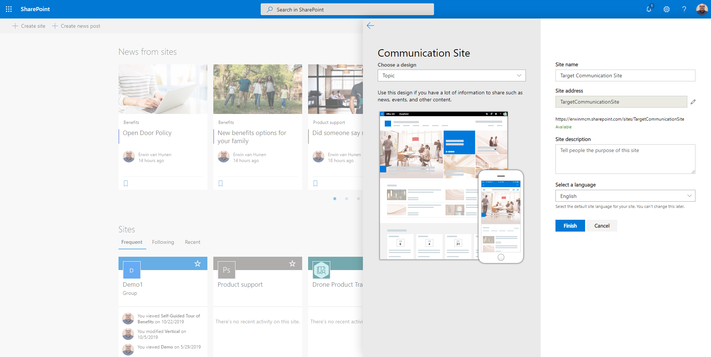

# Introducing the PnP provisioning engine

This article introduces the PnP provisioning engine, which was originally released in April 2015 within the [OfficeDev PnP](../community/community.md) project, and which is updated on a monthly basis in alignment with the release schedule of the Office Dev PnP Core Library. 

[!INCLUDE [pnp-provisioning-engine](../../includes/snippets/open-source/pnp-provisioning-engine.md)]
<a name="thegoal"> </a>

## The goal

Let’s start from the main goal of having a provisioning engine. With the introduction of Microsoft Office 365 and Microsoft SharePoint Online, developers are facing the new Cloud Add-in model as a new way of creating custom software solutions for Microsoft SharePoint, SharePoint Online, and Office 365 in general. However, while in the past developers provisioned custom artifacts using the CAML/XML-based Feature Framework, either with full trust code (FTC) solutions or sandbox solutions, provisioning artifacts in the new Cloud Add-in model should be done via the "remote provisioning" technique. What does it mean to do remote provisioning? It means using the one of the available APIs (REST or CSOM) to provision artifacts instead of using the Feature Framework.

What if you want to model and provision artifacts by using a test and a production environment, or what if you want to automate provisioning of artifacts, just because you want to sell your customizations to multiple customers? Likewise, what if you want to define a custom site template that you can reuse across multiple site instances, such as customer-oriented sites or project-oriented sites?

Using the new PnP provisioning engine, you can model a site by configuring the design of site columns, content types, list definitions and instances, pages, and much more, via your web browser. When you are done with the design, you can export what you have done into a provisioning template format (XML, JSON, or a container format called a [PnP file](the-pnp-office-open-xml-file-format.md)), and you can apply that template to as many target sites as you like.

However, what if you would like to provision other artifacts like Microsoft Teams? Or Azure AD users? The PnP Provisioning Engine can do the work for you.

## Two types of Templates

There are basically two types of templates that the engine understands: **Site Templates** (also called Provisioning Templates) and the extended version: **Tenant Templates**. 

When the engine was introduced the only template type available was the Site Template. After a few years we introduced the Tenant Template which distinguishes itself from its ability to provision artifacts beyond the scope of SharePoint sites. A tenant template for instance allows you to provision a Microsoft Teams team, Azure AD users, Site Designs and Site Scripts, tenant scoped themes, etc. Unlike Site Templates, you can create a so-called 'Sequence' in a tenant template and create site collections. 

To keep it short: a tenant template is a site template which can contain artifacts to provision to tenant level.

<a name="creatingtemplate"> </a>

## Create a site template

As already stated, the easiest way to create a custom provisioning template is to create a fresh new site collection in SharePoint Online, configure your artifacts (site columns, content types, lists, pages, etc.), and save the result as a provisioning template.

Let's say you have defined a sample site with a custom homepage:


Besides the custom homepage you created a few events in the out of the box Events list:


To export that site as a provisioning template, you can either use PowerShell or CSOM code, with some extension methods, which are provided by the OfficeDev PnP Core Library. 

### Using PowerShell cmdlets

> [!NOTE] 
> This article focuses on using PnP PowerShell to work with the Provisioning Engine. If you prefer using C#, please refer to [PnP Provisioning Engine and the Core Library](./pnp-provisioning-engine-and-the-core-library.md).

[!INCLUDE [pnp-powershell](../../includes/snippets/open-source/pnp-powershell.md)]

To use the PowerShell cmdlets for SharePoint Online or SharePoint, go to [PnP PowerShell overview](/powershell/sharepoint/sharepoint-pnp/sharepoint-pnp-cmdlets?view=sharepoint-ps), and install the SharePoint PnP PowerShell module. 

After you have connected your PowerShell environment to SharePoint Online by using the **Connect-PnPOnline** cmdlet, you can use the following PowerShell cmdlet: 

```powershell
Get-PnPSiteTemplate -Out "PnP-Provisioning-File.xml"
```

The `–Out` argument instructs the cmdlet about where to save the provisioning template.

The result of extracting and saving the template is, depending of the extension you used in the cmdlet (we support .xml and [.pnp](the-pnp-office-open-xml-file-format.md) currently), a file. If you selected to save the template as an XML file it will look like something you see below (notice, the template is not complete and is just an example of the XML structure):

> [!NOTE] 
> There are many configuration options to set to extract a template. For an explanation of this refer to [Configuring the PnP Provisioning Engine](./configuring-the-pnp-provisioning-engine.md).

```xml    
   <?xml version="1.0"?>
<pnp:Provisioning xmlns:pnp="http://schemas.dev.office.com/PnP/2019/09/ProvisioningSchema">
  <pnp:Preferences Generator="OfficeDevPnP.Core, Version=3.14.1910.1, Culture=neutral, PublicKeyToken=null" />
  <pnp:Templates ID="CONTAINER-TEMPLATE-8F4D883BE25B442FB9F889C351D3EA0B">
    <pnp:ProvisioningTemplate ID="TEMPLATE-8F4D883BE25B442FB9F889C351D3EA0B" Version="1" BaseSiteTemplate="SITEPAGEPUBLISHING#0" Scope="RootSite">
      <pnp:WebSettings RequestAccessEmail="" NoCrawl="false" WelcomePage="SitePages/Home.aspx" SiteLogo="{hosturl}{site}/SiteAssets/__sitelogo___sitelogo_theperspective.png"/>
      <pnp:Navigation AddNewPagesToNavigation="true" CreateFriendlyUrlsForNewPages="true">
        <pnp:CurrentNavigation NavigationType="StructuralLocal">
          <pnp:StructuralNavigation RemoveExistingNodes="true">
            <pnp:NavigationNode Title="Who we are" Url="http://linkless.header/" IsExternal="true">
            </pnp:NavigationNode>
            <pnp:NavigationNode Title="What's happening" Url="http://linkless.header/" IsExternal="true">
            <pnp:NavigationNode Title="Find it" Url="http://linkless.header/" IsExternal="true">
            </pnp:NavigationNode>
          </pnp:StructuralNavigation>
        </pnp:CurrentNavigation>
      </pnp:Navigation>
      <pnp:Lists>
        <pnp:ListInstance Title="Events" Description="" DocumentTemplate="" TemplateType="106" Url="Lists/Events" MinorVersionLimit="0" MaxVersionLimit="0" DraftVersionVisibility="0" TemplateFeatureID="00bfea71-ec85-4903-972d-ebe475780106" ContentTypesEnabled="true" EnableFolderCreation="false" DefaultDisplayFormUrl="{site}/Lists/Events/DispForm.aspx" DefaultEditFormUrl="{site}/Lists/Events/EditForm.aspx" DefaultNewFormUrl="{site}/Lists/Events/NewForm.aspx" ImageUrl="/_layouts/15/images/itevent.png?rev=44" IrmExpire="false" IrmReject="false" IsApplicationList="false" ValidationFormula="" ValidationMessage="">
        </pnp:ListInstance>
        <pnp:DataRows KeyColumn="Title" UpdateBehavior="Overwrite">
          <pnp:DataRow>
            <pnp:DataValue FieldName="Title">Thanksgiving</pnp:DataValue>
            <pnp:DataValue FieldName="fAllDayEvent">true</pnp:DataValue>
            <pnp:DataValue FieldName="EventDate">2019-11-28 00:00:00</pnp:DataValue>
            <pnp:DataValue FieldName="EndDate">2019-11-28 23:59:00</pnp:DataValue>
          </pnp:DataRow>
          <pnp:DataRow>
            <pnp:DataValue FieldName="Title">In the design lab with Carlos Slattery</pnp:DataValue>
            <pnp:DataValue FieldName="Location">Contoso HQ</pnp:DataValue>
            <pnp:DataValue FieldName="fAllDayEvent">false</pnp:DataValue>
            <pnp:DataValue FieldName="EventDate">2020-01-02 10:00:00</pnp:DataValue>
            <pnp:DataValue FieldName="EndDate">2020-01-02 12:00:00</pnp:DataValue>
          </pnp:DataRow>
        </pnp:DataRows>
      </pnp:Lists>
      <pnp:ClientSidePages>
        <pnp:ClientSidePage PromoteAsNewsArticle="false" PromoteAsTemplate="false" Overwrite="true" Layout="Home" EnableComments="false" Title="Home" ThumbnailUrl="" PageName="Home.aspx" LCID="0">
          <pnp:Header Type="Default" LayoutType="FullWidthImage" TextAlignment="Center" ShowTopicHeader="false" ShowPublishDate="false" TopicHeader="" AlternativeText="" Authors="[]" AuthorByLine="[]" AuthorByLineId="-1" />
          <pnp:Sections>
            <pnp:Section Order="1" Type="OneColumnVerticalSection" VerticalSectionEmphasis="Soft">
              <pnp:Controls>
                <pnp:CanvasControl WebPartType="News" JsonControlData="{&quot;id&quot;: &quot;8c88f208-6c77-4bdb-86a0-0c47b4316588&quot;, &quot;instanceId&quot;: &quot;1ac6db3e-eb95-4d5d-a991-28ee34772313&quot;, ..." ControlId="8c88f208-6c77-4bdb-86a0-0c47b4316588" Order="1" Column="1" />
                <pnp:CanvasControl WebPartType="News" JsonControlData="{&quot;id&quot;: &quot;8c88f208-6c77-4bdb-86a0-0c47b4316588&quot;, &quot;instanceId&quot;: &quot;e5fc83c0-3350-4eea-9606-6627646a0a4b&quot;, &quot;title&quot;: &quot;News&quot;, &quot;description&quot;: &quot;..." ControlId="8c88f208-6c77-4bdb-86a0-0c47b4316588" Order="2" Column="1" />
                <pnp:CanvasControl WebPartType="Custom" JsonControlData="{&quot;id&quot;: &quot;868ac3c3-cad7-4bd6-9a1c-14dc5cc8e823&quot;, &quot;instanceId&quot;: &quot;c1524d29-ab2a-44a3-809e-c01c3762c4ee&quot;, &quot;title&quot;: &quot;Weather&quot;, &quot;description&quot;:..." ControlId="868ac3c3-cad7-4bd6-9a1c-14dc5cc8e823" Order="1" Column="2" />
              </pnp:Controls>
            </pnp:Section>
            <pnp:Section Order="2" Type="OneColumn">
              <pnp:Controls>
                <pnp:CanvasControl WebPartType="CallToAction" JsonControlData="{&quot;id&quot;: &quot;df8e44e7-edd5-46d5-90da-aca1539313b8&quot;, &quot;instanceId&quot;: &quot;b022816d-c9de-4989-aa10-9b44bec4a872&quot;, &quot;title&quot;: &quot;Call to action&quot;, &quot;description&quot;: &quot;Call to action&quot;, &quot;dataVersion&..." Order="1" Column="1" />
              </pnp:Controls>
            </pnp:Section>
            <pnp:Section Order="3" Type="ThreeColumn">
              <pnp:Controls>
                <pnp:CanvasControl WebPartType="Image" JsonControlData="{&quot;id&quot;: &quot;d1d91016-032f-456d-98a4-721247c305e8&quot;, &quot;instanceId&quot;: &quot;984b089c-ca62-4f92-89c0-1ce0e1cb6c03&quot;, &quot;title&quot;: &quot;Image&quot;, &quot;description&quot;: &quot;Image&quot;, &quot;dataVersion&quot;: &quot;1.8&quot;, &quot;..." ControlId="d1d91016-032f-456d-98a4-721247c305e8" Order="1" Column="1" />
                <pnp:CanvasControl WebPartType="Text" ControlId="5755396c-b272-4c0f-8e8d-eb41d218a10e" Order="2" Column="1">
                  <pnp:CanvasControlProperties>
                    <pnp:CanvasControlProperty Key="Text" Value="&lt;p&gt;&lt;span class=&quot;fontColorThemePrimary&quot;&gt;&lt;span class=&quot;fontSizeMediumPlus&quot;&gt;&lt;strong&gt;BREATHTAKING VIDEOS &amp;amp; PHOTOS&lt;/strong&gt;&lt;/span&gt;&lt;/span&gt;&lt;/p&gt;&#xA;&#xA;&lt;p&gt;..." />
                  </pnp:CanvasControlProperties>
                </pnp:CanvasControl>
                <pnp:CanvasControl WebPartType="Button" JsonControlData="{&quot;id&quot;: &quot;0f087d7f-520e-42b7-89c0-496aaf979d58&quot;, &quot;instanceId&quot;: &quot;deb39e2b-11a0-4141-8ac1-1078fe7cc392&quot;, &quot;title&quot;: &quot;..." ControlId="0f087d7f-520e-42b7-89c0-496aaf979d58" Order="3" Column="1" />
                <pnp:CanvasControl WebPartType="Image" JsonControlData="{&quot;id&quot;: &quot;d1d91016-032f-456d-98a4-721247c305e8&quot;, &quot;instanceId&quot;: &quot;e0b59b5b-8a5a-406e-9deb-6e6f9de4bd3b&quot;, &quot;title&quot;: &quot;Image&quot;, ..." ControlId="d1d91016-032f-456d-98a4-721247c305e8" Order="1" Column="2" />
            </pnp:Section>
          </pnp:Sections>
        </pnp:ClientSidePage>
      </pnp:ClientSidePages>
      <pnp:Header Layout="Compact" MenuStyle="MegaMenu" BackgroundEmphasis="Strong" />
      <pnp:Footer Enabled="true" RemoveExistingNodes="false" />
    </pnp:ProvisioningTemplate>
  </pnp:Templates>
</pnp:Provisioning>
```    
As you can see, the XML elements are fairly self-explanatory. The XML schema used in the example references the 201909 version of the PnP provisioning schema, which has been defined together with the SharePoint PnP Community, and which can be found on GitHub at [PnP-Provisioning-Schema](https://github.com/SharePoint/Pnp-Provisioning-Schema/). Within the same repository you can also find a markdown (MD) auto-generated document which describes the main elements, types, and attributes available to manually define an XML provisioning template.

It is up to you to define the **ProvisioningTemplate** manually, using a model site, or by composing an XML document that validates against the PnP provisioning XSD schema, or by simply writing .NET code and constructing the hierarchy of objects. You can even do a mix of these approaches: you can design the provisioning template by using a model site, save it as an XML file, and do some in-memory customizations, while handling the **ProvisioningTemplate** instance in your code.

<a name="applyingtemplate"> </a>

## Apply a provisioning template

Now that you have seen what a provisioning template is you are ready to apply it to a target site. 

Let's say that you have created another new Communication site collection in SharePoint Online as shown in the following figure.
 


<br/>

By default, the site will look like the following figure, which is the default layout of a Communication site.


You can now apply a custom site template by using a PnP PowerShell cmdlet

```PowerShell
Connect-PnPOnline -Url "https://yourtenant.sharepoint.com/sites/targetcommunicationsite"
Invoke-PnPSiteTemplate -Path "PnP-Provisioning-File.xml"
```

The `–Path` argument refers to the source template file, which the cmdlet automatically applies to the currently connected site (implied by the ```Connect-PnPOnline``` cmdlet).

> [!NOTE] 
> The rule of thumb is that when you apply a site template the site you target needs to be created and working. If you want to create the site on the fly through a template you will have to create a tenant template. See below for more information about tenant templates.

## Apply a tenant template

A tenant template is very similar to a site template, with the additional of a few more elements, of which one is fundamental: the sequence.

A sequence is a configuration of one or more site collections to be created. Check out the following template **excerpt**:

```xml
<pnp:Provisioning xmlns:pnp="http://schemas.dev.office.com/PnP/2019/09/ProvisioningSchema" Author="John White" Generator="Human being" Version="1.0" Description="Home Site" DisplayName="The Perspective">
  <pnp:Sequence ID="sequence">
    <pnp:SiteCollections>
      <pnp:SiteCollection xmlns:xsi="http://www.w3.org/2001/XMLSchema-instance" xsi:type="pnp:CommunicationSite" ProvisioningId="MAIN" SiteDesign="Topic" Title="My New Site" Description="" Url="/sites/mynewsite" IsHubSite="false" Owner="user@domain.com">
        <pnp:Templates>
          <pnp:ProvisioningTemplateReference ID="MAIN-TEMPLATE"/>
        </pnp:Templates>
      </pnp:SiteCollection>
    </pnp:SiteCollections>
  </pnp:Sequence>
  <pnp:Templates ID="SITE-TEMPLATES">
    <pnp:ProvisioningTemplate ID="MAIN-TEMPLATE" Version="1" BaseSiteTemplate="SITEPAGEPUBLISHING#0" Scope="RootSite">
      <pnp:Header Layout="Compact" MenuStyle="MegaMenu" BackgroundEmphasis="Strong" />
```
As you can see, the sequence is defined at the same level as the ```<pnp:Templates />``` element. A sequence can contain one or more sites and can also define subsites. For each site you can refer to one or more templates to apply after the site has been created. You refer to a template by its ID and the templates are located in this example in the same XML file.

To apply a tenant template to a tenant you enter: 

```powershell
Connect-PnPOnline https://yourtenant.sharepoint.com
Invoke-PnPTenantTemplate -Path "yourtenanttemplate.xml"
```

For more information about tenant templates, refer to [PnP Provisioning Tenant Templates](pnp-provisioning-tenant-templates.md)

<a name="advancedtopics"> </a>

## Advanced topics

This is just an introductory article; it is important to understand that when using the PnP provisioning engine, you can also provision taxonomies, and use variables and tokens that can be replaced at runtime, based on what you are provisioning (such as list IDs, parameters, or term IDs). You can invoke the provisioning engine from timer job services, provider-hosted add-ins, external sites, and more. Lastly, you can use the PnP provisioning engine to move artifacts from test/staging environments to production environments.

Make sure to check out the other [articles](pnp-remote-provisioning.md) for more advanced topics.

<a name="wrapup"> </a>

## Requirements and wrap-up

To play with the PnP provisioning engine on-premises, you need to have at least the SharePoint 2013 March 2015 Cumulative Update installed, because the engine leverages some [capabilities](https://blogs.msdn.com/b/vesku/archive/2015/04/10/new-sharepoint-csom-version-released-for-office-365.aspx) of the client-side object model which are not available in previous versions of the product. If you target SharePoint Online, the requirements are automatically satisfied thanks to the Software as a Service model.

Play with the PnP provisioning engine, give us feedback, and enjoy the future of the SharePoint Add-in model and remote provisioning!

## See also

- [SharePoint Patterns and Practices](https://github.com/SharePoint/PnP/)
- [SharePoint Developer Group at Microsoft Tech Community](https://techcommunity.microsoft.com/t5/SharePoint-Developer/bd-p/SharePointDev) 
- [PnP remote provisioning](pnp-remote-provisioning.md)
