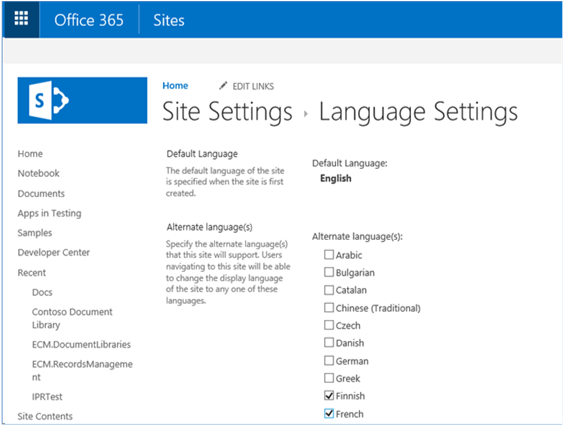
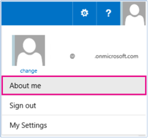
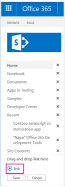
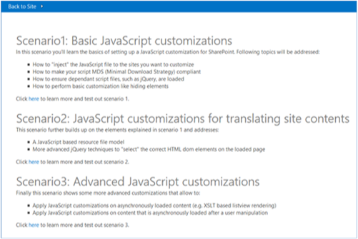
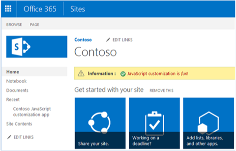
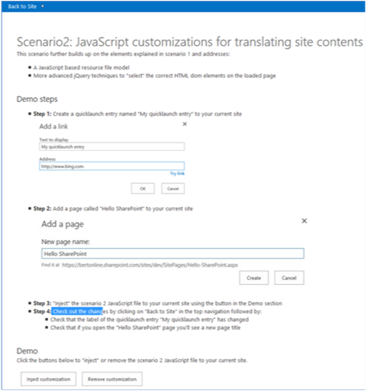
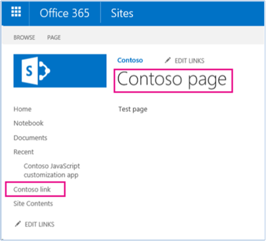

# Localize UI elements sample SharePoint Add-in
    
The [Core.JavaScriptCustomization](https://github.com/SharePoint/PnP/tree/master/Samples/Core.JavaScriptCustomization) sample add-in shows you how to use JavaScript to replace the text value of a SharePoint UI element with a translated text value, which is read from a JavaScript resource file. 

> [!NOTE] 
> You are responsible for maintaining the translated text values in the JavaScript resource file. 

This code sample uses a provider-hosted add-in to:

- Localize a site page or **Quick Launch** link title with specific text values.
    
- Preserve a site page or **Quick Launch** link title in a primary language, and provide translated versions of the site page and **Quick Launch** link title in another language at run time.
    
- Use JavaScript resource files for client-side localization.
    
- Link a JavaScript file to a SharePoint site by using a custom action.
    
- Check the UI culture of the site and then load culture-specific text values from a JavaScript resource file.
    
- Overwrite site page and **Quick Launch** link titles with culture-specific text values by using jQuery.

## Before you begin

To get started, download the [Core.JavaScriptCustomization](https://github.com/SharePoint/PnP/tree/master/Samples/Core.JavaScriptCustomization) sample add-in from the Office 365 Developer patterns and practices project on GitHub.

Before you run this code sample, complete the following steps.

### Configure the language settings on your site

1. On your team site, choose **Settings** > **Site settings**.
    
2. In **Site Administration**, choose **Language settings**.
    
3. On the **Language Settings** page, in **Alternate language(s)**, choose the alternate languages that your site should support. For example, choose **Finnish** and **French**, as shown in the following figure.

    
    
4. Choose **OK**.


### Set the display language on your user's profile page

1. At the top of your Office 365 site, choose your profile picture, and then choose **About me**.

    
    
2. On the **About me** page, choose **Edit your profile**.
    
3. Choose the ellipsis (...) for additional options, and then choose **Language and Region**.
    
4. In **My Display Languages**, choose a new language in the **Pick a new language** list, and then choose **Add**. For example, choose **Finnish** and **French**. You can move your preferred language up or down by choosing the up and down arrows.

    
    
5. Choose **Save all and close**.

> [!NOTE] 
> It might take a few minutes for your site to render in the selected language(s).

> [!IMPORTANT] 
> The CSOM is periodically updated with new features. If the CSOM provides new features to update site page or **Quick Launch** link titles, we recommend that you use the new features in the CSOM instead of the options discussed here.

<br/>

Before you run Scenario 2 of this code sample, complete the following tasks.

### Create a Quick Launch link

1. On the host web, choose **EDIT LINKS**.
    
2. Choose **link**.

    
    
3. In **Text to display**, enter **My quicklaunch entry**.
    
4. In **Address**, enter the URL of a website.
    
5. Choose **OK** > **Save**.

### Create a site page

1. On the host web, choose **Site Contents** > **Site Pages** > **New**.
    
2. In **New page name,** enter **Hello SharePoint**.
    
3. Choose **Create**.
    
4. Enter **Test page** in the body of the page.
    
5. Choose **Save**.

## Run the Core.JavaScriptCustomization sample app

When you run this code sample, a provider-hosted application appears, as shown in the following figure. This article describes Scenario 1 and Scenario 2 because you might use the techniques in these two scenarios to provide localized versions of your site page and **Quick Launch** link titles. 



### Scenario 1

Scenario 1 shows how to add a reference to a JavaScript file on a SharePoint site by using a custom action. Choosing the **Inject customization** button calls the **btnSubmit\_Click** method in scenario1.aspx.cs. The **btnSubmit\_Click** method calls **AddJsLink** to add references to JavaScript files by using a custom action on the host web.

The following figure shows the start page for Scenario 1.


> [!NOTE] 
> The code in this article is provided as-is, without warranty of any kind, either express or implied, including any implied warranties of fitness for a particular purpose, merchantability, or non-infringement.

The **AddJSLink** method is part of the JavaScriptExtensions.cs file in **OfficeDevPnP.Core**. **AddJSLink** requires that you supply a string representing the identifier to assign to the custom action, and a string containing a semicolon delimited list of URLs to the JavaScript files that you want to add to the host web. Note that this code sample adds a reference to Scripts\scenario1.js, which adds a status bar message to the host web.

```js
protected void btnSubmit_Click(object sender, EventArgs e)
        {
            var spContext = SharePointContextProvider.Current.GetSharePointContext(Context);
            using (var cc = spContext.CreateUserClientContextForSPHost())
            {
                cc.Web.AddJsLink(Utilities.Scenario1Key, Utilities.BuildScenarioJavaScriptUrl(Utilities.Scenario1Key, this.Request));
            }
        }
```

<br/>
  
> [!NOTE] 
> SharePoint uses Minimal Download Strategy to reduce the amount of data the browser downloads when users navigate between pages on a SharePoint site. In scenario1.js, the following code ensures that whether Minimal Download Strategy is used on your SharePoint site, the **RemoteManager_Inject** method is always called to run the JavaScript code to add the status bar message to the host web. For more information, see [Minimal Download Strategy overview](../general-development/minimal-download-strategy-overview.md).
> 
> ```js
    if ("undefined" != typeof g_MinimalDownload &amp;&amp; g_MinimalDownload &amp;&amp; (window.location.pathname.toLowerCase()).endsWith("/_layouts/15/start.aspx") &amp;&amp; "undefined" != typeof asyncDeltaManager) {
        // Register script for MDS if possible.
        RegisterModuleInit("scenario1.js", RemoteManager_Inject); //MDS registration
        RemoteManager_Inject(); //non MDS scenario
    } else {
        RemoteManager_Inject();
    }
> ```

<br/>

> [!NOTE] 
> Some JavaScript files may depend on other JavaScript files to be loaded first before they can run and complete successfully. The following code construct from **RemoteManager_Inject** uses the **loadScript** function in scenario1.js to first load jQuery, and then continue running the remaining JavaScript code.
>
> ```js
    var jQuery = "https://ajax.aspnetcdn.com/ajax/jQuery/jquery-2.0.2.min.js";
        // Load jQuery first, and then continue running the rest of the code.
        loadScript(jQuery, function () {
        // Add additional JavaScript code here to complete your task. 
    });
> ```

<br/>

Choose **Back to Site**. As shown in the following figure, the host web now displays a status bar message that was added by scenario1.js.



<br/>

### Scenario 2

Scenario 2 uses the technique described in Scenario 1 to replace UI text with translated text read from a JavaScript resource file. Scenario 2 replaces the **Quick Launch** link title (**My quicklaunch entry**) and site page title (**Hello SharePoint**) that you created earlier. Scenario 2 attaches a JavaScript file that reads translated text values from variables in culture-specific JavaScript resource files. Scenario 2 then updates the UI. 

The following figure shows the start page for Scenario 2.



As shown, choosing **Inject customization** applies the following changes to the site:

- The **Quick Launch** link title **My quicklaunch entry** is changed to **Contoso link**.
    
- The **Hello SharePoint** site page title is changed to **Contoso page**.

    
    
> [!NOTE] 
> If your values for the **Quick Launch** link title and site page title differ from those shown in the preceding figure, edit the **quickLauch\_Scenario2** and **pageTitle\_HelloSharePoint** variables in the JavaScript resource file scenario2.en-us.js or scenario2.nl-nl.js, and then run the code sample again. 
> 
> The scenario2.en-us.js file stores English (US) culture-specific resources. The scenario2.nl-nl.js file stores Dutch culture-specific resources. If you are testing this code sample by using another language, consider creating another JavaScript resource file that uses the same naming convention.

Similar to Scenario 1, **btnSubmit\_Click** in scenario2.aspx.cs calls **AddJsLink** to add a reference to the Scripts\scenario2.js file. In scenario2.js, the **RemoteManager\_Inject** function calls the **TranslateQuickLaunch** function, which performs the following tasks:

- Determines the site's culture by using **\_spPageContextInfo.currentUICultureName**.
    
- Loads the JavaScript resource file containing culture-specific resources that match the UI culture of the site. For example, if the site's culture was English (United States), the scenario2.en-us.js file is loaded.
    
- Replaces **my quicklaunch entry** with the value of the **quickLauch\_Scenario2** variable read from the JavaScript resource file.

```js
function RemoteManager_Inject() {

    var jQuery = "https://ajax.aspnetcdn.com/ajax/jQuery/jquery-2.0.2.min.js";
    
    loadScript(jQuery, function () {
        SP.SOD.executeOrDelayUntilScriptLoaded(function () { TranslateQuickLaunch(); }, 'sp.js');
    });
}

function TranslateQuickLaunch() {
    // Load jQuery and if complete, load the JS resource file.
    var scriptUrl = "";
    var scriptRevision = "";
    // Iterate over the scripts loaded on the page to find the scenario2 script. Then use the script URL to dynamically build the URL for the resource file to be loaded.
    $('script').each(function (i, el) {
        if (el.src.toLowerCase().indexOf('scenario2.js') > -1) {
            scriptUrl = el.src;
            scriptRevision = scriptUrl.substring(scriptUrl.indexOf('.js') + 3);
            scriptUrl = scriptUrl.substring(0, scriptUrl.indexOf('.js'));
        }
    })

    var resourcesFile = scriptUrl + "." + _spPageContextInfo.currentUICultureName.toLowerCase() + ".js" + scriptRevision;
    // Load the JS resource file based on the user's language settings.
    loadScript(resourcesFile, function () {

        // General changes that apply to all loaded pages.
        // ----------------------------------------------

        // Update the Quick Launch labels.
        // Note that you can use the jQuery  function to iterate over all elements that match your jQuery selector.
        $("span.ms-navedit-flyoutArrow").each(function () {
            if (this.innerText.toLowerCase().indexOf('my quicklaunch entry') > -1) {
                // Update the label.
                $(this).find('.menu-item-text').text(quickLauch_Scenario2);
                // Update the tooltip.
                $(this).parent().attr("title", quickLauch_Scenario2);
            }
        });

        // Page-specific changes require an IsOnPage call.
        // ----------------------------------------------------------

        // Change the title of the "Hello SharePoint" page.
        if (IsOnPage("Hello%20SharePoint.aspx")) {
            $("#DeltaPlaceHolderPageTitleInTitleArea").find("A").each(function () {
                if ($(this).text().toLowerCase().indexOf("hello sharepoint") > -1) {
                    // Update the label.
                    $(this).text(pageTitle_HelloSharePoint);
                    // Update the tooltip.
                    $(this).attr("title", pageTitle_HelloSharePoint);
                }
            });
        }

    });
}
```


## See also
  
- [Enterprise Content Management solutions for SharePoint](enterprise-content-management-solutions-for-sharepoint.md)
- [Localization solutions for SharePoint](localization-solutions-for-sharepoint-2013-and-sharepoint-online.md)