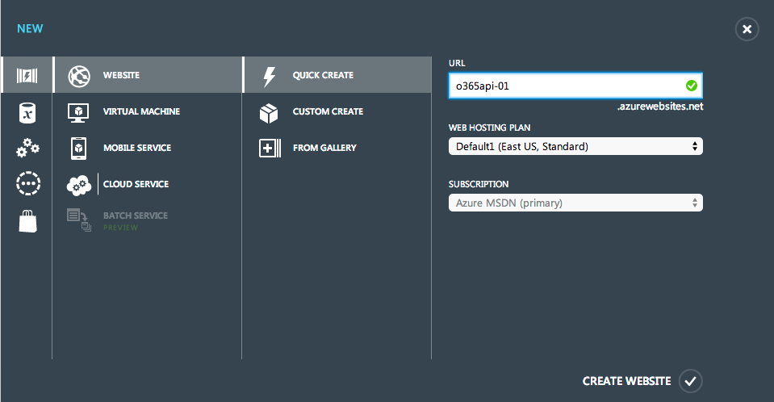
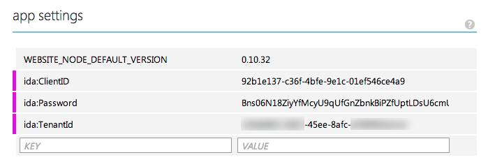
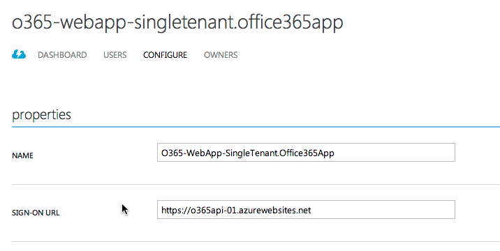
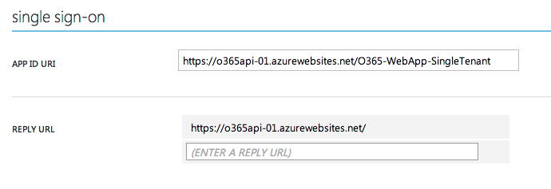
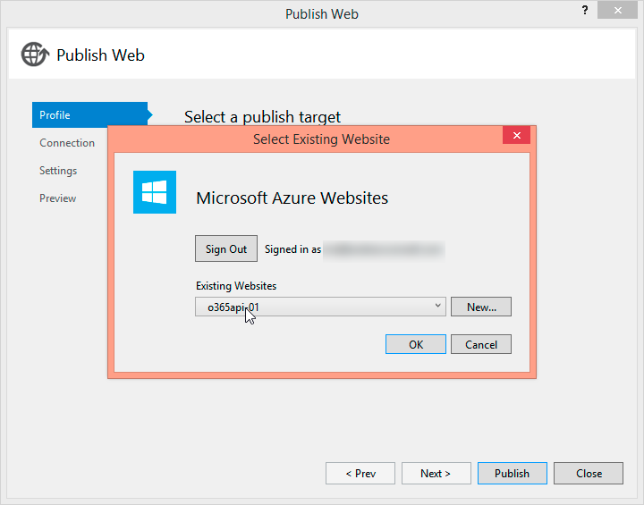
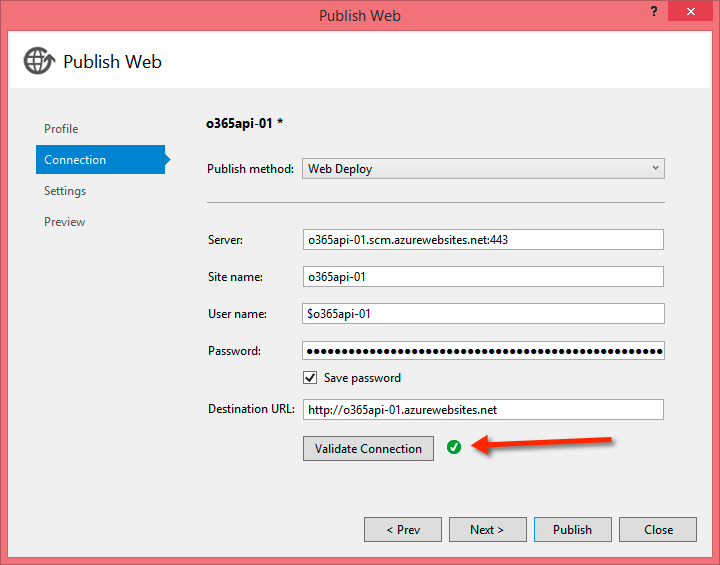

# Deploy development Office 365 sites to Microsoft Azure

When developing any type of web application, most development is done locally using `http://localhost`. Some projects use local resources or a mix of local and remote resources. Taking these projects from local development environments involves a handful of tasks to perform, such as changing database connection strings, URLs, and configurations.

Web projects that leverage the Office 365 APIs are no different. These projects leverage the Microsoft Azure Active Directory (Azure AD) service to authenticate the applications and obtain OAuth 2.0 access tokens. These tokens are used by the web applications to authenticate with the Office 365 APIs.

This page explains the steps involved in taking an Office 365 API development project and launching it to a working sample hosted entirely in Azure by using [Office 365](https://products.office.com/en-us/business/explore-office-365-for-business), [Azure AD](https://azure.microsoft.com/en-us/services/active-directory/), and the [Web Apps feature of Azure App Service](https://azure.microsoft.com/en-us/services/app-service/web/).

Deploying an Office 365 API web application to Azure from a local development environment requires four high-level steps to be performed as outlined on this page:

- Create and configure a Web App.
- Configure the Azure AD application.
- Configure the ASP.NET project.
- Deploy the Office 365 API ASP.NET web application.

## Create and configure a Web App

In this step, you create a web app that will be used to host the web application. 

1. Go to the [Azure portal](https://ms.portal.azure.com) and sign in by using your Organization ID account.

2. After signing in, on the navigation sidebar, choose **WEBSITES**.

3. On the **websites** page, choose the **NEW** link in the footer in the lower-left corner of the page.

4. In the wizard that appears, choose **Quick Create**, enter a name for the site in the **URL** field, and then choose a **Web Hosting Plan** and **Subscription**. 

  

  > [!TIP] 
  > Make sure you keep a note of the name of the website you create as it will be needed later.

5. Finally click the **Create Website** link to create the site.

Give Azure a few moments to create the site. After creating the site, you can specify **app settings** through the web interface. This allows you to override any `<appSettings>` within the project's web.config file through the web administration interface for the website without deploying your site codebase for simple web.config changes.

1. Choose the website that you just created within the [Azure portal](https://ms.portal.azure.com).

2. Choose the **CONFIGURE** link in the top navigation.

3. Scroll down to the **App Settings** section and add three new entries:
  - **ida:ClientID**
  - **ida:Password** 
  - **ida:TenantID** 

4. Copy the corresponding values from the working project's web.config file to these settings values in your Azure website as shown in the following figure.

  

5. In the footer, choose **SAVE** to save your changes.

At this point the Azure website is set up and configured to host the Office 365 API web project that you will deploy in a later step.

## Configure the Azure AD application

In this step, you modify the Azure AD application used in the development and testing of the Office 365 application.

1. Go to the [Azure portal](https://ms.portal.azure.com) and sign in by using your Organization ID account.

2. After signing in, on the navigation sidebar, choose **ACTIVE DIRECTORY**.

3. On the **active directory** page, choose the directory that is linked to your Office 365 tenant.

4. Next, choose the **APPLICATIONS** item in the top navigation.

5. In the **Properties** section, update the **SIGN-ON URL** to point to the default URL of the Azure website you created. Take note to use the HTTPS endpoint that is provided with all Azure websites.

  

6. In the **Single Sign-On** section, update the **App ID URI** to use the domain for the Azure website (shown in the following figure).

7. Update the **REPLY URL** so that the only URL listed is the homepage of the Azure website:

  

8. In the footer, choose the **SAVE** button to save your changes.

At this point, the Azure AD application used by the Office 365 API web project has been configured to work with the new Azure website.

## Configure the ASP.NET project

In this step, you configure the ASP.NET project in your application to use the new Azure website.

For the sample application used in the example for this guidance, no extra work is actually required. However the web application does contain the settings within the web.config file for the Azure AD application and Azure AD tenant used during development. Some developers may choose to use different Azure AD applications or even different Azure subscriptions for their development and production instances.

In a previous step outlined on this page, when you created the Azure website you set the add-in settings for the application that are typically found in the web.config file. To ensure the web application receives these values from the Azure website configuration, we recommend that you replace the values within the web.config file with placeholder values instead.

1. Open the project's web.config file.

2. Locate the add-in settings for the **ida:ClientID**, **ida:Password**, and **ida:TenantId**.

3. Replace the values of these settings with a placeholder value:

  ````xml
  <add key="ida:TenantId" value="set-in-azure-website-config" />
  <add key="ida:ClientID" value="set-in-azure-website-config" />
  <add key="ida:Password" value="set-in-azure-website-config" />
  ````

4. Save your changes.

At this point the web application, Azure website, and application in Azure AD are all configured correctly and ready to be deployed.

## Deploy the Office 365 API ASP.NET web application

In this step, you publish the Office 365 API web application to the Azure website. After the site has been deployed, you test it to ensure everything works as desired.

> [!NOTE] 
> This step assumes that you have the Microsoft [Azure SDK](https://azure.microsoft.com/en-us/downloads/), version 2.0 or higher, installed. 

### Deploy the ASP.NET web application

1. Open your Office 365 API web application in Visual Studio.

2. In the Solution Explorer tool window, right-click the project, and choose **Publish** to start the Publish Web Wizard.

3. On the **Profile** tab, choose **Microsoft Azure Website**.

  At this point you are prompted to sign in to your Azure subscription by using your Organization ID.

4. After signing in, choose the website that you created in a previous step from this page, and then choose **OK**.

  

5. On the **Connection** tab, choose the **Validate Connection** button to ensure that the connection profile was successfully downloaded and applied.

  

6. Choose the **Publish** button to publish the web application to the Azure website.

### Test the ASP.NET web application

After publishing the web application to the Azure website, Visual Studio opens a browser and goes to the site's homepage. 

By default this is the HTTP endpoint. Recall from the previous step that when you configured the Azure AD application, you set it to only accept sign-ins from the HTTPS endpoint. Before you use the application, update the URL to point to the HTTPS endpoint.

1. In the browser, update the URL to go to the HTTPS homepage for the Azure website. In the example on this page, it is `https://o365api-01.azurewebsites.net`.

2. Choose the **Sign In** link in the header at the top-right of the page. This redirects you to the Azure AD sign-in page.

  > [!NOTE] 
  > If you get an error at this point, it's likely an issue with the three add-in settings you created for the Azure website. Go back and make sure the values are the correct values from the Azure AD tenant and application.  

3. After successfully signing in, you are redirected back to the homepage for the web application of the Azure website you created.

At this point you have successfully deployed your Office 365 API web application project to run in an Azure website.


## See also

- [Deploying your SharePoint Add-ins](deploying-your-sharepoint-add-ins.md)