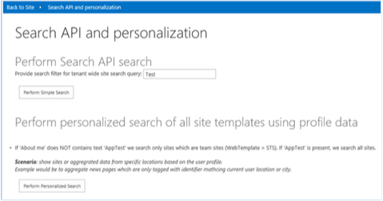
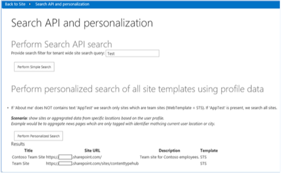
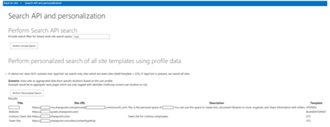

# Personalize search results sample add-in for SharePoint

You can personalize SharePoint by filtering information that is shown to the user based on the value of a user profile property.
    
_**Applies to:** Office 365 | SharePoint 2013 | SharePoint Online_
    
The [Search.PersonalizedResults](https://github.com/SharePoint/PnP/tree/master/Samples/Search.PersonalizedResults) code sample shows how you can personalize SharePoint by filtering information based on the value of a user profile property. Some examples of pesonalization include:

- News articles or other content filtered by country or location.
    
- Navigation links filtered based on the user's role or organization.
    
- Restaurants or retail outlet listings based on the location of your place of business.
    
This code sample uses a provider-hosted add-in to display search results to the user that include either all sites or only team sites that the user has access to. To do this, the sample:

- Checks the value of the  **AboutMe** user profile property.
    
- Builds a search query filter string associated with the value of the  **AboutMe** user profile property.
    
- Runs the search query and displays the search query results.

## Before you begin
<a name="sectionSection0"> </a>

To get started, download the  [Search.PersonalizedResults](https://github.com/SharePoint/PnP/tree/master/Samples/Search.PersonalizedResults) sample add-in from the [Office 365 Developer patterns and practices](https://github.com/SharePoint/PnP/tree/dev) project on GitHub.

## Using the Search.PersonalizedResults app
<a name="sectionSection1"> </a>

When you run this code sample, a provider-hosted application appears, as shown in Figure 1. 

**Figure 1. Start page of the Search.PersonalizedResults app**



This article describes the  **Perform personalized search of all site templates using profile data** scenario. Choosing **Perform Personalized Search** returns filtered search results that contain team sites only, as shown in Figure 2. Notice that the **Template** column contains sites of type **STS** only.

**Figure 2. Search results showing team sites only**



For handling personalization scenarios, you can change the search query by:

- Reading and testing the value of a user profile property for that user. This code sample tests the  **About Me** property for a value of **AppTest**.
    
- Taking a specific course of action based on the value of the user profile property. For example, if the value of the  **About Me** user profile property is **AppTest**, this code sample removes the team site filter and returns search results that contain all sites.

### To enter AppTest in the About Me user profile property

1. At the top of your Office 365 site, choose your profile picture, then choose  **About Me**, as shown in Figure 3.
    
2. On the  **About me** page, choose **edit your profile**.
    
3. In  **About me**, enter  **AppTest**.
    
4. Choose  **Save all and close**.

**Figure 3. Navigating to a user's profile page by choosing About me**


Return to the  **Search.PersonalizedResults** provider-hosted add-in and choose **Perform Personalized Search** again. The add-in changes the filter on the search query to show all sites instead of team sites only, as shown in Figure 4. The **Template** column now contains several different site template types.

**Figure 4. Search results showing all sites**



Choosing  **Perform Personalized Search** calls the **btnPersonalizedSearch_Click** method in default.aspx.cs. **btnPersonalizedSearch_Click** performs the following actions:

- Uses  **PeopleManager** to get all user profile properties for the user running this add-in.
    
- Retrieves and checks the value of the  **AboutMe** user profile property. If the value of the **AboutMe** property is **AppTest**, the search query retrieves all sites using the query string  `contentclass:"STS_Site"`. If the value of the  **AboutMe** property is not **AppTest**, the team site filter is appended to the query string ( `WebTemplate=STS`), and the search query retrieves team sites only.
    
- Calls the  **ProcessQuery** method to retrieve the search results based on the supplied query string. **ProcessQuery** also demonstrates how to specify a list of properties to return with the search results.
    
- Calls the  **FormatResults** method to format the search results into an HTML table.
    
**Note**  The code in this article is provided as-is, without warranty of any kind, either express or implied, including any implied warranties of fitness for a particular purpose, merchantability, or non-infringement.

```
protected void btnPersonalizedSearch_Click(object sender, EventArgs e)
        {
            var spContext = SharePointContextProvider.Current.GetSharePointContext(Context);

            using (var clientContext = spContext.CreateUserClientContextForSPHost())
            {
                // Load user profile properties.
                PeopleManager peopleManager = new PeopleManager(clientContext);
                PersonProperties personProperties = peopleManager.GetMyProperties();
                clientContext.Load(personProperties);
                clientContext.ExecuteQuery();
                // Check the value of About Me. 
                string aboutMeValue = personProperties.UserProfileProperties["AboutMe"];
                string templateFilter = ResolveAdditionalFilter(aboutMeValue);
                // Build the query string.
                string query = "contentclass:\"STS_Site\" " + templateFilter;
                ClientResult<ResultTableCollection> results = ProcessQuery(clientContext, query);
                lblStatus2.Text = FormatResults(results);
            }
        }

private ClientResult<ResultTableCollection> ProcessQuery(ClientContext ctx, string keywordQueryValue)
        {
            KeywordQuery keywordQuery = new KeywordQuery(ctx);
            keywordQuery.QueryText = keywordQueryValue;
            keywordQuery.RowLimit = 500;
            keywordQuery.StartRow = 0;
            keywordQuery.SelectProperties.Add("Title");
            keywordQuery.SelectProperties.Add("SPSiteUrl");
            keywordQuery.SelectProperties.Add("Description");
            keywordQuery.SelectProperties.Add("WebTemplate");
            keywordQuery.SortList.Add("SPSiteUrl", Microsoft.SharePoint.Client.Search.Query.SortDirection.Ascending);
            SearchExecutor searchExec = new SearchExecutor(ctx);
            ClientResult<ResultTableCollection> results = searchExec.ExecuteQuery(keywordQuery);
            ctx.ExecuteQuery();
            return results;
        }
```

## Additional resources
<a name="bk_addresources"> </a>

-  [User profile solutions for SharePoint 2013 and SharePoint Online](user-profile-solutions-for-sharepoint.md)
    
-  [Search.PersonalizedResults app](https://github.com/SharePoint/PnP/tree/master/Samples/Search.PersonalizedResults)
    
-  [UserProfile.Manipulation.CSOM](https://github.com/SharePoint/PnP/tree/master/Samples/UserProfile.Manipulation.CSOM)
    
-  [UserProfile.Manipulation.CSOM.Console](https://github.com/SharePoint/PnP/tree/master/Samples/UserProfile.Manipulation.CSOM.Console)
    
-  [Core.ProfileProperty.Migration](https://github.com/SharePoint/PnP/tree/master/Samples/Core.ProfileProperty.Migration)
