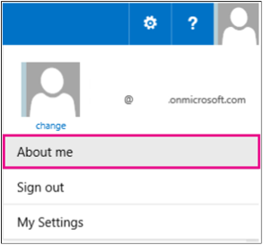
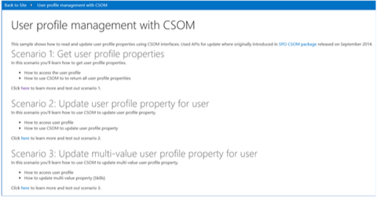
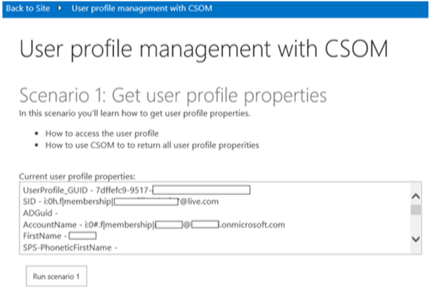
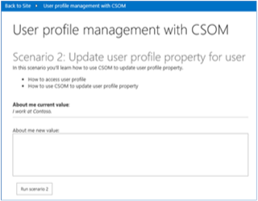
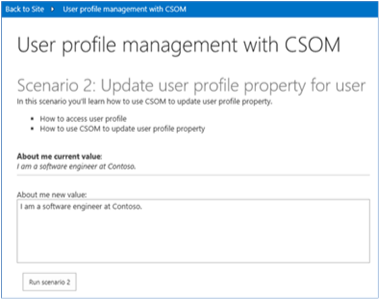
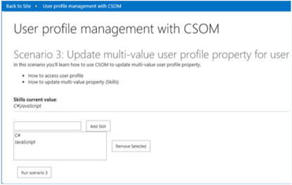

# Read or update user profile properties sample SharePoint Add-in

The UserProfile.Manipulation.CSOM sample shows you how to read and update user profile properties for a particular user. This sample uses a provider-hosted add-in to:

- Read and display all user profile properties for a user.
- Update a single-valued user profile property. 
- Update a multivalued user profile property.
    
Use this solution if you want to:

- Read or write data to a user profile property for a user.   
- Use user profile property values to personalize SharePoint.

> [!NOTE] 
> This code sample only runs on Office 365. 

## Before you begin

To get started, download the [UserProfile.Manipulation.CSOM](https://github.com/SharePoint/PnP/tree/master/Samples/UserProfile.Manipulation.CSOM) sample add-in from the Office 365 Developer Patterns and Practices project on GitHub.

> [!NOTE] 
> The code in this article is provided as-is, without warranty of any kind, either express or implied, including any implied warranties of fitness for a particular purpose, merchantability, or non-infringement.

### Before you run Scenario 1

1. At the top of your Office 365 site, choose your profile picture, and then choose **About me**. 

    
    
2. On the **About me** page, choose **edit your profile**.
    
3. In **About me**, enter **I work at Contoso**.
    
4. Choose **Save all and close**. 
    
### Before you run Scenario 3

1. At the top of your site, choose your profile picture, and then choose **About me**. 
    
2. On the **About me** page, choose **edit your profile**.
    
3. On **Edit Details**, choose **Details**.
    
4. In **Skills**, enter **C#, JavaScript**.
    
5. Choose **Save all and close**. 


## Using the UserProfile.Manipulation.CSOM sample add-in

When you run this sample, a provider-hosted add-in starts, as shown in the following figure.



<br/>

This code sample includes three scenarios.

|Scenario|Shows how to|
|:---|:---|
|1|Read all user profile properties for the user running the app.|
|2|<p>Update a single-valued user profile property.</p><p>**Note**: This scenario is only supported in Office 365.</p>|
|3|<p>Update a multivalued user profile property.</p><p>**Note**: This scenario is only supported in Office 365.</p>|

### Scenario 1: Read all user profile properties

When you choose **Run scenario 1**, the add-in reads all user profile properties for the current user, and then displays the user profile data in **Current user profile properties**, as shown in the following figure.



Choosing **Run scenario 1** calls the **btnScenario1_Click** method in CodeSample1.aspx.cs to perform the following tasks:

- Use **PeopleManager** to retrieve all the user profile properties for the current user.  
- Iterate over **PersonProperties.UserProfileProperties** to list the values of the user profile properties in a text box.
    
```csharp
protected void btnScenario1_Click(object sender, EventArgs e)
        {

            var spContext = SharePointContextProvider.Current.GetSharePointContext(Context);

            using (var clientContext = spContext.CreateUserClientContextForSPHost())
            {
                // Get the people manager instance and load current properties.
                PeopleManager peopleManager = new PeopleManager(clientContext);
                PersonProperties personProperties = peopleManager.GetMyProperties();
                clientContext.Load(personProperties);
                clientContext.ExecuteQuery();

                // Output user profile properties to a text box.
                txtProperties.Text = "";
                foreach (var item in personProperties.UserProfileProperties)
                {
                    txtProperties.Text += string.Format("{0} - {1}{2}", item.Key, item.Value, Environment.NewLine);
                }
            }
        }
```

### Scenario 2: Update a single-valued user profile property

Scenario 2 shows how to update a single-valued user profile property. As shown in the following figure, the current value of the **About me** user profile property for the user running this add-in is **I work at Contoso**. 



To update the value of the **About me** user profile property, in the **About me new value** box, enter **I am a software engineer at Contoso**, and then choose **Run scenario 2**. The code updates the value of the **About me** property to **I am a software engineer at Contoso**. 

As shown in the following figure, the add-in updates **About me current value** with the new value of the **About me** user profile property.



Choosing **Run scenario 2** calls the **btnScenario2_Click** method in CodeSample2.aspx.cs to do the following:

- Use **PeopleManager** to get the user profile properties of the current user.
- Format the text entered by the user in HTML.
- Update the value of the **AboutMe** user profile property by using **SetSingleValueProfileProperty**, which accepts three parameters:
	- The account name of the user whose user profile you're updating.
	- The user profile property name (**AboutMe** in this scenario).
	- The property value, in HTML format (**I am a software engineer at Contoso** in this scenario).
    
```csharp
protected void btnScenario2_Click(object sender, EventArgs e)
        {
            var spContext = SharePointContextProvider.Current.GetSharePointContext(Context);

            using (var clientContext = spContext.CreateUserClientContextForSPHost())
            {
                // Get the people manager instance and initialize the account name.
                PeopleManager peopleManager = new PeopleManager(clientContext);
                PersonProperties personProperties = peopleManager.GetMyProperties();
                clientContext.Load(personProperties, p => p.AccountName);
                clientContext.ExecuteQuery();

                // Convert entry to HTML.
                string updatedValue = (txtAboutMe.Text).Replace(Environment.NewLine, "");

                // Update the AboutMe property for the user using account name from the user profile.
                peopleManager.SetSingleValueProfileProperty(personProperties.AccountName, "AboutMe", updatedValue);
                clientContext.ExecuteQuery();

            }
        }
```
    
> [!NOTE] 
> If you use custom user profile properties, configure the property to be editable by users. The technique used in this scenario works for custom user profile properties. 

### Scenario 3: Update a multivalued user profile property

Scenario 3 shows how to update a multivalued user profile property. The following figure shows the start page for Scenario 3. **Skills current value** shows the skills of the user running the app. The skills are read from the **SPS-Skills** user profile property for the user.



To add new skills to the **SPS-Skills** user profile property from this add-in:

1. Enter HTML5, and then choose **Add Skill**. 
    
2. Enter ASP.Net, and then choose **Add Skill**. 
    
3. Choose **Run scenario 3**.
    
4. Verify that **Skills current value** shows the new list of skills for the user.
    
5. Verify that the **SPS-Skills** user profile property for the user now shows the new list of skills.
    
Choosing **Run scenario 3** calls the **btnScenario3_Click** method in CodeSample3.aspx.cs to do the following:

- Use **PeopleManager** to get the user profile properties of the current user.  
- Read the list of skills shown in the list box.
- Save the new skills to the **SPS-Skills** user profile property by using **SetMultiValuedProfileProperty**, which accepts three parameters:
	- The account name of the user whose user profile is being updated.
	- The user profile property name, which is **SPS-Skills**.
	- The property values as a **List** of string objects.

```csharp
  protected void btnScenario3_Click(object sender, EventArgs e)
        {
            var spContext = SharePointContextProvider.Current.GetSharePointContext(Context);

            using (var clientContext = spContext.CreateUserClientContextForSPHost())
            {
                // Get the people manager instance and initialize the account name.
                PeopleManager peopleManager = new PeopleManager(clientContext);
                PersonProperties personProperties = peopleManager.GetMyProperties();
                clientContext.Load(personProperties, p => p.AccountName);
                clientContext.ExecuteQuery();

                // Collect the user's skills from the list box in order to update the user's profile.
                List<string> skills = new List<string>();
                for (int i = 0; i < lstSkills.Items.Count; i++)
                {
                    skills.Add(lstSkills.Items[i].Value);
                }

                // Update the SPS-Skills property for the user using account name from the user's profile.
                peopleManager.SetMultiValuedProfileProperty(personProperties.AccountName, "SPS-Skills", skills);
                clientContext.ExecuteQuery();

                // Refresh the values.
                RefreshUIValues();
            }

        }
```
## See also
    
- [Search.PersonalizedResults sample](https://github.com/SharePoint/PnP/tree/master/Samples/Search.PersonalizedResults)
- [User profile solutions for SharePoint](user-profile-solutions-for-sharepoint.md)
