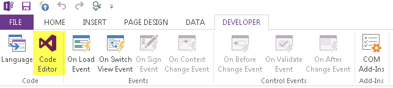
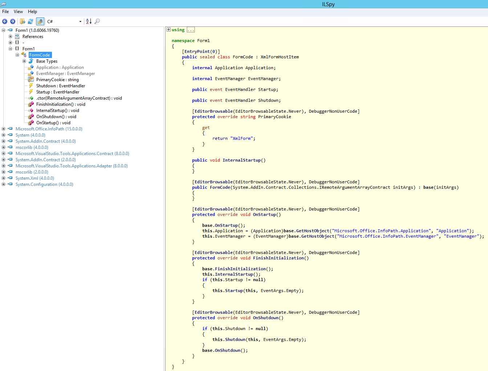
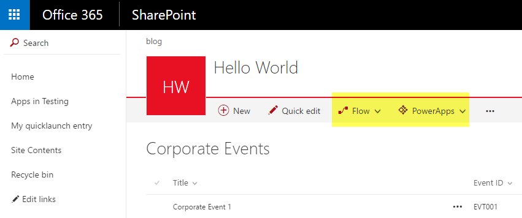
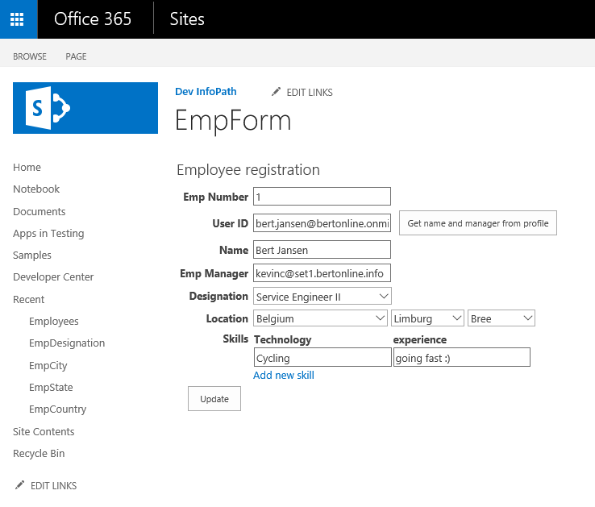

# Sandbox solution transformation guidance - InfoPath

When you're using InfoPath forms with code-behind, the forms depend on code-based sandbox solutions for executing the code-behind. This article helps you to either fix or transform your InfoPath forms so they are no longer dependent on sandbox solutions.

> [!NOTE] 
> [Code-based sandbox solutions were deprecated](https://blogs.msdn.microsoft.com/sharepointdev/2014/01/14/deprecation-of-custom-code-in-sandboxed-solutions/) in 2014, and SharePoint Online has started the process to completely remove this capability. Code-based sandbox solutions are also deprecated in SharePoint 2013 and in SharePoint 2016.

## Analyze and fix your InfoPath forms

In this section, we describe a model that you can use to analyze and fix your InfoPath forms. Depending on the form, you can either fix the form and redeploy it, or you may need to move away from InfoPath and use an alternative approach to get the functionality you need. 

Before taking any action, it's important that you assess the business need for your form. We often see many forms that are no longer business-relevant, and in those cases it's easier to simply drop the form.

### Determine if your InfoPath forms use code-behind

To determine this, we recommend that you use the [SharePoint SandBox Solution scanner tool](https://github.com/SharePoint/PnP-Tools/tree/master/Solutions/SharePoint.SandBoxTool). The report from this tool indicates if the sandbox solution comes from an InfoPath file. The tool also tells you if the used assembly in the solution is useless, as described later in this article.

### Determine if your forms are still relevant

Before you dive into the remediation/transformation work, it's important that you determine whether the form is still critical for your business. If so, continue to the next section; if not, you need to think about the data created by using this form. 

Typically the data was created as InfoPath XML files that live in a SharePoint list. If you remove the form, you will no longer be able to visualize the data. Sometimes that's okay because the form and data are not relevant anymore. However, if you want to be able to access the data, you can convert the data coming from the InfoPath XML files into SharePoint list items data. To do this, see the [PnP-Transformation EmpRegConsole console application](https://github.com/SharePoint/PnP-Transformation/tree/master/InfoPath/Migration/EmpRegConsole).

### Download the InfoPath forms (XSN file) for inspection

If you have confirmed that you have InfoPath forms that require work, you must download these forms. InfoPath forms with code-behind are deployed as either **Form Library** or **Site Content Type**. 

#### Download InfoPath forms deployed as Form Library

In this case, the XSN file is inside the Forms folder of the form library to which the InfoPath form was deployed. To find the form library, look at the WSP package name that follows this convention: `InfoPath Form_LibName_id`. 

After you know the form library, you need to download the template.xsn file from the Forms folder of the library. You can do so by constructing a URL like this **library URL + /Forms/template.xsn** (for example:  `https://contoso.sharepoint.com/sites/infopath1/IHaveCodeBehind/Forms/template.xsn`) and using the browser to download the file.

#### Download InfoPath forms deployed as Site Content Type

InfoPath forms deployed as Site Content Type have their XSN file stored in a form library that was connected to the content type as form deployment time. As in the previous section, you can obtain the library name from the WSP package name. What's different this time is that the form is actually stored as a file in the library, so you can simply download it from the form library. 

### Fix your InfoPath forms

The previous sections showed you the InfoPath forms with code-behind, but do these forms actually contain useful code-behind? There are many forms for which the form author accidentally chose the **Code Editor** button on the InfoPath **Developer** ribbon.



If you've done this, you may have code-behind that doesn't do anything. By removing it, you can convert your InfoPath form with code-behind to an InfoPath form with no code-behind, and as such no dependency on sandbox solutions.

#### Determine if your forms' code-behind is useless

The [SharePoint Sandbox Solution scanner](https://github.com/SharePoint/PnP-Tools/tree/master/Solutions/SharePoint.SandBoxTool) tells you if your InfoPath form has useless code. However, you might wonder how you can distinguish between useless and needed code-behind because you can only fix useless code. If you still have the original form (not the one you downloaded in previous steps), you can simply look at the code. 

Following is the default empty code, and if your code is similar, the form can be fixed by dropping the code.

```csharp
using Microsoft.Office.InfoPath;
using System;
using System.Xml;
using System.Xml.XPath;

namespace Form1
{
    public partial class FormCode
    {
        // Member variables are not supported in browser-enabled forms.
        // Instead, write and read these values from the FormState
        // dictionary using code such as the following:
        //
        // private object _memberVariable
        // {
        //     get
        //     {
        //         return FormState["_memberVariable"];
        //     }
        //     set
        //     {
        //         FormState["_memberVariable"] = value;
        //     }
        // }

        // NOTE: The following procedure is required by Microsoft InfoPath.
        // It can be modified using Microsoft InfoPath.
        public void InternalStartup()
        {
        }
    }
}
```

<br/>

In case you only have the XSN file that you downloaded in the previous step, you can rename your XSN file as a cab file (for example, template.cab), extract the assembly, and use .NET reflection tools (such as the [ILSpy open-source .NET assembly browser and decompiler](https://github.com/icsharpcode/ILSpy)) to inspect the code. 

A typical view of useless code-behind looks like the following figure in ILSpy.



#### Drop code-behind from InfoPath forms to fix them

If you have confirmed that your code-behind is useless, you can drop it by doing the following:

1. Open the form in **InfoPath Designer** (right-click **Design**).

2. Go to **File** > **Info** > **Form Options**.

3. Choose the **Programming** category, and then choose **Remove Code**.

4. Publish the form again at **File** > **Info** > **Quick Publish**.

5. Deactivate the linked sandbox solution at **Site Settings** > **Solutions**.

6. Confirm that the form works as expected.

7. Delete the sandbox solution.

> [!NOTE] 
> If you no longer have access to the InfoPath XSN file and source code, you can still fix these forms by deactivating the sandbox solutions that have useless code. Only do this for the ones mentioned in the sandbox solution report output with **IsEmptyInfoPathAssembly = true**.

## Migrate your InfoPath forms

If the guidance in the previous sections was not applicable to your InfoPath forms, it means that your forms are still business-relevant and contain code-behind that you cannot drop. If that's the case, the typical solution is to move away from InfoPath, which can be done in the following ways:

- Build a SharePoint Add-in that leverages remote APIs to read/write SharePoint data.

- Create an app by using [Azure PowerApps](https://powerapps.microsoft.com/en-us/) or [Microsoft Flow](https://flow.microsoft.com/en-us/search/?q=sharepoint).

   

### Build SharePoint Add-Ins to replace your InfoPath forms

When you choose to use SharePoint Add-Ins to replace your InfoPath forms, you have several options. Following are three options; however, you can use variations of these. 

- [An ASP.Net MVC SharePoint Add-in](https://github.com/SharePoint/PnP-Transformation/tree/master/InfoPath/Samples/EmployeeRegistration.MVC)
- [An ASP.Net Forms SharePoint Add-in](https://github.com/SharePoint/PnP-Transformation/tree/master/InfoPath/Samples/EmployeeRegistration.Forms)
- [A Single Page Application (SPA) based on knockout.js](https://github.com/SharePoint/PnP-Transformation/tree/master/InfoPath/Samples/EmployeeRegistration.KnockOut.SinglePageApp)

    

#### Common InfoPath coding patterns

To better help you with converting your InfoPath form, following is a list of 11 common InfoPath coding patterns and how you can implement these patterns by using the three SharePoint Add-in options. 

To do so, we've first developed a [reference InfoPath form](https://github.com/SharePoint/PnP-Transformation/tree/master/InfoPath/Reference/EmployeeRegistration) that uses the most common InfoPath coding patterns, and then we've migrated that form to three SharePoint Add-in flavors.

The following links show these common patterns:

- [Populate fields on form load - set user information](https://github.com/SharePoint/PnP-Transformation/blob/master/InfoPath/Guidance/Patterns/Populating%20fields%20on%20form%20load-set%20user%20information.md)
- [Populate fields on form load - read list information](https://github.com/SharePoint/PnP-Transformation/blob/master/InfoPath/Guidance/Patterns/Populating%20fields%20on%20form%20load-read%20list%20information.md)
- [Populate fields on form load - read list data](https://github.com/SharePoint/PnP-Transformation/blob/master/InfoPath/Guidance/Patterns/Populating%20fields%20on%20form%20load-read%20list%20data.md)
- [Submit the form via code](https://github.com/SharePoint/PnP-Transformation/blob/master/InfoPath/Guidance/Patterns/Submit%20the%20form%20via%20code.md)
- [Switch view after form submission](https://github.com/SharePoint/PnP-Transformation/blob/master/InfoPath/Guidance/Patterns/Switching%20view%20after%20form%20submission.md)
- [Retrieve user data](https://github.com/SharePoint/PnP-Transformation/blob/master/InfoPath/Guidance/Patterns/Retrieving%20user%20data.md)
- [Read data collection and set multiple controls](https://github.com/SharePoint/PnP-Transformation/blob/master/InfoPath/Guidance/Patterns/Read%20data%20collection%20and%20set%20multiple%20controls.md)
- [Cascade data load](https://github.com/SharePoint/PnP-Transformation/blob/master/InfoPath/Guidance/Patterns/Cascading%20data%20load.md)
- [Upload or delete attachments](https://github.com/SharePoint/PnP-Transformation/blob/master/InfoPath/Guidance/Patterns/Upload%20or%20Delete%20Attachments.md)
- [Add or remove user from site groups](https://github.com/SharePoint/PnP-Transformation/blob/master/InfoPath/Guidance/Patterns/Add%20or%20remove%20user%20from%20site%20groups.md)
- [Load existing item in form](https://github.com/SharePoint/PnP-Transformation/blob/master/InfoPath/Guidance/Patterns/Load%20existing%20item%20in%20form.md)

## Migrate your InfoPath data

After you move your InfoPath forms to a new solution, you might also want to migrate your data from InfoPath XML to regular SharePoint list data or to the data layer of your choice. Because InfoPath files are XML files, it's fairly easy to read and transform them. 

To do this, use the [PnP-Transformation EmpRegConsole console application](https://github.com/SharePoint/PnP-Transformation/tree/master/InfoPath/Migration/EmpRegConsole).

### Code-based operations are disabled and now my existing forms don't open anymore

As soon as code-based operations are disabled, code can no longer run in the sandbox. In addition, if you have forms that execute code, opening the existing forms no longer works. 

The following steps can help you handle this:
- If you migrated your InfoPath form to a new solution, you most likely already converted your data and if so, you're good.

-  If you chose to keep the form as is (for example, because it's not business-relevant anymore), but you still want to open the existing forms, you can do one of the following:

    - Remove the code-behind from your form and republish it (see the [Drop code-behind from InfoPath forms to fix them](#drop-code-behind-from-infopath-forms-to-fix-them) section).

    - Use InfoPath Client to open the forms.

    - Migrate the form data to plain SharePoint list data (see the [Migrate your InfoPath data](#migrate-your-infopath-data) section).

## See also

- [Transform sandbox solutions to the SharePoint Add-in model](sandbox-solution-transformation-guidance.md)