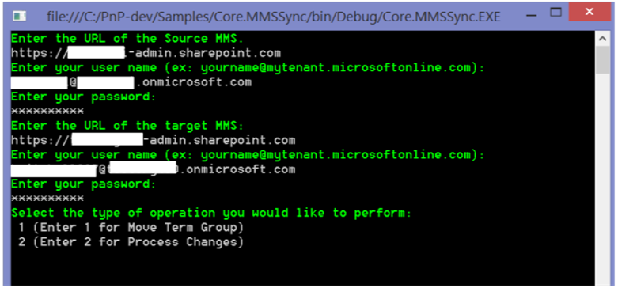

# Synchronize term groups sample add-in for SharePoint

As part of your Enterprise Content Management (ECM) strategy, you can synchronize term groups across multiple SharePoint term stores.
    
_**Applies to:** Office 365 | SharePoint 2013 | SharePoint Online_

The [Core.MMSSync](https://github.com/SharePoint/PnP/tree/master/Samples/Core.MMS) sample shows you how to use a provider-hosted add-in to synchronize a source and target taxonomy. This add-in synchronizes two term stores in the managed metadata service - a source and a target term store. The following objects are used to synchronize term groups:

- **TermStore** 

- **ChangeInformation** 

Use this solution if you want to:

- Synchronize two taxonomies. For example, you might use both SharePoint Online and SharePoint Server 2013 on-premises for different sets of data, but they use the same taxonomy.
    
- Synchronize changes made to a specific term group only.

## Before you begin
<a name="sectionSection0"> </a>

To get started, download the  [Core.MMSSync](https://github.com/SharePoint/PnP/tree/master/Samples/Core.MMSSync) sample add-in from the [Office 365 Developer patterns and practices](https://github.com/SharePoint/PnP/tree/dev) project on GitHub.

Before you run this add-in, you'll need permission to access the term store in the managed metadata service. Figure 1 shows the Office 365 admin center where these permissions are assigned.

**Figure 1. Assigning permissions to the term store in the SharePoint admin center**


To assign permissions to the term store:

1. From the Office 365 admin center, choose  **term store**.
    
2. In  **TAXONOMY TERM STORE**, choose the term set that you want to assign an administrator to.
    
3. In  **Term Store Administrators**, enter the organizational account that requires term store administrator permissions.

## Using the Core.MMSSync sample app
<a name="sectionSection1"> </a>

When you start the add-in, you see a console application, as shown in Figure 2. You are prompted to enter the following information:

- The URL of the Office 365 admin center that contains the source term store (this is the URL of the source managed metadata service). For example, you might enter https://contososource-admin.sharepoint.com.
    
- The user name and password of a term store administrator on your source managed metadata service.
    
- The URL of theOffice 365 admin center that contains the target term store (this is the URL of the target MMS). For example, you might enter https://contosotarget-admin.sharepoint.com.
    
- The user name and password of a term store administrator on your target managed metadata service.
    
- The type of operation you want to perform. You can either:
    
	- Move a term group (scenario 1) by using the  **TermStore** object.
    
	- Process changes (scenario 2) by using the  **ChangeInformation** object.

**Important**  This sample add-in works with both SharePoint Online and SharePoint Server 2013 on-premises.

**Figure 2. Core.MMSSync console application**



After you select your scenario, enter the name of the term group you want to synchronize from your source to your target managed metadata service, as shown in Figure 3. For example, you might enter Enterprise.

**Figure 3. Term groups in the managed metadata service**


### Scenario 1 - Move term group

When you select  **Move Term Group**, the add-in prompts you to enter a term group to synchronize and then calls the  **CopyNewTermGroups** method in MMSSyncManager.cs. **CopyNewTermGroups** then does the following to copy a term group from the source term store to the target term store:

1. Retrieves the source and target term store objects.
    
2. Verifies that the languages of the source and target term stores match. 
    
3. Verifies that the source term group doesn't exist in the target term store, and then copies the source term group to the target term store by using  **CreateNewTargetTermGroup**. 
    
You can set the  _TermGroupExclusions_,  _TermGroupToCopy_, and  _TermSetInclusions_ parameters to filter which terms get processed.

The following code shows the  **CopyNewTermGroups** and **CreateNewTargetTermGroup** methods in MMSSyncManager.cs.

**Note**  The code in this article is provided as-is, without warranty of any kind, either express or implied, including any implied warranties of fitness for a particular purpose, merchantability, or non-infringement.

```C#
public bool CopyNewTermGroups(ClientContext sourceContext, ClientContext targetContext, List<string> termGroupExclusions = null, string termGroupToCopy = null)
        {
            TermStore sourceTermStore = GetTermStoreObject(sourceContext);
            TermStore targetTermStore = GetTermStoreObject(targetContext);

            
            List<int> languagesToProcess = null;
            if (!ValidTermStoreLanguages(sourceTermStore, targetTermStore, out languagesToProcess))
            {
                Log.Internal.TraceError((int)EventId.LanguageMismatch, "The target termstore default language is not available as language in the source term store, syncing cannot proceed.");
                return false;
            }

            // Get a list of term groups to process. Exclude site collection-scoped groups and system groups.
            IEnumerable<TermGroup> termGroups = sourceContext.LoadQuery(sourceTermStore.Groups.Include(g => g.Name,
                                                                                                       g => g.Id,
                                                                                                       g => g.IsSiteCollectionGroup,
                                                                                                       g => g.IsSystemGroup))
                                                                                              .Where(g => g.IsSystemGroup == false &amp;&amp; g.IsSiteCollectionGroup == false);
            sourceContext.ExecuteQuery();

            foreach (TermGroup termGroup in termGroups)
            {
                // Skip term group if you only want to copy one particular term group.
                if (!String.IsNullOrEmpty(termGroupToCopy))
                {
                    if (!termGroup.Name.Equals(termGroupToCopy, StringComparison.InvariantCultureIgnoreCase))
                    {
                        continue;
                    }
                }

                // Skip term groups that you do not want to copy.
                if (termGroupExclusions != null &amp;&amp; termGroupExclusions.Contains(termGroup.Name, StringComparer.InvariantCultureIgnoreCase))
                {
                    Log.Internal.TraceInformation((int)EventId.CopyTermGroup_Skip, "Skipping {0} as this is a system termgroup", termGroup.Name);
                    continue;
                }

                // About to start copying a term group.
                TermGroup sourceTermGroup = GetTermGroup(sourceContext, sourceTermStore, termGroup.Name);
                TermGroup targetTermGroup = GetTermGroup(targetContext, targetTermStore, termGroup.Name);

                if (sourceTermGroup == null)
                {
                    continue;
                }
                if (targetTermGroup != null)
                {
                    if (sourceTermGroup.Id != targetTermGroup.Id)
                    {
                        // Term group exists with a different ID, unable to sync.
                        Log.Internal.TraceWarning((int)EventId.CopyTermGroup_IDMismatch, "The term groups have different ID's. I don't know how to work it.");
                    }
                    else
                    {
                        // Do nothing as this term group was previously copied. Term group changes need to be 
                        // picked up by the change log processing.
                        Log.Internal.TraceInformation((int)EventId.CopyTermGroup_AlreadyCopied, "Termgroup {0} was already copied...changes to it will need to come from changelog processing.", termGroup.Name);
                    }
                }
                else
                {
                    Log.Internal.TraceInformation((int)EventId.CopyTermGroup_Copying, "Copying termgroup {0}...", termGroup.Name);
                    this.CreateNewTargetTermGroup(sourceContext, targetContext, sourceTermGroup, targetTermStore, languagesToProcess);
                }
            }

            return true;
        }


private void CreateNewTargetTermGroup(ClientContext sourceClientContext, ClientContext targetClientContext, TermGroup sourceTermGroup, TermStore targetTermStore, List<int> languagesToProcess)
        {
            TermGroup destinationTermGroup = targetTermStore.CreateGroup(sourceTermGroup.Name, sourceTermGroup.Id);
            if (!string.IsNullOrEmpty(sourceTermGroup.Description))
            {
                destinationTermGroup.Description = sourceTermGroup.Description;
            }

            TermSetCollection sourceTermSetCollection = sourceTermGroup.TermSets;
            if (sourceTermSetCollection.Count > 0)
            {
                foreach (TermSet sourceTermSet in sourceTermSetCollection)
                {
                    sourceClientContext.Load(sourceTermSet,
                                              set => set.Name,
                                              set => set.Description,
                                              set => set.Id,
                                              set => set.Contact,
                                              set => set.CustomProperties,
                                              set => set.IsAvailableForTagging,
                                              set => set.IsOpenForTermCreation,
                                              set => set.CustomProperties,
                                              set => set.Terms.Include(
                                                        term => term.Name,
                                                        term => term.Description,
                                                        term => term.Id,
                                                        term => term.IsAvailableForTagging,
                                                        term => term.LocalCustomProperties,
                                                        term => term.CustomProperties,
                                                        term => term.IsDeprecated,
                                                        term => term.Labels.Include(label => label.Value, label => label.Language, label => label.IsDefaultForLanguage)));

                    sourceClientContext.ExecuteQuery();

                    TermSet targetTermSet = destinationTermGroup.CreateTermSet(sourceTermSet.Name, sourceTermSet.Id, targetTermStore.DefaultLanguage);
                    targetClientContext.Load(targetTermSet, set => set.CustomProperties);
                    targetClientContext.ExecuteQuery();
                    UpdateTermSet(sourceClientContext, targetClientContext, sourceTermSet, targetTermSet);

                    foreach (Term sourceTerm in sourceTermSet.Terms)
                    {
                        Term reusedTerm = targetTermStore.GetTerm(sourceTerm.Id);
                        targetClientContext.Load(reusedTerm);
                        targetClientContext.ExecuteQuery();

                        Term targetTerm;
                        if (reusedTerm.ServerObjectIsNull.Value)
                        {
                            try
                            {
                                targetTerm = targetTermSet.CreateTerm(sourceTerm.Name, targetTermStore.DefaultLanguage, sourceTerm.Id);
                                targetClientContext.Load(targetTerm, term => term.IsDeprecated,
                                                                     term => term.CustomProperties,
                                                                     term => term.LocalCustomProperties);
                                targetClientContext.ExecuteQuery();
                                UpdateTerm(sourceClientContext, targetClientContext, sourceTerm, targetTerm, languagesToProcess);
                            }
                            catch (ServerException ex)
                            {
                                if (ex.Message.IndexOf("Failed to read from or write to database. Refresh and try again.") > -1)
                                {
                                    // This exception was due to caching issues and generally is thrown when terms are reused across groups.
                                    targetTerm = targetTermSet.ReuseTerm(reusedTerm, false);
                                }
                                else
                                {
                                    throw ex;
                                }
                            }
                        }
                        else
                        {
                            targetTerm = targetTermSet.ReuseTerm(reusedTerm, false);
                        }

                        targetClientContext.Load(targetTerm);
                        targetClientContext.ExecuteQuery();

                        targetTermStore.UpdateCache();

                        // Refresh session and term store references to force reload of the term just added. You need 
                        // to do this because there can be an update change event following next, and if you don't,
                        // the newly created term set cannot be obtained from the server.
                        targetTermStore = GetTermStoreObject(targetClientContext);

                        // Recursively add the other terms.
                        ProcessSubTerms(sourceClientContext, targetClientContext, targetTermSet, targetTerm, sourceTerm, languagesToProcess, targetTermStore.DefaultLanguage);
                    }
                }
            }
            targetClientContext.ExecuteQuery();
        }

```

### Scenario 2 - Process changes

When you select  **Process Changes**, the add-in prompts you to enter a Term Group to synchronize, and then calls the  **ProcessChanges** method in MMSSyncManager.cs. **ProcessChanges** uses the **GetChanges** method of the **ChangedInformation** class to retrieve all changes made to groups, term sets, and terms in the source managed metadata service. Changes are then applied to the target managed metadata service.

**Note**  This document includes only some parts of the  **ProcessChanges** method. To review the entire method, open the Core.MMSSync solution in Visual Studio.

The  **ProcessChanges** method starts by creating a **TaxonomySession** object.

```C#
Log.Internal.TraceInformation((int)EventId.TaxonomySession_Open, "Opening the taxonomy session");
            TaxonomySession sourceTaxonomySession = TaxonomySession.GetTaxonomySession(sourceClientContext);
            TermStore sourceTermStore = sourceTaxonomySession.GetDefaultKeywordsTermStore();
            sourceClientContext.Load(sourceTermStore,
                                            store => store.Name,
                                            store => store.DefaultLanguage,
                                            store => store.Languages,
                                            store => store.Groups.Include(group => group.Name, group => group.Id));
            sourceClientContext.ExecuteQuery();

```

Next, it retrieves changes by using the  **ChangeInformation** object, and setting the start date on the **ChangeInformation** object. This example retrieves all changes that were made within the last year.

```C#
Log.Internal.TraceInformation((int)EventId.TermStore_GetChangeLog, "Reading the changes");
            ChangeInformation changeInformation = new ChangeInformation(sourceClientContext);
            changeInformation.StartTime = startFrom;
            ChangedItemCollection termStoreChanges = sourceTermStore.GetChanges(changeInformation);
            sourceClientContext.Load(termStoreChanges);
            sourceClientContext.ExecuteQuery();

```

The  **GetChanges** method returns a **ChangedItemCollection**, which enumerates all changes occurring in the term store, as shown in the following code example. The last line of the example checks to determine whether the  **ChangedItem** was a term group. **ProcessChanges** includes code to perform similar checks on the **ChangedItem** for term sets and terms.

```C#
foreach (ChangedItem _changeItem in termStoreChanges)
                {
                    
                    if (_changeItem.ChangedTime < startFrom)
                    {
                        Log.Internal.TraceVerbose((int)EventId.TermStore_SkipChangeLogEntry, "Skipping item {1} changed at {0}", _changeItem.ChangedTime, _changeItem.Id);
                        continue;
                    }

                    Log.Internal.TraceVerbose((int)EventId.TermStore_ProcessChangeLogEntry, "Processing item {1} changed at {0}. Operation = {2}, ItemType = {3}", _changeItem.ChangedTime, _changeItem.Id, _changeItem.Operation, _changeItem.ItemType);

                    #region Group changes
                    if (_changeItem.ItemType == ChangedItemType.Group)

```

The changed item type might be a term group, term set, or term. Each changed item type has different operations you can perform on it. The following table lists the operations that you can perform on each changed item type. 

|What changed? (ChangedItemType) | Operations you can perform on changed item type (ChangedOperationType)|
|---|---|
|Group|<p>Delete group</p><p>Add group</p><p>Edit group|
|TermSet|</p>Delete term set</p><p>Move term set</p><p>Copy term set</p><p>Add term set</p><p>Edit term set<p>|
|Term|</p>Delete term</p><p>Move term</p><p>Copy term</p><p>Path change term</p><p>Merge term</p><p>Add term</p><p>Edit term<p>|

The following code shows how to perform a delete operation when a term group was deleted in the source managed metadata service.

```C#
#region Delete group
                        if (_changeItem.Operation == ChangedOperationType.DeleteObject)
                        {
                            TermGroup targetTermGroup = targetTermStore.GetGroup(_changeItem.Id);
                            targetClientContext.Load(targetTermGroup, group => group.Name);
                            targetClientContext.ExecuteQuery();

                            if (!targetTermGroup.ServerObjectIsNull.Value)
                            {
                                if (termGroupExclusions == null || !termGroupExclusions.Contains(targetTermGroup.Name, StringComparer.InvariantCultureIgnoreCase))
                                {
                                    Log.Internal.TraceInformation((int)EventId.TermGroup_Delete, "Deleting group: {0}", targetTermGroup.Name);
                                    targetTermGroup.DeleteObject();
                                    targetClientContext.ExecuteQuery();
                                }
                            }
                        }
                        #endregion

```

## Additional resources
<a name="bk_addresources"> </a>

-  [Enterprise Content Management solutions for SharePoint 2013 and SharePoint Online](Enterprise-Content-Management-solutions-for-SharePoint-2013-and-SharePoint-Online.md)
    
-  [OfficeDevPnP.Core sample](https://github.com/SharePoint/PnP-Sites-Core/blob/master/Core)
    
-  [Core.MMS sample](https://github.com/SharePoint/PnP/tree/master/Samples/Core.MMS)
