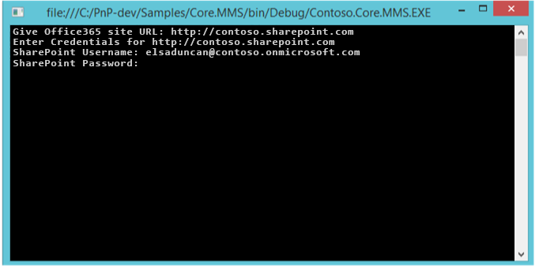

# Taxonomy operations sample SharePoint Add-in

The Core.MMS sample console application shows you how to interact with the SharePoint managed metadata service to create and retrieve terms, term sets, and groups. This sample also runs in a provider-hosted add-in, such as an ASP.NET MVC web application. 

Use this solution if you want to migrate terms between SharePoint farms or display terms in your custom add-in.   

## Before you begin

To get started, download the [Core.MMS](https://github.com/SharePoint/PnP/tree/master/Samples/Core.MMS) sample add-in from the Office 365 Developer Patterns and Practices project on GitHub.
    
> [!NOTE] 
> The code in this article is provided as-is, without warranty of any kind, either express or implied, including any implied warranties of fitness for a particular purpose, merchantability, or non-infringement.

Before you run this add-in, you'll need:

- The URL of your SharePoint site.
- Permission to access the term store in the managed metadata service. 

The following figure shows the Office 365 admin center where these permissions are assigned. 


    
To assign permissions to the term store:

1. From the Office 365 admin center, choose **term store**.
    
2. In **TAXONOMY TERM STORE**, choose the term set that you want to assign an administrator to.
    
3. In **Term Store Administrators**, enter the organizational account that requires term store administrator permissions.

## Using the Core.MMS sample add-in

When you start the add-in, you see a console application similar to that in the following figure. You are prompted to enter the URL of your SharePoint or SharePoint Online site and your credentials. 



After you supply the SharePoint URL and your credentials, user authentication occurs. 

The following code performs user authentication in SharePoint Online.

```csharp
ClientContext cc = new ClientContext(siteUrl);
cc.AuthenticationMode = ClientAuthenticationMode.Default;
// For SharePoint Online.
cc.Credentials = new SharePointOnlineCredentials(userName, pwd);
```

<br/>

The following code performs user authentication in SharePoint Online Dedicated or in an on-premises SharePoint farm.

```csharp
ClientContext cc = new ClientContext(siteUrl);
cc.AuthenticationMode = ClientAuthenticationMode.Default;
// For SharePoint Online Dedicated or on-premises .
cc.Credentials = new NetworkCredential(userName, pwd);
```

<br/>

The **CreateNecessaryMMSTermsToCloud** method creates a group, term set, and several terms in the managed metadata service. The code first gets a reference to the **TaxonomySession** object, and then the **TermStore** object, before creating the custom **TermGroup**,  **TermSet**, and new terms. 

```csharp
private static void CreateNecessaryMMSTermsToCloud(ClientContext cc)
        {
            // Get access to taxonomy CSOM.
            TaxonomySession taxonomySession = TaxonomySession.GetTaxonomySession(cc);
            cc.Load(taxonomySession);
            cc.ExecuteQuery();

            if (taxonomySession != null)
            {
                TermStore termStore = taxonomySession.GetDefaultSiteCollectionTermStore();
                if (termStore != null)
                {
                    //
                    // Create group, termset, and terms.
                    //
                    TermGroup myGroup = termStore.CreateGroup("Custom", Guid.NewGuid());
                    TermSet myTermSet = myGroup.CreateTermSet("Colors", Guid.NewGuid(), 1033);
                    myTermSet.CreateTerm("Red", 1033, Guid.NewGuid());
                    myTermSet.CreateTerm("Orange", 1033, Guid.NewGuid());
                    myTermSet.CreateTerm("Yellow", 1033, Guid.NewGuid());
                    myTermSet.CreateTerm("Green", 1033, Guid.NewGuid());
                    myTermSet.CreateTerm("Blue", 1033, Guid.NewGuid());
                    myTermSet.CreateTerm("Purple", 1033, Guid.NewGuid());

                    cc.ExecuteQuery();
                }
            }
        }
```

<br/>

After creating the new terms, the **GetMMSTermsFromCloud()** method retrieves all term groups, term sets, and terms from the managed metadata service. Similar to the **CreateNecessaryMMSTermsToCloud()** method, the code first gets a reference to the **TaxonomySession** object, and then the **TermStore** object, before retrieving and displaying the term information.

```csharp
private static void GetMMSTermsFromCloud(ClientContext cc)
        {
            //
            // Load up the taxonomy item names.
            //
            TaxonomySession taxonomySession = TaxonomySession.GetTaxonomySession(cc);
            TermStore termStore = taxonomySession.GetDefaultSiteCollectionTermStore();
            cc.Load(termStore,
                    store => store.Name,
                    store => store.Groups.Include(
                        group => group.Name,
                        group => group.TermSets.Include(
                            termSet => termSet.Name,
                            termSet => termSet.Terms.Include(
                                term => term.Name)
                        )
                    )
            );
            cc.ExecuteQuery();

            //
            // Writes the taxonomy item names.
            //
            if (taxonomySession != null)
            {
                if (termStore != null)
                {
                    foreach (TermGroup group in termStore.Groups)
                    {
                        Console.WriteLine("Group " + group.Name);

                        foreach (TermSet termSet in group.TermSets)
                        {
                            Console.WriteLine("TermSet " + termSet.Name);

                            foreach (Term term in termSet.Terms)
                            {
                                // Writes root-level terms only.
                                Console.WriteLine("Term " + term.Name);
                            }
                        }
                    }
                }
            }
        }
```

<br/>

You will see your term data from your managed metadata service displayed in the console application as shown in the following figure, and in the term store in your managed metadata service, as shown in the second figure.


<br/>


## See also
    
- [Core.MMSSync sample](https://github.com/SharePoint/PnP/tree/master/Samples/Core.MMSSync)   
- [Core.ContentTypesAndFields sample](https://github.com/SharePoint/PnP/tree/master/Samples/Core.ContentTypesAndFields)
- [Enterprise Content Management solutions for SharePoint](enterprise-content-management-solutions-for-sharepoint.md)