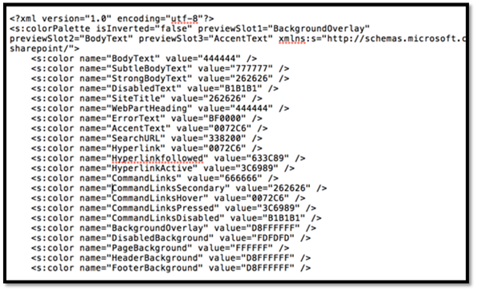
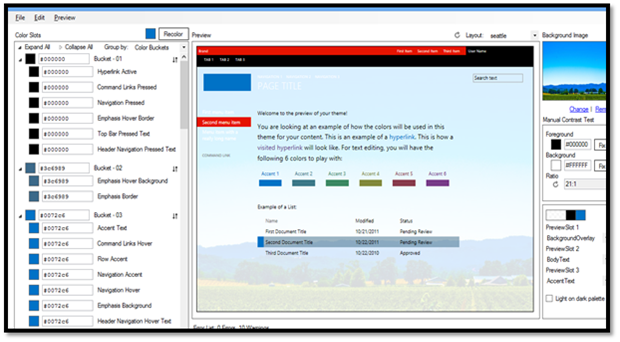
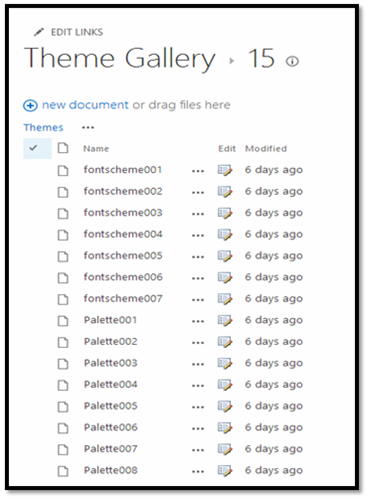
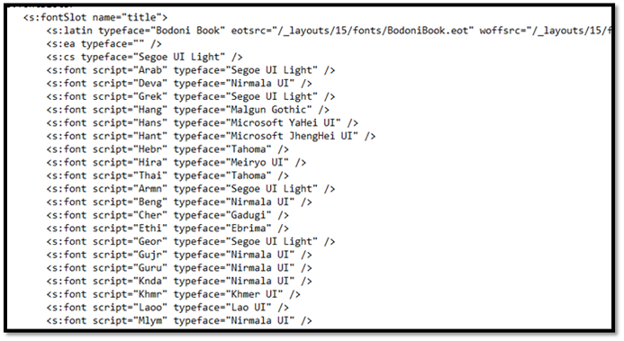
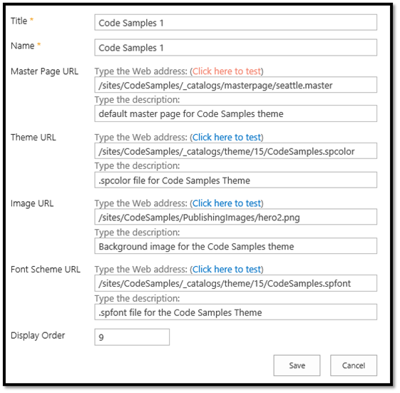
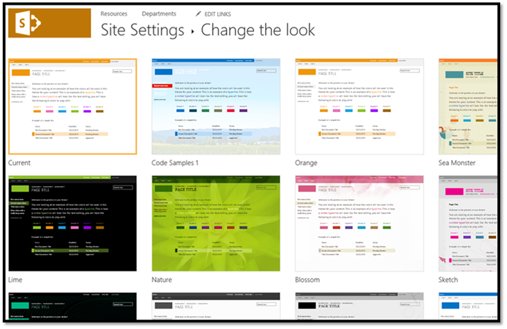

# Use composed looks to brand SharePoint sites

Apply composed looks, including colors, fonts, and a background image, to your SharePoint 2013 and SharePoint Online sites by using the SharePoint theming engine.

_**Applies to:** Office 365 | SharePoint 2013 | SharePoint Online_

You can apply composed looks to your SharePoint sites. Composed looks are out-of-the-box themes that are included in SharePoint 2013 and SharePoint Online. 
To apply a composed look to a SharePoint site, select **Site Settings** > **Look and Feel** > **Change the look**. You can then use the Change the look wizard to customize the colors, fonts, master page, and background image of a composed look. The Change the look wizard copies, transforms, and stores CSS in SharePoint's content database. It also recolors images and stores them in the content database. 

## SharePoint theming engine
<a name="sectionSection0"> </a>

You can use the SharePoint 2013 theming engine to apply colors, fonts, and a background image to a site by associating those elements with a master page.

In SharePoint 2013 and SharePoint Online, a theme is a connected set of XML definition files, an image file, and an associated master page that you can use to apply custom CSS to a site. The following XML files define color slots and font slots that define the details of specific colors and fonts as they're applied to styles: 

- .spcolor
    
- .spfont
    
You can create your own color and font files in your favorite text editor.

The following table lists the elements of a composed look.

|**Element**|**File or files**|**Where it's stored**|**Required?**|
|:-----|:-----|:-----|:-----|
|Color palette|.spcolor|Theme Gallery\15 folder|Yes|
|Font scheme|.spfont|Theme Gallery\15 folder|No|
|Site layout|<p>.master</p><p>.preview</p>|Master Page Gallery|Yes|
|Background image|<p>.jpg</p><p>.bmp</p><p>.png</p><p>.gif</p>|Site assets|No|
Users can select composed looks by using the Change the look wizard (**Site Settings** > **Look and Feel** > **Change the Look**), the Getting Started UI, or directly in the site actions menu. When a user selects a composed look, the theming engine applies colors, fonts, background images, the associated .master page, and the .preview file associated with the .master page to the site. 

### Color palettes

The theming engine stores colors in color palettes defined by the .spcolor file, as shown in Figure 1. Color palettes are stored in the Theme Gallery of the root site. A color palette is an editable XML file made up of color palette definitions and color slots. Color palette metadata ( `<s:colorPalette>`) defines the following:

- Three preview slots that define what color slots to use in composed look previews.
    
- An  **isInverted** property that lets the palette designer specify whether the theme is inverted (dark background with light text).
    
- The XML namespace associated with the theme.
    
Color slots are defined by two attributes—color name and value—that define a name for the color and its RGB value. Color slots have semantic names, such as BodyText or SiteTitle, that help you identify which slots correspond to a region of a SharePoint page.

`<s:color name="BodyText" value="444444" />`

**Figure 1. .spcolor file**



Line 2 of the .spcolor file defines the XML namespace, preview slots, and whether colors are inverted (they have a light foreground on a dark background instead of a dark foreground on a light background). 

The .spcolor file contains 89 color slots. You can use color slots to define richer aspects of color, including opacity, by using 8-digit hexadecimal values. For example, if green is RRGGBB 00FF00, a 70 percent opaque green is AARRGGBB 7F00FF00. If SharePoint uses a slot that you don't define, any CSS that references it won't change color. If a slot is defined that is never referenced in CSS, the color is never shown in the UI.

You can edit the .spcolor file in Notepad. You cannot edit it in PowerPoint.

### Color palette tool

You can use the  [color palette tool](http://www.microsoft.com/en-us/download/details.aspx?id=38182) to visualize theme colors and how they work together on the page. Use it to identify color information you can use in the color slots of the .spcolor file, and apply colors to a SharePoint site without changing any CSS as part of the process.

The tool displays the colors in hexadecimal format, so you can easily copy and paste the color value into the appropriate element in your .spcolor file. You can also use the color palette tool to fit a background image into a mockup and toggle between the seattle.master and oslo.master master pages. 


**Figure 2. Color palette tool**



The .spcolor file is the only file that is required for a new theme, but you might need to add some custom font declarations, depending on the depth of your design. To do that, you need to access the .spfont file.

### Font schemes

In the same way that color palettes define how colors are used in composed looks, font schemes define the fonts in composed looks. 

Font schemes are defined in the .spfont file stored in the Theme Gallery. The .spfont file includes the following font slots that define the name, typeface, and script values of a composed look:

- Title
    
- Navigation
    
- Small-heading
    
- Heading
    
- Large-heading
    
- Body
    
- Large-body
    
Fonts are further scoped by script type (for example, Latin, Arabic, Cyrillic). Web fonts support is included in four file types:

- Embedded open type (EOT)
    
- Web open font format file (WOFF)
    
- TrueType font (TTF)
    
- Scalable vector graphics (SVG)
    
The font scheme defines a large preview image and a small preview image. They are required only for web fonts.

**Note**  You can edit the .spfont file in Notepad. You cannot edit it in PowerPoint.

The following is an example of an .spfont file.

```XML
<?xml version="1.0" encoding="utf-8"?>
<s:fontScheme name="Georgia" previewSlot1="title" previewSlot2="body"
  xmlns:s=http://schemas.microsoft.com/sharepoint/>
    <s:fontSlots>
        <s:fontSlot name="title">
            <s:latin typeface="Georgia"/>
            <s:font script="Arab" typeface="Calibri" />
            <s:font script="Deva" typeface="Mangal" />
            . . . 
        </s:fontSlot>
    <s:fontSlot name="navigation">
        <s:latin typeface="Georgia"/>
        <s:font script="Arab" typeface="Calibri" />
        <s:font script="Deva" typeface="Mangal" />
        . . . 
        </s:fontSlot>
    </s:fontSlots>
</s:fontScheme>
```

### Site layout: master pages and corresponding preview files

The theming engine defines the site layout of a composed look based on the .master master page and its corresponding .preview file. For example, if the master page defined for the composed look is seattle.master, that master page defines the layout of the site.

The site layout is pulled from the Master Page Gallery of any master pages that have accompanying .preview files. A .preview file is required for a master page to appear as an option in the **Change the look** UI (**Site Settings** > **Look and Feel** > **Change the look**).

To make a master page available from the Site Layout drop-down menu, create a .preview file that corresponds to the .master page. The .preview file displays thumbnail images for the composed look and the preview section to the right of the **Change the look** options on the designbuilder.aspx page.

### Background image

You can change the background image of a composed look by choosing **Change**. This opens an upload dialog box that you can use to upload an image file. You can also drag your own image onto the background preview.

## Create custom themes
<a name="sectionSection1"> </a>

To create a custom theme:

1. Go to **Site settings**, and under the Web Designer Galleries heading, select **Themes** > **15**. A list of .spcolor and .spfont files appears, as shown in Figure 3.
    
    **Figure 3. Theme Gallery**

    

2. Download a copy of one of the .spcolor files (for example, Palette001.spcolor) and open it in a text editor. 
    
3. Edit the copied .spcolor file to reflect your design guidelines. For example, if you have a black font for main body text, edit the file to change the line  `<s:color name="BodyText" value="444444" />` to `<s:color name="BodyText" value="000000" />`.
    
4. For each HTML element, add your color. 
    
5. When you are done, upload the .spcolor file to the **Site settings** > **Theme** > **15** folder.
    
    **Note**  Save the file with a new file name (for example, custom_palette1.spcolor).

   The following table maps colors and page elements to their code in the .spcolor file. It is a subset of the mappings that are available in the .spcolor file.
    

	|**Element**|**Color**|**Code**|
	|:-----|:-----|:-----|
	|Body text|Black| `<s:color name="BodyText" value="000000" />`|
	|Global navigation background|Blue| `<s:color name="HeaderBackground" value="018dff" />`|
	|Global navigation text|White| `<s:color name="HeaderNavigationText" value="ffffff" />`|
	|Current navigation background|Red| `<s:color name="NavigationHoverBackground" value="e51400" />`|
	|Current navigation text|White| `<s:color name="Navigation" value="ffffff" />`|
	|Title|White| `<s:color name="SiteTitle" value="FFFFFF" />`|
	|Footer background|Black| `<s:color name="FooterBackground" value="000000" />`|

6. To customize .spfont, download a copy of a .spfont file and open it in a text editor. Notice that the .spfont file is laid out a bit differently than .spcolor, but that both files share a similar structure. 
    
    **Figure 4. .spfont file**

    

7. Edit each  `<s:fontSlot />` section to customize the font SharePoint applies to the specified font slot on the page. For example, notice the first entry, `<s:fontSlot name="title">`. This entry describes which font SharePoint uses to style the title of the page. This section also specifies which font will be used for different languages.
    
    **Note**  You can upload custom fonts to SharePoint and point each entry to a custom .eot, .woff, .ttf, and .svg file. 

8. Upload the file to the **Site settings** > **Theme** > **15** folder.
    
    **Note**  Save the file with a new file name (for example, custom_font.spfont).

    The following table maps page elements to fonts as they're defined in the .spfont file.

|**Element**|**Font**|**Code**|
|:-----|:-----|:-----|
|Title|Open Sans| `<s:cs typeface="Open Sans" />`|
|Navigation|Roboto| `<s:cs typeface="Roboto" />`|
|Headings|Trajan Pro| `<s:cs typeface="Trajan Pro" />`|
|Body|Open Sans| `<s:cs typeface="Open Sans" />`|

You might have to ensure that some custom fonts are available to users' browsers. For example, if the headings refer to a Trajan Pro font, which is uncommon on most users' computers, add the following font declarations at the top of the <s:fontSlot> declaration. This will ensure that the correct font is displayed. 

```XML
<s:latin typeface=" Trajan Pro" eotsrc="/SiteAssets/Trajan Pro.eot" woffsrc="/SiteAssets/Trajan Pro.woff" ttfsrc="/SiteAssets/Trajan Pro.ttf" svgsrc="/SiteAssets/Trajan Pro.svg"  />
```

## Add a custom theme to SharePoint
<a name="sectionSection2"> </a>

After you make your customizations to the master page, .spcolor, and .spfont files, add them to the Composed Looks directory so that SharePoint can access them. 

1. Go to **Site settings**, and under **Web Designer Galleries**, select **Composed Looks**. 
    
2. Choose the **new item** link at the top left. A window opens, as shown in Figure 5.
    
    **Figure 5. Composed looks**

    

3. Add a title and a name for your composed look.
    
4. Complete the remaining field:
    
	- In the **Master Page URL** field, add the URL of the master page you would like the theme to use.
    
	- In the **Theme URL** field, add the URL of the .spcolor file.
    
	- In the **Image URL** field, include the URL of an image that you want to use as a background. This is not required if your design doesn't call for a background image.
    
	- In the **Font Scheme URL** field, include the URL of the .spfont file.
    
	- In the **Display Order** field, indicate the order in which the composed look should be displayed.
    
5. Choose **Save**. Your theme entry will now appear in the  **Composed Looks** list.
    
After you add your custom theme to as a composed look, users can access the theme and apply it to a site by going to **Site settings** > **Look and Feel** > **Change the look**. Figure 6 shows an example of a **Change the look** section in **Site Settings**.

**Figure 6. Composed looks available in Change the look**



## What does the theming engine do when a user applies a composed look?
<a name="sectionSection3"> </a>

When a user applies a composed look, SharePoint copies, transforms, and stores CSS in the content database. It also recolors and stores images in the content database. As part of the process of applying a theme to a site, the theming engine pulls color and font values from the specified color palette and font scheme found in the Theme Gallery of the root site. To apply .master page and the master page .preview file (the site layout), the theming engine pulls master pages in the Master Page Gallery that have a corresponding .preview file. 

When it applies a composed look, the engine maps the settings specified by specific CSS comments that the theming engine defines. Under the hood, the theming engine saves the background image to Site Assets, scales and compresses JPG and BMP images, and limits the size of GIF and PNG images. 

When a composed look is applied to a SharePoint site, SharePoint finds and replaces CSS comment tokens by embedding a value derived from the composed look in the next line in the CSS file after the token. This new value is applied to the SharePoint site.

The following table lists the CSS comment tokens.

|**Token**|**Description**|**Corresponding ApplyTheme parameter**|
|:-----|:-----|:-----|
|/* ReplaceBGImage */|Swaps current background image with the image in the assigned composed look image URL.|backgroundImageUrl|
|/* ReplaceFont */|Swaps the current font with one of the fonts found in the font scheme URL of the assigned composed look.|fontSchemeUrl|
|/* ReplaceColor */|Swaps the current color with one of the colors specified in a color slot in the color palette URL of the assigned composed look.|colorPaletteUrl|
|/* RecolorImage */|Recolors images using tinting or filling. ||

## Additional resources
<a name="bk_addresources"> </a>

-  [SharePoint site branding and page customization solutions](SharePoint-site-branding-and-page-customization-solutions.md)
    
-  [Branding and site provisioning solutions for SharePoint 2013 and SharePoint Online](Branding-and-site-provisioning-solutions-for-SharePoint.md)
