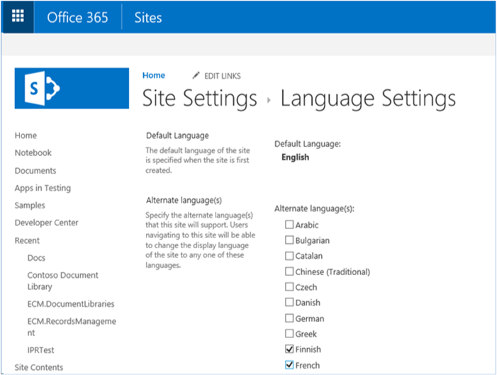
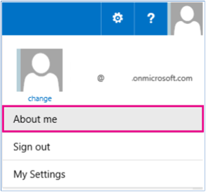
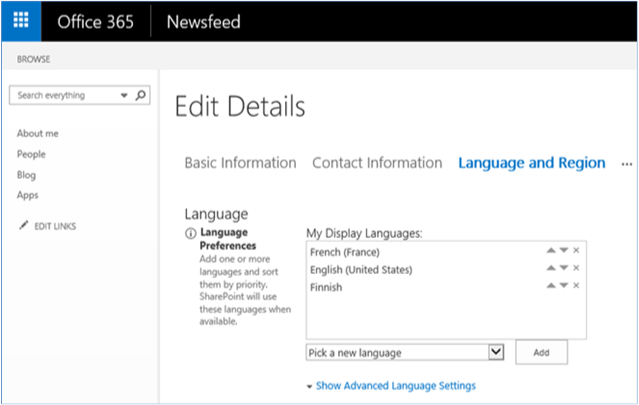
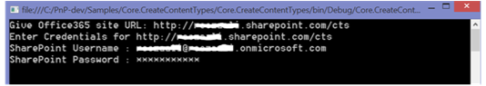
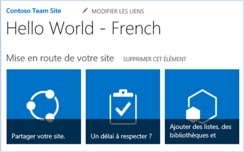

# Use localization features in Office 365 sample add-in

The [Core.CreateContentTypes](https://github.com/SharePoint/PnP/tree/master/Samples/Core.CreateContentTypes) sample shows you how to use the localization features of Office 365 on sites, lists, content types, and site columns. This code sample uses a console application to do the following:

- Create content types, site columns, and lists, and associate site columns with content types.   
- Localize the content type, site column, list, and a user-supplied site.

> [!NOTE] 
> The localization features described in this article are only available in Office 365. For information about the localization features that are available in Office 365 Dedicated or SharePoint Server on-premises, see [Localize SharePoint Add-ins](../sp-add-ins/localize-sharepoint-add-ins.md) and [Localizing SharePoint solutions](https://msdn.microsoft.com/en-us/library/ee696750.aspx).

## Before you begin

To get started, download the [Core.CreateContentTypes](https://github.com/SharePoint/PnP/tree/master/Samples/Core.CreateContentTypes) sample add-in from the Office 365 Developer Patterns and Practices project on GitHub.

Before you run this code sample, complete the following steps.

### Configure the language settings on your site
    
1. On your team site, choose **Settings** > **Site settings**.
    
2. In **Site Administration**, choose **Language settings**.
    
3. On the **Language Settings** page, in **Alternate language(s)**, choose the alternate languages that your site should support. For example, you can choose **Finnish** and **French**, as shown in the following figure.

   
    
4. Choose **OK**.
    
### Set the display language on your user's profile page
    
1. At the top of your Office 365 site, choose your profile picture, and then choose **About me**.

   

2. On the **About me** page, choose **Edit your profile**.
    
3. Choose **...** (additional options), and then choose **Language and Region**.
    
4. In **My Display Languages**, choose a new language similar to the one you set on the site by using the **Pick a new language** list, and then choose **Add**. For example, choose **Finnish** and **French** as shown. You can move your preferred language up or down by choosing the up and down arrows.

   
    
5. Choose **Save all and close**.

> [!NOTE] 
> It might take a few minutes for your site to render in the selected language(s). 


## Run the Core.CreateContentTypes sample app

When you run this code sample, a console application displays, as shown in the following figure. You need to supply the site to localize and your Office 365 administrator's credentials. 



When the console application runs, the **Main** method in Program.cs performs the following tasks:

- Calls the **CreateContentTypeIfDoesNotExist** method to create a content type called **Contoso Document**.
    
- Calls the **CreateSiteColumn** method to create a site column called **Contoso String**.
    
- Calls the **AddSiteColumnToContentType** method to link the **Contoso String** site column to the **Contoso Document** content type.
    
- Calls the **CreateCustomList** method to create a new list called **MyList**.

The **Main** method then calls the **LocalizeSiteAndList** and **LocalizeContentTypeAndField** methods. 

The **LocalizeSiteAndList** method shows you how to do the following:

- Set different localized values for the title and description of a site by using the **SetValueForUICulture** method on the **TitleResource** and **DescriptionResource** properties on the **Web** object.
    
- Set different localized values for the title and description of a site by using the **SetValueForUICulture** method on the **TitleResource** and **DescriptionResource** properties on the **Web** object.
    
The **LocalizeContentTypeAndField** method shows you how to do the following:

- Set different localized values for the name and description of a content type by using the **SetValueForUICulture** method on the **NameResource** and **DescriptionResource** properties on the **ContentType** object.
    
- Set different localized values for the title and description of a site by using the **SetValueForUICulture** method on the **TitleResource** and **DescriptionResource** properties on the **Field** object.
    
> [!NOTE] 
> The code in this article is provided as-is, without warranty of any kind, either express or implied, including any implied warranties of fitness for a particular purpose, merchantability, or non-infringement.

```csharp
private static void LocalizeSiteAndList(ClientContext cc, Web web)
        {
            // Localize the site title.
            web.TitleResource.SetValueForUICulture("en-US", "Hello World");
            web.TitleResource.SetValueForUICulture("fi-FI", "Hello World - Finnish");
            web.TitleResource.SetValueForUICulture("fr-FR", "Hello World - French");
            // Localize the site description.
            web.DescriptionResource.SetValueForUICulture("en-US", "Hello World site sample");
            web.DescriptionResource.SetValueForUICulture("fi-FI", " Hello World site sample - Finnish");
            web.DescriptionResource.SetValueForUICulture("fr-FR", " Hello World site sample - French");
            web.Update();
            cc.ExecuteQuery();

            // Localize the custom list that was created previously.
            List list = cc.Web.Lists.GetByTitle("MyList");
            cc.Load(list);
            cc.ExecuteQuery();
            // Localize the list title.
            list.TitleResource.SetValueForUICulture("en-US", "Hello World");
            list.TitleResource.SetValueForUICulture("fi-FI", "Hello World - Finnish");
            list.TitleResource.SetValueForUICulture("fr-FR", " Hello World - French");
            // Localize the list description.
            list.DescriptionResource.SetValueForUICulture("en-US", "This example localizes a list using CSOM.");
            list.DescriptionResource.SetValueForUICulture("fi-FI", "This example localizes a list using CSOM - Finnish.");
            list.DescriptionResource.SetValueForUICulture("fr-FR", "This example localizes a list using CSOM - French.");
            list.Update();
            cc.ExecuteQuery();
        }

private static void LocalizeContentTypeAndField(ClientContext cc, Web web)
        {
            ContentTypeCollection contentTypes = web.ContentTypes;
            ContentType myContentType = contentTypes.GetById("0x0101009189AB5D3D2647B580F011DA2F356FB2");
            cc.Load(contentTypes);
            cc.Load(myContentType);
            cc.ExecuteQuery();
            // Localize content type name.
            myContentType.NameResource.SetValueForUICulture("en-US", "Contoso Document");
            myContentType.NameResource.SetValueForUICulture("fi-FI", "Contoso Document - Finnish");
            myContentType.NameResource.SetValueForUICulture("fr-FR", "Contoso Document - French");
            // Localize content type description.
            myContentType.DescriptionResource.SetValueForUICulture("en-US", "This is the Contoso Document.");
            myContentType.DescriptionResource.SetValueForUICulture("fi-FI", " This is the Contoso Document - Finnish.");
            myContentType.DescriptionResource.SetValueForUICulture("fr-FR", " This is the Contoso Document - French.");
            myContentType.Update(true);
            cc.ExecuteQuery();

            // Localize the site column.
            FieldCollection fields = web.Fields;
            Field fld = fields.GetByInternalNameOrTitle("ContosoString");
            // Localize site column title.
            fld.TitleResource.SetValueForUICulture("en-US", "Contoso String");
            fld.TitleResource.SetValueForUICulture("fi-FI", "Contoso String - Finnish");
            fld.TitleResource.SetValueForUICulture("fr-FR", "Contoso String - French");
            // Localize site column description.
            fld.DescriptionResource.SetValueForUICulture("en-US", "Used to store Contoso specific metadata.");
            fld.DescriptionResource.SetValueForUICulture("fi-FI", "Used to store Contoso specific metadata - Finnish.");
            fld.DescriptionResource.SetValueForUICulture("fr-FR", "Used to store Contoso specific metadata - French.");
            fld.UpdateAndPushChanges(true);
            cc.ExecuteQuery();
        }
```

<br/>

As shown in the following figure, your site displays your custom French title **Hello World - French**, which was set by using the **LocalizeSiteAndList** method.



## See also
  
- [Enterprise Content Management solutions for SharePoint](enterprise-content-management-solutions-for-sharepoint.md)
- [Localization solutions for SharePoint](localization-solutions-for-sharepoint-2013-and-sharepoint-online.md)