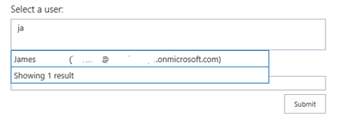
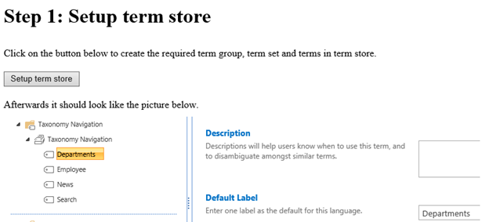

# Create UX controls by using SharePoint provider-hosted add-ins

Create UX controls in SharePoint provider-hosted add-ins that work and behave like UX controls on the host web. 

The article describes three samples that show you how to implement UX controls in your provider-hosted add-in:

- [Core.PeoplePicker](https://github.com/SharePoint/PnP/tree/dev/Components/Core.PeoplePicker) &ndash; Shows you how to add a people picker control.
    
- [Core.TaxonomyMenu](https://github.com/SharePoint/PnP/tree/dev/Components/Core.TaxonomyMenu) &ndash; Shows you how to implement a localizable taxonomy menu control.
    
- [Core.TaxonomyPicker](https://github.com/SharePoint/PnP/tree/dev/Components/Core.TaxonomyPicker) &ndash; Shows you how to implement a taxonomy picker control.
    
These samples use JavaScript and the JSOM to communicate with SharePoint, and use the [cross-domain library](../sp-add-ins/access-sharepoint-data-from-add-ins-using-the-cross-domain-library.md) to handle function calls from the add-in to the host site domain.

<a name="bmPeoplePicker"> </a>

## People picker control

The [Core.PeoplePicker](https://github.com/SharePoint/PnP/tree/dev/Components/Core.PeoplePicker) sample shows you how to implement a people picker control in a provider-hosted add-in. When the user starts typing a name into the text input box, the control searches the user profile store for potential matches, and displays them in the UI. The add-in displays a configurable and extensible people picker control that runs on a remote host and queries the user profile store on the host site to match user inputs.

**People picker control**


    
> [!NOTE] 
> The Visual Studio solution for the sample contains a module named "Dummy" to ensure that when the add-in is deployed, it creates an add-in web. An add-in web is required for cross-domain calls.

> [!NOTE] 
> The code in this article is provided as-is, without warranty of any kind, either express or implied, including any implied warranties of fitness for a particular purpose, merchantability, or non-infringement.

The Scripts folder of the Core.PeoplePickerWeb project contains app.js and peoplepickercontrol.js files (along with people picker resource files for additional language support). The app.js file fetches client context by using the cross-domain library and hooks the HTML in the Default.aspx file into the people picker control. The Default.aspx file contains the `<div>` tags that implement both the text box and the people search capability.

```html
<div id="divAdministrators" class="cam-peoplepicker-userlookup ms-fullWidth">
  <span id="spanAdministrators"></span>
<asp:TextBox ID="inputAdministrators" runat="server" CssClass="cam-peoplepicker-edit" Width="70"></asp:TextBox>
</div>
<div id="divAdministratorsSearch" class="cam-peoplepicker-usersearch ms-emphasisBorder"></div>
<asp:HiddenField ID="hdnAdministrators" runat="server" />

```

<br/>

The app.js file then creates and configures a people picker control.

```js
//Make a people picker control.
//1. context = SharePoint Client Context object
//2. $('#spanAdministrators') = SPAN that will 'host' the people picker control
//3. $('#inputAdministrators') = INPUT that will be used to capture user input
//4. $('#divAdministratorsSearch') = DIV that will show the 'drop-down' of the picker
//5. $('#hdnAdministrators') = INPUT hidden control that will host resolved users
peoplePicker = new CAMControl.PeoplePicker(context, $('#spanAdministrators'), $('#inputAdministrators'), $('#divAdministratorsSearch'), $('#hdnAdministrators'));
// required to pass the variable name here!
peoplePicker.InstanceName = "peoplePicker";
// Hook up everything.
peoplePicker.Initialize();

```

<br/>

The people picker control queries the **ClientPeoplePickerWebServiceInterface** object in the JSOM library to initiate searches for users whose names match the character strings entered.

```js
if (searchText.length >= parent.GetMinimalCharactersBeforeSearching()) {
                            resultDisplay = 'Searching...';
                            if (typeof resultsSearching != 'undefined') {
                                resultDisplay = resultsSearching;
                            }

                  var searchbusy = parent.Format('<div class=\'ms-emphasisBorder\' style=\'width: 400px; padding: 4px; border-left: none; border-bottom: none; border-right: none; cursor: default;\'>{0}</div>', resultDisplay);
                            parent.PeoplePickerDisplay.html(searchbusy);
                            // Display the suggestion box.
                            parent.ShowSelectionBox();

                   var query = new SP.UI.ApplicationPages.ClientPeoplePickerQueryParameters();
                            query.set_allowMultipleEntities(false);
                            query.set_maximumEntitySuggestions(2000);
                            query.set_principalType(parent.GetPrincipalType());
                            query.set_principalSource(15);
                            query.set_queryString(searchText);
                            var searchResult = SP.UI.ApplicationPages.ClientPeoplePickerWebServiceInterface.clientPeoplePickerSearchUser(parent.SharePointContext, query);

                  // Update the global queryID variable so that you can correlate incoming delegate calls.
                            parent._queryID = parent._queryID + 1;
                            var queryIDToPass = parent._queryID;
                            parent._lastQueryID = queryIDToPass;

                  // Make the SharePoint request.
                            parent.SharePointContext.executeQueryAsync(Function.createDelegate(this, function () { parent.QuerySuccess(queryIDToPass, searchResult); }),
                                                Function.createDelegate(this, function () { parent.QueryFailure(queryIDToPass); }));

```

<a name="bmTaxMenu"> </a>

## Taxonomy menu control

The [Core.TaxonomyMenu](https://github.com/SharePoint/PnP/tree/dev/Components/Core.TaxonomyMenu) sample shows you how to implement a localizable taxonomy menu control that is populated from the term store in a provider-hosted add-in. The add-in also sets up the required term store languages, groups, sets, and terms for populating the menu, and checks the user's language preference to set the display language.

The add-in implements a **TaxonomyHelper** class (CSOM) that sets up the term store and populates it with terms. It then uploads into the site's root folder a JavaScript file that displays the navigational links.

The add-in sets up the term store on the host site. It uses CSOM objects and methods to create a term group and set, and then populates the term set with four terms. 

**Term store setup screen**



When you choose the **Setup term store** button, the add-in:

- Makes sure that the required languages (English, German, French, and Swedish) are enabled in the term store.
    
- Creates a term group and term set and populates the term set with four new terms.
    
The following code in the **TaxonomyHelper** class verifies that the required languages are enabled, and if they're not, it enables them.

```js
var languages = new int[] { 1031, 1033, 1036, 1053 };
            Array.ForEach(languages, l => { 
                if (!termStore.Languages.Contains(l)) 
                    termStore.AddLanguage(l); 
            });

            termStore.CommitAll();
            clientContext.ExecuteQuery();

// Create the term group.
termGroup = termStore.CreateGroup("Taxonomy Navigation", groupId);
                clientContext.Load(termGroup);
                clientContext.ExecuteQuery();
```

<br/>

Finally, the following code in the same **TaxonomyHelper** class creates each new term, along with labels for the German, French, and Swedish languages. It also sets a value for the **\_Sys\_Nav\_SimpleLinkUrl** property, which is equivalent to the **Simple Link or Header** property in the Term Store Management Tool. In this case, the URL for each term points back to the root site.

```js
var term = termSet.CreateTerm(termName, 1033, Guid.NewGuid());
term.CreateLabel(termNameGerman, 1031, false);
term.CreateLabel(termNameFrench, 1036, false);
term.CreateLabel(termNameSwedish, 1053, false);
term.SetLocalCustomProperty("_Sys_Nav_SimpleLinkUrl", clientContext.Web.ServerRelativeUrl);
```

<br/>

Next, the add-in inserts the topnav.js file into the root folder of the host site. This file contains the JavaScript that inserts the links from this term set into the navigation of the host site's home page. The add-in UI also shows you how the navigational links will appear on the host site after the add-in uploads the JavaScript file.

The following code in the topnav.js file uses JSOM to check for the user's preferred language.

```js
var targetUser = "i:0#.f|membership|" + _spPageContextInfo.userLoginName;
        context = new SP.ClientContext.get_current();
var peopleManager = new SP.UserProfiles.PeopleManager(context);
var userProperty = peopleManager.getUserProfilePropertyFor(targetUser, "SPS-MUILanguages");
```

The add-in then determines whether the user's language preference matches one of the enabled languages. If it finds a match, the following code gets the terms and the associated labels for the user's preferred language.

```js
while (termEnumerator.moveNext()) {
    var currentTerm = termEnumerator.get_current();
    var label = currentTerm.getDefaultLabel(lcid);

    termItems.push(currentTerm);
    termLabels.push(label);
    context.load(currentTerm);
```

Finally, the following code in the topnav.js file inserts links that contain the terms into the top navigational element of the host site.

```js
html += "<ul style='margin-top: 0px; margin-bottom: 0px;'>"
        for (var i in termItems) {
            var term = termItems[i];
            var termLabel = termLabels[i];
            var linkName = termLabel.get_value() != 0 ? termLabel.get_value() : term.get_name();
            var linkUrl = term.get_localCustomProperties()['_Sys_Nav_SimpleLinkUrl'];

            html += "<li style='display: inline;list-style-type: none; padding-right: 20px;'><a href='" + linkUrl + "'>" + linkName + "</a></li>";
        }
        html += "</ul>";

        $('#DeltaTopNavigation').html(html);
        SP.UI.Notify.removeNotification(nid);
```

<a name="bmTaxPicker"> </a>

## Taxonomy picker control

The [Core.TaxonomyPicker](https://github.com/SharePoint/PnP/tree/dev/Components/Core.TaxonomyPicker) sample shows you how to implement a taxonomy picker control in a provider-hosted add-in. When the user starts typing a term into the text input box, the control searches the term store for potential matches and displays them in a list under the input box.

The add-in creates an HTML page that conforms to the JSOM taxonomy picker requirements, and then adds and configures the control. It uses the JSOM library to query the host site's term store. The taxonomy picker communicates with the SharePoint Managed Metadata Service, which requires write permission at the taxonomy permission scope so that it can read from closed term sets and write to open term sets. Make sure that the AppManifest.xml file has set the write permission at the appropriate scope.

The Scripts folder of the Core.TaxonomyPicker project contains app.js and taxonomypickercontrol.js files (along with a taxonomy picker resource file for additional language support). The app.js file fetches client context by using the cross-domain library and hooks the HTML in the Default.aspx file into the taxonomy picker control. The Default.aspx file contains the hidden field that implements both the text box and the taxonomy picker capability. It also adds a bulleted list to display suggestions returned from the term store.

```html
<div style="left: 50%; width: 600px; margin-left: -300px; position: absolute;">
            <table>
                <tr>
                    <td class="ms-formlabel" valign="top"><h3 class="ms-standardheader">Keywords Termset:</h3></td>
                    <td class="ms-formbody" valign="top">
                        <div class="ms-core-form-line" style="margin-bottom: 0px;">
                            <asp:HiddenField runat="server" id="taxPickerKeywords" />
                        </div>
                    </td>
                </tr>
            </table>

            <asp:Button runat="server" OnClick="SubmitButton_Click" Text="Submit" />

            <asp:BulletedList runat="server" ID="SelectedValues" DataTextField="Label" />
</div>
```

<br/>

The app.js file then creates and configures a taxonomy picker control.

```js
// Load scripts for calling taxonomy APIs.
                    $.getScript(layoutsRoot + 'init.js',
                        function () {
                            $.getScript(layoutsRoot + 'sp.taxonomy.js',
                                function () {
                                    // Bind the taxonomy picker to the default keywords term set.
                                    $('#taxPickerKeywords').taxpicker({ isMulti: true, allowFillIn: true, useKeywords: true }, context);
                                });
                        });

```

<br/>

The taxonomy picker control uses the following code to open a **TaxonomySession** instance in the JSOM to load all the terms from the term store.

```js
// Get the taxonomy session by using CSOM.
            var taxSession = SP.Taxonomy.TaxonomySession.getTaxonomySession(spContext);
            //Use the default term store...this could be extended here to support additional term stores.
            var termStore = taxSession.getDefaultSiteCollectionTermStore();

            // Get the term set based on the properties of the term set.
            if (this.Id != null)
                this.RawTermSet = termStore.getTermSet(this.Id); // Get term set by ID.
            else if (this.UseHashtags)
                this.RawTermSet = termStore.get_hashTagsTermSet(); // Get the hashtags term set.
            else if (this.UseKeywords)
                this.RawTermSet = termStore.get_keywordsTermSet(); // Get the keywords term set.

            // Get all terms for the term set and organize them in the async callback.
            this.RawTerms = this.RawTermSet.getAllTerms();
            spContext.load(this.RawTermSet);
            spContext.load(this.RawTerms);
            spContext.executeQueryAsync(Function.createDelegate(this, this.termsLoadedSuccess), Function.createDelegate(this, this.termsLoadedFailed));

```

The taxonomy picker control then looks for potential matches from the loaded terms, and adds new terms to the term store as needed.


## See also
 
- [UX components in SharePoint and SharePoint Online](ux-components-in-sharepoint-2013-and-sharepoint-online.md)